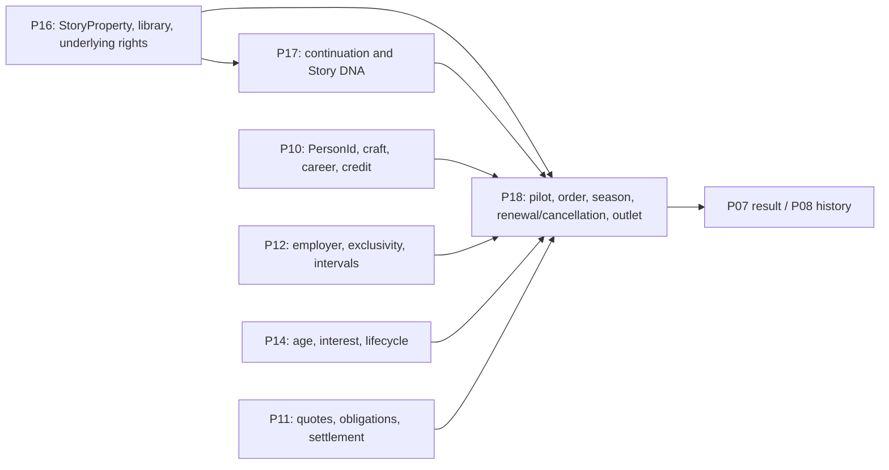

# Family-Entertainment Brand and Television Handoff

> **FUTURE PRODUCT RESEARCH AND IMPLEMENTATION-PLANNING CANDIDATE**
>
> **OWNER INTEREST CONFIRMED — SPECIFIC MECHANICS NOT YET APPROVED**
>
> **NOT SCHEDULED**
>
> **NOT AUTHORIZED FOR GAMEPLAY IMPLEMENTATION**
>
> **SUBJECT TO CURRENT OPS REVIEW AND ACCEPTED-BASE REFRESH**

Navigation: [Current Ops review](TALENT-ORIGINS-CURRENT-OPS-REVIEW.md) · [Crossover talent](CROSSOVER-TALENT-AND-SCREEN-CAREERS-DESIGN.md) · [Young performers](YOUNG-PERFORMERS-AND-CAREER-DEVELOPMENT-DESIGN.md) · [Implementation plan/register](TALENT-ORIGINS-IMPLEMENTATION-PLAN-AND-REQUIREMENT-REGISTER.md)

## 1. The aspiration, preserved

The long-term fantasy is to build an original family-entertainment operation whose films and recurring series create meaningful opportunities, whose audiences remember performers as they grow, and whose studio history can connect an early role to later adult acting, music partnership, writing, directing, producing, a voluntary exit, or a career elsewhere.

The design should evoke the satisfaction of building **the player's own** institution. It is not a Disney-branded reskin, a captive child-star factory, or one facility that magically combines production, representation, recording, broadcasting, rights ownership, merchandising, touring, and streaming.

Five increasingly different businesses preserve the destination:

1. producing family films;
2. operating a family/youth production label;
3. producing recurring series for an outside broadcaster or platform;
4. supporting a performer through separate film, television, and music partnerships;
5. owning and operating a linear channel or direct-to-consumer platform.

The first four can establish a remarkable family-entertainment history without pretending the fifth already exists. The fifth remains explicitly deferred for separate authorization.

---

## 2. Five business models, not one building

| Model | Player-facing proposition | Existing/future owner | What it does **not** confer | Status |
|---|---|---|---|---|
| **1. Family-film production** | Choose and release films for family/youth audience segments with age-appropriate roles. | P04 casting; P05/P06 production/release; P07 audience/result; P10 people | A label, series workflow, channel, rights beyond the actual project, or ownership of performers | **EXISTING AUTHORITY**; youth-specific eligibility is new |
| **2. Family/youth production label** | Curate a coherent portfolio promise, presentation, slate lens, and history across projects. | Recommended stable label identity/associations under later P16+ corporate/rights authority; P15/P07 derive reputation; P18 projects its series slate | A physical facility, permanent roster, talent agency, automatic audience bonus, or outlet | **OWNER DECISION REQUIRED**; genuinely new |
| **3. Series for an outside outlet** | Pitch a pilot, accept an order, produce seasons, negotiate renewal, and handle cast continuity for a commissioner/distributor. | P18 workflow; P16 property/rights; P17 continuation; P10/P12/P14 people/availability; P11 money | Ownership of broadcaster/platform, automatic renewal, automatic cast control | **READY AFTER NAMED DEPENDENCY** |
| **4. Cross-media performer support** | Make separate film/TV offers and facilitate era-appropriate music or other partnerships when the performer wants them. | P10 person/contract; P12 employer/interval availability; P11 obligations; P14 choice; P16 rights; P18 projects/outlets; music capability/career-evidence owner per FAM-015; external partner interface | Record-label, touring, merchandising, social-platform, subscriber, or blanket representation simulation | **READY AFTER NAMED DEPENDENCY**; bounded to explicit partnerships |
| **5a. Owned linear channel/network** | Program a continuing schedule and operate distribution, affiliate/carriage and advertising economics. | Separate future P18/P16/P11/P13/P15 business-model authority | Proven by a label, facility, one hit, or one series | **DEFERRED WITH NAMED RETURN CONDITION** |
| **5b. Owned DTC platform** | Operate catalogue/service technology, subscriptions or ads, distribution and content acquisition. | Separate future P18/P16/P11/P13/P15 business-model authority | Equivalent to a linear channel or free distribution | **DEFERRED WITH NAMED RETURN CONDITION** |

Aardman producing *Robin Robin* for Netflix and *Vengeance Most Fowl* with BBC/Netflix partners, together with Sesame Workshop's changing HBO Max/PBS/Netflix arrangements, demonstrates producer/outlet separability ([Aardman: Robin Robin](https://www.aardman.com/latest-news/2021/november/robin-robin-streaming-now-on-netflix/), [Aardman: Vengeance Most Fowl](https://www.aardman.com/latest-news/2025/february/double-bafta-win-for-wallace-gromit-vengeance-most-fowl/), [Sesame Workshop](https://sesameworkshop.org/about-us/press-room/hbo-max-and-sesame-workshop-announce-new-content-partnership-cementing/)). Disney's FY2025 reporting separately describes linear networks, direct-to-consumer services, content licensing, and music operations ([annual report, pp. 5–10](https://investors.thewaltdisneycompany.com/files/doc_financials/2025/ar/2025-Annual-Report.pdf)). These **SOURCE FACTS** establish different functions, not universal deal structures or balance values.

---

## 3. Institutional roles

The same fictional company may eventually hold more than one role, but every role retains a separate decision, contract, right, cost, and source of truth.

| Role | What it controls | Project Studio treatment |
|---|---|---|
| **Commissioning studio/outlet commissioner** | Decides what to commission/fund for an outlet, gives editorial notes, monitors delivery | P18 offer/order relationship; it does not physically produce by definition. [ScreenSkills](https://www.screenskills.com/job-profiles/browse/film-and-tv-drama/development-film-and-tv-drama-job-profiles/commissioner/) describes commissioners hearing pitches from internal/independent producers and funding/broadcasting work. |
| **Production company** | Budgets, staffs, shoots, completes and delivers episodes | Existing production authority adapted by P18; line/episodic producer responsibilities remain production facts. [PGA credit guidance](https://producersguild.org/code-of-credits-episodic-television-scripted/) distinguishes producing work from concurrently employed studio/network/streamer executives. |
| **Broadcaster/distributor/platform** | Supplies audience access, territory/window, schedule or service, and monetization | P18 distribution/platform contract; not implied ownership of producer, people, or all rights. |
| **Talent representative** | Negotiates employment or advises a person's career within applicable rules | P14 market/P10 contract interface; never automatically the studio. [SAG-AFTRA's representation FAQ](https://www.sagaftra.org/contracts-industry-resources/agents-managers/frequently-asked-questions) distinguishes agents and managers from employers. |
| **Record label/music publisher** | Recorded music, publishing, distribution/licensing, sometimes live activity under separate agreements | Initially an outside partnership seam only. No full record-label/tour simulator. |
| **Rights owner** | Holds defined property, character, programme, library, music, sequel, window, territory, or licence rights | P16. Rights bundles are explicit and may be licensed/revert; they never amount to ownership of an actor. |
| **Performer** | Supplies contracted services and owns their identity, career choices, and personal history | P10 identity/career; P12 employer/interval; P14 choice/lifecycle. A role, show, or label does not own the person. |

The studio may own a fictional show or licensed character under P16. The actor's identity, credits, future labor, fans, and adult choices remain separate.

---

## 4. A family/youth label

### 4.1 What the label is

`FAM-002 — OWNER DECISION REQUIRED`: the genuinely new label proposal is a stable, original portfolio identity attached to actual projects and promises. It can provide:

- a public name, creative remit, era-appropriate audience promise, and provenance;
- a slate view across family films, shorts, specials, and later series;
- derived history: launches, renewals, cancellations, performer opportunities, departures, audience results, and rights status;
- production/marketing presentation that makes the portfolio legible;
- explicit boundaries for age-appropriate work and the universal welfare floor;
- a pipeline view of new, returning, and alumni collaborators without treating people as inventory.

Disney Branded Television describes an editorial/production/marketing organization supplying several outlets, while the same cited release identifies an outside production company for the particular show ([Disney+ press release](https://press.disneyplus.com/news/disney-plus-announces-rennervations-april-12-premiere)). This supports functional separation. It does not authorize Disney names, content, or economics.

### 4.2 What the label is not

- Not a building. P09 facilities remain physical capacity only.
- Not a permanent roster. Every performer uses P10/P12/P14 offers, employment, availability, and agency.
- Not a generic family-audience multiplier. P07 must derive project-specific awareness and response.
- Not a talent agency, guardian, school, record label, channel, or rights shortcut.
- Not a churn score. A label can remember unsuccessful work and respectful exits.

### 4.3 Avoiding dependence and disposable-person churn

The portfolio should be judged through visible evidence rather than a single health number:

- multiple age-appropriate roles across a bounded future slate;
- a mixture of new and returning fictional collaborators;
- ensembles and supporting careers, not only lead-star vehicles;
- fulfilled protection/production commitments;
- renewal, recast, conclusion, and departure reasons;
- alumni continuing, pausing, returning, or moving behind camera;
- project/audience results with contrary evidence;
- concentration warnings when most demand or scheduled output depends on one performer/property.

Disney Jr.'s public slate shows that a real branded portfolio can contain new projects, returning work, multiple formats, new/returning casts, and internal/outside producers ([Disney Jr. slate](https://thewaltdisneycompany.com/news/disney-jr-new-slate-lets-play/)). That source does not prove fair performer treatment or yield an anti-churn formula. The game should present the evidence and avoid inventing a moral score.

---

## 5. Recurring series for an outside outlet

### 5.1 P16/P17/P18 handoff

No recurring television system is implemented at accepted TypeScript `2753e18...`; the accepted `EraConfig.televisionCompetition` field is configuration, not a series workflow. The Owner-supplied future boundary is:

P18 orchestrates; it must not duplicate the facts in the upstream boxes.

### 5.2 Distinct commitments

Current SAG-AFTRA public material separately discusses pilots/initial options, first-season commencement, between-season options, production spans, outside work, and young-performer provisions ([2026 TV/Theatrical Contracts](https://www.sagaftra.org/contracts-industry-resources/contracts/2026-tvtheatrical-contracts), [2022 exclusivity terms](https://www.sagaftra.org/sag-aftra-approves-agreement-amptp-new-exclusivity-terms)). These are current covered-US examples, not historical universal law. They show why P18 needs distinct decisions:

| Decision | Authoritative outcome |
|---|---|
| Developmental conversation | No production or performer service obligation unless an explicit offer is accepted. |
| Pilot or presentation | One bounded project with its own rights, cast, schedule, finance, and outcome. |
| Season/order | An exact episode/production commitment, outlet terms, delivery window, rights, and P11 obligation. |
| Producer-held cast option | Exercise, expiry, waiver and performer obligations follow the actual accepted terms; it is not rewritten as a fresh offer or a universal free-decline right. |
| New or renewal offer | A separate P10/P12 proposal that the performer can accept, counter or decline; success never creates it automatically. |
| Renewal/cancellation | P18 project/outlet decision based on actual evidence and valid terms. |
| Performer acceptance/decline | P10/P12/P14 agency and availability; success does not compel renewal. |
| Departure/recast | P18 production plus P17 continuation/Story DNA; actor and character are distinct. |

### 5.3 Recurring cast, age, and departures

At each season boundary:

1. P18 establishes whether the property and outlet have a real new order.
2. P10/P12/P14 establish each person's current age, interest, employer, option/contract and external commitments.
3. The [young-performer production model](YOUNG-PERFORMERS-AND-CAREER-DEVELOPMENT-DESIGN.md) validates scheduled dates and protection.
4. P17 establishes whether a character continues, ages, changes, exits, or can be recast without inventing ownership of the performer.
5. P07 estimates project-specific audience consequences; it does not assign a universal recast penalty.
6. P11 quotes and settles the accepted order/performer terms.

A performer aging out of a role, wanting different work, studying, changing medium, declining a new/renewal offer, or using a contractually available exit is normal career agency. A producer-held option is separately exercised, waived or allowed to expire under its actual terms. A series can age the character, conclude an arc, write a departure, recast through actual continuation law, change format, or end. It may not silently renew or punish the person with a disloyalty trait.

### 5.4 Audiences grow, but do not belong to the studio

Research on children's attachment to media characters finds that attachments can end and often change as children grow; it does not measure whether viewers follow a particular actor into adult work ([Aguiar et al.](https://journals.sagepub.com/doi/10.1177/0276236618809902)). Star research likewise finds context and selection effects rather than guaranteed demand ([Hofmann et al.](https://www.sciencedirect.com/science/article/abs/pii/S016781161630115X)).

Therefore:

- youth-series familiarity is project/character/segment evidence, not universal adult-role suitability;
- performer Star Power remains screen-outcome based;
- a new adult project gets a bounded overlap estimate once, with uncertainty and possible negative mismatch;
- the label owns no fans;
- audience cohorts can grow, leave, return, or prefer the property with a different cast;
- cross-promotion is a real marketing action with cost/reach and cannot be duplicated as free demand.

---

## 6. Cross-media careers and partnerships

### 6.1 Smallest useful interface

An era-appropriate partnership opportunity can connect a performer and a separately owned project:

1. A film/series produces real public evidence of musical performance or audience interest.
2. A music partner makes or receives a bounded proposal through P14's market/intermediary seam.
3. P10/P12 validate the performer's identity, interest, employment, contract and availability.
4. P16 records only the actual soundtrack/composition/recording/licence rights involved.
5. P11 records fees, royalties or obligations only when that future finance law is authorized.
6. P18 records use/promotion in the series or outlet workflow.
7. P07 counts cross-promotion/relevance once and measures the actual result.

The *Descendants* example demonstrates coordinated films, shorts, music videos, soundtracks, live promotion and new/returning casts. The same corporate article separately identifies *ZOMBIES* performers Meg Donnelly and Milo Manheim as executive producers of *ZOMBIES 4*, an example of performer-to-production participation rather than a *Descendants* credit ([Disney](https://thewaltdisneycompany.com/news/how-disneys-descendants-franchise-cast-a-spell-on-global-audiences/)). An unusually broad Nickelodeon/La Bala agreement expressly bundled representation, music, productions, social, live events and products, illustrating how many distinct rights/roles such a deal contains ([Paramount](https://ir.paramount.com/news-releases/news-release-details/nickelodeon-latin-america-signs-exclusive-global-representation/)). Both are corporate, survivor-selected sources. The second is a cautionary boundary, not a default contract.

### 6.2 Explicit exclusions

The initial partnership seam does not authorize:

- an owned record label or publisher;
- album/song-catalogue, chart, radio, tour, concert, merchandise, social-network or subscriber simulation;
- automatic music skill from acting fame, or acting skill from music fame;
- a universal soundtrack multiplier;
- blanket ownership of future work, likeness, followers, or adult career;
- fabricated pre-game discography or touring history.

Any one of those businesses needs a separately named product return condition and owner.

### 6.3 Creative participation

A performer may express interest in writing, directing, producing, choreography, music, or another role. If the studio offers that opportunity, the person must have or develop the relevant capability, receive the real credit, accept the separate terms, and be available. Fame cannot generate competence. P10 already owns Actor, Director, Writer and Craft disciplines; music capability/career-evidence ownership is a separate unresolved extension, not current P10 law. Public examples of youth performers later writing, directing, or executive-producing establish possibility, not an automatic transition ([Raven-Symoné interview](https://news.disney.com/raven-symone-ravens-home), [Disney's separate ZOMBIES example](https://thewaltdisneycompany.com/news/how-disneys-descendants-franchise-cast-a-spell-on-global-audiences/)).

---

## 7. One long fictional journey

### Amara Quinn and Northlight Family

Amara Quinn is an original fictional performer discovered at 14 for a 1992 family adventure. Northlight is the player's original production label; neither is modeled on a real person or brand.

1. **First opportunity.** Amara's audition shows strong role Fit and uncertain camera stamina. The player schedules a supported film using the youth-production eligibility model. One overlong plan is refused; a different day template works. Her gross compensation, credit, and experience are recorded once; a performer-owned restricted allocation is recorded only if the selected versioned policy requires it, otherwise its absence is explicit.
2. **Breakthrough without ownership.** The film succeeds with family audiences. Amara earns release-derived screen Star Power. Northlight gains a real historical association with the film, but it does not acquire her fans or future labor.
3. **Outside-outlet series.** After P16/P18 authority exists, an outside broadcaster commissions a pilot based on a Northlight StoryProperty. Amara accepts a bounded pilot and then a season. The outlet, production company, rights owner, character, and performer contracts are separate.
4. **Recurring development.** Over three seasons, ensemble roles give several fictional performers real opportunities. School/support arrangements auto-resolve when valid. New season offers, producer option exercise/expiry, age changes, and outside commitments are reevaluated under their distinct law rather than assumed.
5. **Cross-media partnership.** Amara performs a song in one episode. A separate music partner offers one soundtrack recording. She accepts; the studio neither becomes her record label nor fabricates a tour.
6. **A different ambition.** At 19, the outlet wants a safer fourth season and Northlight makes a new offer for a familiar spin-off; no exercised surviving option binds that proposal. Amara instead wants a small drama aimed at adult audiences and time to study writing, so she declines. The player may support the drama, negotiate a limited guest return, recast the character under P17, or part professionally. There is no loyalty penalty and no automatic new agreement.
7. **The label continues responsibly.** Northlight commissions new age-appropriate projects and retains ensemble alumni where suitable. The series may continue with a story-justified transition; audience response is uncertain and segment-specific. New performers are opportunities, not replacements to discard.
8. **Adult reinvention.** At 27 Amara acts in a drama aimed at adult audiences for another studio. At 34, after separately evidenced writing work, she writes and directs a Northlight television episode under a new agreement. Her original credit, declined spin-off, outside career, and new creative credit remain on one `PersonId`.
9. **Studio history.** Decades later the history view can truthfully say that Northlight gave Amara an early role and later collaborated again. It cannot say the studio made, owned, or controlled her career.

The meaningful emotional hinge is step 6: preserving the relationship requires respecting a desire that differs from the studio's most obvious commercial plan.

---

## 8. Owned channel/platform: explicit later decision

### 8.1 Why it is not an unlock after one hit

Disney's FY2025 filing describes linear channels through affiliate fees, advertising, carriage agreements, programming costs and continuous channel operations, while DTC services add subscription/advertising economics, technology/distribution, owned and licensed catalogue content, and service marketing ([pp. 5–10](https://investors.thewaltdisneycompany.com/files/doc_financials/2025/ar/2025-Annual-Report.pdf)). That incumbent is not a balance template, but it demonstrates distinct obligations.

An owned outlet therefore needs decisions beyond film/series production:

- era/media availability and geographic reach under P13;
- channel versus DTC business model;
- commissioning, acquisition and continuous programming/catalogue sufficiency;
- schedule/window or service/catalogue law under P18;
- property, licence, term, territory and reversion under P16;
- production/acquisition/technology/distribution/marketing costs and revenue under P11;
- market/rival interaction under P15;
- accessibility, parental/family audience positioning, and age-appropriate presentation;
- save/migration and failure/rollback behavior.

### 8.2 Named return condition

`FAM-012 — DEFERRED WITH NAMED RETURN CONDITION`: return to owned-outlet design only after:

1. accepted P16 property/library/rights law;
2. accepted P18 pilot/series/season/outside-outlet workflow;
3. a functioning multi-project family label with measured slate behavior;
4. P11 authority for the new operating obligations and revenue explanations;
5. P13 media availability and P15 market interfaces;
6. an Owner decision between linear channel, DTC platform, both as separate stages, or neither;
7. research into appropriate historical economics and distribution rather than copying one contemporary incumbent.

The aspiration remains in the roadmap. No channel, platform, building, or implementation is authorized here.

---

## 9. Stable family/TV requirements

| ID | Requirement | Status | Owner / verified source | Public/hidden, persistence, migration, consumers, refresh |
|---|---|---|---|---|
| FAM-001 | Family films remain ordinary projects with family-audience positioning. | **EXISTING AUTHORITY** | P04–P08 | Public project/role/result facts; persist real work only. Old saves unchanged. Label/history later consume. |
| FAM-002 | A label is a stable portfolio/brand promise, not a building or roster. | **OWNER DECISION REQUIRED** | Recommended P16+ identity/associations; P15/P07 derived reputation; P18 slate | Public label and projects; private strategy as existing law allows. Persist identity/associations, derive reputation. No retroactive old-save label. Final P16/P18 boundary refresh. |
| FAM-003 | Preserve producer, commissioner, outlet, representative, music partner, rightsholder, and performer roles. | **READY AFTER NAMED DEPENDENCY** | First TV stage after P10/P12/P14/P16/P18 | Public contract/credit/rights facts as allowed; no duplicate ownership. Migration says not recorded. Finance/history consume. |
| FAM-004 | Model pilot, order, season, option, renewal, cancellation and delivery as distinct. | **READY AFTER NAMED DEPENDENCY** | P18 | Public project state and exact terms/unknowns. Persist actual decisions only. No fabricated prior seasons. P11/P16/P17/history consume. |
| FAM-005 | Revalidate cast interest, age, protection, contract and availability each season. | **READY AFTER NAMED DEPENDENCY** | P10/P12/P14/P18 + youth model | Reasons visible without private fabrication. Persist offers/outcomes. Casting/production/history consume. |
| FAM-006 | Actor and character remain distinct; departures/recasts use P17 story law and P18 production law. | **READY AFTER NAMED DEPENDENCY** | P16/P17/P18 | Credits/cast public; Story DNA follows its owner. No retroactive actor ownership. Audience/history consume. |
| FAM-007 | Youth-series familiarity is distinct from adult-role suitability and fan transfer. | **READY AFTER NAMED DEPENDENCY** | First TV stage after P07/P10/P04/P18 | Public bounded estimates; no exact captive-fan truth. Persist source evidence/version, derive effect. Marketing/casting consume. Formula refresh. |
| FAM-008 | Cross-promotion affects audience reach once and has real cost/scope. | **OWNER DECISION REQUIRED** | P07/P11/P18 | Explanation public; campaign details as existing law. No duplicate demand. Results/finance consume. |
| FAM-009 | Cross-media support uses separate voluntary partnership offers. | **READY AFTER NAMED DEPENDENCY** | P10/P11/P12/P14/P16/P18; FAM-015 must decide music capability/career-evidence ownership for any music extension | Terms/rights/availability known or unknown explicitly. Persist real offers/credits only. No pre-game catalogue fabrication. |
| FAM-010 | Fame never grants another existing P10 discipline's skill. | **EXISTING AUTHORITY** | P10 Actor, Director, Writer and Craft profession/skill ownership | Separate skills/evidence and credits. Profile/project/history consume. |
| FAM-011 | Label pipeline supports new, returning, ensemble, supporting and alumni opportunities without person ownership. | **OWNER DECISION REQUIRED** | Label/P18 slate; P14 people | Public evidence lens; no hidden moral/churn score. Persist projects/choices, derive warnings. History/legacy consume. |
| FAM-012 | Owned channel/network/platform remains a separate later business model. | **DEFERRED WITH NAMED RETURN CONDITION** | Future P13/P15/P16/P18/P11 decision | No current facts or migration. Return conditions in §8.2. |
| FAM-013 | Do not add a record-label, touring, merchandising, social, or subscriber simulator through the partnership seam. | **REJECTED DESIGN ALTERNATIVE** | Outside current scope | No facts or consumers. |
| FAM-014 | Do not own performers or assume their fans follow every project. | **REJECTED DESIGN ALTERNATIVE** | Conflicts with P10/P12/P14 and research | No facts or consumers. |
| FAM-015 | Decide ownership of music capability and career evidence before any music-career extension. | **OWNER DECISION REQUIRED** | Proposed P10 extension versus separate future music-domain owner; P11/P12/P16/P18 retain their existing seams | No assumed music skill/current profession fact. No old-save discography. Partnership, credit and history consumers wait for the decision. |

No table entry freezes a future TypeScript name or save version.

---

## 10. Source register

| Source | Publisher / date | Locator and supported claim | Limitation | Confidence |
|---|---|---|---|---|
| [Robin Robin](https://www.aardman.com/latest-news/2021/november/robin-robin-streaming-now-on-netflix/), [Vengeance Most Fowl](https://www.aardman.com/latest-news/2025/february/double-bafta-win-for-wallace-gromit-vengeance-most-fowl/) | Aardman; 2021-11-24 / 2025-02-17 | “Produced by Aardman for Netflix”; BBC/Netflix partners/windows | Corporate producer sources; terms undisclosed | High separability |
| [Sesame content partnership](https://sesameworkshop.org/about-us/press-room/hbo-max-and-sesame-workshop-announce-new-content-partnership-cementing/), [mission/history](https://sesameworkshop.org/about-us/mission-and-history/) | Sesame Workshop/WarnerMedia; 2019-10-03 / history accessed 2026-09-06 | Five-season order, HBO Max then PBS; later Netflix/PBS arrangement | Deal changed; rights/finance details undisclosed | High |
| [Disney FY2025 Annual Report](https://investors.thewaltdisneycompany.com/files/doc_financials/2025/ar/2025-Annual-Report.pdf) | The Walt Disney Company; FY ended 2025-09-27, filed 2025-11-13 | pp. 5–10: linear, DTC, licensing, music functions and economics | One large incumbent, not Project Studio balance law | High distinction |
| [Disney Branded Television description](https://press.disneyplus.com/news/disney-plus-announces-rennervations-april-12-premiere) | Disney+ Press; 2023-03-07 | “About” section: brand teams supply multiple outlets; outside producer named | Vertically integrated/promotional | High functional separation |
| [Commissioner](https://www.screenskills.com/job-profiles/browse/film-and-tv-drama/development-film-and-tv-drama-job-profiles/commissioner/) | ScreenSkills; undated, accessed 2026-09-06 | `What does a commissioner do?`: pitches, funding, notes, monitoring | UK occupational guidance | High role distinction |
| [Episodic producing credits](https://producersguild.org/code-of-credits-episodic-television-scripted/) | Producers Guild of America; as of 2024-09-24 | EP/line producer duties; studio/network/streamer executive distinction | Credit guidance, not labor law | High role distinction |
| [Agency representation FAQ](https://www.sagaftra.org/contracts-industry-resources/agents-managers/frequently-asked-questions) | SAG-AFTRA; current page accessed 2026-09-06 | Agent negotiates employment; manager advises career | US union/jurisdiction caveats | High distinction |
| [2026 TV/Theatrical Contracts](https://www.sagaftra.org/contracts-industry-resources/contracts/2026-tvtheatrical-contracts) | SAG-AFTRA; ratified 2026-06-04, effective 2026-07-01–2030-06-30 | Public FAQ: pilot/options/start/span/young-performer concepts | Summary only; current covered US work | High existence / medium details |
| [2022 exclusivity terms](https://www.sagaftra.org/sag-aftra-approves-agreement-amptp-new-exclusivity-terms) | SAG-AFTRA; 2022-08-20, applies from 2023-01-01 | Outside-work/conflict windows; minor-specific limits on roles in other children's programs cease at 18 | Does not say underlying contracts/options end at 18; later bargaining may change; not historical | High bounded claim |
| [Descendants franchise and separate ZOMBIES example](https://thewaltdisneycompany.com/news/how-disneys-descendants-franchise-cast-a-spell-on-global-audiences/) | The Walt Disney Company/Ayo Davis; 2024-08-22 | *Descendants*: films, shorts, music, live promotion and new/returning cast; separately, *ZOMBIES 4* performers Meg Donnelly and Milo Manheim as executive producers | Promotional/survivor-selected; do not attribute the ZOMBIES credits to Descendants performers | Medium-high existence |
| [La Bala agreement](https://ir.paramount.com/news-releases/news-release-details/nickelodeon-latin-america-signs-exclusive-global-representation/) | Paramount/Nickelodeon; 2019-05-22 | Explicit representation/music/production/social/live/product bundle | Exceptional promotional deal, not safe default | High existence |
| [Parasocial breakups](https://journals.sagepub.com/doi/10.1177/0276236618809902) | Aguiar et al., *Imagination, Cognition and Personality* 38(3); online 2018-11-12 / 2019 volume | Abstract/prior-study discussion: attachment can end as children grow | Parent-report sample; characters, not actor fan transfer | High direction / medium application |
| [Star-impact meta-analysis](https://www.sciencedirect.com/science/article/abs/pii/S016781161630115X) | Hofmann et al., *International Journal of Research in Marketing* 34(2); June 2017 | Abstract: 61 studies/172 effects, selection bias and different commercial/artistic measures | Full text may require subscription; aggregate film stars, not youth/cross-media transfer | High directional |
| [Hilary Duff/Lizzie McGuire](https://www.latimes.com/entertainment-arts/tv/story/2021-05-07/hilary-duff-on-why-the-lizzie-mcguire-reboot-didnt-happen) | *Los Angeles Times*, Aida Ylanan; 2021-05-07 | Reported first-person account of adult creative disagreement and no reboot | Secondary, one party's account | Medium-high |
| [Raven-Symoné](https://news.disney.com/raven-symone-ravens-home) | Disney News, Ilana Gelfand; 2020-05-03 | First-person writing/directing/education discussion | Corporate/positive selection | Medium-high existence |
| [Disney Jr. slate](https://thewaltdisneycompany.com/news/disney-jr-new-slate-lets-play/) | The Walt Disney Company; 2025-08-08 | New/returning projects, formats, casts, internal/outside producers | Announcements include future work; no welfare/churn measure | Medium |

No retained source supplies a causal rate for young viewers following one performer into adult roles or another medium, a validated label-health score, or Project Studio channel economics. Those remain explicit product/evidence gaps.
