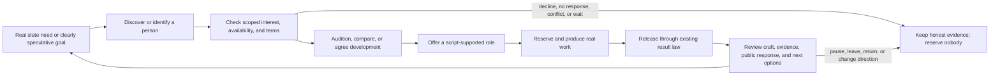
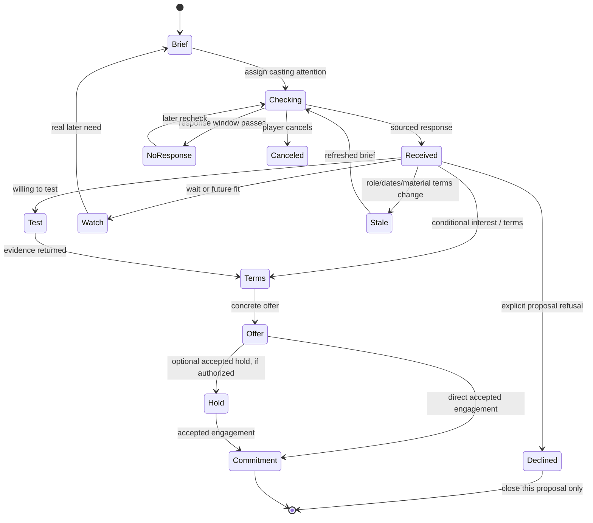
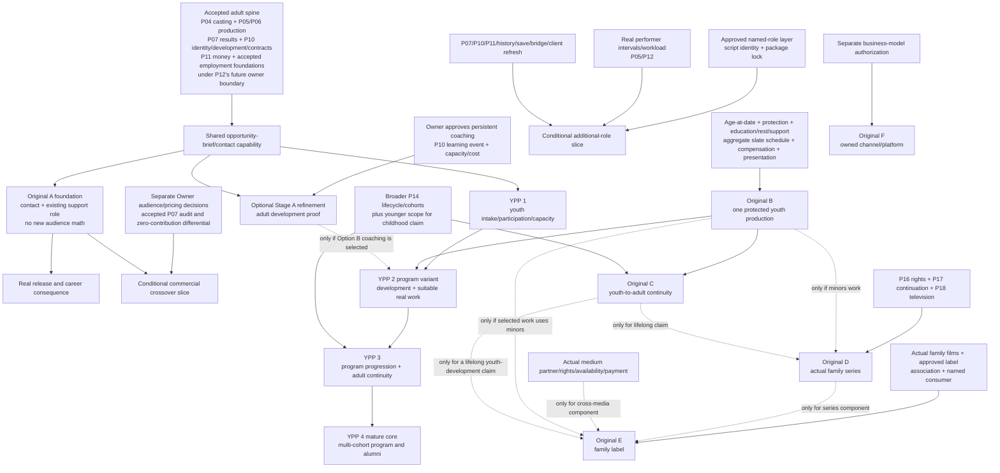

# Talent Development, Outreach, and Casting Integration Plan

> **OWNER-REQUESTED FUTURE PRODUCT REFINEMENT**
>
> **NEW MECHANICS AND SEQUENCING REMAIN PROPOSALS**
>
> **UNSCHEDULED**
>
> **GAMEPLAY IMPLEMENTATION NOT AUTHORIZED**
>
> **CURRENT OPS REVIEW AND ACCEPTED-BASE REFRESH REQUIRED**

Navigation: [Current Ops talent hub](TALENT-ORIGINS-CURRENT-OPS-REVIEW.md) · [Crossover design](CROSSOVER-TALENT-AND-SCREEN-CAREERS-DESIGN.md) · [Young-performer foundation](YOUNG-PERFORMERS-AND-CAREER-DEVELOPMENT-DESIGN.md) · [Family/TV handoff](FAMILY-ENTERTAINMENT-BRAND-AND-TV-HANDOFF.md) · [Talent Origins implementation register](TALENT-ORIGINS-IMPLEMENTATION-PLAN-AND-REQUIREMENT-REGISTER.md) · [Young Performers Program addendum](YOUNG-PERFORMERS-PROGRAM-DESIGN-AND-IMPLEMENTATION-ADDENDUM.md)

Exact inputs inspected:

- corrected five-document Talent Origins package at [`2980bcbd1367e23575a51008a011143e3a0d9653`](https://github.com/HSpector1/The-Movies/tree/2980bcbd1367e23575a51008a011143e3a0d9653/docs/design/future-talent);
- Young Performers Program addendum at [`4d43787ca6ee99dc620d4904346ffe49e489285e`](https://github.com/HSpector1/The-Movies/blob/4d43787ca6ee99dc620d4904346ffe49e489285e/docs/design/future-talent/YOUNG-PERFORMERS-PROGRAM-DESIGN-AND-IMPLEMENTATION-ADDENDUM.md);
- accepted TypeScript product/source snapshot `2753e18ba8fb5f65b936c22cde9531646fecc6cd` and its accepted runtime ancestor `da848225516fe3ced9a421548d0f5e7cbc8b5b88`;
- accepted Unity client snapshot `c4c65db464ef9abcf3bdcc088f5c8a47cc9081b6`.

The documentation parent is `4d43787...`, a documentation-only descendant of `2980bcbd...`, which is a documentation-only descendant of the supplied accepted product baseline `2753e18...`. No acceptance advancement beyond those recorded baselines was established. Later implementation observations recorded in the Talent Origins package remain dated **UNSEALED FORWARD EVIDENCE** and are not used here as shipped law. This plan records one snapshot; it does not chase active WIP.

This is a connective design and implementation plan, not a new package, implementation order, schema, save version, formula approval, or claim of human playtesting. It does not rewrite the five-document research. It refines how existing ambitions meet: discovery, mutual interest, terms, preparation, script-supported work, release, and durable career understanding.

Every consequential statement is framed as **SOURCE FACT**, **CURRENT CODE FACT**, **EXISTING PROJECT DIRECTION**, **INFERENCE**, **NEW RECOMMENDATION**, or **GAME-DESIGN HYPOTHESIS**. All people, films, studios, and prices in design fixtures are fictional.

---

## 1. One-page vision and player-experience contract

### The integrated journey



**NEW RECOMMENDATION:** make one opportunity pathway serve ordinary performers, adult prospects, famous outsiders, and—after youth-specific safeguards exist—young performers. The common path is a role- or goal-backed brief, a provenance-bearing contact journey, optional bounded development, real casting, real work, and a readable career consequence. Differences enter only where they are causal: outside recognition, existing commitments, youth protection, program participation, or a different medium.

### Player promises

The product should let the player:

1. start from an actual role or intentionally choose a speculative development goal;
2. compare imperfect evidence without seeing exact hidden craft or potential;
3. learn whether a particular person wants this particular opportunity;
4. distinguish interest from dates, terms, willingness to test, and commitment;
5. invest scarce money, coaching capacity, casting attention, and calendar time;
6. offer a supporting role, ensemble part, small named part, cameo, or lead only when the script genuinely supports it;
7. accept a refusal, wait for a better fit, hire an established actor, or proceed with an ordinary non-program candidate;
8. see private coaching, improved knowledge, role preparation, released-work growth, credit, and public recognition as different consequences;
9. follow one `PersonId` through repeated opportunities, departures, returns, professions, and—in the later youth vision—adulthood;
10. remember what the studio and performer actually did together without claiming ownership of the person or their entire career.

### Product invariants

- A Profile view, watch state, recommendation, inquiry, audition, or shortlist reserves nobody.
- Unknown interest is not refusal. No response is not proof of another deal. A refusal belongs to the dated proposal, not the person forever.
- Program membership, coaching, casting, project employment, representation, and rights are separate relationships.
- Private coaching creates no `FilmResult`, credit, public fame, revenue, work-history count, or genre experience.
- A released performance uses the real production/release path and resolves each genuine consequence exactly once.
- Outside fame never supplies free acting quality. Commercial crossover is a later, separately approved audience/pricing law.
- A script need precedes a named role. No empty role exists merely to farm development.
- Background work remains an honestly costed production aggregate unless the creative plan deliberately elevates a person to a named role.
- With no new role or origin contribution, the accepted legacy path—including outputs and RNG behavior—remains unchanged unless a separate recalibration is approved.
- Youth later reuses the shared pathway but adds all of its actual age, participation, protection, compensation, presentation, scheduling, and lifecycle requirements. Adult-first proof does not fulfill the childhood-to-adulthood ambition.

### What is independently useful

The plan separates four capability slices inside or beside the already defined Stage A; these are not a third stage ladder:

1. **Contact/casting foundation:** origin provenance, two-way contact, dates, terms, testing, an existing support-role opportunity, and a real first screen credit—with no new audience math.
2. **Shared adult development:** costed Option-B coaching through P10, demonstrated with adults before youth safeguards are added.
3. **Additional named roles:** a bounded, script-authored extension for ensemble/supporting, small named, cameo, and self-appearance work. This is conditional; existing support roles remain valid opportunities.
4. **Commercial crossover:** optional audience and pricing behavior only after explicit product approval and a refreshed P07 audit.

The first two can connect the missing journey without waiting for young performers, television, a family label, or a channel. The latter two solve different problems and must not be smuggled in as prerequisites.

---

## 2. Authority, accepted facts, and reviewed constraints

### 2.1 Source identity and classification

| Evidence | Exact identity | What it authorizes here |
|---|---|---|
| Talent Origins research and Current Ops correction | `2980bcbd1367e23575a51008a011143e3a0d9653` | **EXISTING PROJECT DIRECTION** and reviewed planning constraints; not implementation or external-source reverification. |
| Young Performers Program addendum | `4d43787ca6ee99dc620d4904346ffe49e489285e` | **EXISTING PROJECT DIRECTION** for Option-B coaching, YPP stages/IDs, and full-vision preservation; its mechanics remain proposals. |
| TypeScript accepted snapshot | `2753e18ba8fb5f65b936c22cde9531646fecc6cd` | **CURRENT CODE FACTS** below. Its runtime tree is the accepted P07 runtime ancestry; no later branch tip is treated as acceptance. |
| Unity accepted snapshot | `c4c65db464ef9abcf3bdcc088f5c8a47cc9081b6` | **CURRENT CLIENT FACTS** below. Inspection was read-only; no Unity process was opened. |
| Targeted external sources | Source register §14 | Narrow evidence about breakdowns, submissions, contact, availability checks, auditions, offers, and booking. They do not establish universal law or game tuning. |

The accepted TypeScript and Unity generated DTO files share Git blob `84d9c9a814ad4cc92d8a882205baa2f484ff8527` and SHA-256 `045fccce1ae318cbd338779fd52bd805302c1b8ad5ed033cb24d08eab590047f`; the recorded protocol/projection/save identities are `4 / 15 / V16`. These identify the inspected contract only and reserve no successor.

### 2.2 Current accepted capability and missing law

| Area | **CURRENT CODE FACT** at `2753e18...` | Planning consequence |
|---|---|---|
| Person identity | `Talent.id` is stable; one `Talent` holds age, Persona, fame, skill profiles, ceilings, `devRate`, work ethic, genre experience, and work history. | Reuse P10 identity and development. Do not create crossover, prospect, or graduate copies. Static `age` is not adequate youth lifecycle law. |
| Roles and scripts | `CastSlot` is exactly `lead | antagonist | support`. `FilmConcept.requiredSlots` and `roleRequirements` are keyed by that union; original concepts create all three. | Existing support can prove a smaller-than-lead opportunity. Added named roles require a real script/package extension, not a label change. |
| Casting evidence | `castingSessions.ts::auditionObservation` produces project/slot-specific evidence from a derived stream. A session takes one week and a shared Development & Casting reservation; it creates no hold or fee. The supported session/package pools require primary profession `actor`, although core greenlight's cross-discipline check tests whether the person has the acting discipline. | Reuse P04 evidence semantics. Audition changes knowledge, not craft, employment, or availability. Stage A needs one identity-preserving rule for when an origin-field person becomes contactable, auditionable, and assignable through the supported path. |
| Package/greenlight | `filmPackage`, package read models, and `applyGreenlight` expect one director, all three actors, and craft. M16.3/M16.7 reject duplicate same-film assignments. The economy-engaged path freezes participants at greenlight; legacy/open-pool productions deliberately may omit that snapshot for compatibility. | Added roles fan into validation and participant capture. If multiple acting assignments become legal, grouping by person is mandatory; legacy byte behavior remains explicit. |
| Availability | `activeProductionCompanyTalentIds`/`busyTalentIds` mark every director, cast member, and craft contributor busy for the whole active production through release. | A two-day named part cannot honestly exist yet. P05/P12 need performer-specific work intervals and workload before shorter bookings can be promised. |
| Hiring/terms | Current contract signing and freelancer pricing are immediate deterministic offers from the available talent market; there is no interest, representative, inquiry, outside-commitment, exploratory-brief, or hold model. `salaryCurve` already uses perceived **primary-profession** ability and screen fame; `offerForTalent` adds term, static-age, and stable-scarcity factors; the one-film freelancer fee reuses the curve. A cross-discipline acting assignment therefore is not currently priced from acting-role readiness. | Contact and negotiated appetite are genuinely new. P10 contract, P11 money, and P12 employer/interval authority remain distinct. Any origin-recognition pricing law must reconcile with existing screen fame and the primary-profession pricing seam instead of duplicating either. |
| Development | `developTalent` resolves at release from discipline-level project weights, difficulty, critic result, headroom/ceilings, `devRate`, accepted adult age multiplier, work ethic, and derived per-film/person RNG. Actor slot and workload are not passed. A high-work-ethic secondary-discipline nudge can consume additional fixed-order derived draws. | Audit every factor/draw before coaching calibration and exact regression. A tiny appearance must not receive the existing full-film actor opportunity by default. |
| Reception/forecast | Accepted forecast/result paths consume exactly three cast members. `CAST_WEIGHT` is lead `1.0`, antagonist `0.6`, support `0.35`; expressive `ROLE_WEIGHT` and Star Power role visibility are also fixed to current roles. | Additional cast touches Fit, execution, cohesion, forecast, demand/revenue, and Star Power. It cannot be added only to UI/types or assumed to improve quality. |
| Career events | `flattenParticipants` enumerates fixed participants; Star Power and career history resolve per participant. `TalentCareerEvent.eventId` is `${filmId}:${talentId}`—one event per person/film. | Preserve plural role credits but one bounded per-person/per-film development, career, and public-recognition resolution. Avoid duplicate RNG/rewards/event collisions. |
| Money | Greenlight sums a fee for each assigned freelancer; the ledger distinguishes production and freelancer-fee costs. | A naive repeated PersonId would double-charge. One negotiated engagement plus explicit incremental workload/preparation is required. |
| Saves/contracts/clients | Save validators, bridge casting/company schema, generated TypeScript-to-Unity DTOs, web adapter/read models, and accepted Unity casting workspace enumerate the three cast roles. Unity `StudioCastingWorkspace` and proof runners hold fixed role-key arrays. The accepted Unity release-result snapshot carries no participant/career-event array and there is no generic Unity Talent Profile/Career Impact surface. | An expanded role layer has wide generated-contract/client fan-out and needs a final accepted-base refresh. Do not assume the existing Unity Film History displays a person's role history. No version/type is frozen here. |
| History | Durable `FilmResult`, credits, work history, and career events exist. | These facts do not prove broader P08 Studio History or its world entrance shipped. P08 may later govern/present history; Wire is a separate downstream editorial consumer and never authors facts. |

The apparently flexible `requiredSlots` array does not make the system variadic: payloads, `Record<CastSlot, ...>` values, fixed loops, save validation, formulas, bridge contracts, and clients still require the three named actor slots.

### 2.3 Current Ops constraints carried unchanged

This plan preserves the full clarification record at `2980bcbd...`:

- Owner product choices remain separate from implementation-lead storage, adapter, interval, and resource-accounting recommendations.
- Dependencies follow selected capabilities, not P-number order. Adult development needs no youth or television; a film program/label needs no channel.
- Youth performer work and qualified support capacity aggregate across all concurrent productions and relevant outside commitments.
- Disabling new youth engagements cannot remove protections or unresolved obligations from committed work.
- Absent, zero, or non-applicable origin contribution preserves the then-accepted P07 results and actual RNG behavior unless a separate recalibration is approved.
- Source domains own facts; P08 governs/presents its history when accepted; Hollywood Wire is a non-authoritative editorial consumer.

Independent-review questions retained by that correction remain questions. This plan does not silently mandate a fame surcharge, negative persona modifier, label bonus, particular storage owner, 2065 endpoint, or jurisdiction scope.

### 2.4 Classification of this plan's additions

| Addition | Classification |
|---|---|
| Existing support-role casting, P04 audition evidence, real release, P10 work development, career fact, and Star Power consequences | **ALREADY COVERED** at the accepted baseline, subject to their current three-role and whole-production limits. |
| Origin provenance, uncertain interest, outside-commitment evidence, scoped offer/decline, adult screen-career transition | **PLANNED BUT UNDERSPECIFIED** in `XOV-001`–`XOV-011`; integrated contact behavior is a **NEW RECOMMENDATION**. |
| Persistent costed coaching | Older `YTH-009` deferred it; the later YPP request explicitly reopens Option B under `YPP-011`–`YPP-013`. Adult-first reuse is a **NEW RECOMMENDATION**, still **OWNER DECISION REQUIRED**. |
| Additional named roles and performer-specific short bookings | **GENUINELY NEW** and conditional. They extend P04/script, P05/P12, P07/P10/P11, history, saves, contracts, and clients. |
| Origin-aware demand/pricing/mismatch | **REQUIRES SEPARATE PRODUCT DECISION** and accepted P07/P11/P14 law. No parameter is approved. |
| Academy, younger cohorts, adult transition, family label, series, cross-media, channel | **PRESERVED EXISTING FUTURE DIRECTION** with named dependencies; none is made a prerequisite for adult Stage A. |
| Free fame, fake bids, profile-triggered expiry, arbitrary roles, full-film reward for trivial work, studio ownership of a person | **REJECTED DESIGN ALTERNATIVES**. |

One older planning restriction is deliberately revisited, and two accepted behavior restrictions would change only for selected approved variants:

- `YTH-009` deferred new persistent coaching. The later Owner-requested YPP addendum permits proposing Option B; approval would replace that deferral with one bounded P10 coaching law, first proved with adults. Until approval, the deferral still controls implementation.
- accepted M16.7 permits one role per person per production. It remains intact unless the Owner approves same-performer multiple acting assignments and the one-person aggregation proof passes.
- the accepted three-slot/full-production-booking path remains intact unless the additional-role and interval slices are approved. The extension is additive; the legacy branch is not rewritten.

The corrected Stage A already makes origin-demand behavior conditional. This plan operationalizes that review into a no-new-audience foundation and an optional commercial slice; it changes no P07 rule.

---

## 3. Targeted research: what a contact path must represent

This pass did not repeat the crossover biographies, sports-academy research, or youth-law survey. It investigated the consequential missing bridge between a known person and a real booking.

**SOURCE FACT:** Spotlight documents role breakdowns, performer/agent submissions, dated application tracking, and casting-professional contact for availability, self-tape, skill, or reel evidence. It also distinguishes invitation, shortlist, and rejection actions. That supports a compact role-backed submission/contact flow; it does not show that a submission or shortlist reserves or employs anyone.

**SOURCE FACT:** SAG-AFTRA's Young Performers Handbook describes a sequence from script breakdown and submission through audition/callback, an “on avail” notice, offer negotiation, client choice, and booking. The handbook itself warns that laws change and it is not legal advice. Its present-day US/youth context is evidence for separating states, not a universal historical contract model.

**SOURCE FACT:** SAG-AFTRA's March 2026 one-page commercial booking guidance says the contract should identify the signatory, advertiser, product, and applicable special provisions. It is commercial-specific; it supports specificity at engagement, not a theatrical-film-wide rule or a game formula.

**INFERENCE:** the game needs provenance-bearing statements and a stateful opportunity brief, not one hidden “interest percentage.” The player should know which proposal, dates, evidence source, and confidence a response refers to. The simulation may keep underlying preference factors hidden, but it must expose actionable evidence and never convert uncertainty into a fabricated fact.

These sources support the flow below, not the existence of an agent for every person, an absence of representation for unknowns, exact response times, contract enforceability across eras, or automatic acceptance behavior.

---

## 4. Shared performer development—prove the loop with adults first

### 4.1 Recommended adult proof

Refine original Stage A with an optional adult development cycle:

1. choose a real upcoming role, or explicitly mark a speculative role family/goal;
2. compare a promising adult, an established hire, and ordinary market alternatives;
3. ask the performer whether the bounded development direction is acceptable;
4. quote and reserve elapsed time, coaching capacity, attention, and P11 cost;
5. deliver completed blocks and resolve craft progress separately from better knowledge;
6. audition or screen-test for the real role;
7. cast only if the current evidence, Fit, terms, and dates justify it;
8. make and release the film through accepted law;
9. review coaching, audition evidence, released-work development, credit, Star Power, and next opportunities as separate facts.

This proves a reusable investment loop. It does **not** prove program enrollment, participation by a minor, protection, education, protected compensation, younger presentation, age transition, a lifelong cohort, a family label, television, or channel ownership.

### 4.2 Development alternatives

| Alternative | Player value | Cost/risk | Disposition |
|---|---|---|---|
| **A. Opportunities and accepted work-derived development only** | Cleanest reuse; the studio develops people by casting them in suitable real films. | Does not let the player make a direct, bounded investment before a person is role-ready; may encourage premature casting. | Preserve as a fully viable non-coaching strategy, but insufficient alone for the requested development fantasy. |
| **B. Costed, bounded coaching plus real opportunities** | Player chooses focus, spends scarce capacity/money/time, sees possible permanent craft change, then still must find suitable work. | Requires a new P10 learning-event law, calibration, anti-farm rules, finance/reservation integration, and explanation. | **NEW RECOMMENDATION**, subject to Owner approval. Prove with adults first, then reuse for YPP Stage 2. |
| **C. Named coaches/mentorship** | Adds personal fit, relationships, continuity, and richer stories. | Requires coach identity, availability/employment/service, P11 cost, P12 intervals, P14 relationship law, UI, and tuning beyond the core loop. | **DEFERRED WITH NAMED RETURN CONDITION:** Option B must first demonstrate meaningful choices that a named person would improve. |

Option B is the smallest addition that makes studio investment real without becoming a stat farm. It extends, never duplicates, P10's skill/development authority.

### 4.3 Audit before pacing or tuning

The accepted released-work path is not “one film = one gain.” It uses:

- acting-skill alignment from the concept/shape/promise;
- current actual skill and remaining ceiling/headroom;
- `devRate.acting`;
- current adult `ageRunwayMult`;
- work ethic;
- project difficulty;
- actual critic result;
- one derived draw per acting skill in fixed order;
- a possible high-work-ethic secondary-discipline nudge with further fixed-order derived draws;
- genre experience and work-history consequences at release.

**NEW RECOMMENDATION:** build calibration fixtures around representative people and films—different headroom, alignment, learning factors, difficulty, outcomes, and responsibilities. Do not declare that a course equals a fixed fraction of a movie.

Using the same person trait in two activities is not automatically double counting. It is justified only when the causal story is explicit:

| Existing factor | Possible coaching use | Constraint |
|---|---|---|
| `devRate.acting` | General propensity to learn professional acting craft | Strongest shared candidate, but its current distribution/tuning still needs audit. |
| Headroom/ceiling | Both coaching and work cannot improve beyond the same P10 limit | Recheck current headroom at resolution so overlapping genuine causes cannot overrun the ceiling. |
| Work ethic | Completion reliability **or** learning yield | Do not reward effort twice after completed blocks are already known. Select and explain one causal use or omit it. |
| Current adult age multiplier | No automatic reuse | It is accepted work-derived-development law, not evidence for a universal coaching curve or youth multiplier. Re-establish meaning before any coaching calibration. |
| Project result/difficulty | Not a private-coaching input | Coaching uses delivered curriculum/challenge. Released work keeps its own result/difficulty cause. |

### 4.4 Proposed coaching cycle contract

The following are design hypotheses, not schema or tuning approval.

#### Inputs and one authority

P10 owns the professional skill mutation, any applicable agreement/contract fact, and the idempotent learning event. P04 may supply a role/goal and evidence; P05/P06 reserve activity/capacity; P11 quotes and posts costs; P12 validates studio/employer identity, intervals, conflicts, and exclusivity; the Profile and program views consume a safe projection. No client, academy, facility, or coach adapter may mutate skill independently.

A cycle contains conceptually:

- one person and one stable cycle identity;
- one agreed acting focus mapped to existing P10 acting dimensions;
- a role/project link or an explicit speculative-goal label;
- planned blocks, interval, service level, quote, and cancellation/hold terms;
- a reserved maximum exposure against one canonical per-person rolling limit;
- governing ruleset/provenance;
- delivered blocks, interruptions, resolution, and player-facing explanation.

#### What freezes and what remains live

| At accepted commitment | During delivery or resolution |
|---|---|
| Person, focus, role/goal link, quote, planned interval/blocks, provider/service capacity, cancellation terms, ruleset identity, and maximum reserved exposure | Completed blocks, actual interruptions, active agreement state, current skill headroom, current rolling-cap consumption across all programs/studios, delivered service, refund/cancellation settlement, and the final bounded result |

Completed progress cannot be pre-banked. A reservation prevents over-commitment but does not award growth. If a cycle is interrupted, only genuinely completed work can resolve; unused capacity follows explicit cancellation/refund law.

#### Four outcomes must remain separate

| Outcome | May change | Must not change merely because of it |
|---|---|---|
| Coaching | Bounded actual P10 craft and the studio's evidence about it | Credit, fame, film result, revenue, work history, genre experience |
| Audition/screen exercise | Estimate, range, confidence, and role-specific evidence | Actual craft, employment, reservation, public fame |
| Role preparation | Current readiness for a named assignment | Global permanent craft unless a separately completed P10 coaching activity causes it |
| Released work | Existing/approved work development, exact credit, work history, genre experience, public consequence | Retroactive coaching, fabricated outside history, automatic success |

#### Anti-farm and explanation law

- One stable event resolves once across save/load/retry.
- All completed coaching contributes to one person-level P10 ledger and rolling cap; changing focus, provider, program, studio, or employer cannot reset it.
- Cancellation cannot award undelivered blocks or transform them into generic XP.
- Any fractional carry, if retained, belongs to the person/skill/event provenance, not to program membership, and arises only from completed work.
- Simultaneous coaching, schooling, preparation, and filming consume their real shared time; the same hour/provider cannot be reused.
- Repetition beyond headroom, cap, or useful challenge explains “limited headroom,” “cycle incomplete,” “capacity interrupted,” or “focus no longer aligned,” not a silent zero.
- Inspections and comparison screens consume no simulation RNG. Event resolution uses its own stable derived identity and cannot reroll on reload.

### 4.5 Why development and established hiring both work

Development trades present cash, attention, calendar, and uncertainty for a better-known or more capable person and possible future-role value. An established hire buys stronger current evidence and preserves coaching capacity. Either may be rational depending on slate frequency, time, headroom, cost, and artistic Fit. Program membership supplies no hidden loyalty, Fit, discount, or fame. The analytical walkthrough in §9 tests this directly.

---

## 5. One two-way talent-approach authority

### 5.1 One opportunity brief, three entry routes

**NEW RECOMMENDATION:** P04/casting coordinates one conceptual opportunity brief/contact journey. P10 supplies the person/professional evidence and retains its contract authority; P11 supplies quotes/costs; P12 validates studio/employer identity, a real hold/commitment interval, and exclusivity; P14 may later source repeatable inbound or market recommendations. Exact record placement is an implementation-lead choice after refresh.

| Route | Entry and default | Real resource | Response/evidence | Next actions |
|---|---|---|---|---|
| **Outbound** | Select a role in Casting, or choose **Discuss Opportunity** on a Profile. Default project, role/version, dates, expected engagement size, test request, billing/publicity intent, and budget context. | One bounded casting-team assignment, elapsed response time, and optional research cost when requested. | Person/representative response tied to exact brief/version; evidence source, date, confidence, freshness. | Clarify, request test, negotiate, watch, close, or proceed to an explicit hold/offer if real law exists. |
| **Inbound** | Person or representative appears in one Casting/Talent attention inbox, for the studio generally or a named opportunity. | Archival screening is automatic; advancing consumes triage/research attention and elapsed time. | Claimed interest and supplied evidence with source/date. General studio interest proves no role interest or availability. | Attach to a real role, request evidence/test, watch, decline, or close. Repeatable generation waits for an accepted P14/market source. |
| **Recommendation** | **Request Candidates** from a real casting need; role, dates, and evidence sought are inherited. | Casting/scouting attention and search time. | Explanation of why an unconventional candidate may fit, with observation/source/freshness. It proves no candidate interest. | Open Profile, check interest through the same outbound journey, shortlist without reserve, or ignore/watch. |

Advanced controls may expose exploratory versus role-specific purpose, alternate dates, engagement appetite, or publicity intent. Ordinary use must not require retyping facts already present in the selected role.

### 5.2 Seven separate facts

| Fact | Meaning | Does **not** establish |
|---|---|---|
| Public curiosity | Dated authored/simulated evidence that screen work may interest the person | Interest in this studio or proposal |
| Proposal interest | A response to this exact brief/version | Availability, terms, or acceptance |
| Engagement appetite | Acceptable role type/size, medium, duration, or billing context | Acceptance of the current role |
| Availability | Known dates and relevant outside commitments, with freshness | Reservation or future availability outside the evidenced window |
| Asking terms | Quote/range/unknown for this proposal | Accepted compensation or price for all future projects |
| Willingness to test | Willingness to audition/read/screen-test under stated conditions | Casting, employment, or craft quality |
| Accepted hold/commitment | Explicit dated acceptance under the applicable P10 contract and P12 employer/interval authority | Lifetime exclusivity, representation, ownership, or automatic future work |

Confidence belongs to evidence, never to a universal player-facing “interest 73%.” Multiple sources may conflict; the view should show which statement is newer or firmer rather than silently overwriting provenance. One stable proposal/version resolution identity prevents cancellation, reopening, duplicate inbound delivery, or save/load from producing a fresh answer to the same resolved contact.

### 5.3 States, refusal, cancellation, and staleness

The exact enum is not frozen, but the journey must distinguish at least: draft, assigned/checking, response received, clarification/terms, test invited, stale, canceled, declined, closed, and separately held/committed under actual law.

- Canceling an unresolved approach stops future contact work; spent time/cost remains spent.
- Canceling an accepted hold/commitment follows that agreement's actual terms; it is not a free state toggle.
- Material role, date, workload, billing, or publicity changes make the old answer stale and trigger recheck.
- No response remains “no response.” It cannot become refusal, another deal, or a fake rival deadline.
- A role-specific refusal leaves ordinary future approaches possible when circumstances genuinely differ.
- A watch entry consumes no time reservation and does not cause a person to expire.
- Waiting is rational when dates are distant, evidence is weak, terms are high, capacity is scarce, or a known commitment may clear.
- Only a separately accepted hold/commitment may reserve time, if that capability is approved. An audition or “on avail” presentation must not overstate its legal/simulation effect.

### 5.4 Player-facing flow



A hold is never a mandatory phase. A concrete offer may become a direct accepted engagement under its actual P10/P12 law, or use an optional hold where that distinct capability exists.

The Profile shows the latest sourced statement and links back to its opportunity. The Casting workspace shows only actionable briefs, responses, stale facts, conflicts, and next decisions—not a second Roster or a weekly inbox chore.

---

## 6. Crossover foundation before commercial crossover

### 6.1 Independently useful foundation

The verified Jim Brown, Dwayne Johnson, and other timelines in the linked Crossover design remain examples that originating-field awareness, first credit, acting breakthrough, and a sustained screen career are different milestones. They are not templates for fictional people or permission to assume one conversion path.

An adult famous outsider can complete a real first screen transition without any new audience formula:

- retain authored origin/contact provenance separately from simulated screen history;
- record public curiosity only when a dated source exists;
- learn proposal-specific interest, engagement appetite, dates, terms, and willingness to test;
- respect real outside commitments as bounded availability facts;
- audition or test through P04;
- offer an existing support role or, after separate approval, a smaller script-supported role;
- produce and release through accepted law;
- grant only the resulting real credit, work development, and later screen Star Power.

That completes origin/contact/casting foundation and a genuine career transition. It does **not** complete the “famous outsider brings an audience” fantasy.

### 6.2 Commercial behavior remains a separate decision

The Owner must separately decide whether and how:

- outside recognition affects asking terms;
- a desired first opportunity can affect acceptable terms;
- actual rivals value origin recognition once real rival-offer law exists;
- project/segment/territory/era overlap contributes to demand;
- persona mismatch merely reduces relevant positive overlap or creates an independent negative appeal effect;
- the studio learns any of this before commitment.

Accepted asking-price law already includes screen fame. No additional origin-fame surcharge, debut discount, negative modifier, transfer rate, cap, or audience formula is approved. Individual terms may later reflect bargaining position, opportunity cost, role desire, and engagement size, but “famous elsewhere” cannot mandate one price direction or double-charge the fame already priced.

### 6.3 One-entry and publicity gates

If a commercial origin contribution is later approved:

1. determine the distinct causal origin-relevant reach from frozen, supported facts;
2. reconcile overlap with existing awareness, Star Power, and marketing so the same people enter opening demand once;
3. preserve genuinely different causal effects—such as performance-driven review value versus pre-release publicity—rather than collapsing everything because both correlate with fame;
4. propagate once through accepted P07 demand/revenue law;
5. prove absent, zero, and non-applicable contribution against identical relevant state and actual RNG state.

A signed performer, billing choice, public announcement, trailer use, actual participation, and released visibility are different facts. A surprise cameo that is not publicized cannot automatically create pre-release awareness. A union/cap proposal does not authorize rewriting existing awareness, Star Power, marketing, demand, or revenue calculations, and no stored `FilmResult` is recomputed.

---

## 7. Script-supported additional roles

### 7.1 Smallest useful role layer

Keep the accepted lead/antagonist/support spine intact. Add, only if approved, a bounded collection of script-supported named roles with a few presentation categories:

- additional supporting or ensemble character;
- small named character;
- cameo character;
- self-appearance, with no fictional character identity.

These are game categories, not universal labor or billing classifications. The collection is bounded by authored script need, production complexity, client readability, and measured performance—not a hard-coded quota chosen to satisfy a fixture and not an unlimited cast editor.

Ordinary background work remains distinct and normally automatic. It receives lawful aggregate cost/capacity treatment but does not require the studio head to select every person. Automation never bypasses individual age eligibility, protection, work-time, supervision, education, or settlement rules if minors are used. Elevating a background worker into a named role is an explicit script/package choice with the consequences of a named assignment.

### 7.2 Two orthogonal optionalities

| Choice | Meaning | Required behavior |
|---|---|---|
| **Optional to personalize** | The script requires the role, but the player may accept lawful automatic casting or choose a specific performer. | Automatic casting must still schedule, pay, and satisfy applicable eligibility. Once personalized, the selected person follows normal contact, Fit, availability, terms, and commitment law. |
| **Optional to include** | The creative plan explicitly permits including or omitting the character/appearance before package lock. | Omission is a valid script decision, not an unfilled/unpaid role. Inclusion makes it a real role that must be cast, costed, scheduled, and resolved. |

A role can be required/automatic, required/personalized, optional/omitted, or optional/included and then automatic/personalized. These axes must not collapse into one “optional slot” flag.

### 7.3 Role, character, performer, and exposure are different facts

Every named role needs conceptual separation of:

| Fact | Purpose |
|---|---|
| Stable role identity | Keeps the script need stable across drafting, casting, commitment, production, credit, and history. |
| Character identity, when applicable | Identifies the fictional character; absent for a self-appearance. It is never the actor. |
| Narrative function/category | Explains why the role exists and which creative need it serves. |
| Required / optional-to-include | Governs whether omission is a creative option before lock. |
| Automatic / personalized | Governs whether the player chooses an individual. |
| Performer assignment | References one persistent P10 `PersonId`; does not transfer person or character ownership. |
| Expected work/preparation | Drives Fit, real intervals, workload, capacity, and development exposure. |
| Billing | Credit prominence. It is not screen time, workload, or publicity. |
| Publicity | What is actually disclosed and when. It gates pre-release audience knowledge. |
| Frozen visibility/contribution | What the released result and career systems may consume under approved law. |
| Cost | Negotiated engagement, preparation, and incremental production components with one explanation. |

### 7.4 Authoring and lock

**NEW RECOMMENDATION:** the accepted script/project owner authors the role during development; the player selects permitted optional inclusions before the package/greenlight cast lock. Exact ownership between current P04 script structures and later P16 StoryProperty/character identity is an implementation-lead/authority refresh question, not a new Owner storage choice.

After a brief, hold, cast commitment, or package lock, a role-set or material workload change triggers owning-system revalidation. At minimum revalidate:

- script/package and any character/right;
- role Fit, eligibility, audition evidence, and candidate interest;
- hold/employment terms and performer-specific intervals;
- preparation, capacity, and production schedule;
- payroll, engagement, and incremental production costs;
- forecast/result inputs and deterministic ruleset;
- billing/publicity;
- participants, credits, career events, saves, contracts, and clients.

There is no free late cast expansion. Removing a committed role also follows cancellation, finance, scheduling, and credit rules rather than erasing facts.

### 7.5 Whole-path consumer audit

| Consumer | Accepted assumption | Required extension / compatibility law |
|---|---|---|
| `types.ts`, screenplay/worldgen | Three `CastSlot` values and three `roleRequirements`; every original concept creates the trio. | Preserve the core record; attach prospective named roles with stable identity and explicit inclusion/personalization. No legacy role fabrication. |
| `castingSessions.ts`, `talentSummary.ts` | Audition and fit are one of three fixed slots; evidence is derived/project-specific. | Named-role requirement/goal must feed the same evidence concepts without changing craft or consuming sim RNG on inspection. |
| `filmPackage`, greenlight, `actions.ts` | All core roles required; the economy-engaged path freezes participants while legacy/open-pool productions may omit that snapshot for compatibility; M16.7 rejects any duplicate person in one production. | Validate every included named role. Keep duplicate-person rejection until explicit multi-assignment law can aggregate workload/cost/rewards safely; preserve the regime split for legacy files. |
| `employment.ts`, production | Every production seat is busy for the entire active production. | Performer-specific intervals and relevant outside commitments must reconcile before promising short work. Until then, a named role is honestly full-production booked or unavailable. |
| P10 `development.ts` | All actor slots share discipline-level opportunity; role/workload is absent; one film/person stream. | Add bounded learning exposure based on aligned activity, challenge, responsibility/workload, novelty, and real release—not screen minutes alone. Resolve once per person/film. |
| Forecast/reception/P07 | Fixed cast contributes to Fit, execution, expressive centroid, Star draw, audience satisfaction, demand, and revenue. | Extra cast supplies no automatic quality. Define bounded relevant contribution and coordination cost; absent collection takes exact legacy branch. Commercial origin contribution remains separate. |
| Star Power | Role visibility is frozen from current participant role; lead/support differ. | Combine actual billing, publicity, visibility, and outcome once per person. A small credit never receives lead exposure; an unpublicized cameo creates no pre-release awareness. |
| P11 finance | In the engaged economy, freelancer fees charge assigned director/cast/craft people at greenlight; the credited writer is not an engaged seat. Contracted talent has no incremental assignment fee because authoritative payroll already covers the relationship. Legacy/open-pool production accounting remains distinct. | One authoritative compensation basis per person/film—payroll-covered assignment or one freelancer engagement—plus approved, explained incremental workload/preparation/production costs; no per-role duplicate base fee and no invisible automatic-cast labor. Preserve accepted regime behavior when the extension is absent. |
| Credits/career | One participant role and one `${filmId}:${talentId}` event. | Preserve role-level credits, but group all same-person assignments into one person/film career/development/Star Power resolution with collision-free subreferences. Work-history/film count increments once. |
| Save/migration | Exact-key validation and current participant shapes assume the trio. | Add prospective empty projection for old saves; never infer, generate, or renormalize historical roles/casts/results. No schema number is reserved here. |
| Bridge/generated DTO/web/Unity | Casting slates, candidates, company rows, role enums, pickers, and proof fixtures enumerate lead/antagonist/support. The accepted Unity release-result DTO does not contain participant/career-event arrays. | Refresh all generated contracts/adapters/clients from the final accepted owner and add a real person-career consumer where selected. Client remains read-only; no partial deployment that drops new obligations or roles. |
| Profile/P08/Wire | Exact source facts can reach Profile; P08 and Wire are not equivalent. | Profile must show basic credit/career path. P08 may govern/present richer history; Wire may narrate typed facts but cannot create or mutate them. |

### 7.6 One person, multiple acting assignments

The accepted M16.7 single-role rule is a valuable fail-closed boundary. Do not relax it merely because a list can hold two entries. If a future creative case permits the same performer in more than one acting assignment:

- each role keeps its own role/character credit and workload;
- intervals and simultaneous feasibility use the union of that person's assignments;
- compensation resolves once through the authoritative basis—existing payroll coverage or one freelancer engagement—plus explained approved increments, not two unrelated full fees;
- development aggregates the genuine aligned exposure and resolves once from one person/film event;
- Star Power aggregates frozen visibility/billing/publicity once and applies one bounded result;
- work history and genre experience increment once for the released film;
- one career event references all assignment IDs without `${filmId}:${talentId}` collision;
- the system still prohibits incompatible writer/director/craft/cast duplication unless separately designed and approved.

### 7.7 Migration and rollback

- Old saves project `additionalNamedRoles = absent/empty` conceptually; they gain no invented characters, cast, fees, credits, development, or public effects.
- With no additional role, use the accepted legacy path—not a rewritten generic path whose rounding or draws happen to look similar.
- Existing stored `FilmResult`, participants, career events, and financial entries remain authoritative and are never recomputed.
- Disabling new roles stops authoring and new commitments. Committed work must finish or reach an explicit safe hold/cancellation under the rules that can still enforce its intervals, costs, and credits.
- A binary that cannot represent an in-flight expanded-role commitment must not resume it. Restore a compatible pre-change checkpoint or use an approved forward resolver.
- Contact/coaching disable follows the same distinction: stop new activity; safely resolve existing agreements, reservations, costs, and earned progress; restore only compatible checkpoints.

---

## 8. Make the career legible without another roster

### 8.1 Existing surfaces, new connective actions

Use the Casting/Talent lot workspace and the one P10 Profile:

- **Casting workspace:** actual role needs, inbound approaches, outbound checks, recommendations, tests, stale evidence, unresolved terms, and schedule exceptions.
- **Profile:** dated origin/contact evidence, current proposal/hold status, coaching and audition evidence, actual credits, career facts, and program participation when applicable.
- **Next Opportunity:** opens real compatible roles and permitted speculative development goals. It never creates a role for the person.
- **YPP overview:** remains the compact cohort/exception/direction surface under `YPP-029`, linked to the same Profile—not a second market or Roster.
- **Program identity:** may show a lightweight fictional name such as Northlight Young Performers and exact participation dates; it creates no channel, representation, role, loyalty, or person ownership.

Milestones may include first inquiry, accepted test, first named credit, first supporting/lead role, completed development cycle, declined proposal, departure, and return only when authoritative facts exist. A long studio relationship is derived from mutually accepted agreements and real joint work; it is not an automatic loyalty meter.

P08 may later present governed Studio History. Hollywood Wire may later narrate typed facts. Basic Profile/casting comprehension and “Next Opportunity” cannot wait for either system, and Wire must not exaggerate the studio's causal contribution or invent gossip.

### 8.2 Compact progress explanation

A useful review answers four questions without exposing hidden truth:

1. **What did we do?** “Six of eight camera-performance blocks completed; two interrupted by the agreed outside commitment.”
2. **What changed?** “Observed camera steadiness improved within the current estimate; one bounded craft change resolved.”
3. **What remains uncertain or unsuitable?** “Dramatic-lead evidence remains limited; the upcoming lead is still beyond the observed readiness range.”
4. **What can I do next?** “Audition for the existing comedy support role, continue later, hire an established actor, or pause without penalty.”

No progress bar guarantees an eventual tier, and no alumni label implies ownership or permanent availability.

---

## 9. Analytical paper walkthrough

> **ANALYTICAL PAPER WALKTHROUGH — NOT HUMAN PLAYTEST OR RUNTIME PROOF**
>
> An independent read-only agent acted as the simulated player. Arithmetic was checked with a standalone scratch calculator. No project runtime, test suite, proof harness, prototype, or persistent game state was used.

### 9.1 Fixed fixture and information boundary

All dollar values are fictional `$000` expected-value proxies declared before comparison. They are not P07 law, real-world prices, approved tuning, or claims that a player should see exact success probabilities or utility.

**Lantern Gate Pictures, weeks 1–24**

- discretionary casting/development cash: `320`;
- casting/development staff attention: `7` blocks;
- purchasable coaching capacity: `8` delivery blocks;
- base film budgets excluded and held constant.

**Slate**

- *Harbor Line* shoots weeks 15–17. `Dockmaster Neris` is the required existing support slot: eight workdays with sustained dialogue/emotional responsibility. `Ceremony Host` is a two-day, script-supported small named part optional to personalize; lawful automatic casting supplies it otherwise.
- *The Violet Hour* is a later dramatic lead, too demanding for the prospect and outsider under current evidence.
- *Winter Rooms* has no additional named role beyond lead/antagonist/support. No celebrity insertion or development-farming slot appears.

**People and what the player knows**

| Person | Known before decision | Unknown / later evidence |
|---|---|---|
| Mira Sen, 26, ordinary adult prospect | Inbound submission for *Harbor Line*; interested in bounded coaching; promising dialogue evidence; current camera presence uncertain | Exact actual craft/potential and whether one cycle makes her support-ready |
| Rafi Arden, 48, established character actor | Sufficient role evidence, confirmed availability, stated terms | Ordinary outcome uncertainty; no coaching dependency |
| Nyra Cole, 33, famous wrestler/broadcaster | Dated public curiosity; plausible persona for `Ceremony Host`; outside appearance conflicts with week 15 | Proposal interest, test result, acceptable terms, and any project-relevant audience overlap |
| Jae Kestrel, musician | Representative explicitly declines this role-specific inquiry | Nothing is inferred about another deal or permanent disinterest |
| Ana Voss, ordinary non-program actor | Available and adequate support fallback | Ordinary project outcome uncertainty |

Jae's inquiry costs `8` cash plus one attention block, leaving `312` and six. It is a common sunk cost: included in remaining-cash figures, excluded from comparative surplus.

The paper analyst uses hidden `p` and value proxies to compare robustness. The actual player would see source-bearing ranges, readiness explanations, dates, terms, and capacity—not exact potential or a displayed `60%` destiny.

### 9.2 Frozen hypotheses

| Input | Hypothesis |
|---|---:|
| Mira coaching plus assessment cost `K` | 80 |
| Probability Mira is support-ready after base cycle `p` | 0.60 |
| Mira compensation/preparation if ready | 55 |
| Ana fallback if Mira is not ready | 105 |
| Immediate value with ready Mira | 260 |
| Immediate value with Ana fallback | 225 |
| Future value, ready Mira branch | 120 |
| Future value, not-ready branch | 40 |
| Rafi compensation/preparation | 185 |
| Rafi immediate + future relationship value | 330 + 20 |
| Nyra initial interest/date check | 8 |
| Nyra later evidence/test | 10 |
| Nyra base fee `T` | 100 |
| Small-role production/preparation | 30 |
| Publicity | 25 |
| Schedule-shift cost for outside conflict `S` | 25 |
| Small-role performance/narrative value | 50 |
| Hypothetical relevant-overlap value `O` | 150; one de-duplicated incremental value after overlap with baseline awareness, Star Power, and marketing |
| Future crossover option after real work | 30 |

Staff-attention blocks are capacity, not one-for-one player clicks:

| Strategy after Jae's common one-block inquiry | Staff-attention allocation | Total |
|---|---|---:|
| A | compare/brief `1`; agreement/cycle setup `1`; grouped delivery oversight `2`; assessment/audition `1`; cast/fallback resolution `1` | 6 |
| B | evidence/availability confirmation `1`; quote/booking `1` | 2 |
| C | Nyra interest/date check `1`; evidence/test `2`; terms `1`; production-window replan `1`; cast/commitment `1` | 6 |

Grouped blocks are deliberate staff assignments, not hidden free actions: A's single post-cycle *Harbor Line* audition is also its assessment evidence event; C's final casting-resolution block books Ana and, only on the favorable branch, Nyra in one package decision.

### 9.3 Base comparison

#### A — develop Mira for the required support role

Policy: complete one eight-block cycle, assess once, cast Mira if ready, otherwise use Ana.

```text
Expected cost  = K + p(55) + (1-p)(105) = 155
Expected value = p(260+120) + (1-p)(225+40) = 334
Expected surplus = 179
```

Ready-branch surplus is `245`; fallback-branch surplus is `80`. Including the common inquiry, expected cash used is `163` and expected cash remaining is `157`; the realized ready branch uses `143`/leaves `177`, while the fallback branch uses `193`/leaves `127`. All branches fit the envelope. All six remaining staff-attention blocks and all eight coaching-delivery blocks are consumed. This is attractive because the slate plausibly contains later fitting roles, but it is the most outcome-sensitive option.

#### B — hire established Rafi through the ordinary route

```text
Value = 330 + 20 = 350
Cost = 185
Surplus = 165
```

Including the common inquiry, cash used is `193` and cash remaining is `127`; two more staff-attention blocks are consumed, leaving four. This is a successful non-program strategy. The numerical model understates it because unused attention has no shadow price.

#### C — hire Ana for support and, conditionally, personalize the small role with Nyra

This branch is evaluated only after Nyra returns favorable proposal interest, sufficient test evidence, and the stated base terms. If the early date check reveals an unresolvable conflict, or the response/test is unfavorable, the studio exits after the actual spent check/test and chooses A, B, Ana, or Wait.

Nyra's real outside appearance conflicts with week 15. Opening an additional week-12 pre-shoot block costs `25`; it changes *Harbor Line*'s declared production window and requires script/package, facility, crew, production, performer-interval, cost, and forecast revalidation. The accepted runtime cannot represent this plan today.

Lawful automatic casting of `Ceremony Host` is the baseline and its common cost/value is held constant. Nyra's `50` performance/narrative value and `30` future option—and her contact/test, fee, preparation, publicity, and shift costs—are incremental to that baseline. `O` is a single hypothetical incremental audience value after removing overlap with accepted awareness, Star Power, and marketing; it is not approved P07 law.

```text
Cost  = 105 + 18 + 100 + 30 + 25 + 25 = 303
Value = 225 + 50 + 150 + 30 = 455
Surplus = 152
```

Including the common inquiry, cash used is `311` and cash remaining is `9`; all six remaining staff-attention blocks are used. Under the frozen base assumptions, `A 179 > B 165 > C 152`. C is close, cash-brittle, requires not-yet-existing production-window and short-interval law, and depends on commercial origin law that is not approved.

### 9.4 Sensitivity—not post-hoc balancing

#### Future role frequency for Mira (`K=80`, `p=.60`)

The ready/not-ready future-value pairs are: low `30/10`, base `120/40`, and high `220/75`. All other inputs stay fixed.

| Matching-role frequency | A surplus | B surplus | C base surplus | Best quantified option |
|---|---:|---:|---:|---|
| Low | 113 | **165** | 152 | Established hire |
| Base | **179** | 165 | 152 | Develop prospect |
| High | **253** | 165 | 152 | Develop prospect |

Development is weak when the slate cannot supply appropriate later work. Expanding a cohort without opportunity frequency worsens the bottleneck.

#### Coaching cost/progress

At base role frequency, `A surplus = 160 - K + 165p`.

| `K` | `p=.30` | `p=.60` | `p=.80` |
|---:|---:|---:|---:|
| 50 | 159.5 | 209 | 242 |
| 80 | 129.5 | 179 | 212 |
| 120 | 89.5 | 139 | 172 |

High-cost/low-progress coaching loses plainly to Rafi. Stronger progress or lower cost can justify development. This supplies no universal course-to-film conversion.

#### Outsider terms and relevant overlap

With the fixture's declared `25` shift cost, `C surplus = 102 + O - T`.

| Nyra fee `T` | `O=0` | `O=150` | `O=300` | Total cash used including common inquiry |
|---:|---:|---:|---:|---:|
| 70 | 32 | 182 | 332 | 281 |
| 100 | 2 | 152 | 302 | 311 |
| 150 | -48 | 102 | 252 | **361—infeasible** |

With no approved origin contribution, C's base surplus is `2`, versus `120` for Ana plus automatic small-role casting. High relevant overlap can make Nyra valuable; high asking terms can still make the plan infeasible. No transfer rate, cap, or formula follows from these paper values.

#### Availability and publicity

| Nyra state | Result under frozen hypotheses |
|---|---|
| Dates compatible | Surplus `177`, cash used `286`, five post-inquiry attention blocks consumed |
| Conflict shiftable | Surplus `152`, cash used `311`, six post-inquiry attention blocks consumed |
| Conflict unresolvable | No commitment. Spend Nyra's `8` early check only, then retain a non-reserving watch state. Hiring Rafi yields surplus `157` excluding Jae's common cost and uses `201` cash including both `8` checks. |
| Surprise/unadvertised appearance | No pre-release origin contribution. Compatible surplus `52`; shifted `27`. Ana plus automatic casting supplies `120`, so a commercially motivated surprise is dominated here. |

Waiting for a compatible Nyra role is rational. Opening her Profile does not make her expire. An unadvertised appearance could still be selected for a separately supported creative reason, never a hidden awareness bonus.

### 9.5 Simulated-player resolution

1. `Dockmaster Neris` supplies the brief, role demands, and dates.
2. Jae's representative explicitly declines; the sourced, dated refusal closes only this proposal.
3. Rafi's availability and terms are confirmed, preserving a reliable alternative.
4. Mira accepts one bounded focus. Person/cycle/focus, quote, interval, blocks, ruleset, cap reservation, and cancellation terms freeze.
5. Delivery checks completed blocks, interruptions, current headroom, and the canonical rolling cap. Focus/program/studio/reload switching cannot reset them.
6. The player chose A on expected information before knowing the outcome. A predeclared illustrative paper card then selects the ready branch solely to exercise downstream decisions; the fallback branch remains fully costed above. One bounded craft change occurs. Mira has no public credit or fame yet.
7. Mira remains unsuitable for *The Violet Hour*. The player does not force a promotion.
8. Mira's one post-cycle *Harbor Line* audition also supplies the assessment event: it narrows camera-presence evidence without changing craft. She then accepts the real support engagement.
9. Release uses one authoritative path for participant, credit, work history, genre experience, work-derived development, and any public outcome—separate from coaching.
10. *Winter Rooms* exposes no additional-role action. No arbitrary part is authored.
11. Nyra is watched for a later compatible script-supported role without reservation or fabricated urgency.

### 9.6 Findings and weaknesses

**Meaningful choices**

- A exchanges money, all coaching capacity, attention, and time for uncertain current readiness and future slate value.
- B buys reliable evidence now and preserves staff capacity.
- C keeps the demanding role with an ordinary professional while testing an outsider in a genuinely smaller role.
- Waiting, refusal, fallback, and non-program hiring are legitimate outcomes.

**Dominated or invalid choices under the relevant assumptions**

- asking Mira or Nyra to carry *The Violet Hour*;
- high-fee/zero-overlap Nyra under this envelope;
- claiming pre-release commercial value for an unadvertised surprise;
- creating a role in *Winter Rooms* for development farming;
- reserving at inquiry/watch/shortlist/audition;
- selecting the coaching strategy in the low-role-frequency/high-cost/low-progress sensitivity cases;
- promising two workdays while the accepted engine blocks the performer for the whole production.

**Workload**

The useful cadence is one role-defaulted contact approval, one genuine terms/date exception, one coaching commitment, one material cycle review, and one audition/casting decision. Eight delivered coaching blocks must not become eight clicks. Re-entering role facts, approving weekly progress, and individually casting ordinary background work are chores; staff should group routine work and surface exceptions.

**Bottlenecks and improvements**

- Suitable future roles, not intake volume, are the binding development opportunity. Show likely role frequency beside a coaching decision; never manufacture parts to rescue the investment.
- Coaching delivery capacity binds Mira's option; terms plus schedule shift nearly exhaust C's cash/attention. Quote those opportunity costs together before commitment.
- The accepted whole-production busy rule blocks an honest small booking. Keep the role automatic/full-booked or wait until a real interval extension exists.
- Default every approach from the role and group routine updates. Interrupt the player only for a changed date/term, capacity conflict, failed valid-plan search, or material review.
- Preserve a one-click established-hire route and an explicit **Wait** action so the new system creates alternatives rather than compulsory process.

**Unresolved weaknesses**

- Coaching progress/cost has no empirical calibration.
- Origin contribution, pricing response, and persona mismatch are unapproved.
- Expected-value proxies compress artistic purpose, preference, risk, and cash timing.
- Unpriced spare attention biases the arithmetic against B.
- Accepted work development cannot distinguish a tiny role from full-film acting responsibility.
- Short bookings, late role revalidation, optional-role quality contribution, and multi-assignment resolution are absent.
- Stale reports, delayed replies, and real rival offers were identified but not simulated.
- No human evaluated clarity, excitement, or repetition. Agent simulation and independent document review cannot prove fun.

The finding is not that one strategy should always win. Each becomes rational under identifiable conditions; opportunity-poor development, forced promotion, and high-fee/low-overlap celebrity casting become visibly poor choices.

---

## 10. One capability-dependent stage map

These are refinements and conditional gates mapped onto the already published Talent Origins A–F and YPP 1–4 stages. They are not new package numbers, schedules, or a third unexplained ladder.



Solid arrows are hard dependencies for the named slice. Dashed arrows are conditional on selecting that variant. Removing a false dependency does not schedule a feature, waive its real dependencies, or approve mechanics.

### 10.1 Mapping to the published stages

| Published authority | Integrated refinement | Hard dependencies | Explicitly not proven / conditional extensions |
|---|---|---|---|
| **Original A—adult crossover** | One opportunity brief; outbound/inbound/recommendation routes; dated interest/availability/terms; existing support role; audition; real release. Optional adult coaching refinement. | Accepted P04/P05–P07/P10–P12 seams; an identity-preserving origin/acting-eligibility/profession seam for supported casting; refreshed clients; approval for contact behavior. Coaching additionally needs Owner approval and P10/P11/capacity law. | No youth/TV. Commercial origin effects and additional roles are independent conditional slices. |
| **YPP 1—intake/capacity** | Reuse briefs, reports, contact evidence, watch/defer, and Profile links; add youth intake, voluntary program participation, authorized-adult context, and program capacity. | Minimum P14-consistent age/intake source, P10 registration, P04, P11, approved age/participation/presentation rules. | No persistent development or youth production. Adult contact alone proves none of these youth facts. |
| **Original B—one supported youth production** | Cast and complete one appropriately supported young-performer film under real production law. | Minimum age-at-date; age-appropriate role/presentation; P05/P06 aggregate scheduling/support; P11/P12/P13 youth compensation/employer/policy law. | No program intake or coaching dependency. Existing support can suffice; expanded roles are conditional. One production is not an academy or childhood-to-adult career. |
| **YPP 2—program development plus suitable work** | Connect YPP 1 participation to development and one appropriate real role. | YPP 1 plus Original B protections/work. The current Option-B proposal additionally requires separate coaching approval and the accepted adult proof. | If coaching is not approved, YPP 2 must be deliberately redefined; Original B remains independently valuable. |
| **Original C—youth-to-adult continuity** | Preserve identity, credits, age transition, independent adult choice, pause/return, and profession change over time. | Original B; broader P14 lifecycle/cohort law; P10/P11/P12 continuity; approved younger scope for a genuine childhood claim. | No program, television, label, channel, mortality, or full relationship dependency. |
| **YPP 3—program progression/adult continuity** | Add several program review cycles and honest program-to-adult history to Original C capabilities. | YPP 2 and broader P14 lifecycle/cohort law; approved younger scope for the full childhood claim. | No TV, label, channel, or compulsory rival/mentor system. |
| **YPP 4—mature program core** | Bounded multi-cohort operation, honest alumni, program-health/opportunity evidence. | Stage 3, horizon/performance/persistence evidence; P08 only for richer governed history. | Rival, named-mentor, facility, TV, and cross-media adapters remain conditional. |
| **Original D—family series** | Real recurring production through actual series/season/cast law. | P16 property/rights, P17 continuation, P18 television, and applicable P07/P10–P12. | Adults-only series needs no YPP. Minors add Original B protections; a lifelong youth-development claim adds Original C. YPP is required only for the selected program experience. |
| **Original E—family label/partnerships** | Film-only label can consume actual family films and talent pathways; selected series/media add only their real owners. | Actual family films; approved label proposition, identity/project association, and concrete consumer or explicitly presentation-only interface. Selected work with minors adds Original B; a lifelong youth-development claim adds Original C. | No inherent TV, program, or youth dependency for an adult film-only label; no invented label bonus or silent music/touring/merchandise simulator. |
| **Original F—owned outlet** | Preserved separate linear/DTC business decision. | Separate Owner authorization, selected business-model capabilities, sufficient rights-cleared content, refreshed economics/era law. | Never unlocked merely by an academy, label, additional roles, or one series. |

### 10.2 Implementation slices and safe handoff

#### Stage A foundation—first integrated journey

| Planning field | Contract |
|---|---|
| **Player outcome** | Identify an adult candidate, learn proposal-specific interest/dates/terms, audition if useful, cast an existing support role, release the film, and see the exact career consequence. |
| **Required capabilities/decisions** | Approve the compact contact experience and career freedoms; refresh accepted P04/P05–P07/P10–P12 interfaces; define one identity-preserving origin/acting-eligibility/profession seam so a non-primary actor can enter supported casting without a replacement person. No origin-demand decision is required when commercial contribution is absent. |
| **Bounded work** | One opportunity brief; three shared entry routes; sourced response/staleness; one existing support role; explicit refusal/no-response/wait; Profile/casting projection; persistence and cancellation. |
| **Scope exclusions** | No coaching unless the next refinement is selected; no additional roles, audience transfer, rival bid, youth, TV, label, or channel. |
| **Acceptance journey** | Famous outsider has limited screen evidence and a real outside conflict; ordinary actor is skilled; a person declines; another waits; the selected adult completes a real support credit. |
| **Persistence/migration** | Old saves have no contact cases or invented interest. Inspection is passive. Proposal facts persist only with source/version/date; release facts use existing owners. |
| **Rollback** | Stop new approaches; cancel unresolved cases while keeping spent effort; honor/settle any explicit accepted hold or engagement. Restore only a checkpoint compatible with committed law. |
| **Full vision outstanding** | Direct investment, smaller parts, origin commercial behavior, youth and lifelong careers. |
| **Relative effort/risk** | Large / medium–high due new contact state and client flow, but bounded by existing core role. |

#### Optional Stage A adult-development refinement

| Planning field | Contract |
|---|---|
| **Player outcome** | Fund one bounded adult coaching direction for a real role/speculative goal, observe craft separately from knowledge, then audition and choose whether to cast. |
| **Required capabilities/decisions** | Owner approval of persistent coaching, impact/cadence/opportunity cost/speculative goals; P10 learning authority; P05/P06 capacity/time; P11 cost; P12 conflicts; accepted-base factor audit. |
| **Bounded work** | One to three mapped focuses, one provider tier (not a named coach), one cycle/event ledger, rolling cap/headroom, interruption/cancellation, explanation, Profile link. |
| **Scope exclusions** | No youth enrollment/protection, named mentorship, automatic role, public fame/credit for coaching, second skill tree, or universal course/film equivalence. |
| **Acceptance journey** | Prospect, established hire, and outsider comparison; coaching may stall; audition only narrows evidence; released work resolves separately once; focus/studio/cancel/reload cannot farm progress. |
| **Persistence/migration** | Add only actual prospective cycles/resolutions; no retroactive lessons. Stable event identities and cap ledger are idempotent. |
| **Rollback** | Stop new cycles; finish, interrupt, or settle active cycles; preserve earned completed-block resolution and costs; incompatible binaries cannot resume them. |
| **Full vision outstanding** | Youth-specific law, multi-year lifecycle, institution/alumni, named mentors. |
| **Relative effort/risk** | Large / high because pacing, shared factors, anti-farm, money, and time must reconcile. |

#### Conditional additional-named-role slice

| Planning field | Contract |
|---|---|
| **Player outcome** | Include/omit a supported character where allowed, or personalize/auto-cast a required small role; offer a legitimately smaller responsibility. |
| **Required capabilities/decisions** | Owner selects player-facing categories/creative authority/billing workload. Script/package role identity and lock; P05/P12 intervals/workload for short bookings; P07/P10/P11/history/save/contract/client refresh. |
| **Bounded work** | A small measured collection; additional support/ensemble, small named, cameo/self presentation; automatic background aggregate; all-consumer integration. |
| **Scope exclusions** | No unlimited cast editor, arbitrary quota, farm roles, free quality, unpaid background, or promised short booking before interval law. |
| **Acceptance journey** | Required/automatic, required/personalized, optional/omitted, optional/included; no-extra-role film exact legacy path; one same-person multi-assignment fixture only after aggregation law exists. |
| **Persistence/migration** | Old saves project an empty collection; no historical reconstruction. Role/character/assignment IDs remain stable; results are never recalculated. |
| **Rollback** | Stop new role authoring; finish or explicitly resolve committed roles under compatible interval/cost/credit law. |
| **Full vision outstanding** | Commercial origin law, youth, recurring series, broad cast simulation. |
| **Relative effort/risk** | Very large / very high due system-wide fixed-slot fan-out. It is not required for the first adult path. |

#### Conditional commercial-crossover slice

| Planning field | Contract |
|---|---|
| **Player outcome** | Understand when a known outsider's relevant audience and bargaining position may matter for this publicized project. |
| **Required capabilities/decisions** | Owner decisions on demand, terms, rival valuation, debut motivation, mismatch, evidence; accepted P07/Star Power/marketing audit; real P14 rival law before rival valuation. |
| **Bounded work** | One provenance-bearing origin-relevance contribution, one-entry overlap reconciliation, publicity gate, pricing explanation if selected, exact zero-contribution differential. |
| **Scope exclusions** | No follower conversion, automatic surcharge/discount, mandatory negative effect, fake rival bid, global recalibration, or stored-result rewrite. |
| **Acceptance journey** | Same origin recognition yields different role/segment/territory relevance; unadvertised cameo no pre-release effect; absent/zero/non-applicable path matches baseline outputs and RNG. |
| **Persistence/migration** | Persist frozen contribution/publicity inputs only for new eligible commitments/results; old films remain unchanged. |
| **Rollback** | Disable new contributions; committed films retain the frozen ruleset needed to resolve, or return to a compatible checkpoint. |
| **Full vision outstanding** | No origin-industry simulator or automatic long career. |
| **Relative effort/risk** | Large–very large / very high because commercial balance and deterministic compatibility are sensitive. |

YPP, longitudinal, family, television, cross-media, and outlet stages retain their detailed contracts in the existing documents. If approved, this plan makes two sequencing refinements: it makes the no-new-audience contact/casting foundation explicit within Original A, leaving commercial crossover conditional, and it offers a reusable adult development proof before any selected YPP Option-B reuse. Neither refinement makes adult stage completion a prerequisite for YPP intake or for a coaching-free protected youth production.

### 10.3 Work that can proceed independently after authorization

Specification can be parallelized against frozen contracts:

- P04 contact/brief/evidence behavior;
- P10 coaching event and per-person/per-film aggregation design;
- P05/P06/P12 person-specific interval and reservation semantics;
- P11 quote/ledger explanation;
- script-role identity/package lock and optionality;
- P07 no-change differential harness design;
- read-only Profile/Casting/Unity projections.

Integration cannot seal until shared identities, event keys, intervals, finance, RNG, migrations, generated contracts, and clients reconcile. None of this parallelism is authorization to begin implementation.

---

## 11. Stable supplemental requirement and proof register

`TPI` supplements, and never renumbers or replaces, existing `XOV`, `YTH`, `FAM`, `INT`, `PRF`, `YPP`, and `YPP-PRF` identities.

### 11.1 Requirements

Statuses use the reviewed Talent Origins vocabulary. **Recommended** never means **approved**.

| ID | Stable requirement | Status / owner or dependency |
|---|---|---|
| **TPI-001** | Connect real need → discovery → scoped interest/availability/terms → optional development/evidence → script-supported offer → work → career consequence. | **OWNER DECISION REQUIRED** for integrated experience; existing P04–P12 owners remain. |
| **TPI-002** | Default ordinary briefs from the selected role, version, dates, workload, billing/publicity intent, and budget; label speculative goals explicitly. | **RECOMMENDED STAGE A FOUNDATION**; P04/project context. |
| **TPI-003** | Outbound, inbound, and recommendation routes use one contact/casting authority and converge on the same opportunity journey. | **RECOMMENDED STAGE A FOUNDATION**; exact record placement is implementation-lead work. |
| **TPI-004** | Keep public curiosity, proposal interest, engagement appetite, availability, asking terms, willingness to test, and accepted commitment distinct. | **RECOMMENDED STAGE A FOUNDATION**; P04/P10/P11/P12 seams. |
| **TPI-005** | Every material contact statement carries a stable proposal/version resolution identity, source, observed/responded date, freshness, and confidence where interpretive. | **RECOMMENDED STAGE A FOUNDATION**; no exact hidden interest score or reroll-by-reopen. |
| **TPI-006** | Inquiry, recommendation, watch, shortlist, and audition reserve nobody; only an explicit accepted hold/commitment may reserve under approved law. | **EXISTING CONTRACT/AVAILABILITY BOUNDARY plus REQUIRED extension**; P10 contract, P11 compensated terms, P12 employer/interval/exclusivity. |
| **TPI-007** | Unknown, no response, stale, canceled, and declined remain distinct; refusal is proposal-scoped and waiting can remain rational. | **RECOMMENDED STAGE A FOUNDATION**. |
| **TPI-008** | Contact consumes bounded casting attention/time and any quoted research cost; cancellation preserves spent effort and applies real hold terms where present. | **OWNER DECISION REQUIRED** for workload; P04/P11 implementation. |
| **TPI-009** | If persistent coaching is approved, first prove the shared Option-B loop with adults through P10's one development authority. | **OWNER DECISION REQUIRED**; refines Stage A and later supports `YPP-011`–`YPP-013`. |
| **TPI-010** | Coaching requires elapsed time, cost, capacity, skill alignment, headroom, diminishing returns, rolling limits, interruption handling, and idempotent resolution. | **RECOMMENDED ADULT-DEVELOPMENT REFINEMENT**; tuning remains a game-design hypothesis. |
| **TPI-011** | Freeze commitment inputs; recheck completed blocks, current headroom, interruptions, delivered service, and canonical rolling-cap use at delivery/resolution. | **RECOMMENDED ADULT-DEVELOPMENT REFINEMENT**; P10/P05/P11/P12. |
| **TPI-012** | Switching focus/provider/program/studio, canceling, or reloading cannot bank progress, reset diminishing returns/caps, or duplicate cost/reward. | **REQUIRED INTEGRITY LAW** if coaching is approved. |
| **TPI-013** | Explain each causal use of `devRate`, headroom, work ethic, age, challenge, and results; sharing a trait across genuine causes is neither automatically required nor forbidden. | **ACCEPTED-BASE AUDIT REQUIRED**; no coaching formula approved. |
| **TPI-014** | Coaching, evidence, role preparation, released-work growth, credit, genre/work history, fame, and revenue remain different facts and causes. | **EXISTING BOUNDARIES plus RECOMMENDED coaching/preparation extensions and REQUIRED regression law**; P04/P07/P10. |
| **TPI-015** | Origin/contact/casting foundation remains useful with no new audience math; commercial crossover is separately gated. | **RECOMMENDED STAGE A FOUNDATION**; `XOV-003`–`XOV-007`. |
| **TPI-016** | Demand, asking terms, debut motivation, rival valuation, relevant overlap, mismatch, and pre-commitment knowledge are separate product decisions. | **OWNER DECISION REQUIRED** per selected effect; no mandated surcharge/penalty. |
| **TPI-017** | Absent, zero, and non-applicable origin contribution preserve then-accepted P07 outputs and actual RNG behavior; stored history is never rewritten. | **EXISTING CURRENT OPS CONSTRAINT / REQUIRED ACTIVATION GATE**. |
| **TPI-018** | A person's billing, publicity/announcement, participation, released visibility, and public result remain distinct; unpublicized cameos add no pre-release awareness. | **RECOMMENDED CONDITIONAL COMMERCIAL LAW**; P07 refresh. |
| **TPI-019** | Preserve core lead/antagonist/support and add only a bounded script-supported named-role layer; ordinary background remains aggregate/automatic without bypassing any individual youth protections. | **OWNER DECISION REQUIRED** for categories and management depth; genuinely new conditional slice. |
| **TPI-020** | Required/optional-to-include and automatic/player-personalized are orthogonal; automatic work is still lawfully costed and scheduled. | **RECOMMENDED CONDITIONAL ROLE LAW**; script/P04/P11/P12. |
| **TPI-021** | Each named role separates stable role ID, optional character ID, function, inclusion/personalization, performer, work/preparation, billing, publicity, visibility, and cost. | **RECOMMENDED CONDITIONAL ROLE LAW**; exact storage owner unresolved at refresh. |
| **TPI-022** | The script/project owner authors roles and locks permitted inclusions before package commitment; later changes trigger all-owner revalidation. | **RECOMMENDED CONDITIONAL ROLE LAW**; P04/P16 authority seam requires refresh. |
| **TPI-023** | A short named role requires real performer-specific intervals/workload and outside-commitment reconciliation; current whole-production blocking must be stated honestly. | **READY AFTER NAMED P05/P12 DEPENDENCY**. |
| **TPI-024** | Tiny/trivial roles receive no automatic full-film development; learning exposure considers aligned activity, challenge, workload/responsibility, novelty, and real release—not screen minutes alone. | **OWNER PRODUCT RULE + P10 IMPLEMENTATION REQUIRED**; no formula approved. |
| **TPI-025** | Extra cast supplies no automatic film-quality or commercial gain; any contribution and coordination cost is bounded, role-relevant, and frozen. | **OWNER DECISION REQUIRED**; P07/film-package refresh. |
| **TPI-026** | Multiple acting assignments retain plural role credits but resolve availability, cost, development, Star Power, film count, and career event once per person/film. | **READY AFTER NAMED CROSS-OWNER DEPENDENCIES**; keep M16.7 until proven. |
| **TPI-027** | No additional named roles takes the exact legacy role/cost/result/development/credit/RNG path; old saves gain an empty projection, never invented history. | **REQUIRED COMPATIBILITY LAW**. |
| **TPI-028** | Use the existing P10 Profile and Casting workspace authority for the pathway and Next Opportunity; do not create a second Roster. | **RECOMMENDED PRESENTATION**; accepted Unity lacks a generic Profile/Career consumer and therefore requires an explicit client refresh. |
| **TPI-029** | One person identity survives every approach, development event, assignment, employer, profession, age transition, departure, and return. | **EXISTING P10 IDENTITY AUTHORITY** through accepted `Talent.id`; `PersonId` remains future/planning vocabulary, not a shipped type. No duplication. |
| **TPI-030** | YPP reuses shared briefs/contact/development and adds all actual youth-specific intake, protection, compensation, presentation, and lifecycle law. | **PRESERVED FUTURE SCOPE**; `YPP-020`–`YPP-040` remain unchanged. |
| **TPI-031** | Ordinary non-program discovery and established hiring remain viable; membership/contact never grants a hidden Fit, role, discount, loyalty, or fame bonus. | **EXISTING/REQUIRED STRATEGY LAW**. |
| **TPI-032** | Source facts remain authoritative; P08 governs/presents history when accepted; Wire only narrates typed facts and blocks no basic Profile comprehension. | **EXISTING CURRENT OPS CONSTRAINT**; `INT-007`, `YPP-036`. |
| **TPI-033** | A person from another primary profession keeps the same identity while origin, contactability, supported audition eligibility, acting assignment eligibility, and any profession transition remain explicit separate facts. | **RECOMMENDED STAGE A FOUNDATION**; P10 identity/profession and P04 supported casting seam require accepted-base refresh. |

### 11.2 Future proofs

These are planned evidence only. Legal/policy compliance, simulation correctness, deterministic compatibility, finance, visual clarity, and enjoyment remain separate gates.

| Proof ID | Category | Future setup | Required observation |
|---|---|---|---|
| **TPI-PRF-001** | Contact state | Enter the same role-backed journey through outbound, inbound, and recommendation. | One person and opportunity are linked without duplicate contact records/reservations; route provenance remains visible. |
| **TPI-PRF-002** | Contact semantics | Exercise curiosity, proposal interest, terms request, test willingness, availability, hold, and commitment separately. | Each enables only its lawful next actions; none silently implies another. |
| **TPI-PRF-003** | Contact/refusal | Resolve explicit decline, no response, stale facts, cancel/reopen, duplicate inbound delivery, rational wait, and save/reload against the same proposal/version. | States remain distinct; the same resolution does not reroll or duplicate; no fake rival/signing story, person expiry, or profile-triggered RNG. |
| **TPI-PRF-004** | Adult development | Compare coaching, audition-only, released-work-only, and coaching+work on representative adult people/films. | Coaching/work are distinct genuine causes; audition changes knowledge only; no universal equivalence is inferred. |
| **TPI-PRF-005** | Development integrity | Switch focus/provider/program/studio; cancel mid-cycle; save/reload before/after resolution; approach headroom and rolling cap. | No banked undelivered progress, cap reset, duplicate event/cost/reward, ceiling overrun, or inspection RNG. |
| **TPI-PRF-006** | Strategy | Run the fixed-resource prospect/established/outsider walkthrough and later a human evaluation. | Different choices win under declared conditions; non-program route succeeds; human workload/enjoyment remains a separate unproven gate. |
| **TPI-PRF-007** | Crossover/availability | Famous outsider has limited screen craft and a real outside conflict; skilled unknown is available; one person declines. | Existing support role can complete the foundation; conflict blocks commitment or offers a real alternative; decline is proposal-scoped. |
| **TPI-PRF-008** | Commercial | Same origin recognition meets different role/segment/territory/era relevance; include an unadvertised cameo. | Relevant reach can differ; no automatic transfer; unadvertised participation produces no pre-release origin awareness. |
| **TPI-PRF-009** | Legacy/RNG differential | From identical relevant state and actual RNG state, compare accepted baseline with no contact case, coaching, additional role, or origin contribution; separately cover origin absent, zero, and non-applicable. | Results, costs, development, credits, stored history, RNG state and draw behavior match—not merely the seed; disabled/no-case systems consume nothing. |
| **TPI-PRF-010** | Role optionality | Required/automatic, required/personalized, optional/omitted, and optional/included roles. | Every included role is filled/costed/scheduled; omission is a creative choice; background remains automatic. |
| **TPI-PRF-011** | Interval | Attempt a two-day role while only whole-production availability exists, then after real interval capability test compatible/conflicting windows. | Pre-capability plan is refused or honestly full-booked; later intervals aggregate with outside and other work. |
| **TPI-PRF-012** | Development/public result | Compare a trivial appearance, short demanding part, ensemble responsibility, support, and lead. | No flat full-film reward; exposure is not screen minutes alone; billing/publicity/visibility produce bounded distinct consequences. |
| **TPI-PRF-013** | Identity/events | Assign one performer to two compatible acting roles after explicit law exists. | Plural role/character credits, one person/film booking union, one authoritative compensation basis—payroll-covered or one freelancer base—plus approved increments, one development/Star Power/work-history/career resolution, no event collision. |
| **TPI-PRF-014** | Finance | Quote contact research, coaching, preparation, automatic cast, one-person multiple assignments, and production increments. | Each real cause explains once; no unpaid role, duplicated compensation/base fee, or invisible free labor. |
| **TPI-PRF-015** | Migration | Load old saves and completed films with no new structures. | Empty prospective projection only; no regenerated cast, characters, contact, coaching, fees, credits, outside history, or result rewrite. |
| **TPI-PRF-016** | Rollback | Disable new contact/coaching/roles with unresolved approach, active cycle, accepted hold, and in-flight named role. | New activity stops; spent work and commitments resolve safely; incompatible binary cannot resume; compatible checkpoint restore remains distinct. |
| **TPI-PRF-017** | Presentation | Navigate Casting need → approach → Profile → coaching/evidence → actual project → credit/Next Opportunity and back, with P08/Wire absent. | Context, source/date, distinct states, one identity, accessible text/shape cues, and basic career comprehension remain intact without a second Roster. |
| **TPI-PRF-018** | Youth handoff | Reuse an approved adult coaching cycle in YPP Stage 2, then add a minor's concurrent work/support/education/compensation/presentation rules. | P10 learning remains single-source; youth obligations aggregate slate-wide; disabling intake preserves committed safeguards; adult proof is not relabeled youth proof. |
| **TPI-PRF-019** | Origin/profession identity | Start with a person whose primary profession is not actor; progress through authorized origin/contact, supported acting evidence, and a real eligible role without replacing the person. | One accepted `Talent.id` persists; origin, primary profession, acting eligibility, screen credit, and any later profession change stay distinct; unsupported pools fail clearly before the seam exists. |

### 11.3 Traceability to retained authority and evidence

| New IDs | Primary retained IDs / evidence |
|---|---|
| `TPI-001`–`TPI-008` | `XOV-003`–`XOV-006`, `YPP-002`–`YPP-007`, `INT-005`, `PRF-DET-001`; Spotlight and SAG-AFTRA contact sources in §14. |
| `TPI-009`–`TPI-014` | `YTH-008`–`YTH-009`, `YPP-010`–`YPP-019`, `YPP-PRF-002`–`004`, `009`, `012`; accepted `development.ts`. |
| `TPI-015`–`TPI-018` | `XOV-001`–`XOV-008`, `PRF-DET-002`, `YPP-040`; Current Ops no-origin clarification; accepted P07/Star Power law. |
| `TPI-019`–`TPI-027` | `INT-002`, `INT-003`, `INT-008`–`INT-010`, `YPP-015`, `YPP-017`–`YPP-018`, `YPP-040`; accepted role/greenlight/development/finance/save/client audit. |
| `TPI-028`–`TPI-033` | `INT-001`, `INT-004`, `INT-006`–`INT-007`, `YPP-028`–`YPP-036`, `YPP-038`; accepted primary-actor pool/core cross-discipline seam; Current Ops P08/Wire clarification. |

All original requirement and proof IDs remain intact in their owning documents. This supplement neither changes their status nor treats a new classification as approval.

---

## 12. Product decisions versus implementation-lead recommendations

### 12.1 Genuine Owner product decisions

| Decision | Why it is material | Recommended direction without claiming approval |
|---|---|---|
| Integrated approach experience and performer freedom | Changes the amount of uncertainty, refusal, negotiation, waiting, and player attention. | Approve one compact role-defaulted journey; keep unknown/no-response/refusal distinct and allow rational waiting/departure. |
| Persistent adult coaching and speculative goals | Adds a new permanent-growth cause, cost, capacity, and potential farm surface. | Select Option B, prove it with adults; allow speculative goals only when visibly labeled and capacity-limited. |
| Coaching impact, cadence, and investment scale | Determines whether development overwhelms casting or becomes decorative. | Material choice at cycle/milestone cadence; no weekly delivery clicks; calibrate against representative work paths. |
| Outside recognition and terms | Can change price and crossover strategy. | Decide demand, asking price, debut motivation, and eventual rival valuation separately; mandate neither surcharge nor discount absent explicit approval, and reconcile any approved effect with existing screen-fame pricing. |
| Audience relevance/persona mismatch | Changes P07 results and the risk of negative effects. | Begin with bounded positive relevance/overlap if selected; treat a signed negative effect as a distinct decision, not “less bonus.” |
| Additional-role categories and creative authority | Changes script breadth, number of people managed, production cost, and artistic choice. | Start with a bounded named-role layer and two orthogonal optionalities; keep background automatic. |
| Billing/publicity/player workload | Changes public effect, credit prominence, and how much casting the player controls. | Default from role/package; expose only material exceptions; publicity gates pre-release awareness. |
| Retained YPP age, welfare, lifecycle, family-label, cross-media, and outlet decisions | Determine the full childhood-to-adult and institutional scope. | Preserve the existing dockets/return conditions; this pass does not answer them. |

### 12.2 Current Ops / implementation-lead recommendations

These choices should be resolved inside approved product law unless they reveal a material consequence or authority conflict:

- exact contact aggregate, evidence statement, response receipt, and freshness representation;
- whether P04 stores the opportunity case or coordinates projections from P10/P11/P12 facts;
- deterministic response/event keys and passive-inspection boundary;
- coaching event/carry/rolling-cap ledger representation inside P10;
- exact reservation granularity and P05/P06/P12 performer-interval representation;
- provider/support accounting and automatic routine assignment;
- exact stable role and character record placement across P04 and later P16;
- package lock point and revalidation adapters;
- automatic-cast/background receipt representation;
- participant flattening/grouping and collision-free per-role/per-person event keys;
- finance decomposition for engagement base, added workload, preparation, and production costs;
- additive migration, rollback resolver, generated contracts, web projections, and Unity adapters.

Do not ask the Owner where a record lives merely because multiple technical designs are possible.

### 12.3 Unresolved authority seams for accepted-base refresh

- P04 current screenplay/casting ownership versus later P16 character/StoryProperty identity;
- P04 approach/casting coordination versus P10 professional evidence/contracts and P12 employer, accepted-hold interval, availability-interval, and exclusivity validation;
- P14 as the possible source of recurring inbound/outside-market facts without inventing a rival economy;
- P05/P06 production schedules versus P12 engagement windows for short roles;
- P07 audience/forecast/result versus P10 Star Power and P11 asking terms;
- one-person/multiple-assignment behavior across M16.7, finance, RNG, career events, and client rows;
- accepted React/Profile direction versus the accepted Unity client, which has no generic Talent Profile/Career Impact consumer at `c4c65db...`;
- campaign horizon and operative policy/jurisdiction must be verified from actual Owner authority at activation; this plan assumes neither 2065 nor new legal coverage.

These are implementation/authority questions, not evidence that the product vision should be narrowed.

---

## 13. Full vision preserved—return conditions

| Ambition | Disposition | Named return condition |
|---|---|---|
| Adult prospect discovery and real support-role transition | **RECOMMENDED FIRST INTEGRATED STAGE** | Product approval; accepted P04–P12/source/client refresh; contact and compatibility proofs. |
| Persistent shared coaching | **OWNER DECISION REQUIRED** | Approval of Option B, factor audit, cost/capacity/pacing/anti-farm law, adult proof. |
| Additional support/ensemble/small/cameo/self roles | **DEFERRED WITH NAMED RETURN CONDITION / CONDITIONAL SLICE** | Approved role categories/creative authority; script identity/lock; intervals; all-consumer integration. Existing support roles do not wait. |
| Commercial value of outside recognition | **OWNER DECISION REQUIRED / CONDITIONAL SLICE** | Selected demand/price/mismatch/evidence rules; refreshed P07/P11/P14 audit; zero-contribution differential. |
| Youth intake and one supported youth production | **READY AFTER NAMED DEPENDENCIES** | Existing YPP 1/2 and Original B decisions: age/intake, welfare, aggregate scheduling/support, compensation, art/presentation, and accepted adult-development reuse if selected. |
| Genuine younger childhood-to-adult development | **DEFERRED WITH NAMED RETURN CONDITION** | Approved younger age scope; art/voice/animation/role language; researched policy profiles; broader P14 lifecycle/cohorts; YPP 3 evidence. A 16–17 fixture does not fulfill it. |
| Long adult relationship, pause, departure, return, profession change | **READY AFTER NAMED DEPENDENCY** | P10/P12/P14 longitudinal and independent-choice law; one identity/history. Departure is an option, not the only success outcome. |
| Mature program/alumni institution | **DEFERRED WITH NAMED RETURN CONDITION** | YPP 4 multi-cohort/horizon/persistence evidence; readable Profile/program history; P08 only for richer presentation. |
| Named coaches/mentorship | **DEFERRED WITH NAMED RETURN CONDITION** | Adult Option B proves value; named person adds choices beyond a buff; P10/P11/P12/P14 owners exist. |
| Film-only family label | **OWNER DECISION REQUIRED** | Multiple actual family films, approved label identity/project association, and a named consumer or explicit presentation-only scope. No TV prerequisite. |
| Recurring family/youth series | **READY AFTER NAMED DEPENDENCIES** | Actual P16/P17/P18 rights/continuation/season/cast law; youth only when minors work; Stage C only for a lifelong claim. |
| Music/cross-media partnerships | **DEFERRED WITH NAMED RETURN CONDITION** | Selected medium's actual partner, rights, availability, cost/payment, skill/credit, and evidence owners. |
| Rival offers/valuation | **DEFERRED WITH NAMED RETURN CONDITION** | Accepted P14 competitive-offer law; never fabricate urgency before it exists. |
| Owned channel/network/platform | **OWNER DECISION REQUIRED LATER** | Separate business model, selected outlet capabilities, sufficient rights-cleared content, refreshed era/economics, and relevant portfolio evidence. |

Adult-first development does not replace youth. Additional roles do not create television. A program does not imply a label; a label does not imply a channel. The complete emotional destination remains one person, many voluntary opportunities, a persistent career, and a studio history that remembers exact shared work.

---

## 14. Review findings, limitations, and source register

### 14.1 Focused review disposition

Independent read-only lanes covered accepted-source/cross-client accuracy, contact/contract/availability consistency, stage/vision preservation, and the tabletop's economics/workload. Concrete findings incorporated into this draft include:

- existing `support` is enough to prove the first adult opportunity; added roles are not a prerequisite;
- a contact case cannot reserve time or substitute for P12 commitment law;
- current busy state is production-wide, so a “two-day cameo” would be false without interval work;
- current development ignores actor slot/workload; a small role cannot inherit full-film opportunity blindly;
- same-person multiple roles collide across fees, derived development, career-event identity, and client row identity;
- fixed-slot fan-out reaches save validation, bridge schema/generated DTOs, web adapters, and accepted Unity;
- the accepted Unity client has a casting workspace but no generic Talent Profile/Career Impact surface, so presentation needs a real client refresh;
- the tabletop's established-hire option is understated by unpriced spare attention and the outsider option collapses without approved origin contribution;
- agent walkthrough/reviewer agreement is not evidence that humans find the loop enjoyable.

Final review must still check the committed document bytes, exact two-path diff, ID uniqueness, cross-links, Markdown/diff hygiene, remote SHA, and remote bytes. No reviewer independently reverified the entire earlier celebrity/legal/sports source set, and this pass makes no such claim.

### 14.2 Remaining risks

1. **Scope fan-out:** “a few more roles” touches nearly every film consumer and both clients; partial implementation would corrupt or omit facts.
2. **Contact busywork:** response windows and staleness could become inbox churn unless role defaults and exception grouping are strict.
3. **Negotiation overreach:** terms need meaningful variation without creating an unrequested agent/rival/market simulator.
4. **Coaching farm/balance:** no evidence supplies a real lesson-to-skill rate; hypotheses need representative calibration, save/reload proof, and human evaluation.
5. **Availability truth:** outside commitments need a genuine authored/simulated source. They cannot be fabricated as flavor or urgency.
6. **Artistic reduction:** a single readiness number would erase role-specific craft, Fit, persona, preparation, and uncertainty.
7. **Commercial double count:** origin awareness, Star Power, marketing, publicity, demand, and revenue need one-entry causal reconciliation.
8. **Optional-role exploit:** extra roles could become automatic quality/development engines unless script need, cost, coordination, and learning exposure are real.
9. **Long-horizon attribution:** Profile/alumni/history must distinguish studio-supported facts from the person's independent or externally sourced career.
10. **Youth handoff:** adult code proves no welfare law. Younger age, aggregate schedule/support, safe disable, protected settlement, and presentation remain hard gates.
11. **Historical/legal limit:** current contact/union sources illustrate modern practice only. They do not define 1920–2040 law; operative era/jurisdiction policy needs activation refresh.
12. **Enjoyment unproven:** the paper fixture demonstrates decisions and dominated cases, not pacing, comprehension, emotion, or fun.

### 14.3 Source register

External sources were accessed 6 September 2026. Dates shown as current/undated require activation refresh.

| Source | Publisher/date | Locator | Supported claim | Limitation | Confidence |
|---|---|---|---|---|---|
| [How to Apply for Jobs Through Spotlight](https://www.spotlight.com/news-and-advice/spotlight/self-submitting-for-roles-on-spotlight/) | Spotlight Team; current/undated | “Jobs Feed Access,” “How Do I Submit,” tracking sections | A role breakdown can receive performer/agent submission; access and timestamps are distinct; submitted evidence is role-relevant. | Platform guidance, not universal film law, booking, or reservation. | High for current platform behavior |
| [Tips for Using Spotlight When You're a Self-Represented Performer](https://www.spotlight.com/news-and-advice/the-spotlight-podcast/tips-for-self-represented-actors-on-spotlight/) | Spotlight; current/undated | availability/self-tape contact; breakdown dates; invitations, shortlist, decline | Casting may contact a performer for dates/evidence; performers may submit to a concrete brief; contact, shortlist, and audition remain pre-booking actions. | Platform/podcast guidance; no universal response, representation, or contract rule. | High for described workflow |
| [Young Performers Handbook](https://www.sagaftra.org/sites/default/files/sa_documents/young_performers_handbook.pdf) | SAG-AFTRA; ©2022 | pp. 18–20, “Casting, Callbacks and Booking”; disclaimer p. 1 | Breakdowns, submissions, auditions/callbacks, “on avail,” offer, client choice, and booking are distinguishable steps. | Modern US/youth union guidance; expressly not legal advice; not historical/global law. | High for stated distinction |
| [Booking Talent—Commercial Tips & Tools](https://www.sagaftra.org/sites/default/files/2026-03/Commercial%20Tips%20and%20Tools%20-%20Booking%20Talent.pdf) | SAG-AFTRA; Mar 2026 | one-page “Engagement” checklist | Its commercial contract guidance names the signatory, advertiser, product, and applicable special provisions. | Commercial-specific; not a theatrical contract model or game tuning source. | High for narrow claim |
| [Corrected Talent Origins package](https://github.com/HSpector1/The-Movies/tree/2980bcbd1367e23575a51008a011143e3a0d9653/docs/design/future-talent) | Project: Studio; 6 Sep 2026 | five-document set and Current Ops corrections | Existing requirements, A–F stages, conditional dependencies, origin/P07 rule, youth aggregate/safe rollback, P08/Wire split. | Planning authority, not gameplay implementation; Current Ops did not independently repeat external research/tests. | High as project direction |
| [Young Performers Program addendum](https://github.com/HSpector1/The-Movies/blob/4d43787ca6ee99dc620d4904346ffe49e489285e/docs/design/future-talent/YOUNG-PERFORMERS-PROGRAM-DESIGN-AND-IMPLEMENTATION-ADDENDUM.md) | Project: Studio; 6 Sep 2026 | §§1, 4–13 | Option-B proposal, YPP 1–4, coaching boundaries, youth handoff, stable YPP IDs, full-vision register. | Owner-requested discovery; mechanics remain unapproved. | High as planning input |
| [Accepted TypeScript core snapshot](https://github.com/HSpector1/The-Movies/tree/2753e18ba8fb5f65b936c22cde9531646fecc6cd/src/core) | Project: Studio; exact commit | `types.ts`, `screenplay.ts`, `castingSessions.ts`, `talentSummary.ts`, `filmPackage.ts`, `actions.ts`, `employment.ts`, `development.ts`, `forecast.ts`, `reception.ts`, `starPower.ts`, `tick.ts`, `save.ts` | Current accepted role, casting, availability, development, result, career, finance, migration, and RNG behavior/gaps. | Snapshot only; does not approve extensions. | High |
| [Accepted TypeScript bridge/client snapshot](https://github.com/HSpector1/The-Movies/tree/2753e18ba8fb5f65b936c22cde9531646fecc6cd/bridge) and [web adapter](https://github.com/HSpector1/The-Movies/tree/2753e18ba8fb5f65b936c22cde9531646fecc6cd/ui/src/engine) | Project: Studio; exact commit | bridge casting/session/schema, generated DTO input, adapter and career-impact projections | Fixed-role/generated-contract fan-out and existing web presentation paths. | A web read model is not proof of the accepted Unity surface. | High |
| [Accepted Unity client snapshot](https://github.com/HSpector1/project-studio-unity-visual-spike/tree/c4c65db464ef9abcf3bdcc088f5c8a47cc9081b6/Assets/Studio) | Project: Studio; exact commit | generated DTO, `StudioCastingWorkspace`, production workspace/contracts | Fixed lead/antagonist/support role keys and casting drafts; no generic Talent Profile/Career Impact consumer at this snapshot. | Read-only code inspection; no Unity/runtime/visual validation. | High |

The existing biographies, sports comparators, youth safeguards, performer programs, and family-business sources remain in the linked research. They were not re-surveyed here. No cited source supplies a universal interest probability, response time, coaching conversion, audience transfer, asking-price effect, negative persona modifier, or ideal role count.

---

## 15. Stop condition

This plan closes the conceptual journey from discovery through mutual contact, optional development, script-supported work, real release, and career consequence. It preserves ordinary hiring, famous-outsider uncertainty, genuine youth-to-adult development, family institutions, and eventual outlet ambition without bundling them into one feature.

It authorizes no implementation. Future Ops and Current Ops must review the product decisions, accepted owners, capability dependencies, paper weaknesses, migration/rollback law, client scope, and proof plan before activation.

**PRODUCTION CODE CHANGED: NONE**

**GAMEPLAY IMPLEMENTATION AUTHORIZED: NO**
