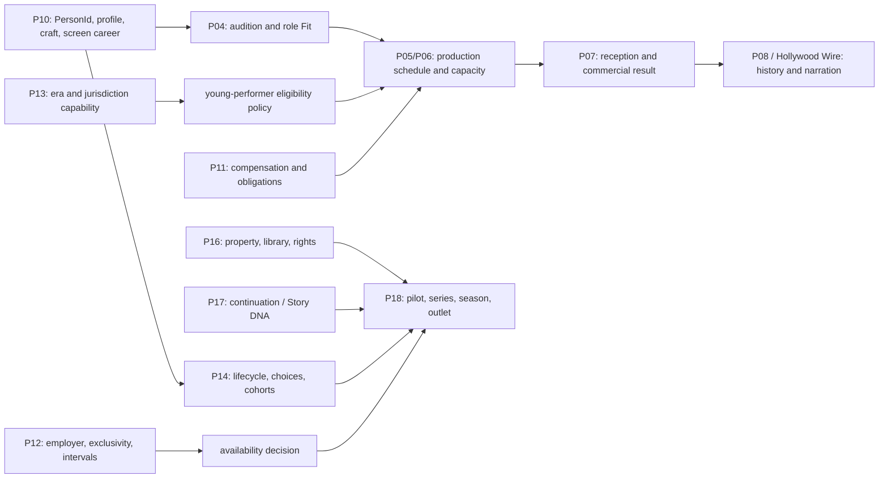

# Studio — Talent Origins, Young Performers, and Cross-Media Career Development

## Current Ops review and executive recommendation

> **FUTURE PRODUCT RESEARCH AND IMPLEMENTATION-PLANNING CANDIDATE**
>
> **OWNER INTEREST CONFIRMED — SPECIFIC MECHANICS NOT YET APPROVED**
>
> **NOT SCHEDULED**
>
> **NOT AUTHORIZED FOR GAMEPLAY IMPLEMENTATION**
>
> **SUBJECT TO CURRENT OPS REVIEW AND ACCEPTED-BASE REFRESH**

This is the entry point for a five-document research and planning set:

1. **Current Ops review** — this document.
2. [Crossover Talent and Screen Careers](CROSSOVER-TALENT-AND-SCREEN-CAREERS-DESIGN.md).
3. [Young Performers and Career Development](YOUNG-PERFORMERS-AND-CAREER-DEVELOPMENT-DESIGN.md).
4. [Family-Entertainment Brand and TV Handoff](FAMILY-ENTERTAINMENT-BRAND-AND-TV-HANDOFF.md).
5. [Implementation Plan and Requirement Register](TALENT-ORIGINS-IMPLEMENTATION-PLAN-AND-REQUIREMENT-REGISTER.md).

The recommendation is to preserve the Owner's full longitudinal ambition but build it through independently useful decisions. Adult crossover entry can stand on the film/talent spine. A supported young-performer production needs production-level protection and finance law before it needs a decades-long career simulator. Longitudinal aging waits for lifecycle authority. Recurring series wait for television and rights authority. A family label follows a portfolio of real work. Owning a channel or platform remains an explicit, later business-model decision; it is neither implied nor discarded.

No implementation order, package number, schema version, save version, or numerical balance law is assigned here.

---

## 1. Exact authority and inspection boundary

### 1.1 Accepted source snapshot

Acceptance has **not** advanced from the historical references supplied by the Owner. A newer branch tip is not acceptance.

| Repository / authority | Branch or source | Exact inspected commit | Classification |
|---|---|---:|---|
| `HSpector1/The-Movies` | `campaign/living-lot-ts` | `2753e18ba8fb5f65b936c22cde9531646fecc6cd` | **ACCEPTED BASELINE** for current code facts |
| `HSpector1/project-studio-unity-visual-spike` | `campaign/living-lot-client` | `c4c65db464ef9abcf3bdcc088f5c8a47cc9081b6` | **ACCEPTED BASELINE** for current client facts |
| `HSpector1/The-Movies` | frozen later inspection | `0a641f584ac6dc4c8a812145582a4f97344a8595` | **UNSEALED FORWARD EVIDENCE** only |
| `HSpector1/project-studio-unity-visual-spike` | frozen later inspection | `01e089812930c772890b0ccd165ab36f9108f109` | **UNSEALED FORWARD EVIDENCE** only |
| Active-stack authorization | Owner-supplied authority | `OPS-P08P10-20260905-01` | Bounded current work; not redirected here |
| Onboarding repair candidate | `docs/agent-onboarding-repair-01` | `83f09ef50d0ee2b32274d0c2eb5f55941ad258b1` | Read-only candidate; not landed or activated |

The accepted TypeScript snapshot exposes protocol `4`, projection `15`, Save V16, protocol digest `sha256:ddce1c399ac4ff58327b296a0600428ac3f3346b84f3639e66e48e53a65fbe99`, and URI `urn:project-studio:bridge:protocol-4:projection-15`. Those identifiers record the inspected baseline; this research does not reserve successors.

### 1.2 Planning authority inspected

| Topic | Exact planning identity | Use here |
|---|---:|---|
| P10 stars, careers, staff | `codex/stars-careers-staff-research-10` at `6a5d41ec233152ecbe8cc3bfc960c31514b6cded` | Person, career, contract, profile, Star Power, development ownership |
| P13–P15 roadmap and P14 lifecycle | `codex/p13-p15-long-range-research-01` at `137ab603e37620ce647cd728b3a57154b8e3c3fb` | Era/capability, market/lifecycle/cohort, later ownership boundaries |
| P11A planning | `docs/p11a-launch-package-01` at `90b349a8272f17ad7ea541cdddc777d36c1d861d` | Authoritative money, obligations, reconciliation |
| P12A planning | `docs/p12a-pre-readiness-01` at `e10c0a091460168357ebcaa12897196dd9288485` | Studio/employer, exclusivity, intervals, availability |
| Existing future concepts | `docs/future-concepts-location-scenarios-creativity-delegation-01` at `bdd61456173dc9e96dc23198a14f79c208217faf` | Bounded delegation and future-concept conventions |

Relevant P04–P09 material, the Success Blueprint, the original-game Mechanics Bible, Hollywood Wire boundaries, and the P16–P18 directions named by the Owner were inspected selectively. Planned law is not described as shipped law.

An authorized local-only research source was also consulted read-only: `/Users/bruce/Desktop/big swing art/THE-MOVIES-2005-COMPLETE-MECHANICS-BIBLE.md`, SHA-256 `1772f518ac125e39dc10012a6f240dddf4a21683e64cc9e9834592499591a768`. It is research evidence, not project authority, and cannot be opened from GitHub. Its useful pattern is durable career history and work-derived experience; its body/looks scoring, addiction/scandal exploitation, composite star rating, and domestic-needs micromanagement are rejected for this design.

### 1.3 Evidence vocabulary

Every consequential assertion in this set is one of:

| Label | Meaning |
|---|---|
| **SOURCE FACT** | Supported by a cited external primary, institutional, peer-reviewed, or high-quality secondary source. |
| **CURRENT CODE FACT** | Verified at the accepted source snapshot above. |
| **EXISTING PROJECT DIRECTION** | Recorded in an existing package/Owner ruling; it may still await implementation or acceptance. |
| **INFERENCE** | A bounded conclusion drawn from identified evidence, not a claim made directly by a source. |
| **NEW RECOMMENDATION** | A proposed product law requiring the stated review or decision. |

---

## 2. Executive findings

### 2.1 What the accepted game already has

- A permanent talent identity and credited career/event spine, with deterministic projections and no fabricated history.
- Acting skill, role Fit/audition evidence, work-derived development, screen-specific Star Power, contracts, salary/availability, project participation, release outcomes, audience segments, Standing, and history views.
- Production phases, resource reservations, facilities, finance seams, and deterministic inspection boundaries.

These are strong foundations. Replacing them with a `crossover fame`, `child potential`, `training`, or `studio family` subsystem would create duplicate truth.

### 2.2 What is planned but not shipped

- P14 career lifecycle: birth-derived chronological age, life phases, bounded cohort entry, retirement, alumni, and permanent identity through transitions.
- P13 historical/era capability and policy ownership beyond the accepted inert configuration.
- P16 rights/library and underlying-property authority, P17 continuation behavior, and P18 pilots/series/seasons/platform workflows.
- The later market, relationship, mentorship, and professional-choice context described in P14.

### 2.3 What is genuinely new

1. **Origin provenance and bounded transferable reach.** A person can have an authored prior field, public evidence, audience overlap by era/geography/segment, and external commitments without receiving free acting skill or a fabricated career catalogue.
2. **One-entry audience law.** The same following must not multiply Star Power, marketing awareness, Standing, opening demand, and revenue.
3. **Character-age and young-performer production eligibility.** Chronological age, character age, apparent playing range, role-specific Fit, supervision, education, rest, permit status, and day-level capacity must be resolved together.
4. **A mandatory welfare floor with routine automation.** No unsafe or evasive optimization path; exact refusal reasons and lawful alternatives replace paperwork chores.
5. **Protected-compensation allocation.** P11 must explain one gross compensation cost and the performer's restricted allocation without duplicate cost or studio liquidity.
6. **Majority-transition agency.** One person and history persist; a new agreement or renewal that requires assent uses the adult performer's choice, while valid existing commitments and producer-held options are not falsely erased.
7. **A family/youth label as a portfolio promise.** It is neither a building nor a channel and cannot own performers.
8. **Cross-media partnership interfaces.** Film/TV/music opportunities may connect through separate offers, rights, finance, and availability; a full label/tour/merchandising system is not silently authorized.

---

## 3. Current ownership versus missing law

The boxes name existing ownership or the Owner-supplied future boundary. They do not assert that P13–P18 are implemented.

| Proposed feature | Coverage classification | Planning disposition | Existing owner / seam | Required action |
|---|---|---|---|---|
| Immutable identity through field, employer, age, and profession changes | **ALREADY COVERED** | **EXISTING AUTHORITY** | P10 identity; P14 lifecycle consumes it | Reuse one `PersonId`; forbid replacement-person transitions. |
| Credited screen history and work-derived development | **ALREADY COVERED** | **EXISTING AUTHORITY** | P10; P08 presentation | Extend event vocabulary only when a real new event exists. |
| Crossover origin and evidence provenance | **GENUINELY NEW** | **OWNER DECISION REQUIRED** | Recommended P10 profile fact, with P14 market provenance | Decide one source owner and projection; never fabricate seasons/catalogues. |
| Origin audience overlap | **GENUINELY NEW** | **OWNER DECISION REQUIRED** | P07 consumer; P10/P14 source fact undecided | Approve one provenance-aware union/cap and input path after a final formula audit. |
| Screen test for a crossover candidate | **PLANNED BUT UNDERSPECIFIED** | **RECOMMENDED FIRST STAGE** | P04 auditions/Fit | Extend evidence context; preserve uncertainty and deterministic inspection. |
| Outside tour/season/broadcast commitments | **PLANNED BUT UNDERSPECIFIED** | **OWNER DECISION REQUIRED** | P12 interval/exclusivity; P10 availability projection | Add bounded commitments, not a parallel career simulator or employer system. |
| Chronological aging and career phase | **PLANNED BUT UNDERSPECIFIED** | **READY AFTER NAMED DEPENDENCY** | P14 lifecycle | Wait for accepted lifecycle law; add no static-age workaround. |
| Character age, apparent playing band, and young-role eligibility | **GENUINELY NEW** | **RECOMMENDED FIRST STAGE** | P04/P05 with P10 public profile | Decide public/hidden boundaries and presentation standard. |
| Daily legal/welfare feasibility beneath a weekly turn | **GENUINELY NEW** | **RECOMMENDED FIRST STAGE** | P05 production; P13 versioned policy; P09 capacity if facilities are needed | Choose deterministic day-template representation and exact explanation. |
| Required supervision and education | **GENUINELY NEW** | **RECOMMENDED FIRST STAGE** | P05 production capacity; P13 policy | Routine valid setup may auto-resolve; never merge it with skill training. |
| Role preparation | **PLANNED BUT UNDERSPECIFIED** | **RECOMMENDED FIRST STAGE** | P04/P05; P10 work development | First stage: project-specific readiness only, no permanent bonus. |
| Optional coaching/mentorship | **REQUIRES SEPARATE PRODUCT DECISION** | **OWNER DECISION REQUIRED** | P10/P14 if approved | Measure existing work development first; no hidden prerequisite/training bar. |
| Protected compensation | **GENUINELY NEW** | **READY AFTER NAMED DEPENDENCY** | P11 | One gross compensation obligation with settlement legs that reconcile exactly. |
| Adult contracting transition | **PLANNED BUT UNDERSPECIFIED** | **READY AFTER NAMED DEPENDENCY** | P10/P12/P14 | Adult assent for a new agreement or renewal that requires it; preserve and correctly resolve valid commitments/options and history. |
| Family films | **ALREADY COVERED** | **EXISTING AUTHORITY** | P04–P08 | Add age-appropriate roles only when youth support exists. |
| Youth/family production label | **GENUINELY NEW** | **OWNER DECISION REQUIRED** | No accepted owner; recommended P16+ corporate/rights parking candidate for stable identity/associations, P18 slate projection, and P15/P07 derived reputation | Do not implement as a facility, captive roster, or fame multiplier. |
| Recurring family series for an outside outlet | **PLANNED BUT UNDERSPECIFIED** | **READY AFTER NAMED DEPENDENCY** | P16/P17/P18 plus P10/P12/P14 | Wait for accepted property/continuation/TV workflow. |
| Performer film/TV/music partnership | **GENUINELY NEW** | **READY AFTER NAMED DEPENDENCY** | P10 person/contract; P11 obligations; P12 intervals; P14 choice; P16 rights; P18 projects/outlets; FAM-015 music owner decision where applicable | Use explicit offers and outside interfaces; no record-label simulation. |
| Owned channel/network/platform | **REQUIRES SEPARATE PRODUCT DECISION** | **DEFERRED WITH NAMED RETURN CONDITION** | Later P18/P16/P11/P13/P15 business model | Preserve for a separate authorization with schedule/catalogue/distribution economics. |
| Sexualized body scoring, scandal farming, profitable neglect, person ownership | **CONFLICTS WITH EXISTING AUTHORITY** | **REJECTED DESIGN ALTERNATIVE** | Owner safeguards; P10 person agency | Reject. |

---

## 4. Research conclusions that materially constrain design

### 4.1 Crossover careers are not one conversion

The Owner's named examples produce different evidence:

- Dwayne Johnson moved from wrestling visibility through scripted television and supporting feature work into a persona vehicle and sustained leading career; coaching and project testing remained separate from prior recognition ([WWE](https://www.wwe.com/superstars/the-rock), [Los Angeles Times](https://www.latimes.com/archives/la-xpm-2003-sep-07-ca-horn7-story.html)).
- Jim Brown's football and film schedules produced an actual conflict around *The Dirty Dozen*; his choice demonstrates that external commitments are binding facts, not flavor ([Pro Football Hall of Fame](https://www.profootballhof.com/news/moments-in-nfl-history-lights-camera-retirement), [AFI](https://catalog.afi.com/Film/23682-THE-DIRTY-DOZEN?cxt=filmography)).
- Arnold Schwarzenegger's bodybuilding visibility and physique supplied particular role suitability, while acting, language, voice, speech, and accent preparation remained distinct ([official biography](https://www.schwarzenegger.com/bio), [commencement transcript](https://time.com/4779796/arnold-schwarzenegger-university-of-houston-uh-commencement-graduation/)).
- Lou Ferrigno's screen test and durable Hulk association do not support treating every bodybuilder as a future feature-film lead ([PBS](https://www.pbs.org/wnet/pioneers-of-television/pioneering-people/lou-ferrigno/), [Guardian first-person account](https://www.theguardian.com/culture/2022/may/30/beautiful-how-we-made-the-incredible-hulk-lou-ferrigno-green-paint)).
- Will Smith moved from music to a first acting role in television, then supporting and against-persona film work before sustained film stardom ([CBS](https://www.cbsnews.com/news/will-smith-my-work-ethic-is-sickening/), [AFI](https://catalog.afi.com/Film/59433-WHERE-THE-DAY-TAKES-YOU)).
- Justin Bieber is accurately relevant as a young online/music discovery whose concert film demonstrated music-aligned audience interest and whose *CSI* arc was a scripted acting debut. The evidence does **not** support “Disney alumnus” or an established dramatic-feature-leading career ([Recording Academy](https://www.grammy.com/news/video-grammy-camp-soundcheck-with-justin-bieber/), [CBS/Paramount](https://www.paramountpressexpress.com/cbs-entertainment/releases/view?id=25625), [Paramount](https://www.paramountpictures.com/movies/justin-bieber-never-say-never)).

These are **SOURCE FACTS** followed by bounded career-stage **INFERENCES**. None supplies a general conversion rate. The detailed fact check and fictional mechanics appear in the [crossover design](CROSSOVER-TALENT-AND-SCREEN-CAREERS-DESIGN.md).

### 4.2 Young-performer law cannot be represented by a weekly average

Current California and England examples independently constrain daily work, time at the place of performance, education, rest, turnaround, supervision, and consecutive days. Satisfying a weekly total does not prove that any given day is lawful ([California §11760](https://www.dir.ca.gov/t8/11760.html), [DLSE chart](https://www.dir.ca.gov/dlse/MinorsSummaryCharts_HoursofWork.pdf), [England SI 2014/3309](https://www.legislation.gov.uk/uksi/2014/3309/pdfs/uksi_20143309_en.pdf)). Jurisdictions and effective periods differ; these current examples must not be projected unchanged over 1920–2040.

The game therefore needs a deterministic production-level daily feasibility plan beneath its coarser turn. The player chooses a suitable cast, production pattern, support capacity, and slate; routine compliant allocation can auto-resolve. If blocked, the interface names the limiting rule and offers lawful alternatives. It never offers a neglect/evasion toggle.

### 4.3 Producing family work, running a label, and owning an outlet are different businesses

Aardman produced *Robin Robin* for Netflix and worked with BBC/Netflix partners on *Vengeance Most Fowl*; Sesame Workshop can steward IP while working across HBO Max, PBS, and later Netflix; Disney's own annual report separates linear networks, direct-to-consumer services, content licensing, and music operations ([Aardman: Robin Robin](https://www.aardman.com/latest-news/2021/november/robin-robin-streaming-now-on-netflix/), [Aardman: Vengeance Most Fowl](https://www.aardman.com/latest-news/2025/february/double-bafta-win-for-wallace-gromit-vengeance-most-fowl/), [Sesame Workshop](https://sesameworkshop.org/about-us/press-room/hbo-max-and-sesame-workshop-announce-new-content-partnership-cementing/), [Disney FY2025 Annual Report](https://investors.thewaltdisneycompany.com/files/doc_financials/2025/ar/2025-Annual-Report.pdf)). These are examples of functional separation, not templates for universal deal economics.

Project Studio should first produce family work, later organize a coherent label and outside-outlet series, and only consider a linear channel or owned platform after separate authorization. Full boundaries appear in the [family/TV handoff](FAMILY-ENTERTAINMENT-BRAND-AND-TV-HANDOFF.md).

---

## 5. Recommended sequence

These are working stages, **not** package numbers and **not** an implementation order.

| Stage | Player-facing proof | Entry dependencies | Relative effort | Product / technical risk |
|---|---|---|---|---|
| **A — adult crossover entry** | Compare a known outsider with uncertain screen craft against a skilled unknown; test, cast, defer, or decline; one real screen-career transition persists. | Owner-accepted P08–P10 base refresh; P04/P05/P07; accepted P11/P12 offer, money and interval seams; ownership decisions for origin reach and commitments | Medium | Medium / medium–high |
| **B — one supported young-performer production** | Cast one supported 14–17-year-old fictional performer; routine protection resolves; an invalid plan explains and offers alternatives. | Accepted P10 identity and P14 birth/age-at-date law; P04 character-age/Fit; P05/P06 day-level scheduling and capacity; P11 settlement; P12 employment; P13 era/jurisdiction policy; qualified support capacity; accepted-client refresh and age-appropriate world/UI plan | Large | High / high |
| **C — longitudinal youth-to-adult continuity** | The same `PersonId` ages, changes ambitions, pauses or continues, and retains every credit. | Stage B; accepted P14 lifecycle/phase/cohort/alumni law; P10 career/development/profession; P11 obligations; P12 intervals; P08 history; bounded long-horizon orchestration | Very large | High / high |
| **D — recurring family-series development** | Pilot/order/season/renewal/departure decisions operate through real contracts and rights. | Stages B/C for youth continuity; accepted P16 StoryProperty/rights, P17 continuation/Story DNA and P18 television workflow; P10/P11/P12/P14 and P07/P08 seams | Very large | High / very high |
| **E — family label and cross-media partnerships** | A coherent portfolio creates opportunities without owning people; music/other media use explicit partners. | Multiple real family projects; Stage D/P18 for series; P16 rights plus stable label/association owner; P15/P07 reputation; P10/P11/P12/P14 offer/availability; era-appropriate external-partner interface; resolved FAM-015 music owner if music is included in the bounded proof | Very large | Very high / very high |
| **F — owned channel/platform** | Operate a separately modeled outlet with programming/catalogue and economic obligations. | Separate Owner business-model authorization; accepted P13/P15/P16/P18/P11 interfaces; proven Stage E multi-project label; enough actual content for catalogue/schedule proof; new historical/economic research | Extreme | Very high / extreme |

Adult crossover does not wait for youth or TV. Stage B proves one protected production, not a childhood career. Stage D proves recurring production, not a channel. The complete stage contracts and acceptance journeys are in the [implementation plan](TALENT-ORIGINS-IMPLEMENTATION-PLAN-AND-REQUIREMENT-REGISTER.md).

---

## 6. Genuine product decisions

| Decision | Options | Recommendation | Why it remains open |
|---|---|---|---|
| Initial young-performer range | 14–17; 9–17; broader | **14–17 first**, with 9–13 and younger explicitly returned after presentation and additional age-band capacity proof | 9–17 is research-defensible, but 14–17 proves two minor bands and the transition to majority with less world/policy scope. Owner has not approved the cut. |
| Origin fact owner | P10 profile fact + P14 provenance; or P14 market fact projected through P10 | **P10 owns durable authored origin on the person; P14 owns changing market evidence; P07 consumes a bounded projection** | Must be reconciled against the accepted P10/P14 boundary at implementation refresh. |
| Outside commitment owner | P10 availability event validated by P12; or P14 lifecycle commitment projected to P12 | **P10 projection with P12 interval/exclusivity validation** | No parallel origin-industry employer or contract graph may be introduced. |
| External following entry point | Broaden Star Power; separate additive marketing bonus; one origin-overlap component | **One bounded origin component inside a provenance-aware P07 reach union/cap with screen awareness, earned Star Power and paid marketing; never free Star Power/craft** | Exact de-duplication, cap and decay need Owner approval and evidence-backed calibration. |
| Daily feasibility engine | Authored day templates; general deterministic solver | **Templates first** | They are explainable and bounded; a solver should follow only if actual production variety proves it necessary. |
| Welfare across eras | Exact historical laws only; modern rules everywhere; stable floor + researched profiles | **Stable fictional welfare floor plus versioned jurisdiction/era profiles that may add constraints** | Requires naming and clear UI disclosure; it must never claim legal exactness where research is incomplete. |
| Optional coaching | No new system; role preparation; persistent coaching/mentorship | **Use role preparation and existing work-derived growth first; decide persistent coaching later** | No credible universal growth conversion law; avoid a training bar. |
| Majority transition | Automatic new agreement; cancel all terms at 18; adult assent where a new agreement/renewal requires it while honoring surviving terms/options | **Affirmative choice with contract-specific continuity** | “Every minor contract ends at 18” is legally false in at least some regimes. |
| Label semantics | Building; roster bonus; portfolio/brand promise | **Portfolio/brand promise** | Success/reputation formula and governance need later proof. |
| Music capability and career-evidence owner | Assume current P10; extend P10; create a later music-domain owner | **Decide the owner before any music-career extension; do not treat music as an accepted P10 discipline today** | P10 currently owns Actor, Director, Writer and Craft disciplines; partnership, rights, availability and payment seams do not themselves own music capability. |
| Owned outlet | Drop; unlock after one series; separately authorize | **Preserve and separately authorize** | Network/platform operations require programming, distribution, catalogue, revenue, cost, rights, and era law. |

These are recommendations, not Owner approvals.

---

## 7. Review findings and limitations

### 7.1 Findings already corrected in this package

- “First screen credit,” documentary/self appearance, scripted guest work, feature debut, breakthrough, leading vehicle, and sustained career are not interchangeable.
- Justin Bieber is not characterized as a Disney alumnus or dramatic-film-career precedent.
- The named famous successes are counterweighted by selective, limited, declined, paused, and behind-camera paths; no conversion rate is inferred.
- Current California, England, Scotland, Wales, federal, and union sources retain jurisdiction/effective-period caveats.
- Education, production welfare, role preparation, and optional long-term development remain separate.
- Star Power, origin reach, audience awareness, Standing, marketing, and revenue are not duplicated.
- Actor, character, contract, representative, employer, producer, commissioner, rightsholder, label, and outlet remain distinct.

### 7.2 Important source limitations

- Corporate and celebrity biographies emphasize successes and may be promotional.
- Peer-reviewed star research is aggregate and not a crossover conversion model; some full text may require subscription.
- Individual young-performer accounts prove possible careers, not prevalence, and must not become scandal archetypes.
- Current legal sources do not provide a complete historical simulation for every territory from 1920–2040. Exact operative law must be refreshed before implementation.
- No retained game comparator combines young-performer safeguards, recurring-series law, adult transition, and cross-media agency.
- No reliable evidence yields a constant for audience transfer from a youth role, sport, music, or online following into demand for later adult-oriented projects.

These are sufficient limits for product planning: the design can preserve uncertainty and refuse unsupported numerical claims. More biography collection would not justify a general success probability.

---

## 8. Current Ops disposition

| Question | Disposition |
|---|---|
| Is the vision compatible with the existing architecture? | **Yes, if implemented as extensions to P04/P05/P07/P10/P11/P12/P13/P14/P16/P17/P18 rather than duplicate systems.** |
| Is any implementation authorized? | **No.** |
| Is adult crossover independently buildable? | **Yes, only after the accepted P04/P05/P07/P08–P12 owners exist, an accepted-base refresh is complete, and the origin-reach/commitment decisions are resolved. It does not wait for youth or television.** |
| Is one youth fixture enough to claim a longitudinal system? | **No.** |
| Is one recurring series enough to claim a family channel? | **No.** |
| Is the broader channel ambition preserved? | **Yes; deferred with explicit return conditions, not dropped.** |
| Are P11/P12 packages modified or reopened? | **No. Their existing ownership is consumed, not changed.** |
| Were production code, tests, schemas, saves, generated DTOs, assets, or runtime state changed? | **No.** |

The next action is Future Ops and Current Ops review of the five-document set. Any later implementation effort must begin with an accepted-base refresh and a scoped Owner decision; this document is not authorization to build.
