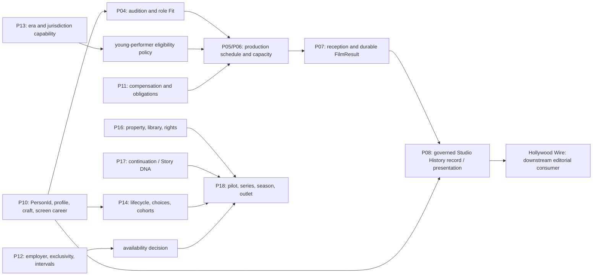

# Studio — Talent Origins, Young Performers, and Cross-Media Career Development

## Current Ops review and executive recommendation

> **CURRENT OPS REVIEWED — RETAINED AS UNSCHEDULED FUTURE PLANNING**
>
> **TARGETED REVIEW CLARIFICATIONS RECORDED**
>
> **SPECIFIC MECHANICS NOT APPROVED**
>
> **GAMEPLAY IMPLEMENTATION NOT AUTHORIZED**
>
> **ACCEPTED-BASE REFRESH REQUIRED BEFORE ACTIVATION**

This is the entry point for a five-document research and planning set:

1. **Current Ops review** — this document.
2. [Crossover Talent and Screen Careers](CROSSOVER-TALENT-AND-SCREEN-CAREERS-DESIGN.md).
3. [Young Performers and Career Development](YOUNG-PERFORMERS-AND-CAREER-DEVELOPMENT-DESIGN.md).
4. [Family-Entertainment Brand and TV Handoff](FAMILY-ENTERTAINMENT-BRAND-AND-TV-HANDOFF.md).
5. [Implementation Plan and Requirement Register](TALENT-ORIGINS-IMPLEMENTATION-PLAN-AND-REQUIREMENT-REGISTER.md).

Current Ops reviewed all five documents at `207d06d4d3b6c665bd532bcbd3982d1bf0cb654f`. This follow-up records five targeted disposition clarifications only. Current Ops did **not** independently reverify the external research sources and did **not** run tests, runtime profiles, or gameplay validation. The three companion designs remain unchanged; where their original wording conflicts with these reviewed clarifications, this hub and the [implementation/requirement register](TALENT-ORIGINS-IMPLEMENTATION-PLAN-AND-REQUIREMENT-REGISTER.md) qualify that wording for any future activation review.

The recommendation is to preserve the Owner's full longitudinal ambition but build it through independently useful decisions. Adult crossover entry can stand on the film/talent spine. A supported young-performer production needs production-level protection and finance law before it needs a decades-long career simulator. Longitudinal aging waits for lifecycle authority. Recurring series wait for television and rights authority. A family label follows a portfolio of real work. Owning a channel or platform remains an explicit, later business-model decision; it is neither implied nor discarded.

No implementation order, package number, schema version, save version, numerical balance law, or new Owner-decision round is assigned here.

---

## 1. Exact authority and inspection boundary

### 1.1 Accepted source snapshot

Acceptance has **not** advanced from the historical references supplied by the Owner. A newer branch tip is not acceptance.

| Repository / authority | Branch or source | Exact inspected commit | Classification |
|---|---|---:|---|
| `HSpector1/The-Movies` | `campaign/living-lot-ts` | `2753e18ba8fb5f65b936c22cde9531646fecc6cd` | **ACCEPTED BASELINE** for current code facts |
| `HSpector1/project-studio-unity-visual-spike` | `campaign/living-lot-client` | `c4c65db464ef9abcf3bdcc088f5c8a47cc9081b6` | **ACCEPTED BASELINE** for current client facts |
| `HSpector1/The-Movies` | 2026-09-06 frozen later inspection | `0a641f584ac6dc4c8a812145582a4f97344a8595` | **UNSEALED FORWARD EVIDENCE** only |
| `HSpector1/project-studio-unity-visual-spike` | 2026-09-06 frozen later inspection | `01e089812930c772890b0ccd165ab36f9108f109` | **UNSEALED FORWARD EVIDENCE** only |
| Active-stack authorization | Owner-supplied authority | `OPS-P08P10-20260905-01` | Bounded current work; not redirected here |
| Onboarding repair candidate | `docs/agent-onboarding-repair-01` | `83f09ef50d0ee2b32274d0c2eb5f55941ad258b1` | Read-only candidate; not landed or activated |

The accepted TypeScript snapshot exposes protocol `4`, projection `15`, Save V16, protocol digest `sha256:ddce1c399ac4ff58327b296a0600428ac3f3346b84f3639e66e48e53a65fbe99`, and URI `urn:project-studio:bridge:protocol-4:projection-15`. Those identifiers record the inspected baseline; this research does not reserve successors.

### 1.2 Planning authority inspected

| Topic | Exact planning identity | Use here |
|---|---:|---|
| P10 stars, careers, staff | `codex/stars-careers-staff-research-10` at `6a5d41ec233152ecbe8cc3bfc960c31514b6cded` | Person, career, contract, profile, Star Power, development ownership |
| P13–P15 roadmap and P14 lifecycle | `codex/p13-p15-long-range-research-01` at `137ab603e37620ce647cd728b3a57154b8e3c3fb` | Era/capability, market/lifecycle/cohort, later ownership boundaries |
| P11A planning | `docs/p11a-launch-package-01` at `90b349a8272f17ad7ea541cdddc777d36c1d861d` | Authoritative money, obligations, reconciliation |
| P12A planning | `docs/p12a-pre-readiness-01` at `e10c0a091460168357ebcaa12897196dd9288485` | Studio/employer, exclusivity, intervals, availability |
| Existing future concepts | `docs/future-concepts-location-scenarios-creativity-delegation-01` at `bdd61456173dc9e96dc23198a14f79c208217faf` | Bounded delegation and future-concept conventions |

Relevant P04–P09 material, the Success Blueprint, the original-game Mechanics Bible, Hollywood Wire boundaries, and the P16–P18 directions named by the Owner were inspected selectively. Planned law is not described as shipped law.

An authorized local-only research source was also consulted read-only: `/Users/bruce/Desktop/big swing art/THE-MOVIES-2005-COMPLETE-MECHANICS-BIBLE.md`, SHA-256 `1772f518ac125e39dc10012a6f240dddf4a21683e64cc9e9834592499591a768`. It is research evidence, not project authority, and cannot be opened from GitHub. Its useful pattern is durable career history and work-derived experience; its body/looks scoring, addiction/scandal exploitation, composite star rating, and domestic-needs micromanagement are rejected for this design.

### 1.3 Evidence vocabulary

Every consequential assertion in this set is one of:

| Label | Meaning |
|---|---|
| **SOURCE FACT** | Supported by a cited external primary, institutional, peer-reviewed, or high-quality secondary source. |
| **CURRENT CODE FACT** | Verified at the accepted source snapshot above. |
| **EXISTING PROJECT DIRECTION** | Recorded in an existing package/Owner ruling; it may still await implementation or acceptance. |
| **INFERENCE** | A bounded conclusion drawn from identified evidence, not a claim made directly by a source. |
| **NEW RECOMMENDATION** | A proposed product law requiring the stated review or decision. |

---

## 2. Executive findings

### 2.1 What the accepted game already has

- A permanent talent identity, durable film results, and recorded career facts, with deterministic projections and no fabricated history.
- Acting skill, role Fit/audition evidence, work-derived development, screen-specific Star Power, contracts, salary/availability, project participation, release outcomes, audience segments, and Standing.
- Production phases, resource reservations, facilities, finance seams, and deterministic inspection boundaries.

At the inspected accepted P07 baseline, those durable results and career facts do **not** establish that the broader P08 Studio History authority or its world entrance had shipped. Source domains retain their own authoritative facts.

These are strong foundations. Replacing them with a `crossover fame`, `child potential`, `training`, or `studio family` subsystem would create duplicate truth.

### 2.2 What is planned but not shipped

- P08 governed Studio History recording/presentation and its world entrance at this inspected accepted P07 baseline; Hollywood Wire remains a separate downstream editorial consumer rather than a history source.
- P14 career lifecycle: birth-derived chronological age, life phases, bounded cohort entry, retirement, alumni, and permanent identity through transitions.
- P13 historical/era capability and policy ownership beyond the accepted inert configuration.
- P16 rights/library and underlying-property authority, P17 continuation behavior, and P18 pilots/series/seasons/platform workflows.
- The later market, relationship, mentorship, and professional-choice context described in P14.

### 2.3 What is genuinely new

1. **Origin provenance and bounded transferable reach.** A person can have an authored prior field, public evidence, audience overlap by era/geography/segment, and external commitments without receiving free acting skill or a fabricated career catalogue.
2. **One-entry audience law.** The same following must not multiply Star Power, marketing awareness, Standing, opening demand, and revenue.
3. **Character-age and young-performer production eligibility.** Chronological age, character age, apparent playing range, role-specific Fit, supervision, education, rest, permit status, and day-level capacity must be resolved together.
4. **A mandatory welfare floor with routine automation.** No unsafe or evasive optimization path; exact refusal reasons and lawful alternatives replace paperwork chores.
5. **Protected-compensation allocation.** P11 must explain one gross compensation cost and the performer's restricted allocation without duplicate cost or studio liquidity.
6. **Majority-transition agency.** One person and history persist; a new agreement or renewal that requires assent uses the adult performer's choice, while valid existing commitments and producer-held options are not falsely erased.
7. **A family/youth label as a portfolio promise.** It is neither a building nor a channel and cannot own performers.
8. **Cross-media partnership interfaces.** Film/TV/music opportunities may connect through separate offers, rights, finance, and availability; a full label/tour/merchandising system is not silently authorized.

---

## 3. Current ownership versus missing law

The boxes name accepted source domains or Owner-supplied future ownership boundaries; they do not assert that every named interface is implemented. P07 and P10 retain authoritative result/career facts. P08 records and presents the history it governs when accepted. Hollywood Wire is a separate editorial consumer: it does not create or mutate simulation facts and does not replace P08.

| Proposed feature | Coverage classification | Planning disposition | Existing owner / seam | Required action |
|---|---|---|---|---|
| Immutable identity through field, employer, age, and profession changes | **ALREADY COVERED** | **EXISTING AUTHORITY** | P10 identity; P14 lifecycle consumes it | Reuse one `PersonId`; forbid replacement-person transitions. |
| Durable film results, credited career facts, and work-derived development | **ALREADY COVERED** | **EXISTING AUTHORITY** | P07 FilmResult facts; P10 person/career/development facts | Preserve source ownership; extend event vocabulary only when a real new event exists. |
| Broader P08 Studio History and world entrance | **PLANNED BUT UNDERSPECIFIED** | **READY AFTER NAMED DEPENDENCY** | P08 records/presents governed history; Wire consumes downstream | Do not infer shipment from a future-owner diagram or later WIP observation. |
| Crossover origin and evidence provenance | **GENUINELY NEW** | **RECOMMENDED FIRST STAGE** | P10/P14 record-owner alternatives remain implementation proposals | Current Ops/implementation lead resolves placement after product rules are approved; never fabricate seasons/catalogues. |
| Origin audience overlap | **GENUINELY NEW** | **OWNER DECISION REQUIRED** | P07 consumer; P10/P14 source fact undecided | Decide whether/how origin appeal affects demand. If an effect is approved, audit a provenance-aware one-entry input path; no transfer rate, cap, sign, or recalibration is approved. |
| Screen test for a crossover candidate | **PLANNED BUT UNDERSPECIFIED** | **RECOMMENDED FIRST STAGE** | P04 auditions/Fit | Extend evidence context; preserve uncertainty and deterministic inspection. |
| Outside tour/season/broadcast commitments | **PLANNED BUT UNDERSPECIFIED** | **RECOMMENDED FIRST STAGE** | P12 interval/exclusivity plus a P10- or P14-projected availability representation | Retain bounded-interval alternatives for Current Ops/implementation-lead choice; escalate only a material scope or authority conflict. |
| Chronological aging and career phase | **PLANNED BUT UNDERSPECIFIED** | **READY AFTER NAMED DEPENDENCY** | P14 lifecycle | Wait for accepted lifecycle law; add no static-age workaround. |
| Character age, apparent playing band, and young-role eligibility | **GENUINELY NEW** | **RECOMMENDED FIRST STAGE** | P04/P05 with P10 public profile | Decide public/hidden boundaries and presentation standard. |
| Daily legal/welfare feasibility beneath a weekly turn | **GENUINELY NEW** | **RECOMMENDED FIRST STAGE** | P05 production; P13 versioned policy; P09 capacity if facilities are needed | Choose deterministic day-template representation and exact explanation. |
| Required supervision and education | **GENUINELY NEW** | **RECOMMENDED FIRST STAGE** | P05 production capacity; P13 policy | Routine valid setup may auto-resolve; never merge it with skill training. |
| Role preparation | **PLANNED BUT UNDERSPECIFIED** | **RECOMMENDED FIRST STAGE** | P04/P05; P10 work development | First stage: project-specific readiness only, no permanent bonus. |
| Optional coaching/mentorship | **REQUIRES SEPARATE PRODUCT DECISION** | **OWNER DECISION REQUIRED** | P10/P14 if approved | Measure existing work development first; no hidden prerequisite/training bar. |
| Protected compensation | **GENUINELY NEW** | **READY AFTER NAMED DEPENDENCY** | P11 | One gross compensation obligation with settlement legs that reconcile exactly. |
| Adult contracting transition | **PLANNED BUT UNDERSPECIFIED** | **READY AFTER NAMED DEPENDENCY** | P10/P12/P14 | Adult assent for a new agreement or renewal that requires it; preserve and correctly resolve valid commitments/options and history. |
| Family films | **ALREADY COVERED** | **EXISTING AUTHORITY** | Accepted P04–P07 casting/production/result owners; P08 only when its governed-history presentation is accepted | Add age-appropriate roles only when youth support exists. |
| Youth/family production label | **GENUINELY NEW** | **OWNER DECISION REQUIRED** | Product promise/consumer behavior need approval; record-owner alternatives remain implementation proposals | A film-only slice needs actual family films plus approved label, association, and consumer interfaces—not television by default. Do not implement as a facility, captive roster, or fame multiplier. |
| Recurring family series for an outside outlet | **PLANNED BUT UNDERSPECIFIED** | **READY AFTER NAMED DEPENDENCY** | P16/P17/P18 plus applicable P10/P11/P12/P07; Stage B only if minors work and Stage C only for a lifelong youth-development claim | Wait for accepted property/continuation/TV workflow; do not impose youth dependencies on an adult-only series. |
| Performer film/TV/music partnership | **GENUINELY NEW** | **READY AFTER NAMED DEPENDENCY** | Capabilities of the selected medium/partner: P10 person/contract, P11 obligations, P12 intervals, P14 choice, P16 rights, P18 only for TV/outlet use, and FAM-015 before music | Use explicit offers and outside interfaces; no record-label simulation or universal P18 dependency. |
| Owned channel/network/platform | **REQUIRES SEPARATE PRODUCT DECISION** | **DEFERRED WITH NAMED RETURN CONDITION** | Later P18/P16/P11/P13/P15 business model | Preserve for a separate authorization with schedule/catalogue/distribution economics. |
| Sexualized body scoring, scandal farming, profitable neglect, person ownership | **CONFLICTS WITH EXISTING AUTHORITY** | **REJECTED DESIGN ALTERNATIVE** | Owner safeguards; P10 person agency | Reject. |

---

## 4. Research conclusions that materially constrain design

### 4.1 Crossover careers are not one conversion

The Owner's named examples produce different evidence:

- Dwayne Johnson moved from wrestling visibility through scripted television and supporting feature work into a persona vehicle and sustained leading career; coaching and project testing remained separate from prior recognition ([WWE](https://www.wwe.com/superstars/the-rock), [Los Angeles Times](https://www.latimes.com/archives/la-xpm-2003-sep-07-ca-horn7-story.html)).
- Jim Brown's football and film schedules produced an actual conflict around *The Dirty Dozen*; his choice demonstrates that external commitments are binding facts, not flavor ([Pro Football Hall of Fame](https://www.profootballhof.com/news/moments-in-nfl-history-lights-camera-retirement), [AFI](https://catalog.afi.com/Film/23682-THE-DIRTY-DOZEN?cxt=filmography)).
- Arnold Schwarzenegger's bodybuilding visibility and physique supplied particular role suitability, while acting, language, voice, speech, and accent preparation remained distinct ([official biography](https://www.schwarzenegger.com/bio), [commencement transcript](https://time.com/4779796/arnold-schwarzenegger-university-of-houston-uh-commencement-graduation/)).
- Lou Ferrigno's screen test and durable Hulk association do not support treating every bodybuilder as a future feature-film lead ([PBS](https://www.pbs.org/wnet/pioneers-of-television/pioneering-people/lou-ferrigno/), [Guardian first-person account](https://www.theguardian.com/culture/2022/may/30/beautiful-how-we-made-the-incredible-hulk-lou-ferrigno-green-paint)).
- Will Smith moved from music to a first acting role in television, then supporting and against-persona film work before sustained film stardom ([CBS](https://www.cbsnews.com/news/will-smith-my-work-ethic-is-sickening/), [AFI](https://catalog.afi.com/Film/59433-WHERE-THE-DAY-TAKES-YOU)).
- Justin Bieber is accurately relevant as a young online/music discovery whose concert film demonstrated music-aligned audience interest and whose *CSI* arc was a scripted acting debut. The evidence does **not** support “Disney alumnus” or an established dramatic-feature-leading career ([Recording Academy](https://www.grammy.com/news/video-grammy-camp-soundcheck-with-justin-bieber/), [CBS/Paramount](https://www.paramountpressexpress.com/cbs-entertainment/releases/view?id=25625), [Paramount](https://www.paramountpictures.com/movies/justin-bieber-never-say-never)).

These are **SOURCE FACTS** followed by bounded career-stage **INFERENCES**. None supplies a general conversion rate. The detailed fact check and fictional mechanics appear in the [crossover design](CROSSOVER-TALENT-AND-SCREEN-CAREERS-DESIGN.md).

Current Ops retains the proposed one-entry audience rule subject to this compatibility gate:

> **With no origin contribution, the new path preserves accepted result behavior and RNG behavior unless a separate recalibration has been explicitly approved.**

The eventual differential proof must cover absent, zero, and non-applicable origin contribution where its representation supports those states, using identical relevant starting state and RNG state against the then-accepted P07 baseline. Relevant outputs and actual RNG state/draw behavior must match; matching seeds alone is insufficient. Stored historical `FilmResult` values are never recomputed or rewritten. The formula audit must distinguish the same audience reach counted twice from genuinely different causal effects that must remain distinct. A union/cap proposal does not authorize rewriting existing awareness, Star Power, marketing, demand, or revenue calculations. No transfer rate, cap, signed effect, or recalibration is approved.

### 4.2 Young-performer law cannot be represented by a weekly average

Current California and England examples independently constrain daily work, time at the place of performance, education, rest, turnaround, supervision, and consecutive days. Satisfying a weekly total does not prove that any given day is lawful ([California §11760](https://www.dir.ca.gov/t8/11760.html), [DLSE chart](https://www.dir.ca.gov/dlse/MinorsSummaryCharts_HoursofWork.pdf), [England SI 2014/3309](https://www.legislation.gov.uk/uksi/2014/3309/pdfs/uksi_20143309_en.pdf)). Jurisdictions and effective periods differ; these current examples must not be projected unchanged over 1920–2040.

The game therefore needs a deterministic production-level daily feasibility plan beneath its coarser turn. The player chooses a suitable cast, production pattern, support capacity, and slate; routine compliant allocation can auto-resolve. If blocked, the interface names the limiting rule and offers lawful alternatives. It never offers a neglect/evasion toggle.

Eligibility is not evaluated in a project silo. For each performer it aggregates applicable work across concurrent productions and relevant outside commitments before daily, weekly, consecutive-day, education, rest, turnaround, and other selected-profile constraints are evaluated. Two plans that pass separately may fail together. Supervision and education capacity also reconcile across projects; the same provider cannot satisfy conflicting reservations. A compatible combined plan remains permissible.

Stopping new youth engagements is not itself a safe rollback for committed work. Existing work retains its governing eligibility, supervision, education, rest, capacity, and settlement obligations through completion or a safe, explicit hold/cancellation resolution. It may not resume under an older binary or disabled capability that cannot enforce those obligations. Restoring a compatible pre-change checkpoint is a separate rollback path; preserving credits and compensation alone is insufficient.

### 4.3 Producing family work, running a label, and owning an outlet are different businesses

Aardman produced *Robin Robin* for Netflix and worked with BBC/Netflix partners on *Vengeance Most Fowl*; Sesame Workshop can steward IP while working across HBO Max, PBS, and later Netflix; Disney's own annual report separates linear networks, direct-to-consumer services, content licensing, and music operations ([Aardman: Robin Robin](https://www.aardman.com/latest-news/2021/november/robin-robin-streaming-now-on-netflix/), [Aardman: Vengeance Most Fowl](https://www.aardman.com/latest-news/2025/february/double-bafta-win-for-wallace-gromit-vengeance-most-fowl/), [Sesame Workshop](https://sesameworkshop.org/about-us/press-room/hbo-max-and-sesame-workshop-announce-new-content-partnership-cementing/), [Disney FY2025 Annual Report](https://investors.thewaltdisneycompany.com/files/doc_financials/2025/ar/2025-Annual-Report.pdf)). These are examples of functional separation, not templates for universal deal economics.

Project Studio should first produce family work, later organize a coherent label and outside-outlet series, and only consider a linear channel or owned platform after separate authorization. Full boundaries appear in the [family/TV handoff](FAMILY-ENTERTAINMENT-BRAND-AND-TV-HANDOFF.md).

---

## 5. Recommended sequence

These are working stages, **not** package numbers and **not** an implementation order. The table separates hard capability gates from dependencies that apply only when a selected variant uses youth, series, cross-media, label, or outlet functionality. The original B–F path remains a useful combined youth-and-series journey, not an unconditional dependency chain.

| Stage | Player-facing proof | Entry dependencies | Relative effort | Product / technical risk |
|---|---|---|---|---|
| **A — adult crossover entry** | Compare a known outsider with uncertain screen craft against a skilled unknown; test, cast, defer, or decline; one real screen-career transition persists. | **Hard:** accepted P04/P05/P07/P10/P11/P12 seams and accepted-base refresh; Owner product decision on whether/how origin appeal affects demand. **Conditional:** accepted P08 only if governed Studio History presentation is selected. No youth, lifecycle, or television dependency. | Medium | Medium / medium–high |
| **B — one supported young-performer production** | Cast one supported 14–17-year-old fictional performer; routine protection resolves; an invalid plan explains and offers alternatives. | **Hard:** P10 identity; the minimum accepted P14 birth-provenance and age-at-scheduled-work source/representation seam; P04 role/Fit; P05/P06 cross-project scheduling; P11/P12/P13; shared support capacity; accepted-client and age-appropriate presentation. The broader P14 lifecycle/cohort system is not required. | Large | High / high |
| **C — longitudinal youth-to-adult continuity** | The same `PersonId` ages, changes ambitions, pauses or continues, and retains every credit. | **Hard:** Stage B protection for the youth path; broader accepted P14 lifecycle/phase/cohort/alumni authority; P10/P11/P12; bounded long-horizon orchestration. **Conditional:** accepted P08 for the governed complete-history presentation. | Very large | High / high |
| **D — recurring family-series development** | Pilot/order/season/renewal/departure decisions operate through real contracts and rights. | **Hard:** accepted P16 property/rights, P17 continuation/Story DNA, P18 television, and applicable P10/P11/P12/P07 seams. **Conditional:** Stage B whenever minors work; Stage C only when the slice claims a lifelong youth-development experience. An adult-cast family series has neither youth dependency. | Very large | High / very high |
| **E — family label and cross-media partnerships** | A coherent portfolio creates opportunities without owning people; selected series/music/other components use their actual capabilities. | **Hard for a film-only label:** actual family films plus approved label identity, project-association, and concrete consumer/presentation interfaces; accepted P04–P07 project/result law. **Conditional:** Stage D/P16–P18 for series components; actual partner/rights/availability/payment capability for cross-media components; FAM-015 resolution if music is selected; Stage B if the selected work uses minors; Stage C if the slice claims a lifelong youth-development experience. | Very large | Very high / very high |
| **F — owned channel/platform** | Operate a separately modeled outlet with programming/catalogue and economic obligations. | **Hard:** separate Owner business-model authorization, accepted interfaces for the chosen outlet, enough rights-cleared content, and new historical/economic research. **Conditional:** Stage E only if the approved outlet proposition relies on that label/cross-media capability. No label, film, or series success automatically authorizes an outlet. | Extreme | Very high / extreme |

Removing a false dependency does not schedule a feature earlier, waive its actual gates, or approve its mechanics. Adult crossover does not wait for youth or TV. Stage B proves one protected production, not a childhood career. Stage D can prove recurring production with adults; a minor-cast variant invokes Stage B, and a lifelong youth-development claim invokes Stage C. A film-only label does not inherit television dependencies merely because the illustrative combined journey uses them. Stage D still does not prove a channel. The complete stage contracts and acceptance journeys are in the [implementation plan](TALENT-ORIGINS-IMPLEMENTATION-PLAN-AND-REQUIREMENT-REGISTER.md).

---

## 6. Decision docket after Current Ops review

### 6.1 Owner product decisions

These are choices for the Owner because they materially alter the intended player experience, cost, or scope. The current recommendation in each row remains a proposal, not approval.

| Product decision | Live options | Current recommendation | Why it remains open |
|---|---|---|---|
| Supported youth age coverage | 14–17; 9–17; broader | **Propose 14–17 first**, with younger ranges preserved behind named return conditions | The cut materially changes roles, presentation, protection profiles, and production scope. |
| Intended career experience | One supported production; multi-year youth-to-adult path; recurring series; label/cross-media institution; owned outlet | Preserve the complete A–F ambition through independently useful slices | The emotional destination is confirmed, but no particular slice or mechanics are approved. |
| Welfare abstraction | Exact-law simulation; modern rules everywhere; stable floor plus versioned profiles; degree of routine automation | Stable fictional welfare floor plus researched profiles, with routine valid arrangements automated | This defines player responsibility, historical framing, scope, and safety. |
| Persistent coaching | No persistent system; project preparation only; later mentorship/craft system | Use project preparation and existing work-derived development first; decide persistent coaching later | A new long-term development loop materially changes play and risks a training bar. |
| Family-label and eventual outlet ambition | Film-only label; label with selected series/cross-media components; linear outlet; DTC outlet; staged combinations | Portfolio/brand promise first; preserve owned outlet for separate authorization | Label reputation/consumer behavior and outlet economics are product mechanics, not storage choices. |
| Whether and how outside fame affects demand | No origin contribution; bounded project-specific contribution; another explicitly justified effect | Preserve the one-entry principle if an effect is approved; no free craft or screen Star Power | Transfer rate, cap, sign, decay, and recalibration are unapproved; this choice changes demand behavior. Any asking-price or rival-valuation effect remains independent-review follow-up. |
| Majority-transition experience | New adult choice plus contract-specific continuity; a different legally supported interaction | Affirmative adult choice where required while resolving surviving terms under actual law | The interaction materially affects career agency and contract play. |
| Cross-media partnership scope | No partnership slice; selected film/TV/music/creative partner interfaces; later broader business simulation | Bounded, voluntary partner offers only; no silent record-label/tour/platform simulator | Selected media, rights, costs, and player decisions materially change scope. |

Other choices escalate to the Owner only when they have a comparable material consequence or expose an unresolved authority conflict.

### 6.2 Current Ops / implementation-lead recommendations

These are engineering or ownership-placement proposals within whatever product rules are eventually approved. They are retained as proposals; Current Ops does not automatically replace them with an independent reviewer's preferred owner, and Howard is not asked to choose a storage location merely because several sound implementations exist.

| Implementation question | Retained proposal or alternatives | Current Ops disposition |
|---|---|---|
| Origin record ownership | P10 durable person-profile fact with P14 changing market provenance and P07 consumption; alternatively a P14 fact projected through P10 | Reconcile against then-accepted P10/P14/P07 authority during activation. Escalate only a material product effect or owner conflict. |
| Outside commitment and interval representation | P10 availability projection validated by P12, or P14 lifecycle commitment projected to P12 | Preserve bounded intervals and one employment/contract truth. Exact placement is an implementation-lead recommendation. |
| Support-capacity representation | P05 shared reservation first; P09 only for an approved physical facility and P10 only for an accepted named-provider fact | Choose the smallest owner-consistent representation after the product welfare rule is approved. |
| Feasibility engine | Authored deterministic day templates before a general solver | Retain as an explainability/complexity recommendation, not an Owner product decision. |
| Adapter and read-model placement | Authoritative simulation in accepted TypeScript owners; client projection remains read-only | Choose exact adapters after accepted contracts/symbols are refreshed; inspection still consumes no RNG. |
| History and editorial placement | Source domains retain facts; P08 records/presents governed history; Hollywood Wire consumes downstream | Never let Wire create/mutate facts or replace P08. P08 shipment must be verified rather than inferred from a diagram. |
| Label identity, associations, and reputation record | Stable identity/project associations plus a named P07/P15/P18 consumer where selected; a film-only slice may be explicitly presentation-only | Select record placement after label product semantics are approved; do not impose P16–P18 on every film-only slice. |
| Music capability/career evidence | Proposed P10 extension versus a later music-domain owner | First decide whether a music-career feature belongs; implementation lead then recommends placement unless authority conflicts. |

A changed review classification is not implementation approval and creates no new decision round or package work.

---

## 7. Review findings and limitations

### 7.1 Findings already corrected in this package

- “First screen credit,” documentary/self appearance, scripted guest work, feature debut, breakthrough, leading vehicle, and sustained career are not interchangeable.
- Justin Bieber is not characterized as a Disney alumnus or dramatic-film-career precedent.
- The named famous successes are counterweighted by selective, limited, declined, paused, and behind-camera paths; no conversion rate is inferred.
- Current California, England, Scotland, Wales, federal, and union sources retain jurisdiction/effective-period caveats.
- Education, production welfare, role preparation, and optional long-term development remain separate.
- Star Power, origin reach, audience awareness, Standing, marketing, and revenue are not duplicated.
- Actor, character, contract, representative, employer, producer, commissioner, rightsholder, label, and outlet remain distinct.

### 7.2 Targeted Current Ops clarification record

1. **Product decisions versus engineering:** Owner escalation is reserved for material gameplay, cost, scope, or authority consequences; record ownership, interval form, capacity representation, solver/template choice, and adapter placement remain Current Ops/implementation-lead recommendations.
2. **Conditional dependencies:** A is independent; B needs the minimum age source, C the broader lifecycle, adult-only D does not need youth, and film-only E does not need television. Selected minor, longitudinal, series, cross-media, and outlet variants acquire only their actual dependencies.
3. **Concurrent protection and safe rollback:** Youth eligibility and support capacity reconcile across productions and relevant outside commitments. Stopping new engagements is distinct from safely resolving committed work or restoring a compatible checkpoint.
4. **P07 preservation:** absent/zero/non-applicable origin contribution preserves then-accepted results and RNG behavior unless separately recalibrated; no stored result is rewritten and no numeric or signed origin law is approved.
5. **Accepted facts and history owners:** the inspected P07 baseline has durable film results and career facts, not proof that broader P08 Studio History/world entrance shipped; P08 and Hollywood Wire retain distinct record/presentation and editorial-consumer roles.

This record qualifies conflicting wording in the unchanged companion research. It is a disposition review, not independent external-source verification or test evidence.

### 7.3 Important source limitations

- Corporate and celebrity biographies emphasize successes and may be promotional.
- Peer-reviewed star research is aggregate and not a crossover conversion model; some full text may require subscription.
- Individual young-performer accounts prove possible careers, not prevalence, and must not become scandal archetypes.
- Current legal sources do not provide a complete historical simulation for every territory from 1920–2040. Exact operative law must be refreshed before implementation.
- No retained game comparator combines young-performer safeguards, recurring-series law, adult transition, and cross-media agency.
- No reliable evidence yields a constant for audience transfer from a youth role, sport, music, or online following into demand for later adult-oriented projects.

These are sufficient limits for product planning: the design can preserve uncertainty and refuse unsupported numerical claims. More biography collection would not justify a general success probability.

---

## 8. Current Ops disposition

| Question | Disposition |
|---|---|
| Did Current Ops review the complete five-document set? | **Yes, at `207d06d4d3b6c665bd532bcbd3982d1bf0cb654f`; this follow-up records the five targeted clarifications.** |
| Is the vision compatible with the existing architecture? | **Yes, if implemented as extensions to P04/P05/P07/P10/P11/P12/P13/P14/P16/P17/P18 rather than duplicate systems.** |
| Is any implementation authorized? | **No.** |
| Is adult crossover independently buildable? | **Yes, only after the accepted P04/P05/P07/P10/P11/P12 seams exist, an accepted-base refresh is complete, and material origin-demand scope is approved. P08 is conditional on selecting its governed history presentation. Stage A does not wait for youth or television.** |
| Is one youth fixture enough to claim a longitudinal system? | **No.** |
| Does an adult-only family series require Stage B or C? | **No. Stage B applies when minors work; Stage C applies when a lifelong youth-development experience is claimed.** |
| Does a film-only family label require television infrastructure? | **No. It requires actual family films and approved label, project-association, and concrete consumer/presentation interfaces.** |
| Is one recurring series enough to claim a family channel? | **No.** |
| Is the broader channel ambition preserved? | **Yes; deferred with explicit return conditions, not dropped.** |
| Did Current Ops independently reverify sources or execute tests? | **No. The reviewed research and citations are preserved; no test or runtime evidence is claimed.** |
| Are P11/P12 packages modified or reopened? | **No. Their existing ownership is consumed, not changed.** |
| Were production code, tests, schemas, saves, generated DTOs, assets, or runtime state changed? | **No.** |

The five-document set remains retained as unscheduled future planning. This clarification follow-up now stops for Current Ops review. Any later activation must begin with an accepted-base refresh and the applicable scoped product decisions; this document is not authorization to build.
