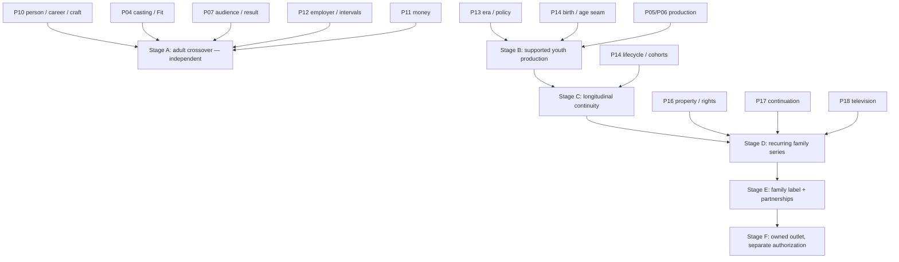

# Talent Origins — Implementation Plan and Requirement Register

> **FUTURE PRODUCT RESEARCH AND IMPLEMENTATION-PLANNING CANDIDATE**
>
> **OWNER INTEREST CONFIRMED — SPECIFIC MECHANICS NOT YET APPROVED**
>
> **NOT SCHEDULED**
>
> **NOT AUTHORIZED FOR GAMEPLAY IMPLEMENTATION**
>
> **SUBJECT TO CURRENT OPS REVIEW AND ACCEPTED-BASE REFRESH**

Navigation: [Current Ops review](TALENT-ORIGINS-CURRENT-OPS-REVIEW.md) · [Crossover talent](CROSSOVER-TALENT-AND-SCREEN-CAREERS-DESIGN.md) · [Young performers](YOUNG-PERFORMERS-AND-CAREER-DEVELOPMENT-DESIGN.md) · [Family/TV handoff](FAMILY-ENTERTAINMENT-BRAND-AND-TV-HANDOFF.md)

This document translates the research into bounded future stages. The stages are planning labels, not package numbers, work orders, campaign redirections, or authority to modify code. No schema name, DTO, save version, formula, balance value, or engineering-hour estimate is frozen.

---

## 1. Accepted-source reconnaissance

Current code facts below were verified at accepted TypeScript `2753e18ba8fb5f65b936c22cde9531646fecc6cd`. The accepted Unity inspection baseline is `c4c65db464ef9abcf3bdcc088f5c8a47cc9081b6`. Later frozen snapshots `0a641f5...` and `01e0898...` are **UNSEALED FORWARD EVIDENCE**, not shipped law.

| Capability requested by the Owner | Verified current source / symbol | Current fact | Future reuse or gap |
|---|---|---|---|
| Person creation and permanent identity | `src/core/types.ts::Talent`; `src/core/worldgen.ts` talent generation | Talent has stable identity/profile fields; world generation mints adults | P10 remains the sole identity owner/registrar. New cohorts and crossover entrants must use it. |
| Profession, skill and development | `Talent.acting`; `src/core/development.ts::developTalent` | Work-derived development exists and is tied to real work/release context | Reuse; do not add a youth/crossover training bar. Later profession transitions need P10/P14 evidence. |
| Star Power | `Talent.fame`; `src/core/starPower.ts::computeStarPowerDelta`, `buildTalentCareerEvent` | Screen-specific commercial recognition is release-derived | Origin reach stays separate and enters demand once. |
| Public versus hidden talent evidence | P10 profile rules; `src/core/talentSummary.ts` projections | Public observations/projected evidence are separated from underlying facts | Preserve uncertainty; no exact potential/prodigy display. |
| Audience segments and demand | `SegmentId`; `src/core/reception.ts`; `src/core/standing.ts` | `youngAdult`, `family`, `adult`, `prestige` are audience segments; fame, awareness, appeal, marketing and results already interact | `youngAdult` is not performer age. Audit before adding one bounded origin-overlap contribution. |
| Casting/role Fit and tests | `src/core/castingSessions.ts::auditionObservation`; `src/core/talentSummary.ts::projectFit`, `castSlotExecution` | Deterministic, role-specific audition/Fit evidence exists; current slots are adult-generic | Extend evidence context; add character age and eligibility without exposing truth. |
| Contracts, obligations and availability | `src/core/employment.ts::activeContract`, `busyTalentIds`, `weeklySalary`, `renewalWindowOpen`, `ContractOffer`; `Contract` in `types.ts` | Current employment/contract/busy facts exist | P10 contract and P12 employer/exclusivity/interval authority must own offers and external conflicts. No parallel crossover/series contract. |
| Chronological age/lifecycle | adult age in `Talent`; `worldgen.ts` generates ages 20–70; `talentSummary.ts::ageRunwayMult` | Age is static; no minor creation, birth-derived aging, or youth phase | P14 lifecycle/birth provenance is a named dependency. Do not extrapolate `ageRunwayMult` to minors. |
| Production scheduling/resources | project phase law; `StudioFacility`, `FacilityReservation` in `types.ts` | Existing phases and reservations; no young-performer day-feasibility model | P05/P06 extend production capacity; P13 supplies versioned policy; possible P09 capacity only if physical resource evidence requires it. |
| Credits/history | `FilmParticipant`; `TalentCareerEvent`; P08/history projections | Credited participants and persistent career events exist | Reuse one continuous career. Add only actual transition/offer/protection events needed for explanation. |
| Recurring television | search of accepted source; `EraConfig.televisionCompetition` | No pilot/episode/season/cast-renewal implementation; configuration is not workflow | Wait for P16/P17/P18. Do not describe roadmap concepts as shipped. |
| Save/migration | `GameStateV16`; V1–V16 migration chain | Accepted save authority is V16 | Additive future migration only when a stage is authorized; no invented childhood/origin/series history. |

The unsealed later source contains people/profile/roster projections such as `peopleProjection`, `BridgePeopleProjection`, and Unity inspector/profile views. They may inform a later refresh but cannot be an implementation base or acceptance claim.

---

## 2. Ownership and integration map

The arrows show logical capability dependencies, not a scheduled package order. Stage A is independently valuable and does not wait for B–F. Stage B needs the accepted P14 age source, but not P14's full retirement/cohort experience; Stage C needs that broader lifecycle authority. Product research, source refresh, paper fixture design, and visual concept review may proceed independently where they do not mutate the active stack.

### 2.1 Proposed addition seam register

Each row explicitly records the requested architecture fields. Names are conceptual, not final types.

| Addition | Existing owner / current symbol if verified | Reuse or extension | New fact or derived interpretation | Public / hidden boundary | Persistence justification | Migration / historical limitation | Downstream consumers | Final refresh required |
|---|---|---|---|---|---|---|---|---|
| Authored talent origin | P10 `Talent`/profile; P14 provenance direction | Extend P10 person profile; P14 may update market evidence | Durable origin discipline and evidence source | Public biography/evidence; unsupported detail `not recorded` | Explains discovery and identity without fake credits | Never generate old seasons, tours, catalogues or awards | Casting, market, profile, history | **Yes:** P10/P14 accepted boundary and actual symbols |
| Origin audience overlap | P07 `reception.ts`/`standing.ts`; P10 `fame` remains screen-only | One bounded P07 input after de-duplication | Derived project/segment/geography/era overlap with provenance/confidence; union/cap against correlated Star Power, awareness and marketing reach | Public estimate; no hidden exact conversion | Persist evidence/rules version, derive effect | Old saves have no origin bonus; real screen results remain | Packaging, marketing explanation, opening demand | **Yes:** full audience/formula audit |
| Crossover screen-test context | P04 `auditionObservation`, `projectFit` | Extend observation context | Role/medium-specific observation | Visible bounded estimate; actual ability/potential remains under existing hidden law | Decision evidence and later explanation | No retroactive tests on old careers | Casting, offers, history | **Yes:** P04 contract/DTO/client |
| External commitment | P10 availability projection; P12 employer/exclusivity/interval authority | Extend interval validation without origin-industry simulation | Bounded known/unknown commitment window | Conflict/reason visible where lawfully known; private detail can remain unknown | Prevents false availability | Never fabricate past leagues/tours/stage runs | Casting, production, TV, market | **Yes:** P10/P12 accepted seam |
| Birth-derived scheduled age | P14 planned lifecycle; current `Talent.age` static | Replace/extend only through accepted P14 law | Birth provenance and age-at-date derivation | Public exact/bounded precision; no invented precision | One person ages consistently | Legacy anchor uses explicit migration precision; no childhood backfill | Profile, casting, production, TV, history | **Yes:** P14C accepted design/source |
| Character age / playing range | P04 role/Fit; later P16 property | Extend roles and audition evidence | Character-age band is authored; playing range is derived uncertain evidence | Role band public; playing range public estimate; no body score | Needed for age-appropriate casting and later revalidation | Old roles remain `not recorded` until explicitly authored | Casting, production, story, UI | **Yes:** P04/P16/client |
| Young-performer eligibility policy | P13 era/capability owner; no current legal profile | Extend P13 with versioned policy selected by date/jurisdiction plus universal floor | Rules/profile facts; eligibility derived | Active policy and reason public; no legal advice claim | Determinism, audit and historical explanation | Research only implemented profiles; no false exactness across 1920–2040 | P05 scheduler, rivals, UI, history | **Yes:** operative law and P13 authority |
| Day-level feasibility/capacity plan | P05/P06 scheduling; `FacilityReservation` pattern | Extend authoritative production reservation | Deterministic daily template and derived eligibility | Exact pass/block reasons public; internals inspectable | Required because weekly totals cannot prove a lawful day | Prospective only; completed old work not re-judged | Production, cast availability, rivals, evidence | **Yes:** scheduler phases/resources |
| Supervision/education capacity | P05; possible P09 facility; P10 people if named roles | Extend resource/capacity reservation | Qualified support capacity and assignment | Availability/reason public; sensitive welfare detail excluded | Prevents overbooking and paperwork chores | No fake historical supervisors/schooling | Slate, production, UI, history where material | **Yes:** P05/P09/P10 role ownership |
| Protected compensation allocation | P11 quote/obligation/ledger | Extend one compensation settlement | Restricted performer-owned allocation under policy | Amount/policy/receipt explainable; never studio liquidity | Exact reconciliation and performer ownership | Prospective; no old-save backcharge or invented trust | Payroll, cash, contract, history | **Yes:** P11 accepted source and applicable law |
| Majority decision event | P10 contract/career; P12 intervals; P14 lifecycle | Extend transition orchestration | Adult assent/decline for a new agreement or renewal that requires assent; existing-term/option interpretation derived | Choice and known terms visible; private motives not invented | Preserves agency and continuity | Does not cancel historical valid terms or rights | Contracts, TV, profile, history | **Yes:** contract-specific law/P10/P12/P14 |
| Family/youth label | No accepted owner; P16+ corporate/rights parking, P15/P07 reputation, P18 slate | New stable identity plus derived portfolio views | Label identity/associations new; reputation/concentration derived | Brand/slate/history public; private strategy under existing law | Durable studio history across real projects | No retroactive label assignment on old saves | Projects, audience, history, legacy | **Yes:** Owner chooses P16+/P15/P18 boundary |
| Pilot/order/season workflow | P18 future boundary; no current source | New only after P18 authority | Real project/order/renew/cancel facts | Known contract/project terms; lawful unknowns explicit | Recurring production and history need actual events | No fabricated old seasons/options | P10/P11/P12/P16/P17/P07/P08 | **Yes:** accepted P18 source |
| Performer/character continuation | P10 person, P16 property, P17 Story DNA, P18 cast | Cross-owner orchestration | Recast/departure interpretation from actual facts | Public credits/cast/role; private negotiation bounded | Preserves both person and property history | No retroactive recasts | Series, audience, history | **Yes:** P16–P18 contracts |
| Cross-media partnership | P10/P11/P12/P14/P16/P18 | Bounded offer/interface, not new industry simulator | Actual partner, scope, right, obligation, availability and credit | Terms known/unknown under existing law | Explains real connected opportunities | No invented pre-game discography/tour | Projects, finance, audience, history | **Yes:** each owner and era capability |
| Owned channel/platform | No accepted implementation; later P13/P15/P16/P18/P11 decision | Separate future business model | Outlet, schedule/catalogue, reach, costs/revenue, rights | Public outlet and offers; business facts per owners | Only if separately authorized | Requires its own migration; no implied unlock | Commissioning, distribution, finance, market, legacy | **Yes:** complete later reconnaissance/research |

---

## 3. Stage A — adult crossover entry and one screen-career transition

| Required planning field | Stage A contract |
|---|---|
| **Player-facing outcome** | Discover an adult fictional outsider, compare known origin reach and uncertain screen craft against an established skilled unknown, inspect/test, make a bounded offer, respect a real outside commitment, cast or decline, and observe one authentic screen-career event on the same `PersonId`. |
| **Entry dependencies** | Owner acceptance of the relevant P08–P10 base and an accepted-base refresh; accepted P04/P05/P07 seams; P10 person/profile/career; P11 quote/settlement and P12 employer/exclusivity/interval authority for a complete offer; deterministic inspection. It does **not** require youth, lifecycle aging, television, a label, or a channel. |
| **Material decisions** | Origin fact owner; external-commitment owner; single origin-overlap entry point/cap/decay; public evidence vocabulary; whether screen test is required or optional. |
| **Existing owners** | P10 identity/craft/Star Power/career; P04 audition/Fit; P05 production; P07 demand/result; P11 money; P12 employment/availability; P08/Wire downstream history only. |
| **Bounded deliverables** | One era-available adult origin; authored evidence/provenance; one commitment interval; P04-compatible test; support/ensemble/vehicle/against-type/decline offer choices sufficient for one fixture; one provenance-aware, de-duplicated audience-reach explanation; one career event; rival eligibility under the same rules; UI read model. |
| **Exact scope exclusions** | No minor; no age progression; no full sports/music/comedy/modelling/online simulation; no record label/tour; no generic celebrity stat; no new contract system; no biographies of real people; no schema reserved here. |
| **Acceptance journey** | Two same-name fictional adults remain distinct. A high-awareness/low-craft outsider and low-awareness/high-craft actor compete for one role. A test changes uncertainty, not truth. An outside commitment blocks one schedule and permits another. The selected candidate finishes a film; origin overlap appears once in the opening explanation; the actual release creates the credit/Star Power change. A second candidate declines or ends after one modest part. |
| **Tests and visual evidence later required** | Deterministic unit/property proof for origin evidence, test projection, interval conflict, one-entry demand contribution and no mutation/RNG on inspection; end-to-end offer→cast→release→career history; rival symmetry; accessible dossier/casting comparison and explanation captures. |
| **Migration implication** | Existing people receive `origin not recorded`/no origin effect. No fabricated prior career, reach, test or commitment. Save evolution is additive and named only by an authorized implementation. |
| **Rollback boundary** | All new behavior must be behind an additive source-owned capability/read projection. Removal leaves P10 person/credits/contracts and P07 results intact; no release result is recomputed. |
| **What remains necessary for the fuller vision** | More origins/eras, deeper career agency, age/lifecycle, youth safeguards, series, label and partnerships. |
| **Relative effort / risk** | **Medium effort; medium product risk; medium–high integration risk** because fame/demand and contract ownership are sensitive. |

Stage A is the first independently buildable product slice **after** its named accepted owners exist. This statement does not authorize or reopen P11/P12 work.

---

## 4. Stage B — one properly supported young-performer production

| Required planning field | Stage B contract |
|---|---|
| **Player-facing outcome** | Cast and produce one age-appropriate project with an original fictional performer aged 14–17 at scheduled work; routine valid protection resolves automatically; an invalid schedule is refused with a useful lawful alternative; compensation reconciles once. |
| **Entry dependencies** | Accepted P10 identity; accepted P14 birth/age-at-date seam (full career lifecycle not required yet); P04 character-age/Fit; P05/P06 deterministic production scheduling; P11 money; P12 contract/employer; P13 policy/era seam; qualified support capacity; accepted-client refresh and an age-appropriate art/presentation plan. |
| **Material decisions** | Approve 14–17 initial band versus 9–17; supported jurisdiction/era fixtures; fictional welfare-floor name; authored day templates versus solver; support capacity owner; exact majority-edge behavior if the birthday occurs during the project. |
| **Existing owners** | P10 person/craft/credit; P14 age; P04 role; P05/P06 plan/reservation; P13 policy; P11 settlement; P12 employment; P09 only if a real facility capacity is approved; Unity consumes TypeScript truth. |
| **Bounded deliverables** | One age-appropriate role and performer; at least two relevant age/policy templates; permit/authorization, education, rest, supervision, daily/weekly caps and turnaround checks; automatic routine allocation; one exact blocker/alternative flow; protected-payment decomposition; scheduled-date birthday revalidation; age-appropriate profile/casting/world presentation. |
| **Exact scope exclusions** | No under-14 performer; no infant; no full historical-law simulator; no recurring series; no guaranteed prodigy/decline; no long-term coaching/training bar; no household needs; no scandal/body/sexual-appeal system; no claim of lifelong career. |
| **Acceptance journey** | One proposed plan fails because a specific daily constraint/capacity is impossible. Moving/splitting scenes or adding valid capacity succeeds. Performer assent, required parent/guardian/authorized-adult approval, and any talent representative's negotiation role remain separate. P11 charges gross compensation once and records the performer-owned protected allocation. A birthday crossing a supported band revalidates only future work. The same law constrains a rival fixture. |
| **Tests and visual evidence later required** | Policy-effective-date and age-at-scheduled-date tests; independent daily and weekly work/presence/school/rest/turnaround/consecutive-day fixtures; paired plans with equal weekly work where one prohibited day still blocks; capacity overbooking; atomic reservation; refusal alternatives; P11 exact reconciliation; no profitable invalid path; no mutation/RNG on inspection; age-appropriate model/wardrobe/animation/voice/context, focus/navigation and readable blocker screenshots/video. |
| **Migration implication** | No old person receives a fabricated childhood, guardian, permit, school, protected account or past compliance event. Existing completed projects are not re-judged. Future eligibility starts prospectively under a recorded profile. |
| **Rollback boundary** | Remove the young-performer eligibility capability and prevent new youth casting while retaining the `PersonId`, any lawfully committed compensation/credit, and immutable history. Never delete a real completed credit to simplify rollback. |
| **What remains necessary for the fuller vision** | Ages 9–13 and younger, broader jurisdiction/era profiles, cohort discovery, long-term aging/choice, series transitions, adult/behind-camera careers. |
| **Relative effort / risk** | **Large effort; high product and technical risk** because policy, time, finance, resource capacity and world presentation meet in one fixture. |

Stage B proves a protected production, not a full youth-to-adult career.

---

## 5. Stage C — longitudinal development and youth-to-adult continuity

| Required planning field | Stage C contract |
|---|---|
| **Player-facing outcome** | Follow the same fictional person across years: real work development, changing role evidence and interests, an adult contracting decision, optional pause/education/exit/return, and a later adult or behind-camera opportunity with complete history. |
| **Entry dependencies** | Accepted Stage B production law; accepted P14 lifecycle/phase/cohort/alumni authority; P10 career/development/profession; P12 intervals; P11 obligations; P08 history; bounded long-horizon orchestration. |
| **Material decisions** | Adult confirmation event and valid existing-option treatment; playing-range refresh cadence/evidence; expressed-interest representation; optional coaching (recommended still deferred); cohort bounds; behind-camera skill entry. |
| **Existing owners** | P10 registers people, craft and credits; P14 derives age/phase/choices/cohorts; P12 owns employer/interval; P11 settles obligations; P08/Wire presents history. |
| **Bounded deliverables** | One `PersonId` across minor/adult phases; age-at-date and playing-range evidence; adult assent for a new agreement or renewal that requires it, with surviving terms/options resolved separately; pause/exit/return; real work-derived development; one separately evidenced profession transition; bounded career events/history; cohort limits through a long campaign fixture. |
| **Exact scope exclusions** | No mortality/family/domestic-needs simulator; no deterministic puberty; no exact potential; no automatic decline/scandal; no full agency/social graph; no series unless Stage D exists. |
| **Acceptance journey** | A 17-year-old completes a supported film, reaches majority before another offer, rejects automatic-looking renewal, pauses for education, returns to an adult role, and later begins a separately skilled creative role. Credits, obligations and rights remain consistent; no replacement person or fake gap history appears. A second person leaves permanently without deletion. |
| **Tests and visual evidence later required** | Age/phase determinism across save/load; identity continuity; adult choice and contract-specific surviving terms; no automatic rights loss; pause/exit/return; bounded cohort performance through 1920–2040; history pagination/provenance; profile timeline visual proof. |
| **Migration implication** | Legacy age uses P14's approved anchor/precision and cannot infer childhood credits, early ambitions, prior employers, or outside careers. Missing history is explicit. |
| **Rollback boundary** | Stop new lifecycle transitions while preserving already written identity, age provenance, credits, contracts and history; fallback projections show recorded facts without manufacturing states. |
| **What remains necessary for the fuller vision** | Recurring seasons, audience growing with a cast, label portfolio, cross-media partners, owned outlet. |
| **Relative effort / risk** | **Very large effort; high product and technical risk** due to long-horizon migration, choice, identity and cross-owner settlement. |

---

## 6. Stage D — recurring family-series talent development

| Required planning field | Stage D contract |
|---|---|
| **Player-facing outcome** | Produce a pilot and at least two explicit season decisions for an outside outlet; manage producer-held option exercise/expiry, separate new/renewal offers, availability, age change and one departure/recast through actual production/contract/story law. |
| **Entry dependencies** | Accepted P16 StoryProperty/library/rights; P17 continuation/Story DNA; P18 pilot/order/season/outlet workflow; Stages B/C for young continuity; P10/P11/P12/P14 and P07/P08 seams. |
| **Material decisions** | Pilot/order terms; producer-held option exercise/expiry versus new/renewal offer authority; outlet/producer/rightsholder roles; character aging/recast law; audience continuity/recast response; series youth-protection revalidation; season migration/rollback. |
| **Existing owners** | P18 orchestrates television; P16 owns rights/property; P17 continuation; P10 person/credit; P12 availability/exclusivity; P14 age/choice; P11 money; P07 result; P08 history. |
| **Bounded deliverables** | One original property, one outside outlet, one pilot, bounded season order, recurring ensemble, explicit option exercise/expiry and separate offers, season boundary, one contract-valid voluntary departure or failed renewal, P17-valid continuation/recast, audience explanation, real credits/history. |
| **Exact scope exclusions** | No owned channel/platform; no universal TV schedule simulator; no captive cast/fans; no family label required; no record label, tour or merchandising; no automatic renewal. |
| **Acceptance journey** | A pilot is not a season. An accepted order reserves production and cast. One producer option expires or is waived under its terms; a separate renewal offer is declined; another performer has a conflicting commitment. The player chooses a story-valid exit/recast/format response. P07 shows segment-specific uncertainty, P11 settles real terms, and P08 records what happened. |
| **Tests and visual evidence later required** | Pilot/order/season state transitions; contract-valid option exercise/expiry/waiver; separate offer accept/counter/decline; interval conflicts; youth day-plan revalidation; actor/character identity separation; P16 rights and P17 continuation validation; cast-departure outcomes; segment response; accessible season/cast timeline. |
| **Migration implication** | Old films do not become pilots; no prior seasons/options/cast continuity are invented. Series introduced after migration begin with explicit provenance. |
| **Rollback boundary** | Stop new orders/renewals while preserving produced episodes/seasons, credits, rights, obligations and history; any in-flight committed order resolves under owner-specific rollback law. |
| **What remains necessary for the fuller vision** | A broader label/portfolio, cross-media partnerships, sustained opportunity pipeline, owned outlet economics. |
| **Relative effort / risk** | **Very large effort; high product risk and very high integration risk** because P16–P18 and person/finance/schedule owners converge. |

Stage D proves recurring outside-outlet production, not channel ownership.

---

## 7. Stage E — family label and cross-media partnerships

| Required planning field | Stage E contract |
|---|---|
| **Player-facing outcome** | Establish an original family/youth label across multiple real projects, see a varied opportunity pipeline and concentration risk, and support one performer through a separate voluntary music or creative partnership without owning that career. |
| **Entry dependencies** | Multiple actual family projects; Stage D/P18 for series; P16 rights and stable label/association owner decision; P15/P07 reputation/market projection; P10/P11/P12/P14 offer/availability; era-appropriate external partner interface; resolved FAM-015 music capability/career-evidence ownership if music is included in the bounded proof. |
| **Material decisions** | Exact label source owner; public promise and derived reputation; concentration/opportunity evidence; partner categories; **music capability/career-evidence owner**; rights/royalty/availability handoff; cross-promotion one-entry law; failure/closure semantics. |
| **Existing owners** | Proposed label identity/associations in P16+ boundary; P18 slate; P15/P07 derived public position; P10 people and existing Actor/Director/Writer/Craft disciplines; proposed music capability owner remains undecided; P14 choices; P12 intervals; P11 obligations; P16 rights. |
| **Bounded deliverables** | One original label; multiple new/returning projects and ensemble/supporting opportunities; evidence-based slate view; one concentration warning; one cross-media partner/offer/right/credit; one performer choosing a different path; durable label/person history. |
| **Exact scope exclusions** | No permanent talent roster; no automatic audience bonus; no moral/churn score; no owned record label, catalogue, touring, merchandising, social network or subscriber economy; no channel/platform. |
| **Acceptance journey** | The label contains a success, a modest project, new and returning performers, and a voluntary departure. A familiar performer declines a commercially obvious continuation and accepts or pursues different work. One music/creative partnership is separately contracted and counted once in promotion/results. The label continues without deleting or punishing the person. |
| **Tests and visual evidence later required** | Label association/source ownership; derived reputation provenance; opportunity/concentration evidence; person not roster-owned; separate skill/credit/rights/obligation; cross-promotion no double count; label history and accessible portfolio timeline. |
| **Migration implication** | Existing projects remain unlabeled unless a later explicit, evidence-backed assignment is made; do not auto-invent a historic label or partnership catalogue. |
| **Rollback boundary** | Remove label projections/new partnership offers while preserving underlying projects, rights, people, contracts, payments, credits and history. |
| **What remains necessary for the fuller vision** | Linear/DTC outlet operation, content acquisition/programming, catalogue/service economics and market distribution. |
| **Relative effort / risk** | **Very large effort; very high product/integration risk** due to identity/reputation/rights/finance ambiguity and scope pressure. |

---

## 8. Stage F — owned channel or platform

| Required planning field | Stage F contract |
|---|---|
| **Player-facing outcome** | If separately authorized, operate an original outlet whose programming/catalogue, reach, rights, costs, revenues and obligations are meaningfully different from producing shows for others. |
| **Entry dependencies** | Accepted P16/P18/P11/P13/P15 interfaces; proven Stage E multi-project label; enough actual content to test catalogue/schedule behavior; new historical/economic research; explicit Owner choice of linear channel, DTC platform, staged sequence, or neither. |
| **Material decisions** | Business model; launch/closure conditions; geography/era; commissioning/acquisition; continuous schedule versus on-demand catalogue; advertising/subscription/affiliate economics; technology/distribution; third-party rights; rival symmetry; player failure/recovery. |
| **Existing owners** | P13 media availability; P15 shared market/corporate condition if accepted; P16 rights/library; P18 commissioning/schedule/catalogue/outlet; P11 finance. Exact owner boundaries require new reconnaissance. |
| **Bounded deliverables** | **Not specified until separate authorization.** A future charter must choose one outlet model and one proof rather than bundle linear and DTC. |
| **Exact scope exclusions** | No automatic unlock from a label, building, hit film or series; no implied merchandising/music/tour/social expansion; no current implementation. |
| **Acceptance journey** | Future decision only: must prove that an outlet can commission/acquire enough licensed/owned work, meet operating obligations, reach an audience and fail/recover without rewriting underlying rights, projects or people. |
| **Tests and visual evidence later required** | Future charter must separate rights correctness, finance reconciliation, schedule/catalogue behavior, market effects, accessibility and player enjoyment. One successful show is insufficient evidence. |
| **Migration implication** | Requires its own additive migration and explicit absence for old saves. No placeholder outlet is created now. |
| **Rollback boundary** | Must preserve every underlying property, licence, project, contract, person, payment and history if the outlet closes or the capability is removed. |
| **What remains necessary for the fuller vision** | Determined only by the separately approved business model. |
| **Relative effort / risk** | **Extreme effort; very high product risk; extreme integration risk.** No engineering hours are estimated. |

---

## 9. Comparator patterns retained

Only comparators that answer a concrete design question were retained.

| Comparator / verified status | What it actually does / problem solved | Adopt | Adapt | Reject and why |
|---|---|---|---|---|
| **Football Manager** — Development Centre shipped/documented in FM20/21; FM24 mentoring documented ([FM20](https://www.footballmanager.com/news/fm20-touch-out-now-nintendo-switchtm), [FM21 Development](https://community.sports-interactive.com/sigames-manual/football-manager-2021-touch/development-r4389/), [FM21 Training](https://community.sports-interactive.com/sigames-manual/football-manager-2021-touch/training-r4393/), [FM24](https://www.footballmanager.com/features/football-manager-2024-console-new-features-unveiled)) | Consolidates long-horizon youth information, staff advice and opportunities; training responsibility can be delegated; mentoring is documented. | A readable pathway view, staff recommendations, delegation, development through real assignments. | Replace minutes/loans with suitable roles, preparation, mentorship and voluntary outside opportunities; retain uncertain estimates. | Transfer inventory, wonderkid certainty, exact potential, generic youth acceleration, deletion of retired history. Sports academies are analogy, not performer ownership or welfare law. |
| **F1 Manager 2024** — affiliate system shipped; patch 1.7 confirms released behavior ([feature](https://www.f1manager.com/features/new/affronta-le-sfide-della-f1), [update](https://www.f1manager.com/2024/update-notes/1-7)) | An affiliate can continue outside the main seat, receive a bounded trial opportunity, be recruited by rivals, and leave. | Affiliation without full slot, bounded trial, outside career, rival symmetry, voluntary exit. | Origin commitments become authored availability; FP1-like trial becomes screen test/supporting role. | Asset-roster framing, fixed numeric development, age decline and one marketability stat. |
| **The Sims 4: Get Famous** — shipped ([actor career](https://help.ea.com/en/articles/the-sims/the-sims-4/actor-career/), [acting skill](https://help.ea.com/en/articles/the-sims/the-sims-4/acting-skill/), [release](https://news.ea.com/press-releases/press-releases-details/2018/Reach-for-the-Stars-With-the-Sims-4-Get-Famous-Available-Now/default.aspx)) | Shows auditions with gig/skill/time/pay, role preparation and acting skill separate from fame/reputation. | Legible audition/readiness and separate craft/fame. | Aggregate at studio-head altitude; Project Studio's own P10/P14 law supplies identity continuity. | Household needs, homework/meals micromanagement, ten-rank ladder and generic training bar. The cited implementation does not supply child-actor welfare law. |
| **The Movies (2005)** — shipped; [official manual](https://shared.akamai.steamstatic.com/store_item_assets/steam/apps/7900/manuals/manual_english.pdf?t=1447351040) | Persistent star careers, genre experience from work/practice, workload consequences, departure and retirement highlights, but also a composite Star Rating and heavy avatar management. | Permanent career highlights, work-derived experience, departure without erased history. | Replace career control with influence through offers/support and respected decisions. | Composite fame/skill/image score, body/looks scoring, addiction/scandal exploitation, tantrum and needs chores—especially unacceptable for minors. |
| **Showrunner** — playable Early Access since 2023, not 1.0 ([Steam](https://store.steampowered.com/app/2058200/Showrunner/), [v0.46](https://store.steampowered.com/news/app/2058200/view/530963804324889518), [official news / v0.44](https://steamcommunity.com/app/2058200/allnews/)) | v0.46 exposes season-boundary renew/remove/recast choices; v0.44 documents mainstream, theme-aficionado and hardcore audience groups; the store describes platform contracts. | Explicit season decisions, actor/character distinction, segmented response. | Route all decisions through P16–P18 rights/story/contract law and evidence-based audience response. | Casual firing as roster optimization, universal recast penalty, fan-conversion constants, stat grind. Early Access limits authority. |
| **Studio Sim** — announced, planned release 2026-10-19 at the research snapshot; not shipped ([Steam](https://store.steampowered.com/app/4516210/)) | Marketing copy claims pilots, seasons, networks and aging. | Nothing until shipped evidence exists. | Revisit only after release if it solves a still-open question. | Do not cite announced mechanics as implemented; reject advertised vice/scandal/nepotism patterns as design authority. |

No comparator combines young-performer safeguards, recurring cast law, adult transition, and cross-media agency. Labor/production/finance architecture—not genre analogy—must lead those parts.

### 9.1 Comparator source accounting

| Source | Publisher / date or version | Locator and supported shipped/announced claim | Limitation | Confidence |
|---|---|---|---|---|
| [FM20 Touch release](https://www.footballmanager.com/news/fm20-touch-out-now-nintendo-switchtm); [FM21 Development](https://community.sports-interactive.com/sigames-manual/football-manager-2021-touch/development-r4389/); [FM21 Training](https://community.sports-interactive.com/sigames-manual/football-manager-2021-touch/training-r4393/); [FM24 Console features](https://www.footballmanager.com/features/football-manager-2024-console-new-features-unveiled) | Sports Interactive; 2019-12-10 / 2021 manual / 2023-10-24 | Development Centre hub and staff advice; loans/opportunities; delegated training; FM24 mentoring | Sports progression analogy, not performer welfare; exact-potential/inventory framing rejected | High shipped/documented status |
| [F1 Manager affiliate feature](https://www.f1manager.com/features/new/affronta-le-sfide-della-f1); [Update 1.7](https://www.f1manager.com/2024/update-notes/1-7) | Frontier; feature unlocked 2024-06-26 / patch 2024-09-04 | Affiliate remains in F2/F3, bounded FP1 opportunity, rival recruitment/exit; patch confirms released behavior | Driver asset/development model does not transfer literally | High |
| [Actor career](https://help.ea.com/en/articles/the-sims/the-sims-4/actor-career/); [Acting skill](https://help.ea.com/en/articles/the-sims/the-sims-4/acting-skill/); [Get Famous release](https://news.ea.com/press-releases/press-releases-details/2018/Reach-for-the-Stars-With-the-Sims-4-Get-Famous-Available-Now/default.aspx) | Electronic Arts; help updated 2026 / release 2018-11-16 | Audition gig/time/pay/preparation; acting skill; fame expansion shipped | Does not document a young-performer career or production safeguards | High shipped features |
| [The Movies manual](https://shared.akamai.steamstatic.com/store_item_assets/steam/apps/7900/manuals/manual_english.pdf?t=1447351040) | Lionhead/Activision; 2005-09-27 manual | pp. 2, 6–7, 17: career/genre experience, workload/departure/highlights and composite Star Rating | Legacy manual; body/looks/addiction/needs patterns explicitly rejected | High |
| [Showrunner store](https://store.steampowered.com/app/2058200/Showrunner/); [v0.46](https://store.steampowered.com/news/app/2058200/view/530963804324889518); [v0.44 in official news](https://steamcommunity.com/app/2058200/allnews/) | Inexplicable Games; Early Access since 2023-01-17; v0.44 2024-07-31; v0.46 2025-02-07 | Store status/platform; v0.46 renewal/remove/recast; v0.44 three audience groups | Early Access and changing saves; no youth/welfare system | Medium |
| [Studio Sim store](https://store.steampowered.com/app/4516210/) | PrattDesign; accessed 2026-09-06, planned release 2026-10-19 | Store says not yet available; only marketing claims exist | Zero evidence of shipped behavior; revisit after release only | High announced/not-shipped status |

---

## 10. Stable requirement register

Detailed rationale and sources live in the linked design documents. This register preserves scope, status and return conditions.

### 10.1 Integration and continuity (`INT`)

| ID | Stable requirement | Status / dependency |
|---|---|---|
| INT-001 | Freeze and record one accepted TypeScript/Unity source snapshot before any future implementation reconnaissance; later WIP is never acceptance. | **EXISTING AUTHORITY** |
| INT-002 | P10 alone registers a person; one `PersonId` survives every origin, employer, profession and age transition. | **EXISTING AUTHORITY** |
| INT-003 | Reuse P04/P05/P07/P08/P10/P11/P12/P13/P14/P16/P17/P18 owners; no duplicate fame, development, contract, finance, rights, television or history truth. | **EXISTING AUTHORITY**; final owner refresh required |
| INT-004 | Distinguish SOURCE FACT, CURRENT CODE FACT, EXISTING PROJECT DIRECTION, INFERENCE and NEW RECOMMENDATION. | **EXISTING AUTHORITY** in this package |
| INT-005 | Client/UI is projection only; inspection is deterministic, read-only and consumes no RNG. | **EXISTING AUTHORITY** |
| INT-006 | Rivals follow the same applicable availability, capacity, protection and resource law. | **RECOMMENDED FIRST STAGE** — apply at the first relevant stage and every later consumer |
| INT-007 | History/Wire narrate authoritative events and never manufacture private motives, childhood credits, origin careers or seasons. | **EXISTING AUTHORITY** — extend its event vocabulary only for real new facts |
| INT-008 | Old saves expose missing provenance honestly and receive no fabricated origin, childhood, representative, guardian, outside career or TV history. | **EXISTING AUTHORITY** — migration invariant for every stage |
| INT-009 | Do not preassign schema/save/protocol/DTO versions or detailed types against moving upstream code. | **EXISTING AUTHORITY** |
| INT-010 | Every stage has an additive capability boundary and preserves already authoritative people, contracts, money, rights, credits and history on rollback. | **RECOMMENDED FIRST STAGE** — retained by every later stage |

### 10.2 Crossover talent (`XOV`)

| ID | Stable requirement | Status / dependency |
|---|---|---|
| XOV-001 | Store authored origin/evidence separately from simulated screen history. | **RECOMMENDED FIRST STAGE** |
| XOV-002 | Make origins era-available and individual; category alone grants no stereotyped capability. | **READY AFTER NAMED DEPENDENCY** — P13 for expanded eras |
| XOV-003 | Keep source awareness, project overlap, screen Star Power, craft, Fit, persona, experience and availability distinct. | **RECOMMENDED FIRST STAGE** |
| XOV-004 | Use contextual screen tests/limited work to narrow uncertainty, never reveal exact potential. | **RECOMMENDED FIRST STAGE** |
| XOV-005 | Support sensible support/ensemble/vehicle/against-type/wait/decline paths. | **RECOMMENDED FIRST STAGE** |
| XOV-006 | Represent outside work as bounded commitments through P10/P12, not a full origin-industry simulator. | **OWNER DECISION REQUIRED** on exact owner |
| XOV-007 | Count one bounded origin-audience-overlap contribution once, after provenance-aware union/capping with correlated screen awareness/Star Power/marketing; no free acting quality, Standing or revenue multiplier. | **OWNER DECISION REQUIRED** on P07 formula |
| XOV-008 | Let real releases replace uncertainty about screen conversion without falsely erasing independently current source-field awareness. | **RECOMMENDED FIRST STAGE** |
| XOV-009 | Allow modest/failed/selective crossover, refusal, return to origin and behind-camera transition. | **READY AFTER NAMED DEPENDENCY** — P14 for full agency/lifecycle |
| XOV-010 | Apply the same discovery/availability/offer law to rivals. | **READY AFTER NAMED DEPENDENCY** — P12/P14 orchestration |
| XOV-011 | No all-purpose celebrity stat, origin contract system, fabricated backstory, or real-person asset. | **REJECTED DESIGN ALTERNATIVE** |

### 10.3 Young performers (`YTH`)

| ID | Stable requirement | Status / dependency |
|---|---|---|
| YTH-001 | Preserve one person and permanent credits from youth through adulthood. | **EXISTING AUTHORITY** |
| YTH-002 | Keep chronological age, character age, playing range, craft, potential estimate, fame and career phase distinct. | **READY AFTER NAMED DEPENDENCY** — P14/P04 |
| YTH-003 | Keep performer assent, required parent/guardian/authorized-adult approval, and talent representation distinct. | **RECOMMENDED FIRST STAGE** — first youth stage |
| YTH-004 | Apply mandatory baseline protection; routine valid compliance may automate, neglect/evasion never profits. | **RECOMMENDED FIRST STAGE** — first youth stage |
| YTH-005 | Validate independent daily work/presence/education/rest/turnaround plus applicable weekly/consecutive-day caps beneath the coarser turn; never use weekly averaging to relax a day. | **RECOMMENDED FIRST STAGE** — first youth stage |
| YTH-006 | Treat qualified supervision and education as bounded production capacity without repetitive chores. | **RECOMMENDED FIRST STAGE** — first youth stage |
| YTH-007 | P11 settles protected compensation once; restricted money belongs to the performer and never funds the studio. | **READY AFTER NAMED DEPENDENCY** — P11 |
| YTH-008 | Separate welfare education, role preparation and optional long-term craft development. | **RECOMMENDED FIRST STAGE** — first youth stage |
| YTH-009 | Add no persistent coaching/training system without a separate decision and evidence. | **OWNER DECISION REQUIRED** |
| YTH-010 | Revalidate future scheduled work when age/policy changes; never rewrite completed work. | **READY AFTER NAMED DEPENDENCY** — P14/P05 |
| YTH-011 | At adulthood, require affirmative choice for a new agreement or renewal that requires assent; resolve valid surviving terms/options separately and preserve rights/history. | **READY AFTER NAMED DEPENDENCY** — P10/P12/P14 |
| YTH-012 | First supported band is recommended at 14–17; ages 9–13, under 9 and infants retain named return conditions. | **OWNER DECISION REQUIRED** |
| YTH-013 | Permit pause, education-first, exit, return, adult reinvention and separately earned behind-camera work. | **READY AFTER NAMED DEPENDENCY** — P14 |
| YTH-014 | Prove actual age-appropriate world/UI presentation and accessible navigation. | **RECOMMENDED FIRST STAGE** — first youth stage |
| YTH-015 | No body/sexual-appeal score, scandal archetype, deterministic decline/prodigy, domestic-needs loop or person ownership. | **REJECTED DESIGN ALTERNATIVE** |

### 10.4 Family entertainment (`FAM`)

| ID | Stable requirement | Status / dependency |
|---|---|---|
| FAM-001 | Family films remain projects using existing production/audience law. | **EXISTING AUTHORITY** |
| FAM-002 | A youth/family label is a portfolio/brand promise, not a building, channel or roster. | **OWNER DECISION REQUIRED** on source owner |
| FAM-003 | Distinguish commissioner, producer, outlet, representative, music partner, rightsholder and performer. | **READY AFTER NAMED DEPENDENCY** — first P16/P18 television stage |
| FAM-004 | Pilot, order, season, option, renewal, cancellation and delivery are separate facts. | **READY AFTER NAMED DEPENDENCY** — P18 |
| FAM-005 | Revalidate cast age, protection, interest, contract and availability each season. | **READY AFTER NAMED DEPENDENCY** — P18/P14 |
| FAM-006 | Actor and character remain distinct; departure/recast uses P17/P18 law. | **READY AFTER NAMED DEPENDENCY** — P16/P17/P18 |
| FAM-007 | Youth-series reputation/familiarity is distinct from adult-role suitability and fan transfer. | **READY AFTER NAMED DEPENDENCY** — first P07/P18 television stage |
| FAM-008 | Cross-promotion has explicit cost/scope and enters demand once. | **OWNER DECISION REQUIRED** |
| FAM-009 | Cross-media support uses separate voluntary offers, rights, availability and payment. | **READY AFTER NAMED DEPENDENCY** — the named P10–P18 seams, plus FAM-015 before any music extension |
| FAM-010 | Fame grants no skill in another existing P10 discipline; every role needs evidence and credit. | **EXISTING AUTHORITY** |
| FAM-011 | A continuing label offers varied new/returning/ensemble/supporting opportunities and exposes concentration without a churn score. | **OWNER DECISION REQUIRED** |
| FAM-012 | Owned linear channel and DTC platform remain separate later business decisions after P16/P18/P11/P13/P15 and a proven label slate. | **DEFERRED WITH NAMED RETURN CONDITION** |
| FAM-013 | No record-label, touring, merchandising, social-platform or subscriber simulator through a partnership seam. | **REJECTED DESIGN ALTERNATIVE** |
| FAM-014 | Treating ownership of defined IP as ownership of an actor or captive fans is forbidden. | **REJECTED DESIGN ALTERNATIVE** |
| FAM-015 | Decide music capability and career-evidence ownership before a music-career extension; do not assume current P10 ownership. | **OWNER DECISION REQUIRED** |

---

## 11. Future proof register

These are paper/design fixtures now. They become executable or visual evidence only under a later authorized implementation. Legal compliance, simulation correctness, visual clarity and player enjoyment are independent evidence classes.

| Proof ID | Required idea | Evidence class | Earliest stage | Future proportionate evidence |
|---|---|---|---|---|
| PRF-SIM-001 | Famous outsider with limited screen craft versus skilled unknown | Simulation + enjoyment | A | Deterministic comparison where each is rational for different projects; no dominant composite score |
| PRF-SIM-002 | Same source popularity produces different audience relevance | Simulation | A | Same origin-reach band, different segment/geography/era/project overlap and explanation |
| PRF-SIM-003 | No double counting of reach or revenue | Simulation + finance | A | Trace one origin item through one demand input; add earned screen Star Power, existing awareness and paid marketing aimed at the same segment; prove a provenance-aware union/cap prevents overlapping people from being counted repeatedly and no second revenue application occurs |
| PRF-SIM-004 | Crossover does not become a major film career | Simulation + enjoyment | A | Completed supporting credit followed by ordinary result, declined/failed vehicle or return to another field; history retained |
| PRF-SIM-005 | Tour/sport commitment prevents conflicting film work | Simulation | A | Interval conflict with delay/shorter role/recast/decline alternatives |
| PRF-SIM-006 | Same-name people remain distinct | Simulation | A | Two display-identical names, distinct immutable `PersonId`, contracts, credits and history |
| PRF-SIM-007 | One `PersonId` survives profession, employer and age transitions | Simulation | C | End-to-end identity trace and save/load digest across all transitions |
| PRF-LEG-001 | Young-performer refusal has useful lawful alternative | Legal/policy + enjoyment | B | Invalid daily plan returns exact rule/effective profile and at least one valid alternative, no bypass |
| PRF-LEG-002 | Required supervision/education without player chores | Legal/policy + enjoyment | B | Capacity reservation/automatic allocation; player selects production pattern, not individual meals/homework |
| PRF-FIN-001 | Protected compensation reconciles exactly | Legal/policy + finance | B | One gross obligation and aggregate cash reduction; all settlement legs sum to gross; restricted allocation exact and performer-owned; zero duplicate or studio liquidity |
| PRF-SIM-008 | Performer ages during project or between seasons | Simulation | B / D | Age-at-scheduled-date crosses band; only future plan revalidated; season boundary uses new age/evidence |
| PRF-LEG-003 | No automatic new agreement or rights loss at adulthood | Legal/policy + simulation | C | Adult assent gate where a new agreement/renewal requires it; contract-specific exercise/expiry of surviving options/terms; unchanged past credits/rights |
| PRF-LEG-004 | Weekly totals do not legalize a prohibited day | Legal/policy + simulation | B | Two plans have equal weekly work; the plan violating a daily or turnaround rule blocks. England education aggregation never relaxes daily work/presence. |
| PRF-LEG-005 | Performer assent, adult authorization and talent representation stay distinct | Legal/policy + simulation | B | Fixture records the young person's assent, required parent/guardian/authorized-adult approval and any representative negotiation as separate results; none substitutes for another. |
| PRF-SIM-013 | Education and preparation do not create hidden skill | Simulation | B | Required education changes no craft; role preparation affects only that project; only existing P10 released-work development persists. |
| PRF-VIS-003 | Minor-safe data and presentation | Visual/accessibility + data contract | B | DTO/schema/UI inspection contains no minor body, sexual-appeal or scandal fields; age-appropriate visual evidence still passes. |
| PRF-SIM-009 | Voluntary pause/exit without deleting history | Simulation + enjoyment | C | Decline/pause/exit event, inactive career state, permanent credits, optional later return |
| PRF-SIM-010 | Recurring cast departure uses actual production/contract law | Simulation | D | Decline/conflict/option expiry feeds P17/P18 write-out/recast/end; no casual roster deletion |
| PRF-SIM-011 | Youth-series reputation is distinct from adult-role Fit | Simulation | D | Familiar performer tests poorly/well for different adult role independently; one bounded audience overlap |
| PRF-MIG-001 | Old saves receive no fabricated youth/origin history | Migration | A–E | Fixture migration shows explicit absence/unknown and identical existing credits/cash/results |
| PRF-SIM-012 | Rivals follow the same protection/resource law | Simulation/fairness | A / B | Matched player/rival eligibility and capacity fixture with identical reasons/outcomes |
| PRF-END-001 | Bounded long-horizon cohorts/history across 1920–2040 | Simulation/performance | C | Fixed-seed campaign fixture with bounded entrants/events/pages, permanent identities, deterministic digest and measured slope |
| PRF-VIS-001 | Age-appropriate world/UI presentation and accessible navigation | Visual/accessibility | B | Native client capture/video of suitable model/role/context, readable status, controller/keyboard focus and target-resolution text |
| PRF-DET-001 | Inspection causes no gameplay mutation or RNG use | Determinism | Every stage | Before/after state+RNG digest for every dossier, comparison, explanation and history inspection route |
| PRF-ENJ-001 | Player choices are meaningful rather than paperwork | Enjoyment | B / D / E | Moderated paper/playtest evidence: players can explain casting/schedule/slate tradeoff and are not repeating compliance chores |
| PRF-ENJ-002 | Long career is emotionally legible without guaranteed success | Enjoyment | C / E | Journey review recognizes contribution, changed ambition and studio history across success/modest/exit outcomes |
| PRF-VIS-002 | One youth fixture does not overclaim full continuity; one series does not overclaim channel ownership | Visual/product clarity | B / D | Scope copy and evidence labels explicitly identify proven and unproven capabilities |

A legal fixture does not prove enjoyable play. A deterministic unit test does not prove readable presentation. A screenshot does not prove correct finance. A positive playtest does not prove compliance.

---

## 12. Migration and historical truth

Every authorized future stage must use additive sequential migration from the then-accepted save—not from V16 by assumption—and preserve these invariants:

1. Existing `PersonId`, contracts, participants, credits, career events, results, cash and history remain authoritative.
2. Missing origin, birth precision, childhood, guardian, representative, protection, outside commitment, label, series and partnership facts are explicitly `not recorded` or absent.
3. No age estimate creates childhood credits or claims a person complied with a policy before the feature existed.
4. No existing family film becomes label content, a pilot, season or franchise without an explicit post-migration decision/evidence.
5. No existing fame is reinterpreted as source-field awareness, and no audience result is recalculated.
6. Rules/policies apply prospectively according to recorded effective versions; completed work is not retroactively invalidated.
7. A career transition never mints a replacement person.
8. Rollback preserves real committed obligations and immutable history even if the future capability is disabled.

Historical research is added only when an era/jurisdiction will materially change a supported decision. The consistent welfare floor remains a product policy, clearly separated from claims of historical law.

---

## 13. Risk and decision register

| Risk / unresolved decision | Consequence | Recommended containment | Blocks |
|---|---|---|---|
| P08–P10 not yet Owner-accepted at the frozen later tip | Building against WIP would counterfeit authority | Refresh from accepted branches at authorization; treat later snapshots as unsealed evidence | Any implementation |
| Origin reach owner/formula unresolved | Duplicate fame/awareness/marketing/revenue or opaque bonus | One provenance-bearing overlap input to P07; retain P10 screen-only Star Power | Stage A |
| External commitment ownership unresolved | Parallel employer/contract truth | P10 projection validated by P12 intervals; no origin-industry simulator | Stage A |
| Initial youth age band unapproved | Presentation/legal scope ambiguity | Approve 14–17 or deliberately fund 9–17; retain younger return conditions | Stage B |
| Current law is temporally/geographically narrow | False legal claims across 1920–2040 | Universal floor + only researched versioned profiles; refresh operative law before coding | Stage B profiles |
| Weekly tick cannot prove daily compliance | Illegal/unsafe schedule hidden by aggregate | Deterministic authored day templates beneath turn; exact explanations | Stage B |
| Support capacity owner unclear | Duplicate facility/person/resource facts | Start as P05 reservation; use P09/P10 only for accepted physical/named provider facts | Stage B |
| Protected-money accounting duplicates compensation | Cash corruption or studio benefits from performer money | P11 one gross settlement decomposition and exact receipt | Stage B |
| Coaching scope pressure | Training bar/duplicate P10 development | No persistent coaching first; separate Owner decision after measurement | Stage C or later |
| Majority transition oversimplified | Automatic ownership or false contract cancellation | Adult assent where a new agreement/renewal requires it plus contract-specific surviving terms/options | Stage C |
| P16–P18 are planned, not shipped | Series design could freeze against nonexistent contracts | Wait for accepted owners and refresh; implement no local substitute | Stage D |
| Label owner/reputation unclear | Second corporate/Standing/rightsholder truth | Persist identity/associations once; derive reputation from P07/P15/P18 evidence | Stage E |
| Survivor-biased source cases | Guaranteed star/decline trajectories | Include modest, failed, selective, voluntary exit and reinvention fixtures; no rates | All stages |
| Scope expands into music/channel/social commerce | Unbounded parallel games | Partnership interface only; Stage F and every adjacent business need named authorization | E/F |
| Client age presentation lags data | “Small adult” implementation harms clarity and safety | World/UI presentation is an entry dependency and separate acceptance class | Stage B |

### Genuine Owner decisions before the relevant stage

1. Origin fact owner and single audience entry law.
2. Outside non-studio commitment owner.
3. Initial youth band: recommended 14–17 versus broader 9–17.
4. Welfare-floor name and relationship to versioned law profiles.
5. Authored day templates versus a general solver; templates recommended first.
6. Support capacity representation.
7. Majority-transition/option policy within actual contract law.
8. Whether persistent coaching/mentorship development exists at all.
9. Family-label source owner, promise, reputation and concentration presentation.
10. Music capability/career-evidence ownership before any music-career extension.
11. Cross-media partner scope and one-entry promotion law.
12. Owned linear channel, DTC platform, staged versions of both, or neither—only after the named return conditions.

No recommendation in this list is Owner approval.

---

## 14. Deferred, not dropped

| Preserved ambition | Current disposition | Named return condition |
|---|---|---|
| Ages 9–13 | **DEFERRED WITH NAMED RETURN CONDITION** | Distinct age/policy templates, support ratios/capacity, age-appropriate audition/role/world/UI proof |
| Under-nine and infant performers | **DEFERRED WITH NAMED RETURN CONDITION** | Specialist policy and welfare review plus dedicated production/presentation design |
| Persistent coaching/mentorship | **OWNER DECISION REQUIRED** | Measure existing P10 work development; define P10/P14 owner and non-grind purpose |
| Wider origin categories/eras | **READY AFTER NAMED DEPENDENCY** | P13 era availability and individually evidenced background, no stereotypes |
| Recurring family television | **READY AFTER NAMED DEPENDENCY** | Accepted P16/P17/P18 property/continuation/TV contracts plus youth/lifecycle law |
| Full youth/family label | **OWNER DECISION REQUIRED** | Multiple real projects plus a stable identity/association owner and evidence-based portfolio view |
| Music support | **READY AFTER NAMED DEPENDENCY** | Separate music-capability owner, offer, rights, availability and P11 obligations; no owned label |
| Record label, touring, merchandising, social/subscriber simulation | **DEFERRED WITH NAMED RETURN CONDITION** | Separate research, owners and explicit authorization for each business |
| Owned linear channel | **DEFERRED WITH NAMED RETURN CONDITION** | Stage F prerequisites and separate linear economics/programming decision |
| Owned DTC platform | **DEFERRED WITH NAMED RETURN CONDITION** | Stage F prerequisites and separate service/catalogue/subscription decision |

The full emotional destination survives: decades later, the studio's history can show the first opportunity, real work, changing ambitions, respectful separations, later collaboration and an adult career—without claiming ownership of the person or guaranteeing their success.

---

## 15. Stop condition

This package supplies research and a staged implementation candidate. It does not authorize gameplay implementation, prototypes, Unity/game launch, tests, schemas, saves, DTOs, assets, package starts, or active-stack changes. Future Ops and Current Ops must review the decisions and dependencies first. Any authorized next effort begins with a new accepted-base refresh and a deliberately bounded stage charter.
