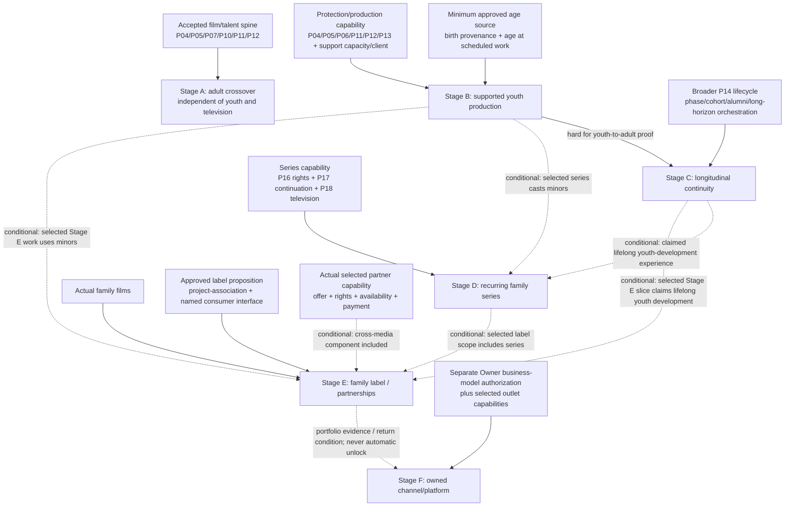

# Talent Origins — Implementation Plan and Requirement Register

> **CURRENT OPS REVIEWED — RETAINED AS UNSCHEDULED FUTURE PLANNING**
>
> **TARGETED REVIEW CLARIFICATIONS RECORDED**
>
> **SPECIFIC MECHANICS NOT APPROVED**
>
> **GAMEPLAY IMPLEMENTATION NOT AUTHORIZED**
>
> **ACCEPTED-BASE REFRESH REQUIRED BEFORE ACTIVATION**

Navigation: [Current Ops review](TALENT-ORIGINS-CURRENT-OPS-REVIEW.md) · [Crossover talent](CROSSOVER-TALENT-AND-SCREEN-CAREERS-DESIGN.md) · [Young performers](YOUNG-PERFORMERS-AND-CAREER-DEVELOPMENT-DESIGN.md) · [Family/TV handoff](FAMILY-ENTERTAINMENT-BRAND-AND-TV-HANDOFF.md)

Current Ops reviewed all five documents at `207d06d4d3b6c665bd532bcbd3982d1bf0cb654f`. This follow-up records five targeted disposition clarifications only; it does not independently reverify external sources or report test execution. The companion designs remain unchanged, and this register plus the Current Ops hub qualify conflicting original wording for future activation review.

The five reviewed clarifications govern: product decisions versus implementation recommendations; hard versus feature-conditional dependencies; concurrent youth protection and safe rollback; preservation of accepted P07 behavior when origin contribution is absent; and separation of accepted source facts, future P08 history authority, and Hollywood Wire editorial consumption.

This document translates the retained research into bounded future stages. The stages are planning labels, not package numbers, work orders, campaign redirections, or authority to modify code. No schema name, DTO, save version, formula, balance value, or engineering-hour estimate is frozen.

---

## 1. Accepted-source reconnaissance

Current code facts below were verified in the original research at accepted TypeScript `2753e18ba8fb5f65b936c22cde9531646fecc6cd`. The accepted Unity inspection baseline is `c4c65db464ef9abcf3bdcc088f5c8a47cc9081b6`. Current Ops reviewed the resulting five documents at `207d06d4...`; it did not independently repeat that source inspection. Later TypeScript `0a641f584ac6dc4c8a812145582a4f97344a8595` and Unity `01e089812930c772890b0ccd165ab36f9108f109` observations remain separate **UNSEALED FORWARD EVIDENCE** from the 2026-09-06 research snapshot, not shipped law.

| Capability requested by the Owner | Verified current source / symbol | Current fact | Future reuse or gap |
|---|---|---|---|
| Person creation and permanent identity | `src/core/types.ts::Talent`; `src/core/worldgen.ts` talent generation | Talent has stable identity/profile fields; world generation mints adults | P10 remains the sole identity owner/registrar. New cohorts and crossover entrants must use it. |
| Profession, skill and development | `Talent.acting`; `src/core/development.ts::developTalent` | Work-derived development exists and is tied to real work/release context | Reuse; do not add a youth/crossover training bar. Later profession transitions need P10/P14 evidence. |
| Star Power | `Talent.fame`; `src/core/starPower.ts::computeStarPowerDelta`, `buildTalentCareerEvent` | Screen-specific commercial recognition is release-derived | Origin reach stays separate and enters demand once. |
| Public versus hidden talent evidence | P10 profile rules; `src/core/talentSummary.ts` projections | Public observations/projected evidence are separated from underlying facts | Preserve uncertainty; no exact potential/prodigy display. |
| Audience segments and demand | `SegmentId`; `src/core/reception.ts`; `src/core/standing.ts` | `youngAdult`, `family`, `adult`, `prestige` are audience segments; fame, awareness, appeal, marketing and results already interact | `youngAdult` is not performer age. Audit before adding one bounded origin-overlap contribution. |
| Casting/role Fit and tests | `src/core/castingSessions.ts::auditionObservation`; `src/core/talentSummary.ts::projectFit`, `castSlotExecution` | Deterministic, role-specific audition/Fit evidence exists; current slots are adult-generic | Extend evidence context; add character age and eligibility without exposing truth. |
| Contracts, obligations and availability | `src/core/employment.ts::activeContract`, `busyTalentIds`, `weeklySalary`, `renewalWindowOpen`, `ContractOffer`; `Contract` in `types.ts` | Current employment/contract/busy facts exist | P10 contract and P12 employer/exclusivity/interval authority must own offers and external conflicts. No parallel crossover/series contract. |
| Chronological age/lifecycle | adult age in `Talent`; `worldgen.ts` generates ages 20–70; `talentSummary.ts::ageRunwayMult` | Age is static; no minor creation, birth-derived aging, or youth phase | P14 lifecycle/birth provenance is a named dependency. Do not extrapolate `ageRunwayMult` to minors. |
| Production scheduling/resources | project phase law; `StudioFacility`, `FacilityReservation` in `types.ts` | Existing phases and reservations; no young-performer day-feasibility model | P05/P06 extend production capacity; P13 supplies versioned policy; possible P09 capacity only if physical resource evidence requires it. |
| Durable film results and recorded career facts | `FilmResult`; `FilmParticipant`; `TalentCareerEvent` | Durable results, credited participants, and recorded career facts exist at the accepted P07 baseline | Source domains retain authority. Reuse one continuous career and add only real new facts. |
| Broader P08 Studio History and world entrance | P08 planning/authorization boundary; not established by the accepted P07 source rows above | Not proven shipped at the inspected accepted P07 baseline | Treat as a named future record/presentation dependency and verify acceptance before use. A future-owner diagram is not implementation evidence. |
| Hollywood Wire | Existing editorial-boundary planning | Separate downstream editorial consumer; it is not the source of simulation facts | Consume authoritative source facts and, when available, governed P08 history. Never create/mutate facts or replace P08. |
| Recurring television | search of accepted source; `EraConfig.televisionCompetition` | No pilot/episode/season/cast-renewal implementation; configuration is not workflow | Wait for P16/P17/P18. Do not describe roadmap concepts as shipped. |
| Save/migration | `GameStateV16`; V1–V16 migration chain | Accepted save authority is V16 | Additive future migration only when a stage is authorized; no invented childhood/origin/series history. |

The dated unsealed later source contains people/profile/roster projections such as `peopleProjection`, `BridgePeopleProjection`, and Unity inspector/profile views. They may inform a later refresh but cannot be an implementation base or acceptance claim.

---

## 2. Ownership and integration map

Solid arrows are hard capability dependencies for the named stage or base slice. Dashed arrows are conditional dependencies that become required gates when the described variant is selected. The original B–C–D–E youth-and-series journey remains a useful illustrative combined journey, not a universal dependency chain. Stage A is independently valuable and does not wait for B–F. Stage B needs only the minimum approved birth-provenance and age-at-scheduled-work source/representation seam; Stage C needs the broader lifecycle/cohort authority. Removing a false dependency neither schedules a feature earlier, waives its actual dependencies, nor approves mechanics.

### 2.1 Proposed addition seam register

Each row explicitly records the requested architecture fields. Names are conceptual, not final types.

| Addition | Existing owner / current symbol if verified | Reuse or extension | New fact or derived interpretation | Public / hidden boundary | Persistence justification | Migration / historical limitation | Downstream consumers | Final refresh required |
|---|---|---|---|---|---|---|---|---|
| Authored talent origin | P10 `Talent`/profile and P14 provenance are record-owner alternatives; P07 consumes only an approved projection | Retain the P10-durable/P14-changing-market proposal without pre-assigning storage | Durable origin discipline and evidence source | Public biography/evidence; unsupported detail `not recorded` | Explains discovery and identity without fake credits | Never generate old seasons, tours, catalogues or awards | Casting, market, profile, history | **Yes:** Current Ops/implementation lead reconciles P10/P14/P07 after product approval |
| Origin audience overlap | P07 `reception.ts`/`standing.ts`; P10 `fame` remains screen-only | Optional bounded P07 input only if the Owner approves an origin-demand effect | Derived project/segment/geography/era overlap with provenance/confidence; any de-duplication applies only to genuinely overlapping reach | Public estimate; no hidden exact conversion | Persist evidence/rules version only if approved; derive effect | Absent/zero/non-applicable contribution preserves then-accepted P07 outputs and RNG behavior; stored `FilmResult` history is never rewritten | Packaging, marketing explanation, opening demand | **Yes:** differential baseline/formula audit; no rate, cap, sign, or recalibration approved |
| Crossover screen-test context | P04 `auditionObservation`, `projectFit` | Extend observation context | Role/medium-specific observation | Visible bounded estimate; actual ability/potential remains under existing hidden law | Decision evidence and later explanation | No retroactive tests on old careers | Casting, offers, history | **Yes:** P04 contract/DTO/client |
| External commitment | P10 availability projection versus P14 lifecycle projection; P12 owns employer/exclusivity/interval validation | Extend interval validation without origin-industry simulation; exact record placement is an implementation-lead recommendation | Bounded known/unknown commitment window included in aggregate availability | Conflict/reason visible where lawfully known; private detail can remain unknown | Prevents false availability and siloed youth scheduling | Never fabricate past leagues/tours/stage runs | Casting, production, TV, market | **Yes:** P10/P12/P14 accepted seam and implementation placement |
| Birth-derived scheduled age | Minimum P14-consistent age-source seam; current `Talent.age` is static | Stage B needs birth provenance plus age at scheduled work, not full lifecycle/cohort law | Birth provenance and age-at-date derivation | Public exact/bounded precision; no invented precision | One person ages consistently | Legacy anchor uses explicit migration precision; no childhood backfill | Profile, casting, production, TV, history | **Yes:** minimum age-source/representation contract; broader P14 only for Stage C |
| Character age / playing range | P04 role/Fit; later P16 property | Extend roles and audition evidence | Character-age band is authored; playing range is derived uncertain evidence | Role band public; playing range public estimate; no body score | Needed for age-appropriate casting and later revalidation | Old roles remain `not recorded` until explicitly authored | Casting, production, story, UI | **Yes:** P04/P16/client |
| Young-performer eligibility policy | P13 era/capability owner; no current legal profile | Extend P13 with versioned policy selected by date/jurisdiction plus universal floor | Rules/profile facts; eligibility derived | Active policy and reason public; no legal advice claim | Determinism, audit and historical explanation | Research only implemented profiles; no false exactness across 1920–2040 | P05 scheduler, rivals, UI, history | **Yes:** operative law and P13 authority |
| Day-level feasibility/capacity plan | P05/P06 scheduling; `FacilityReservation` pattern | Extend authoritative scheduling to aggregate each performer's applicable work across concurrent productions and relevant outside commitments before validation | Deterministic daily template and derived aggregate eligibility | Exact pass/block reasons public; internals inspectable | Required because separately valid plans may be invalid together | Prospective only; completed old work not re-judged | Production, cast availability, rivals, evidence | **Yes:** scheduler phases/resources and cross-project aggregation |
| Supervision/education capacity | P05 shared reservation; possible P09 facility and P10 named provider only if accepted | Reconcile capacity atomically across concurrent productions; exact storage is an implementation-lead recommendation | Qualified support capacity and nonconflicting assignment | Availability/reason public; sensitive welfare detail excluded | Prevents double-booking, siloed compliance, and paperwork chores | No fake historical supervisors/schooling | Slate, production, UI, history where material | **Yes:** P05/P09/P10 role ownership; one provider cannot satisfy conflicting reservations |
| Protected compensation allocation | P11 quote/obligation/ledger | Extend one compensation settlement | Restricted performer-owned allocation under policy | Amount/policy/receipt explainable; never studio liquidity | Exact reconciliation and performer ownership | Prospective; no old-save backcharge or invented trust | Payroll, cash, contract, history | **Yes:** P11 accepted source and applicable law |
| Majority decision event | P10 contract/career; P12 intervals; P14 lifecycle | Extend transition orchestration | Adult assent/decline for a new agreement or renewal that requires assent; existing-term/option interpretation derived | Choice and known terms visible; private motives not invented | Preserves agency and continuity | Does not cancel historical valid terms or rights | Contracts, TV, profile, history | **Yes:** contract-specific law/P10/P12/P14 |
| Family/youth label | No accepted record owner; actual family-film facts remain with P04–P07, with label identity/association/consumer alternatives reviewed after product approval | A film-only label needs no universal P16–P18 dependency; add selected rights/series owners only when that variant uses them | Label identity/associations new; reputation/concentration derived only for a named consumer, otherwise presentation-only | Brand/slate/history public; private strategy under existing law | Durable studio history across real projects | No retroactive label assignment on old saves | Selected project, audience, history, legacy, series consumers | **Yes:** approve product semantics, then implementation lead resolves identity/association and concrete consumer |
| Pilot/order/season workflow | P18 future boundary; no current source | New only after P18 authority | Real project/order/renew/cancel facts | Known contract/project terms; lawful unknowns explicit | Recurring production and history need actual events | No fabricated old seasons/options | P10/P11/P12/P16/P17/P07/P08 | **Yes:** accepted P18 source |
| Performer/character continuation | P10 person, P16 property, P17 Story DNA, P18 cast | Cross-owner orchestration | Recast/departure interpretation from actual facts | Public credits/cast/role; private negotiation bounded | Preserves both person and property history | No retroactive recasts | Series, audience, history | **Yes:** P16–P18 contracts |
| Cross-media partnership | Only owners used by the selected medium/partner: P10/P11/P12/P14, applicable P16 rights, and P18 only for television/outlet interaction | Bounded offer/interface, not a universal industry stack | Actual partner, scope, right, obligation, availability and credit | Terms known/unknown under existing law | Explains real connected opportunities | No invented pre-game discography/tour | Selected projects, finance, audience, history | **Yes:** actual partner capabilities; FAM-015 before music |
| Owned channel/platform | No accepted implementation; later P13/P15/P16/P18/P11 decision | Separate future business model | Outlet, schedule/catalogue, reach, costs/revenue, rights | Public outlet and offers; business facts per owners | Only if separately authorized | Requires its own migration; no implied unlock | Commissioning, distribution, finance, market, legacy | **Yes:** complete later reconnaissance/research |

---

## 3. Stage A — adult crossover entry and one screen-career transition

| Required planning field | Stage A contract |
|---|---|
| **Player-facing outcome** | Discover an adult fictional outsider, compare known origin reach and uncertain screen craft against an established skilled unknown, inspect/test, make a bounded offer, respect a real outside commitment, cast or decline, and observe one authentic screen-career event on the same `PersonId`. |
| **Entry dependencies** | Owner acceptance of the relevant P04/P05/P07/P10/P11/P12 seams and an accepted-base refresh; deterministic inspection. The Owner must decide whether/how origin appeal affects demand if that variant is selected. P08 is conditional on selecting governed Studio History presentation. Stage A does **not** require youth, lifecycle aging, television, a label, or a channel. |
| **Material decisions** | **Owner product:** intended crossover experience and whether/how origin appeal affects demand. **Current Ops / implementation lead:** origin-record placement, external-commitment interval placement, and adapter shape after authority refresh. Public evidence vocabulary and whether a screen test is required remain product-scope questions if they materially change play. No transfer rate, cap, signed effect, decay, or recalibration is approved. |
| **Existing owners** | P10 identity/craft/Star Power/career; P04 audition/Fit; P05 production; P07 demand/result; P11 money; P12 employment/availability. P08, when accepted, records/presents governed history; Hollywood Wire is a separate downstream editorial consumer and never authors facts. |
| **Bounded deliverables** | One era-available adult origin; authored evidence/provenance; one commitment interval; P04-compatible test; support/ensemble/vehicle/against-type/decline choices sufficient for one fixture; if approved, one provenance-aware audience contribution with a de-duplicated explanation; mandatory absent/zero/non-applicable compatibility path; one career event; rival eligibility under the same rules; UI read model. |
| **Exact scope exclusions** | No minor; no age progression; no full sports/music/comedy/modelling/online simulation; no record label/tour; no generic celebrity stat; no new contract system; no biographies of real people; no schema reserved here. |
| **Acceptance journey** | Two same-name fictional adults remain distinct. A high-awareness/low-craft outsider and low-awareness/high-craft actor compete for one role. A test changes uncertainty, not truth. An outside commitment blocks one schedule and permits another. If origin appeal affects demand, overlapping reach appears once and the actual release creates the credit/Star Power change. A second candidate declines or ends after one modest part. With no origin contribution, the then-accepted P07 outputs and RNG behavior remain unchanged. |
| **Tests and visual evidence later required** | Deterministic proof for origin evidence, test projection, interval conflict, one-entry demand contribution, distinct causal-effect preservation, and no mutation/RNG on inspection; end-to-end offer→cast→release→career; rival symmetry; accessible comparison/explanation captures. From identical relevant starting state and RNG state, absent/zero/non-applicable origin variants must match the then-accepted P07 outputs and actual RNG state/draw behavior—not seeds alone. |
| **Migration implication** | Existing people receive `origin not recorded`/no origin effect. No fabricated prior career, reach, test or commitment. No stored historical `FilmResult` is recomputed or rewritten. Save evolution is additive and named only by an authorized implementation. |
| **Rollback boundary** | All new behavior must be behind an additive owner-consistent capability/read projection. Removal leaves P10 person/credits/contracts and P07 results intact; no release result is recomputed, and the no-origin path remains baseline-compatible. |
| **What remains necessary for the fuller vision** | More origins/eras, deeper career agency, age/lifecycle, youth safeguards, series, label and partnerships. |
| **Relative effort / risk** | **Medium effort; medium product risk; medium–high integration risk** because fame/demand and contract ownership are sensitive. |

Stage A is the first independently buildable product slice **after** its named accepted owners exist. This statement does not authorize or reopen P11/P12 work.

---

## 4. Stage B — one properly supported young-performer production

| Required planning field | Stage B contract |
|---|---|
| **Player-facing outcome** | Cast and produce one age-appropriate project with an original fictional performer aged 14–17 at scheduled work; routine valid protection resolves automatically; an invalid schedule is refused with a useful lawful alternative; compensation reconciles once. |
| **Entry dependencies** | Accepted P10 identity; a minimum P14-consistent age source providing birth provenance and age at scheduled work, not the full later lifecycle/cohort system; P04 character-age/Fit; P05/P06 deterministic scheduling that aggregates each performer's concurrent productions and relevant outside commitments; P11 money; P12 contract/employer; P13 policy/era seam; shared qualified support capacity; accepted-client refresh and age-appropriate presentation. |
| **Material decisions** | **Owner product:** supported age coverage, jurisdiction/era product scope, welfare abstraction, and majority-edge experience. **Current Ops / implementation lead:** age-source representation within accepted authority, day templates versus solver, support-capacity representation, reservation/adapter placement. Templates-first remains a proposal, not product approval. |
| **Existing owners** | P10 person/craft/credit; minimum P14-consistent birth/age source for Stage B; P04 role; P05/P06 aggregate plan/reservation; P13 policy; P11 settlement; P12 employment; P09 only if an approved physical facility is needed; Unity consumes TypeScript truth. Broader P14 lifecycle/cohorts belong to Stage C. |
| **Bounded deliverables** | One age-appropriate role and performer; at least two relevant age/policy templates; one per-person aggregate eligibility view across concurrent productions/outside commitments; one atomically shared supervision/education capacity view; permit/authorization, education, rest, supervision, daily/weekly/consecutive-day and turnaround checks; automatic routine allocation; exact blocker/alternative flow; protected-payment decomposition; scheduled-date birthday revalidation; age-appropriate presentation. |
| **Exact scope exclusions** | No under-14 performer; no infant; no full historical-law simulator; no recurring series; no guaranteed prodigy/decline; no long-term coaching/training bar; no household needs; no scandal/body/sexual-appeal system; no claim of lifelong career. |
| **Acceptance journey** | One plan fails for a specific daily constraint and a lawful revision passes. Two plans that pass separately fail when one performer's applicable work/outside commitments are combined; a compatible combined schedule passes. Two productions contend for the same support provider and only a nonconflicting allocation succeeds. Routine valid compliance resolves without repeated chores; whether day templates themselves are selected automatically remains advisory under §13.3. The player resolves actual tradeoffs or failure. Assent/authorization/representation remain distinct, P11 reconciles once, a birthday revalidates only future work, and rivals use the same law. |
| **Tests and visual evidence later required** | Policy-effective-date and age-at-scheduled-date tests; independent and aggregated daily/weekly/work/presence/school/rest/turnaround/consecutive-day fixtures; two separately valid plans invalid together; compatible combined plan; shared support double-reservation refusal and compatible allocation; atomic reservation; lawful alternatives; P11 exact reconciliation; no profitable invalid path; no mutation/RNG on inspection; age-appropriate presentation and accessible blocker evidence. |
| **Migration implication** | No old person receives a fabricated childhood, guardian, permit, school, protected account or past compliance event. Existing completed projects are not re-judged. Future eligibility starts prospectively under a recorded profile. |
| **Rollback boundary** | Stop new youth engagements independently from resolving existing committed youth work. Disabling entry does not disable protection: governing eligibility, supervision, education, rest, capacity, contract, and settlement obligations remain enforced until completion or a safe, explicit hold/cancellation resolution. Never resume in-flight work under an older binary or disabled capability unable to enforce remaining obligations. Restoring a compatible pre-change checkpoint is a distinct rollback path. Preserving identity, credits, and compensation alone is insufficient. |
| **What remains necessary for the fuller vision** | Ages 9–13 and younger, broader jurisdiction/era profiles, cohort discovery, long-term aging/choice, series transitions, adult/behind-camera careers. |
| **Relative effort / risk** | **Large effort; high product and technical risk** because policy, time, finance, resource capacity and world presentation meet in one fixture. |

Stage B proves a protected production, not a full youth-to-adult career.

---

## 5. Stage C — longitudinal development and youth-to-adult continuity

| Required planning field | Stage C contract |
|---|---|
| **Player-facing outcome** | Follow the same fictional person across years: real work development, changing role evidence and interests, an adult contracting decision, optional pause/education/exit/return, and a later adult or behind-camera opportunity with complete history. |
| **Entry dependencies** | Accepted Stage B protection for the youth path; the broader accepted P14 lifecycle/phase/cohort/alumni and long-horizon authority; P10 career/development/profession; P12 intervals; P11 obligations; accepted P08 only when its governed history presentation is part of the slice. |
| **Material decisions** | Adult confirmation event and valid existing-option treatment; playing-range refresh cadence/evidence; expressed-interest representation; optional coaching (recommended still deferred); cohort bounds; behind-camera skill entry. |
| **Existing owners** | P10 registers people, craft, credits, and career facts; P14 derives age/phase/choices/cohorts; P12 owns employer/interval; P11 settles obligations. P08, when accepted, records/presents governed history; Hollywood Wire separately consumes facts editorially and never authors them. |
| **Bounded deliverables** | One `PersonId` across minor/adult phases; age-at-date and playing-range evidence; adult assent for a new agreement or renewal that requires it, with surviving terms/options resolved separately; pause/exit/return; real work-derived development; one separately evidenced profession transition; bounded career events/history; cohort limits through a long campaign fixture. |
| **Exact scope exclusions** | No mortality/family/domestic-needs simulator; no deterministic puberty; no exact potential; no automatic decline/scandal; no full agency/social graph; no series unless Stage D exists. |
| **Acceptance journey** | A 17-year-old completes a supported film, reaches majority before another offer, rejects automatic-looking renewal, pauses for education, returns to an adult role, and later begins a separately skilled creative role. Credits, obligations and rights remain consistent; no replacement person or fake gap history appears. A second person leaves permanently without deletion. |
| **Tests and visual evidence later required** | Age/phase determinism across save/load; identity continuity; adult choice and contract-specific surviving terms; no automatic rights loss; pause/exit/return; bounded cohort performance through 1920–2040; history pagination/provenance; profile timeline visual proof. |
| **Migration implication** | Legacy age uses P14's approved anchor/precision and cannot infer childhood credits, early ambitions, prior employers, or outside careers. Missing history is explicit. |
| **Rollback boundary** | Stop new lifecycle transitions while safely resolving existing commitments under the common rollback law; preserve identity, age provenance, credits, contracts, obligations, and source-owned facts. Fallback projections show recorded facts without manufacturing states. |
| **What remains necessary for the fuller vision** | Recurring seasons, audience growing with a cast, label portfolio, cross-media partners, owned outlet. |
| **Relative effort / risk** | **Very large effort; high product and technical risk** due to long-horizon migration, choice, identity and cross-owner settlement. |

---

## 6. Stage D — recurring family-series talent development

| Required planning field | Stage D contract |
|---|---|
| **Player-facing outcome** | Produce a family-series pilot and at least two explicit season decisions for an outside outlet; manage options/offers, availability, and one departure/recast through actual production/contract/story law. Adult-only, minor-cast, and lifelong youth-development variants acquire different conditional dependencies. |
| **Entry dependencies** | **Hard for every series:** accepted P16 StoryProperty/library/rights, P17 continuation/Story DNA, P18 pilot/order/season/outlet workflow, and applicable P10/P11/P12/P07 seams. **Conditional:** a series casting minors requires Stage B protections and age-at-work eligibility; a lifelong youth-development claim requires Stage C and broader P14 lifecycle. P08 is required only for its governed history presentation. An adult-only family series does not inherently require Stage B or C. |
| **Material decisions** | Pilot/order terms; option versus offer authority; outlet/producer/rightsholder roles; character aging/recast law; audience continuity/recast response; season migration/rollback. Youth-protection revalidation applies only when minors work; broader lifecycle behavior applies only to the claimed career span. |
| **Existing owners** | P18 orchestrates television; P16 owns rights/property; P17 continuation; P10 owns person/credit/career facts; P12 availability/exclusivity; P11 money; P07 result. Stage B/P14 participate only for the selected youth/lifecycle variant. Accepted P08 may present governed history; Wire remains a separate editorial consumer. |
| **Bounded deliverables** | One original property, one outside outlet, one pilot, bounded season order, recurring ensemble, explicit option exercise/expiry and separate offers, season boundary, one contract-valid voluntary departure or failed renewal, P17-valid continuation/recast, audience explanation, real credits/history. |
| **Exact scope exclusions** | No owned channel/platform; no universal TV schedule simulator; no captive cast/fans; no family label required; no record label, tour or merchandising; no automatic renewal. |
| **Acceptance journey** | A pilot is not a season. An accepted order reserves production and cast. One producer option expires or is waived under its terms; a separate renewal offer is declined; another performer has a conflicting commitment. The player chooses a story-valid exit/recast/format response. P07 shows segment-specific uncertainty and P11 settles real terms; authoritative source facts persist, with P08 recording/presenting governed history only when that accepted interface is included. |
| **Tests and visual evidence later required** | Pilot/order/season state transitions; contract-valid option exercise/expiry/waiver; separate offer accept/counter/decline; interval conflicts; actor/character identity separation; P16 rights and P17 continuation; cast-departure outcomes; segment response; accessible timeline. Add youth day-plan revalidation only when minors work and longitudinal identity/lifecycle evidence only when a lifelong youth-development claim is in scope. |
| **Migration implication** | Old films do not become pilots; no prior seasons/options/cast continuity are invented. Series introduced after migration begin with explicit provenance. |
| **Rollback boundary** | Stop new orders/renewals while preserving produced episodes/seasons, credits, rights, obligations and history; any in-flight committed order resolves under owner-specific rollback law. |
| **What remains necessary for the fuller vision** | A broader label/portfolio, cross-media partnerships, sustained opportunity pipeline, owned outlet economics. |
| **Relative effort / risk** | **Very large effort; high product risk and very high integration risk** because P16–P18 and person/finance/schedule owners converge. |

Stage D proves recurring outside-outlet production, not channel ownership. Its adult-only form does not require youth support; its minor-cast and lifelong-development variants acquire the Stage B and Stage C dependencies above.

---

## 7. Stage E — family label and cross-media partnerships

| Required planning field | Stage E contract |
|---|---|
| **Player-facing outcome** | Establish an original family/youth label across multiple real projects and see a varied opportunity pipeline and concentration evidence. If the selected slice includes cross-media support, facilitate one separate voluntary partner opportunity without owning that career. |
| **Entry dependencies** | **Hard for a film-only label:** multiple actual family films, an approved label proposition, an approved identity/project-association interface, and at least one named consumer or an explicitly presentation-only interface. **Conditional:** series components require Stage D and accepted P16/P17/P18; cross-media components require the selected partner's actual offer/rights/availability/payment capabilities plus FAM-015 before music; youth work requires Stage B; a lifelong youth-development claim requires Stage C. Television is not required merely because this is Stage E. |
| **Material decisions** | **Owner product:** label promise, intended experience, concrete consumer or presentation-only scope, concentration/opportunity experience, partner categories, cross-promotion effect, failure/closure. **Current Ops / implementation lead:** identity/association/reputation record placement, adapters, and selected partner record owners after product approval. |
| **Existing owners** | Actual family films remain with P04–P07. Label identity/association placement is unresolved and does not automatically belong to P16/P18; selected series uses P16–P18, selected reputation consumer uses approved P07/P15/P18 seams, and selected partner work uses only its applicable P10–P18 owners. Music record placement follows product approval and FAM-015 review. |
| **Bounded deliverables** | Film-only core: one original label, multiple real family projects, an approved association interface, one named consumer or explicit presentation-only view, varied new/returning/ensemble/supporting opportunities, and concentration evidence. The original label-plus-partnership journey is an illustrative combined variant; partner offer/right/credit and performer-divergence deliverables apply only if that component is selected. |
| **Exact scope exclusions** | No permanent talent roster; no automatic audience bonus; no moral/churn score; no owned record label, catalogue, touring, merchandising, social network or subscriber economy; no channel/platform. |
| **Acceptance journey** | The film-only label contains a success, a modest project, new and returning performers, and a voluntary departure without requiring television. If a cross-media component is selected, a familiar performer may choose different work and one partner opportunity is separately contracted and counted once. The label continues without deleting or punishing the person. |
| **Tests and visual evidence later required** | Core: label identity/association, named consumer or explicit presentation-only behavior, opportunity/concentration evidence, person not roster-owned, and accessible portfolio view. Conditional partner proof adds separate skill/credit/rights/obligation and cross-promotion no-double-counting; conditional series proof uses Stage D. |
| **Migration implication** | Existing projects remain unlabeled unless a later explicit, evidence-backed assignment is made; do not auto-invent a historic label or partnership catalogue. |
| **Rollback boundary** | Remove label projections/new partnership offers while preserving underlying projects, rights, people, contracts, payments, credits and history. |
| **What remains necessary for the fuller vision** | Linear/DTC outlet operation, content acquisition/programming, catalogue/service economics and market distribution. |
| **Relative effort / risk** | **Very large effort; very high product/integration risk** due to identity/reputation/rights/finance ambiguity and scope pressure. |

---

## 8. Stage F — owned channel or platform

| Required planning field | Stage F contract |
|---|---|
| **Player-facing outcome** | If separately authorized, operate an original outlet whose programming/catalogue, reach, rights, costs, revenues and obligations are meaningfully different from producing shows for others. |
| **Entry dependencies** | Separate Owner business-model authorization is mandatory, followed by the accepted capabilities required by the selected linear or DTC model, including applicable P13/P15/P16/P18/P11 interfaces, sufficient actual rights-cleared content, and refreshed historical/economic evidence. A proven Stage E portfolio is a named evidence/return condition when the outlet proposition relies on it, never an automatic unlock or substitute for authorization. |
| **Material decisions** | Business model; launch/closure conditions; geography/era; commissioning/acquisition; continuous schedule versus on-demand catalogue; advertising/subscription/affiliate economics; technology/distribution; third-party rights; rival symmetry; player failure/recovery. |
| **Existing owners** | P13 media availability; P15 shared market/corporate condition if accepted; P16 rights/library; P18 commissioning/schedule/catalogue/outlet; P11 finance. Exact owner boundaries require new reconnaissance. |
| **Bounded deliverables** | **Not specified until separate authorization.** A future charter must choose one outlet model and one proof rather than bundle linear and DTC. |
| **Exact scope exclusions** | No automatic unlock from a label, building, hit film or series; no implied merchandising/music/tour/social expansion; no current implementation. |
| **Acceptance journey** | Future decision only: must prove that an outlet can commission/acquire enough licensed/owned work, meet operating obligations, reach an audience and fail/recover without rewriting underlying rights, projects or people. |
| **Tests and visual evidence later required** | Future charter must separate rights correctness, finance reconciliation, schedule/catalogue behavior, market effects, accessibility and player enjoyment. One successful show is insufficient evidence. |
| **Migration implication** | Requires its own additive migration and explicit absence for old saves. No placeholder outlet is created now. |
| **Rollback boundary** | Must preserve every underlying property, licence, project, contract, person, payment and history if the outlet closes or the capability is removed. |
| **What remains necessary for the fuller vision** | Determined only by the separately approved business model. |
| **Relative effort / risk** | **Extreme effort; very high product risk; extreme integration risk.** No engineering hours are estimated. |

---

## 9. Comparator patterns retained

Only comparators that answer a concrete design question were retained.

| Comparator / verified status | What it actually does / problem solved | Adopt | Adapt | Reject and why |
|---|---|---|---|---|
| **Football Manager** — Development Centre shipped/documented in FM20/21; FM24 mentoring documented ([FM20](https://www.footballmanager.com/news/fm20-touch-out-now-nintendo-switchtm), [FM21 Development](https://community.sports-interactive.com/sigames-manual/football-manager-2021-touch/development-r4389/), [FM21 Training](https://community.sports-interactive.com/sigames-manual/football-manager-2021-touch/training-r4393/), [FM24](https://www.footballmanager.com/features/football-manager-2024-console-new-features-unveiled)) | Consolidates long-horizon youth information, staff advice and opportunities; training responsibility can be delegated; mentoring is documented. | A readable pathway view, staff recommendations, delegation, development through real assignments. | Replace minutes/loans with suitable roles, preparation, mentorship and voluntary outside opportunities; retain uncertain estimates. | Transfer inventory, wonderkid certainty, exact potential, generic youth acceleration, deletion of retired history. Sports academies are analogy, not performer ownership or welfare law. |
| **F1 Manager 2024** — affiliate system shipped; patch 1.7 confirms released behavior ([feature](https://www.f1manager.com/features/new/affronta-le-sfide-della-f1), [update](https://www.f1manager.com/2024/update-notes/1-7)) | An affiliate can continue outside the main seat, receive a bounded trial opportunity, be recruited by rivals, and leave. | Affiliation without full slot, bounded trial, outside career, rival symmetry, voluntary exit. | Origin commitments become authored availability; FP1-like trial becomes screen test/supporting role. | Asset-roster framing, fixed numeric development, age decline and one marketability stat. |
| **The Sims 4: Get Famous** — shipped ([actor career](https://help.ea.com/en/articles/the-sims/the-sims-4/actor-career/), [acting skill](https://help.ea.com/en/articles/the-sims/the-sims-4/acting-skill/), [release](https://news.ea.com/press-releases/press-releases-details/2018/Reach-for-the-Stars-With-the-Sims-4-Get-Famous-Available-Now/default.aspx)) | Shows auditions with gig/skill/time/pay, role preparation and acting skill separate from fame/reputation. | Legible audition/readiness and separate craft/fame. | Aggregate at studio-head altitude; Project Studio's own P10/P14 law supplies identity continuity. | Household needs, homework/meals micromanagement, ten-rank ladder and generic training bar. The cited implementation does not supply child-actor welfare law. |
| **The Movies (2005)** — shipped; [official manual](https://shared.akamai.steamstatic.com/store_item_assets/steam/apps/7900/manuals/manual_english.pdf?t=1447351040) | Persistent star careers, genre experience from work/practice, workload consequences, departure and retirement highlights, but also a composite Star Rating and heavy avatar management. | Permanent career highlights, work-derived experience, departure without erased history. | Replace career control with influence through offers/support and respected decisions. | Composite fame/skill/image score, body/looks scoring, addiction/scandal exploitation, tantrum and needs chores—especially unacceptable for minors. |
| **Showrunner** — playable Early Access since 2023, not 1.0 ([Steam](https://store.steampowered.com/app/2058200/Showrunner/), [v0.46](https://store.steampowered.com/news/app/2058200/view/530963804324889518), [official news / v0.44](https://steamcommunity.com/app/2058200/allnews/)) | v0.46 exposes season-boundary renew/remove/recast choices; v0.44 documents mainstream, theme-aficionado and hardcore audience groups; the store describes platform contracts. | Explicit season decisions, actor/character distinction, segmented response. | Route all decisions through P16–P18 rights/story/contract law and evidence-based audience response. | Casual firing as roster optimization, universal recast penalty, fan-conversion constants, stat grind. Early Access limits authority. |
| **Studio Sim** — announced, planned release 2026-10-19 at the research snapshot; not shipped ([Steam](https://store.steampowered.com/app/4516210/)) | Marketing copy claims pilots, seasons, networks and aging. | Nothing until shipped evidence exists. | Revisit only after release if it solves a still-open question. | Do not cite announced mechanics as implemented; reject advertised vice/scandal/nepotism patterns as design authority. |

No comparator combines young-performer safeguards, recurring cast law, adult transition, and cross-media agency. Labor/production/finance architecture—not genre analogy—must lead those parts.

### 9.1 Comparator source accounting

| Source | Publisher / date or version | Locator and supported shipped/announced claim | Limitation | Confidence |
|---|---|---|---|---|
| [FM20 Touch release](https://www.footballmanager.com/news/fm20-touch-out-now-nintendo-switchtm); [FM21 Development](https://community.sports-interactive.com/sigames-manual/football-manager-2021-touch/development-r4389/); [FM21 Training](https://community.sports-interactive.com/sigames-manual/football-manager-2021-touch/training-r4393/); [FM24 Console features](https://www.footballmanager.com/features/football-manager-2024-console-new-features-unveiled) | Sports Interactive; 2019-12-10 / 2021 manual / 2023-10-24 | Development Centre hub and staff advice; loans/opportunities; delegated training; FM24 mentoring | Sports progression analogy, not performer welfare; exact-potential/inventory framing rejected | High shipped/documented status |
| [F1 Manager affiliate feature](https://www.f1manager.com/features/new/affronta-le-sfide-della-f1); [Update 1.7](https://www.f1manager.com/2024/update-notes/1-7) | Frontier; feature unlocked 2024-06-26 / patch 2024-09-04 | Affiliate remains in F2/F3, bounded FP1 opportunity, rival recruitment/exit; patch confirms released behavior | Driver asset/development model does not transfer literally | High |
| [Actor career](https://help.ea.com/en/articles/the-sims/the-sims-4/actor-career/); [Acting skill](https://help.ea.com/en/articles/the-sims/the-sims-4/acting-skill/); [Get Famous release](https://news.ea.com/press-releases/press-releases-details/2018/Reach-for-the-Stars-With-the-Sims-4-Get-Famous-Available-Now/default.aspx) | Electronic Arts; help updated 2026 / release 2018-11-16 | Audition gig/time/pay/preparation; acting skill; fame expansion shipped | Does not document a young-performer career or production safeguards | High shipped features |
| [The Movies manual](https://shared.akamai.steamstatic.com/store_item_assets/steam/apps/7900/manuals/manual_english.pdf?t=1447351040) | Lionhead/Activision; 2005-09-27 manual | pp. 2, 6–7, 17: career/genre experience, workload/departure/highlights and composite Star Rating | Legacy manual; body/looks/addiction/needs patterns explicitly rejected | High |
| [Showrunner store](https://store.steampowered.com/app/2058200/Showrunner/); [v0.46](https://store.steampowered.com/news/app/2058200/view/530963804324889518); [v0.44 in official news](https://steamcommunity.com/app/2058200/allnews/) | Inexplicable Games; Early Access since 2023-01-17; v0.44 2024-07-31; v0.46 2025-02-07 | Store status/platform; v0.46 renewal/remove/recast; v0.44 three audience groups | Early Access and changing saves; no youth/welfare system | Medium |
| [Studio Sim store](https://store.steampowered.com/app/4516210/) | PrattDesign; accessed 2026-09-06, planned release 2026-10-19 | Store says not yet available; only marketing claims exist | Zero evidence of shipped behavior; revisit after release only | High announced/not-shipped status |

---

## 10. Stable requirement register

Detailed rationale and sources live in the linked design documents. This register preserves scope, status and return conditions.

### 10.1 Integration and continuity (`INT`)

| ID | Stable requirement | Status / dependency |
|---|---|---|
| INT-001 | Freeze and record one accepted TypeScript/Unity source snapshot before any future implementation reconnaissance; later WIP is never acceptance. | **EXISTING AUTHORITY** |
| INT-002 | P10 alone registers a person; one `PersonId` survives every origin, employer, profession and age transition. | **EXISTING AUTHORITY** |
| INT-003 | Preserve accepted P04/P05/P07/P10/P11/P12 source ownership and reuse P08/P13/P14/P16/P17/P18 interfaces only after their applicable authority is accepted; no duplicate fame, development, contract, finance, rights, television or history truth. | **EXISTING AUTHORITY** for accepted source ownership; future interfaces remain **READY AFTER NAMED DEPENDENCY** and final refresh |
| INT-004 | Distinguish SOURCE FACT, CURRENT CODE FACT, EXISTING PROJECT DIRECTION, INFERENCE and NEW RECOMMENDATION. | **EXISTING AUTHORITY** in this package |
| INT-005 | Client/UI is projection only; inspection is deterministic, read-only and consumes no RNG. | **EXISTING AUTHORITY** |
| INT-006 | Rivals follow the same applicable availability, capacity, protection and resource law. | **RECOMMENDED FIRST STAGE** — apply at the first relevant stage and every later consumer |
| INT-007 | P07/P10 and other source domains retain authoritative facts; P08, when accepted, records/presents its governed history; Hollywood Wire is a separate downstream editorial consumer that creates or mutates no simulation fact and never replaces P08. | **EXISTING AUTHORITY** for source ownership/separation; P08 presentation remains **READY AFTER NAMED DEPENDENCY** |
| INT-008 | Old saves expose missing provenance honestly and receive no fabricated origin, childhood, representative, guardian, outside career or TV history. | **EXISTING AUTHORITY** — migration invariant for every stage |
| INT-009 | Do not preassign schema/save/protocol/DTO versions or detailed types against moving upstream code. | **EXISTING AUTHORITY** |
| INT-010 | Every stage separates stopping new engagements, safe resolution of existing committed work, and restoration of a compatible checkpoint. Rollback preserves and enforces all governing protections, reservations, contracts, settlement, rights, facts, and history—not only people, credits, and money. | **RECOMMENDED FIRST STAGE** — common safe-disable law for every later stage |

### 10.2 Crossover talent (`XOV`)

| ID | Stable requirement | Status / dependency |
|---|---|---|
| XOV-001 | Store authored origin/evidence separately from simulated screen history. | **RECOMMENDED FIRST STAGE** |
| XOV-002 | Make origins era-available and individual; category alone grants no stereotyped capability. | **READY AFTER NAMED DEPENDENCY** — P13 for expanded eras |
| XOV-003 | Keep source awareness, project overlap, screen Star Power, craft, Fit, persona, experience and availability distinct. | **RECOMMENDED FIRST STAGE** |
| XOV-004 | Use contextual screen tests/limited work to narrow uncertainty, never reveal exact potential. | **RECOMMENDED FIRST STAGE** |
| XOV-005 | Support sensible support/ensemble/vehicle/against-type/wait/decline paths. | **RECOMMENDED FIRST STAGE** |
| XOV-006 | Represent outside work as bounded commitments validated by P12, not a full origin-industry simulator; P10-versus-P14 projection and interval placement are implementation recommendations. | **RECOMMENDED FIRST STAGE** — Current Ops / implementation lead resolves record placement after accepted P10/P12/P14 refresh |
| XOV-007 | Owner decides whether/how origin appeal affects demand. If a contribution exists, count overlapping reach once without collapsing genuinely different causal effects. **With no origin contribution, the new path preserves accepted result behavior and RNG behavior unless a separate recalibration has been explicitly approved.** Never rewrite stored results or grant free acting quality, Standing, or a second revenue effect. | **OWNER DECISION REQUIRED** — product law; no transfer rate, cap, signed effect, decay, or recalibration approved |
| XOV-008 | Let real releases replace uncertainty about screen conversion without falsely erasing independently current source-field awareness. | **RECOMMENDED FIRST STAGE** |
| XOV-009 | Allow modest/failed/selective crossover, refusal, return to origin and behind-camera transition. | **READY AFTER NAMED DEPENDENCY** — P14 for full agency/lifecycle |
| XOV-010 | Apply the same discovery/availability/offer law to rivals. | **READY AFTER NAMED DEPENDENCY** — P12/P14 orchestration |
| XOV-011 | No all-purpose celebrity stat, origin contract system, fabricated backstory, or real-person asset. | **REJECTED DESIGN ALTERNATIVE** |

### 10.3 Young performers (`YTH`)

| ID | Stable requirement | Status / dependency |
|---|---|---|
| YTH-001 | Preserve one person and permanent credits from youth through adulthood. | **EXISTING AUTHORITY** |
| YTH-002 | Keep chronological age, character age, playing range, craft, potential estimate, fame and career phase distinct. Stage B needs the minimum approved birth-provenance/age-at-scheduled-work source plus P04; broader P14 lifecycle/cohorts are a Stage C dependency. | **READY AFTER NAMED DEPENDENCY** — minimum age source/P04 for B; broader P14 for C |
| YTH-003 | Keep performer assent, required parent/guardian/authorized-adult approval, and talent representation distinct. | **RECOMMENDED FIRST STAGE** — first youth stage |
| YTH-004 | Apply mandatory baseline protection; routine valid compliance may automate, neglect/evasion never profits. | **RECOMMENDED FIRST STAGE** — first youth stage |
| YTH-005 | Aggregate each performer's applicable work across all concurrent productions and relevant outside commitments before validating daily work/presence/education/rest/turnaround and applicable weekly/consecutive-day constraints; separately valid plans may fail together, and weekly averaging never relaxes a day. | **RECOMMENDED FIRST STAGE** — first youth stage |
| YTH-006 | Reconcile qualified supervision and education capacity across concurrent productions; the same capacity/provider cannot satisfy conflicting reservations. Routine compatible allocation may automate without repetitive chores. | **RECOMMENDED FIRST STAGE** — first youth stage |
| YTH-007 | P11 settles protected compensation once; restricted money belongs to the performer and never funds the studio. | **READY AFTER NAMED DEPENDENCY** — P11 |
| YTH-008 | Separate welfare education, role preparation and optional long-term craft development. | **RECOMMENDED FIRST STAGE** — first youth stage |
| YTH-009 | Add no persistent coaching/training system without a separate product decision and evidence. | **OWNER DECISION REQUIRED** — product scope, not storage placement |
| YTH-010 | Revalidate future scheduled work when age/policy changes; never rewrite completed work. | **READY AFTER NAMED DEPENDENCY** — P14/P05 |
| YTH-011 | At adulthood, require affirmative choice for a new agreement or renewal that requires assent; resolve valid surviving terms/options separately and preserve rights/history. | **READY AFTER NAMED DEPENDENCY** — P10/P12/P14 |
| YTH-012 | First supported band is proposed at 14–17; ages 9–13, under 9 and infants retain named return conditions. | **OWNER DECISION REQUIRED** — supported product coverage remains unapproved |
| YTH-013 | Permit pause, education-first, exit, return, adult reinvention and separately earned behind-camera work. | **READY AFTER NAMED DEPENDENCY** — P14 |
| YTH-014 | Prove actual age-appropriate world/UI presentation and accessible navigation. | **RECOMMENDED FIRST STAGE** — first youth stage |
| YTH-015 | No body/sexual-appeal score, scandal archetype, deterministic decline/prodigy, domestic-needs loop or person ownership. | **REJECTED DESIGN ALTERNATIVE** |

### 10.4 Family entertainment (`FAM`)

| ID | Stable requirement | Status / dependency |
|---|---|---|
| FAM-001 | Family films remain projects using existing production/audience law. | **EXISTING AUTHORITY** |
| FAM-002 | A youth/family label is a portfolio/brand promise, not a building, channel or roster. Owner approval concerns the label proposition/experience; identity and association placement are implementation-lead recommendations. | **OWNER DECISION REQUIRED** — product semantics, not source ownership |
| FAM-003 | Distinguish commissioner, producer, outlet, representative, music partner, rightsholder and performer. | **READY AFTER NAMED DEPENDENCY** — first P16/P18 television stage |
| FAM-004 | Pilot, order, season, option, renewal, cancellation and delivery are separate facts. | **READY AFTER NAMED DEPENDENCY** — P18 |
| FAM-005 | Revalidate cast interest, contract, and availability each season; add age/protection revalidation when minors work and broader lifecycle behavior only when a lifelong development claim is selected. | **READY AFTER NAMED DEPENDENCY** — P18 always; Stage B/minimum age source for minors; Stage C/P14 lifecycle for lifelong scope |
| FAM-006 | Actor and character remain distinct; departure/recast uses P17/P18 law. | **READY AFTER NAMED DEPENDENCY** — P16/P17/P18 |
| FAM-007 | Youth-series reputation/familiarity is distinct from adult-role suitability and fan transfer. | **READY AFTER NAMED DEPENDENCY** — first P07/P18 television stage |
| FAM-008 | Owner decides whether/how cross-promotion affects gameplay and economics; any approved effect has explicit cost/scope and enters demand once. | **OWNER DECISION REQUIRED** — product effect; no label bonus approved |
| FAM-009 | Cross-media support uses separate voluntary offers, rights, availability, and payment through only the selected partner/medium capabilities; P18 is required only for a television/outlet component. | **READY AFTER NAMED DEPENDENCY** — actual selected partner capabilities; FAM-015 before music |
| FAM-010 | Fame grants no skill in another existing P10 discipline; every role needs evidence and credit. | **EXISTING AUTHORITY** |
| FAM-011 | Owner decides the intended label experience; the proposal offers varied new/returning/ensemble/supporting opportunities and exposes concentration without a churn score. | **OWNER DECISION REQUIRED** — product experience and concrete consumer |
| FAM-012 | Owned linear channel and DTC platform remain separate later business decisions requiring explicit authorization and the accepted capabilities/content of the selected model; Stage E is evidence where relevant, never an automatic unlock. | **DEFERRED WITH NAMED RETURN CONDITION** |
| FAM-013 | No record-label, touring, merchandising, social-platform or subscriber simulator through a partnership seam. | **REJECTED DESIGN ALTERNATIVE** |
| FAM-014 | Treating ownership of defined IP as ownership of an actor or captive fans is forbidden. | **REJECTED DESIGN ALTERNATIVE** |
| FAM-015 | If the Owner approves a music-career extension, Current Ops/implementation lead decides capability and career-evidence ownership during authority refresh; do not assume current P10 ownership. | **READY AFTER NAMED DEPENDENCY** — product-scope approval first, then implementation ownership reconciliation |

---

## 11. Future proof register

These are paper/design fixtures now. They become executable or visual evidence only under a later authorized implementation. Legal compliance, simulation correctness, visual clarity and player enjoyment are independent evidence classes.

| Proof ID | Required idea | Evidence class | Earliest stage | Future proportionate evidence |
|---|---|---|---|---|
| PRF-SIM-001 | Famous outsider with limited screen craft versus skilled unknown | Simulation + enjoyment | A | Deterministic comparison where each is rational for different projects; no dominant composite score |
| PRF-SIM-002 | Same source popularity produces different audience relevance | Simulation | A | Same origin-reach band, different segment/geography/era/project overlap and explanation |
| PRF-SIM-003 | No double counting without collapsing distinct effects | Simulation + finance | A | Trace one origin item alongside earned screen Star Power, awareness, and marketing; prove genuinely overlapping audience reach is not counted twice while genuinely different causal effects remain distinct. Any union/cap is limited to approved correlated reach and does not authorize rewriting existing awareness, Star Power, marketing, demand, Standing, or revenue law. |
| PRF-DET-002 | P07 no-origin differential preservation | Simulation + determinism | A | From identical relevant starting state and RNG state, compare absent, explicit-zero, and non-applicable origin contribution where supported against the then-accepted P07 baseline. Relevant outputs and actual RNG state/draw behavior—not seeds alone—match, and stored historical `FilmResult` bytes remain unchanged. |
| PRF-SIM-004 | Crossover does not become a major film career | Simulation + enjoyment | A | Completed supporting credit followed by ordinary result, declined/failed vehicle or return to another field; history retained |
| PRF-SIM-005 | Tour/sport commitment prevents conflicting film work | Simulation | A | Interval conflict with delay/shorter role/recast/decline alternatives |
| PRF-SIM-006 | Same-name people remain distinct | Simulation | A | Two display-identical names, distinct immutable `PersonId`, contracts, credits and history |
| PRF-SIM-007 | One `PersonId` survives profession, employer and age transitions | Simulation | C | End-to-end identity trace and save/load digest across all transitions |
| PRF-LEG-001 | Young-performer refusal has useful lawful alternative | Legal/policy + enjoyment | B | Invalid daily plan returns exact rule/effective profile and at least one valid alternative, no bypass |
| PRF-LEG-002 | Required supervision/education without player chores | Legal/policy + enjoyment | B | Capacity reservation/automatic allocation; player selects production pattern, not individual meals/homework |
| PRF-FIN-001 | Protected compensation reconciles exactly | Legal/policy + finance | B | One gross obligation and aggregate cash reduction; all settlement legs sum to gross; restricted allocation exact and performer-owned; zero duplicate or studio liquidity |
| PRF-SIM-008 | Performer ages during project or between seasons | Simulation | B / D | Age-at-scheduled-date crosses band; only future plan revalidated; season boundary uses new age/evidence |
| PRF-LEG-003 | No automatic new agreement or rights loss at adulthood | Legal/policy + simulation | C | Adult assent gate where a new agreement/renewal requires it; contract-specific exercise/expiry of surviving options/terms; unchanged past credits/rights |
| PRF-LEG-004 | Weekly totals do not legalize a prohibited day | Legal/policy + simulation | B | Two plans have equal weekly work; the plan violating a daily or turnaround rule blocks. England education aggregation never relaxes daily work/presence. |
| PRF-LEG-005 | Performer assent, adult authorization and talent representation stay distinct | Legal/policy + simulation | B | Fixture records the young person's assent, required parent/guardian/authorized-adult approval and any representative negotiation as separate results; none substitutes for another. |
| PRF-LEG-006 | Concurrent per-person work is validated in aggregate | Legal/policy + simulation | B | Two production plans pass separately but their combined per-person schedule, including relevant outside commitments, violates an applicable daily/weekly/consecutive-day/education/rest/turnaround rule and blocks with an exact reason; a compatible combined schedule passes. |
| PRF-LEG-007 | Shared support capacity cannot be double-reserved | Legal/policy + simulation | B | Two productions request conflicting supervision/education capacity; atomic shared reconciliation rejects the conflict, while a compatible non-overlapping allocation permits both. |
| PRF-SIM-013 | Education and preparation do not create hidden skill | Simulation | B | Required education changes no craft; role preparation affects only that project; only existing P10 released-work development persists. |
| PRF-VIS-003 | Minor-safe data and presentation | Visual/accessibility + data contract | B | DTO/schema/UI inspection contains no minor body, sexual-appeal or scandal fields; age-appropriate visual evidence still passes. |
| PRF-SIM-009 | Voluntary pause/exit without deleting history | Simulation + enjoyment | C | Decline/pause/exit event, inactive career state, permanent credits, optional later return |
| PRF-SIM-010 | Recurring cast departure uses actual production/contract law | Simulation | D | Decline/conflict/option expiry feeds P17/P18 write-out/recast/end; no casual roster deletion |
| PRF-SIM-011 | Youth-series reputation is distinct from adult-role Fit | Simulation | D | Familiar performer tests poorly/well for different adult role independently; one bounded audience overlap |
| PRF-MIG-001 | Old saves receive no fabricated youth/origin history | Migration | A–E | Fixture migration shows explicit absence/unknown and identical existing credits/cash/results |
| PRF-MIG-002 | Youth safe-disable and rollback paths remain distinct | Migration + protection | B | Disabling new youth engagements leaves protections on committed work active through completion or safe hold/cancellation; an incompatible older binary cannot resume the work; restoring a compatible pre-change checkpoint is demonstrated as a separate path. |
| PRF-SIM-012 | Rivals follow the same protection/resource law | Simulation/fairness | A / B | Matched player/rival eligibility and capacity fixture with identical reasons/outcomes |
| PRF-END-001 | Bounded long-horizon cohorts/history across 1920–2040 | Simulation/performance | C | Fixed-seed campaign fixture with bounded entrants/events/pages, permanent identities, deterministic digest and measured slope |
| PRF-VIS-001 | Age-appropriate world/UI presentation and accessible navigation | Visual/accessibility | B | Native client capture/video of suitable model/role/context, readable status, controller/keyboard focus and target-resolution text |
| PRF-DET-001 | Inspection causes no gameplay mutation or RNG use | Determinism | Every stage | Before/after state+RNG digest for every dossier, comparison, explanation and history inspection route |
| PRF-ENJ-001 | Player choices are meaningful rather than paperwork | Enjoyment | B / D / E | Moderated paper/playtest evidence: players can explain casting/schedule/slate tradeoff and are not repeating compliance chores |
| PRF-ENJ-002 | Long career is emotionally legible without guaranteed success | Enjoyment | C / E | Journey review recognizes contribution, changed ambition and studio history across success/modest/exit outcomes |
| PRF-VIS-002 | One youth fixture does not overclaim full continuity; one series does not overclaim channel ownership | Visual/product clarity | B / D | Scope copy and evidence labels explicitly identify proven and unproven capabilities |

A legal fixture does not prove enjoyable play. A deterministic unit test does not prove readable presentation. A screenshot does not prove correct finance. A positive playtest does not prove compliance.

---

## 12. Migration and historical truth

Every authorized future stage must use additive sequential migration from the then-accepted save—not from V16 by assumption—and preserve these invariants:

1. Existing `PersonId`, contracts, participants, credits, career events, results, cash and history remain authoritative.
2. Missing origin, birth precision, childhood, guardian, representative, protection, outside commitment, label, series and partnership facts are explicitly `not recorded` or absent.
3. No age estimate creates childhood credits or claims a person complied with a policy before the feature existed.
4. No existing family film becomes label content, a pilot, season or franchise without an explicit post-migration decision/evidence.
5. No existing fame is reinterpreted as source-field awareness, no stored `FilmResult` is recalculated, and absent/zero/non-applicable origin contribution preserves then-accepted P07 outputs and RNG behavior unless a separate recalibration is explicitly approved.
6. Rules/policies apply prospectively according to recorded effective versions; completed work is not retroactively invalidated.
7. A career transition never mints a replacement person.
8. Rollback distinguishes stopping new engagements, safely resolving existing committed work, and restoring a compatible pre-change checkpoint. Disabling entry never disables obligations already governing committed work.

Historical research is added only when an era/jurisdiction will materially change a supported decision. The consistent welfare floor remains a product policy, clearly separated from claims of historical law.

### 12.1 Common safe-disable and rollback law

Every future stage must define three different operations:

1. **Stop new engagements.** Prevent new use of the capability without pretending existing commitments disappeared.
2. **Safely resolve committed work.** Continue enforcing its governing eligibility, supervision, education, rest, capacity, contract, finance, settlement, rights, and history obligations until completion or an explicit safe hold/cancellation resolution.
3. **Restore a compatible checkpoint.** Return to a pre-change state only when the binary, save, policy, and in-flight obligations are mutually compatible.

An in-flight youth production may not resume under an older binary or disabled capability that cannot enforce its remaining protection and settlement obligations. Retaining a `PersonId`, credit, or compensation entry is necessary but insufficient. A rollback/disable proof must demonstrate each path independently; this clarification does not create a larger compliance simulator.

---

## 13. Risk and decision register

| Risk / unresolved decision | Consequence | Recommended containment | Blocks |
|---|---|---|---|
| Later P08–P10 WIP is not acceptance | Building against later projections or a future-owner diagram would counterfeit authority | Refresh from accepted branches at activation; preserve P07/P10 facts, verify P08 shipment separately, and treat dated later snapshots as unsealed evidence | Any implementation |
| Whether/how origin appeal affects demand is unresolved | Duplicate reach or an unapproved recalibration could change results/RNG | Owner product decision first; no-origin variants preserve the then-accepted P07 baseline; any approved effect enters once without collapsing distinct causes | Stage A demand-effect variant |
| Origin/commitment record placement unresolved | Parallel person/availability/contract truth | Current Ops/implementation lead reconciles P10/P14 projection with P12 interval validation after accepted refresh; no origin-industry simulator | Stage A implementation, not Owner storage choice |
| Initial youth age band unapproved | Presentation/legal scope ambiguity | Approve 14–17 or deliberately fund 9–17; retain younger return conditions | Stage B |
| Current law is temporally/geographically narrow | False legal claims across 1920–2040 | Universal floor + only researched versioned profiles; refresh operative law before coding | Stage B profiles |
| Project-silo scheduling misses combined work | Two separately valid plans can become illegal/unsafe together | Aggregate each performer's concurrent productions and relevant outside commitments before every applicable check; templates-first remains an implementation proposal | Stage B |
| Shared support capacity can be double-booked | One supervisor/education provider could falsely satisfy conflicting productions | Reconcile one atomic cross-project reservation; P05-first/P09/P10 placement remains an implementation recommendation | Stage B |
| Protected-money accounting duplicates compensation | Cash corruption or studio benefits from performer money | P11 one gross settlement decomposition and exact receipt | Stage B |
| Coaching scope pressure | Training bar/duplicate P10 development | No persistent coaching first; separate Owner decision after measurement | Stage C or later |
| Majority transition oversimplified | Automatic ownership or false contract cancellation | Adult assent where a new agreement/renewal requires it plus contract-specific surviving terms/options | Stage C |
| P16–P18 are planned, not shipped | Series design could freeze against nonexistent contracts | Wait for accepted owners and refresh; adult-only series uses the TV/rights stack, with Stage B/C added only for selected youth/lifelong variants | Stage D and series variants |
| Label product consumer and record placement are unresolved | A label could become a meaningless bonus or duplicate corporate/Standing/rightsholder truth | Owner approves proposition/concrete consumer or presentation-only slice; implementation lead then resolves identity/association placement. Film-only label has no automatic TV dependency. | Stage E selected slice |
| Survivor-biased source cases | Guaranteed star/decline trajectories | Include modest, failed, selective, voluntary exit and reinvention fixtures; no rates | All stages |
| Scope expands into music/channel/social commerce | Unbounded parallel games | Partnership interface only; Stage F and every adjacent business need named authorization | E/F |
| Client age presentation lags data | “Small adult” implementation harms clarity and safety | World/UI presentation is an entry dependency and separate acceptance class | Stage B |

### 13.1 Owner product decisions before the relevant stage

| Owner product question | Requirement references | Current recommendation / limit |
|---|---|---|
| Supported youth age coverage | YTH-012 | Propose 14–17 first; preserve all younger return conditions. Coverage is unapproved. |
| Intended career experience | XOV-005/XOV-009, YTH-013, FAM-004/FAM-009/FAM-012 | Preserve independently useful production, longitudinal, series, label, cross-media, and outlet slices without claiming they are all one hard dependency chain. |
| Welfare abstraction and supported scope | YTH-004/YTH-005/YTH-006 | Stable floor plus selected versioned profiles and routine automation are proposals; exact player responsibility, era, and jurisdiction scope require product approval. |
| Whether persistent coaching belongs | YTH-009 | Use existing work-derived development and project preparation first; no persistent coaching is approved. |
| Family-label and eventual outlet ambition | FAM-002/FAM-011/FAM-012 | Approve label proposition/consumer experience separately from storage; preserve linear/DTC outlet ambition behind separate business-model authorization. |
| Whether/how outside fame affects demand | XOV-007 | No contribution remains an option. If an effect is approved, retain one-entry/no-free-craft law; no rate, cap, sign, decay, or recalibration is approved. |
| Majority-transition experience | YTH-011 | Preserve affirmative adult choice where required and contract-specific continuity; exact product interaction awaits the relevant stage. |
| Cross-media and promotion scope | FAM-008/FAM-009/FAM-015 | Select actual partner/media capability and product effect first; no fame surcharge, label bonus, record-label, tour, or universal P18 dependency is approved. |

Other questions escalate only when they materially alter gameplay, cost, scope, or expose an unresolved authority conflict. This clarification opens no new Owner-decision round.

### 13.2 Current Ops / implementation-lead recommendations

| Implementation question | Retained proposal or alternatives | Disposition |
|---|---|---|
| Origin record placement | P10 durable person fact plus P14 changing provenance, or P14 fact projected through P10; P07 consumes only approved effects | Reconcile after accepted refresh; do not ask the Owner to choose storage absent a material product/authority consequence. |
| Outside commitment/interval placement | P10 availability projection or P14 lifecycle projection, validated by P12 | Retain bounded intervals and one contract/employer truth; implementation lead decides placement. |
| Support-capacity representation | P05 shared reservation first; P09/P10 only for accepted physical/named-provider facts | Reconcile atomically across projects; placement is an engineering recommendation. |
| Day templates versus solver | Authored deterministic templates first; general solver only if required | Retain as a complexity/explanation proposal. Automatic selection of routine valid templates remains advisory, not approved law. |
| Adapter/read-model placement | Accepted TypeScript owners remain authoritative; client stays read-only | Choose exact adapters after contract/symbol refresh; inspection consumes no RNG. |
| Label identity/association/reputation record | Stable association plus named consumer, or an explicitly presentation-only slice; P16/P18 only when selected capabilities require them | Product semantics first, then implementation-lead placement. No automatic label bonus. |
| Music capability/career-evidence record | Proposed P10 extension versus later music-domain owner | Owner decides feature scope; implementation lead recommends ownership under FAM-015. |
| History/editorial adapters | Source domains own facts; P08 records/presents governed history; Wire separately consumes editorially | Verify P08 acceptance and keep Wire mutation-free; do not infer shipment from planned interfaces. |

Existing engineering proposals remain proposals. Independent-review record-owner suggestions are not silently adopted.

### 13.3 Independent review follow-up

> **INDEPENDENT REVIEW FOLLOW-UP — NOT ADOPTED PRODUCT LAW**

| Question retained for the relevant future refresh | Overlap with Current Ops clarification | Disposition |
|---|---|---|
| Whether origin appeal affects asking price and rival valuation | Product-versus-engineering docket; P07 preservation | Investigate only after the product demand law is approved. No fame surcharge is mandated. |
| Whether persona mismatch can reduce appeal rather than merely add less reach | P07 formula audit | Preserve as a signed-effect question. No negative popularity modifier or signed effect is approved. |
| Which concrete consumer uses label reputation, or whether the selected slice is presentation-only | Conditional film-only label dependency; decision docket | Name a real consumer for an approved slice or make it explicitly presentation-only. No label bonus is approved. |
| Minimum P14 age-source and representation dependencies for Stage B | Conditional Stage B dependency | Verify the smallest birth-provenance and scheduled-age seam at activation; do not require the full lifecycle/cohort system. |
| Automatic selection of routine valid day templates, reserving player choice for tradeoffs or failure | Welfare abstraction; concurrent protection | Consider at implementation design. It does not approve a solver, storage owner, or mechanic. |
| Campaign horizon and supported jurisdiction scope | Activation refresh and welfare profiles | Verify both against actual Owner authority/policy at activation. Retain the current 1920–2040 planning horizon and documented scope; do not guess 2065 or expand/reduce jurisdictions now. |
| Suggested record-owner alternatives | Product-versus-engineering docket | Preserve as advisory options for Current Ops/implementation-lead reconciliation. Do not assign new storage ownership or infer that an unknown representative is absent. |

Where these questions overlap the five clarifications, the reviewed Current Ops disposition above controls. None mandates a mechanic or storage choice.

---

## 14. Deferred, not dropped

| Preserved ambition | Current disposition | Named return condition |
|---|---|---|
| Ages 9–13 | **DEFERRED WITH NAMED RETURN CONDITION** | Distinct age/policy templates, support ratios/capacity, age-appropriate audition/role/world/UI proof |
| Under-nine and infant performers | **DEFERRED WITH NAMED RETURN CONDITION** | Specialist policy and welfare review plus dedicated production/presentation design |
| Persistent coaching/mentorship | **OWNER DECISION REQUIRED** | Measure existing P10 work development and approve a non-grind product purpose; Current Ops/implementation lead then recommends ownership within accepted authority |
| Wider origin categories/eras | **READY AFTER NAMED DEPENDENCY** | P13 era availability and individually evidenced background, no stereotypes |
| Recurring family television | **READY AFTER NAMED DEPENDENCY** | Accepted P16/P17/P18 property/continuation/TV contracts; Stage B protection only when minors work and Stage C lifecycle only for a lifelong youth-development experience |
| Full youth/family label | **OWNER DECISION REQUIRED** | Multiple actual family projects plus an approved label proposition, project association, and named consumer or explicitly presentation-only view; series/partner capabilities only for selected variants |
| Music support | **READY AFTER NAMED DEPENDENCY** | Owner product-scope approval, then FAM-015 ownership review and actual offer, rights, availability and P11 capabilities; no owned label |
| Record label, touring, merchandising, social/subscriber simulation | **DEFERRED WITH NAMED RETURN CONDITION** | Separate research, owners and explicit authorization for each business |
| Owned linear channel | **DEFERRED WITH NAMED RETURN CONDITION** | Separate Owner business-model authorization, selected linear capabilities, and relevant Stage E portfolio evidence where the proposition relies on it |
| Owned DTC platform | **DEFERRED WITH NAMED RETURN CONDITION** | Separate Owner business-model authorization, selected service/catalogue capabilities, and relevant Stage E portfolio evidence where the proposition relies on it |

The full emotional destination survives: decades later, the studio's history can show the first opportunity, real work, changing ambitions, respectful separations, later collaboration and an adult career—without claiming ownership of the person or guaranteeing their success.

---

## 15. Stop condition

This package supplies research and a staged implementation candidate. Current Ops reviewed the five-document set at `207d06d4d3b6c665bd532bcbd3982d1bf0cb654f`, and this targeted clarification follow-up now stops for Current Ops review. It does not authorize gameplay implementation, prototypes, Unity/game launch, tests, schemas, saves, DTOs, assets, package starts, or active-stack changes. Any later authorized effort begins with a new accepted-base refresh and a deliberately bounded stage charter.
