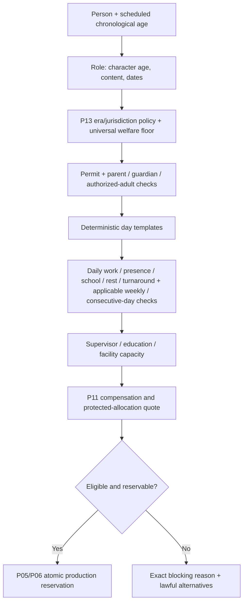

# Young Performers and Career Development

> **FUTURE PRODUCT RESEARCH AND IMPLEMENTATION-PLANNING CANDIDATE**
>
> **OWNER INTEREST CONFIRMED — SPECIFIC MECHANICS NOT YET APPROVED**
>
> **NOT SCHEDULED**
>
> **NOT AUTHORIZED FOR GAMEPLAY IMPLEMENTATION**
>
> **SUBJECT TO CURRENT OPS REVIEW AND ACCEPTED-BASE REFRESH**

Navigation: [Current Ops review](TALENT-ORIGINS-CURRENT-OPS-REVIEW.md) · [Crossover talent](CROSSOVER-TALENT-AND-SCREEN-CAREERS-DESIGN.md) · [Family/TV handoff](FAMILY-ENTERTAINMENT-BRAND-AND-TV-HANDOFF.md) · [Implementation plan/register](TALENT-ORIGINS-IMPLEMENTATION-PLAN-AND-REQUIREMENT-REGISTER.md)

## 1. Product proposition

The studio can discover an original fictional young performer, offer an age-appropriate opportunity with genuine participation, produce work only when protection and capacity are valid, remember every credit, and later respond when that person continues, pauses, studies, leaves entertainment, returns, or pursues adult or behind-the-camera work.

The emotional payoff comes from one continuous person and a history of choices—not from owning a child, revealing a prodigy score, filling a training bar, or engineering scandal. The studio is a producer/employer. It is not automatically the performer’s guardian, representative, school, bank, or career owner.

The design has two separable proofs:

1. **Supported production:** one young performer can lawfully and readably work on one project without making the player manage meals or homework.
2. **Longitudinal career:** the same `PersonId` can age, change suitability and ambitions, make independent adult choices, and retain history over decades.

The first does not prove the second.

---

## 2. Research boundary: present law, historical practice, and game policy

This is game-design research, not legal advice. Current rules identify the dimensions the game must respect; they do not supply one universal profile for every place and year from 1920–2040.

### 2.1 What current official sources establish

| Topic | Current evidence | Design-relevant fact | Limitation |
|---|---|---|---|
| Permits and role separation | [California DLSE permit guidance](https://www.dir.ca.gov/dlse/entertainment-work-permit.htm) | A minor's authorization and an employer's authorization/actions are distinct; a parent/guardian owns parts of the application process. | California administrative guidance, current snapshot only; exemptions and documents need implementation-time refresh. |
| Daily scheduling | [California 8 CCR §11760](https://www.dir.ca.gov/t8/11760.html), [DLSE hours chart](https://www.dir.ca.gov/dlse/MinorsSummaryCharts_HoursofWork.pdf) | Age-banded work, school, rest, on-site presence, early/late work, turnaround, and weekly limits interact. | DIR labels web regulations convenience copies; current California cannot be applied unchanged across the campaign. |
| Supervision | [8 CCR §11755.2](https://www.dir.ca.gov/t8/11755_2.html), [§11755.3](https://www.dir.ca.gov/t8/11755_3.html), [§11757](https://www.dir.ca.gov/t8/11757.html) | Qualified studio-teacher/welfare supervision has ratios, presence duties, and authority to refuse or remove a child from unsafe work; parent presence can separately matter. | Titles, ages, ratios, and exceptions are California-specific. |
| Protected earnings | [California Family Code §6752](https://leginfo.legislature.ca.gov/faces/codes_displaySection.xhtml?lawCode=FAM&sectionNum=6752.), [§6753](https://leginfo.legislature.ca.gov/faces/codes_displaySection.xhtml?lawCode=FAM&sectionNum=6753.) | For covered contracts, 15% of the same gross earnings is set aside and deposited for the minor; it remains restricted for the performer, ordinarily until majority/emancipation. | California only; exceptions such as some background work apply. It is not a universal rule or a second wage. |
| Majority and contracts | [California §§6500](https://leginfo.legislature.ca.gov/faces/codes_displaySection.xhtml?lawCode=FAM&sectionNum=6500.), [6710](https://leginfo.legislature.ca.gov/faces/codes_displaySection.xhtml?lawCode=FAM&sectionNum=6710.), [6751](https://leginfo.legislature.ca.gov/faces/codes_displaySection.xhtml?lawCode=FAM&sectionNum=6751.), [6753](https://leginfo.legislature.ca.gov/faces/codes_displaySection.xhtml?lawCode=FAM&sectionNum=6753.) | Majority changes legal capacity and trust access; some approved contracts do not disappear merely because they were made during minority. | California-specific. “All contracts terminate at 18” would be false. |
| Representation | [California Labor Code §1700.4](https://leginfo.legislature.ca.gov/faces/codes_displaySection.xhtml?lawCode=LAB&sectionNum=1700.4.), [§1700.5](https://leginfo.legislature.ca.gov/faces/codes_displaySection.xhtml?lawCode=LAB&sectionNum=1700.5.) | Procuring employment as a talent agency is a separately defined/licensed role. | Does not decide every possible dual-role arrangement; game separation remains the safer model. |
| Federal/state boundary | [US Department of Labor Field Operations Handbook §33e01](https://www.dol.gov/agencies/whd/field-operations-handbook/Chapter-33) | The cited federal child-labor provisions exempt specified performers, leaving state, safety, education, and contract law important. | Agency operational guidance, not a universal absence of law. |
| England licences and daily law | [GOV.UK overview](https://www.gov.uk/child-employment/performance-licences-for-children), [SI 2014/3309](https://www.legislation.gov.uk/uksi/2014/3309/pdfs/uksi_20143309_en.pdf) | Licensing is generally tied to compulsory school age and activity; daily place/performance limits, breaks, overnight rest, education, chaperones, records, and exceptions are separate. | England only; the statutory age boundary is not simply “under 18.” |
| UK variation | [Scotland guide](https://www.gov.scot/publications/young-performers-licensing-guide/pages/working-hour-limits-and-breaks/), [Wales guidance](https://www.gov.wales/sites/default/files/publications/2019-08/keeping-young-performers-safe-guidance-to-accompany-the-2015-child-performance_0.pdf) | Scotland and Wales have distinct rules; there is no single “UK profile.” | Guidance must be reconciled with controlling instruments; Northern Ireland was not fully researched. |

California's current ordinary school-day examples include different work/site/school/rest allowances for ages 9–15 and 16–17; England's current school-age rules have a different structure and endpoint. Those numbers are **SOURCE FACTS for those profiles**, not proposed universal balance values.

### 2.2 Why weekly averaging is not truthful

Current California and England rules constrain several daily dimensions independently. England permits a particular multi-week aggregation for education only under specified conditions; it does not turn work or presence limits into a weekly average. Therefore:

> A production that totals an acceptable number of hours over a week can still contain a prohibited day, insufficient turnaround, missing supervisor, or invalid school arrangement.

The game's coarser turn may stay readable, but production must validate a deterministic day-level eligibility/capacity plan underneath it. The UI does not need a minute-by-minute domestic simulator. It needs a trustworthy answer to “can this production pattern use this person on these dates, and if not, why?”

### 2.3 Historical policy recommendation

Official sources show material rule changes over time: England's 2014 Regulations came into force on 6 February 2015 and revoked prior England regulations, with DfE departmental advice published that date; Wales replaced earlier regimes in 2015; and California's protected-earnings/permit law has changed ([England SI 2014/3309](https://www.legislation.gov.uk/uksi/2014/3309/pdfs/uksi_20143309_en.pdf), [DfE guidance](https://www.gov.uk/government/publications/child-performance-and-activities-licensing-legislation), [Wales guidance](https://www.gov.wales/sites/default/files/publications/2019-08/keeping-young-performers-safe-guidance-to-accompany-the-2015-child-performance_0.pdf), [California 2003 legislative summary](https://www.dir.ca.gov/od_pub/2003Summary.htm)).

`YTH-004 — RECOMMENDED FIRST STAGE`: Project Studio should maintain a **consistent fictional welfare floor** across the campaign. This is a new product recommendation, not existing authority. P13-owned, versioned era/jurisdiction profiles may add historically researched eligibility and capacity constraints. Earlier eras never unlock profitable neglect, unsafe work, education evasion, withheld protected money, or absent supervision. The UI must label the floor as studio/game policy rather than claim exact historical law.

This avoids both errors: applying 2026 California everywhere and using historical misconduct as a management strategy.

---

## 3. The person model: facts that must remain distinct

| Concept | Meaning and owner | Public / hidden boundary | Forbidden shortcut |
|---|---|---|---|
| **Permanent identity** | P10 `PersonId`; one person across all phases and professions | Public stable identity | New adult `PersonId` at 18 |
| **Chronological age** | P14 lifecycle derives age from birth provenance at the current/scheduled time | Public exact or bounded precision according to evidence | Static age field or “youth” label |
| **Character age** | Authored role/property requirement, owned through casting/project/StoryProperty seams | Public role information | Assuming actor age equals character age |
| **Apparent playing range** | Observed, uncertain, time-sensitive casting interpretation | Public estimate with source/confidence; no body score | Exact hidden “looks age” truth |
| **Craft skill** | Existing P10 professional skill/development | Existing public/hidden law | Age-based automatic talent |
| **Role Fit** | P04 project- and role-specific evidence | Audition/test estimate, not exact truth | “Child actor” universal Fit |
| **Estimated potential** | Staff interpretation, if existing P10/P14 law exposes it | Never exact hidden potential or guaranteed prodigy label | Numeric destiny visible to player |
| **Screen Star Power** | P10 release-derived screen draw | Public screen-career fact | Famous guardian/family or youth label grants fame |
| **Career phase and interest** | P14 lifecycle/agency, based on time and choices | Readable phase and expressed preferences; private unknowns stay unknown | Inevitable decline/scandal |
| **Eligibility/capacity** | P05 production decision using P13 policy, scheduled dates, and resources | Exact eligible/blocked result and reasons | Weekly average or small adult model |

Physical or vocal change does not happen on one universal timetable. Longitudinal research supports individual variation, and one first-person career account describes voice and visible-age signals changing at different times ([Marceau et al.](https://pubmed.ncbi.nlm.nih.gov/21639623/), [2026 voice review](https://pubmed.ncbi.nlm.nih.gov/41916781/), [Tyler James Williams interview](https://au.variety.com/2024/awards/features/anthony-mackie-tyler-james-williams-child-stardom-14719/)). The correct design response is uncertain, periodically refreshed playing-range/role evidence—not a puberty meter, body score, or automatic penalty.

---

## 4. Discovery, participation, and agency

### 4.1 Discovery and audition

A young performer may be discovered through an open age-appropriate casting call, representative submission, school/community performance referral, earlier credited work, or a bounded cohort entry. Every new person is registered through P10; P14 may orchestrate a cohort but may not mint a second identity.

The offer/audition flow must:

- describe the fictional role, expected dates, preparation, travel, and recurring commitment in age-appropriate language;
- record participation by the policy-defined parent, guardian, or other authorized adult where required;
- keep any talent representative's negotiation/advice role separate from that adult's authorization and from the young performer's own assent;
- preserve the young person's affirmative participation and a non-punitive decline;
- avoid manipulative direction and adult-coded audition material;
- expose that selection is uncertain;
- assess role Fit without revealing hidden potential;
- avoid collecting or scoring sexual appeal, body attractiveness, scandal likelihood, or adult persona.

ScreenSkills guidance treats casting/licensing/welfare as production planning, and Jodie Foster's first-person directing account emphasizes clear language, respect, and preparation rather than emotional manipulation ([ScreenSkills casting researcher](https://www.screenskills.com/skills-checklists/childrens-tv/casting-department/casting-researcher-skills-childrens-tv/), [DGA interview](https://www.dga.org/craft/dgaq/issues/1602-spring-2016/dga-interview-jodie-foster)). NSPCC guidance supports seeking the child's own consent/voice in addition to parent/carer arrangements ([safer activities](https://learning.nspcc.org.uk/safeguarding-child-protection/safer-activities-events), [performing arts](https://learning.nspcc.org.uk/safeguarding-child-protection/for-performing-arts)). These are practice/safeguarding sources, not universal legal assent rules.

### 4.2 The studio's role

| Role | Responsibility in the abstraction | The studio does not acquire |
|---|---|---|
| Producer/employer | Makes the offer, pays compensation, provides compliant production and support, records credit | Guardianship or ownership of the person |
| Guardian/authorized adult | Supplies legally required consent/participation and represents welfare within the applicable policy | A studio job or automatic agent role |
| Qualified supervisor/teacher/chaperone | Supplies education/welfare capacity and can stop invalid/unsafe work | Acting-coach output or productivity buff |
| Talent representative | Negotiates or advises under the future market/contract interface | Production authority or rights ownership |
| Performer | Participates, develops preferences and career evidence, may accept/decline/pause/leave | A permanent obligation to the discovering studio |

---

## 5. Production and welfare model

### 5.1 Eligibility pipeline



The authoritative result belongs to production scheduling; the client displays it. Merely opening or comparing plans cannot mutate gameplay or consume RNG.

### 5.2 Routine automation and meaningful decisions

When policy, support capacity, and the production pattern are valid, routine permits, supervision assignment, schooling windows, breaks, and recordkeeping may resolve automatically as one production plan. The studio head decides:

- whether this is the right performer and role;
- whether the slate can support youth work at all;
- which lawful production pattern to use;
- whether to reserve qualified supervision/education capacity;
- whether to move dates, reduce or redistribute scenes, cast another person, or defer;
- whether to accept the performer's refusal or career priority;
- whether required parent/guardian/consent-authority approval is present; the studio cannot supply or override it.

The studio head does **not** click individual homework, meals, bathroom breaks, or sleep. Those requirements reduce usable capacity and appear in explanations; they are not chores or bonuses.

### 5.3 Exact refusal and alternatives

A blocked result must name the smallest authoritative cause, for example:

- `scheduled day exceeds the applicable work limit`;
- `applicable weekly maximum would be exceeded even though every proposed day is otherwise valid`;
- `required education block cannot fit this production template`;
- `qualified supervisor capacity already reserved`;
- `dismissal-to-next-call turnaround is too short`;
- `required permit or licence is invalid for these dates`;
- `required parent/guardian/consent-authority approval or participation is absent`;
- `outside recurring-series commitment conflicts`;
- `performer no longer fits the role's playing-age evidence`;
- `performer declined the proposed work`.

The explanation then offers only lawful alternatives: a shorter day template, different shooting dates, split scenes, added valid supervision/education capacity, another performer, a role rewrite through the proper creative owner, or deferral. Studio-added capacity can solve only a resource shortage; it can never replace performer assent or required parent/guardian/consent-authority approval. There is no “accept risk,” “pay fine,” “skip school,” “hide hours,” or cheaper neglect route.

### 5.4 Capacity, not compliance theatre

Supervision and education are real bounded production resources. Proper arrangement may be automated, but concurrent youth productions can exhaust them. The same applicable law constrains rivals. The system should avoid a dedicated babysitting building unless future P09 evidence proves a physical facility necessary; named qualified people/capacity and production reservations are the smaller truthful extension.

---

## 6. Compensation and protected earnings

P11 remains the only authority for money, payroll, cash, obligations, and explanation.

`YTH-007 — READY AFTER NAMED DEPENDENCY`: after accepted P11 settlement authority, a protected allocation is a decomposition of the same compensation settlement:

```text
gross performer compensation = remaining settlement components
                             + performer-owned restricted allocation

studio compensation charge occurs once
restricted allocation never becomes studio cash or spendable studio credit
```

“Remaining settlement components” makes no claim that every non-trust dollar is legally unrestricted; applicable custody, fiduciary, tax, fee and payment rules still govern it. Restriction concerns access to the allocated money, not whether it belongs to the performer.

For a **paper illustration only** of a currently covered California case, gross compensation of 1,000 and a 15% statutory set-aside would produce one 1,000 gross compensation obligation and aggregate cash reduction. Its settlement legs total 1,000: 150 goes to the performer's restricted account and 850 follows the other applicable performer-owned settlement components. This is not a claim that the 850 is legally unrestricted. Taxes, fees, exceptions, timing, fiduciary duties and other obligations are deliberately omitted. It is not a universal formula and does not authorize balance values.

Acceptance must reconcile:

- the P10/P12 service/contract obligation;
- one P11 gross compensation/payroll charge;
- the policy/version that required the protected allocation;
- an exact performer-owned restricted amount and deposit/settlement receipt;
- cash movement with no duplicate 15% cost and no later studio withdrawal;
- truthful absence when a researched policy has no such rule.

Calling every profile “Coogan” would overstate California's reach. The cross-era welfare floor needs a neutral product name chosen later.

---

## 7. Development ownership

### 7.1 What already exists

At accepted TypeScript `2753e18...`, P10 owns professional skill/development and `src/core/development.ts::developTalent` provides work-derived development tied to real released work. P04 owns role Fit/audition evidence. Those systems must be measured before adding another growth loop.

### 7.2 Three activities with different purposes

| Activity | Purpose | First-stage consequence | Owner |
|---|---|---|---|
| **Required education** | Welfare and continued education | Consumes production time/capacity; no acting bonus | P05 capacity under P13 policy |
| **Role preparation** | Readiness for one audition/role/production | May improve or clarify only that project's readiness/evidence; no guaranteed permanent skill | P04/P05, with P10 evidence projection |
| **Optional long-term craft development** | Career investment outside a specific required production | **Not in the first youth stage**; separate Owner decision after existing work development is evaluated | If approved, P10 skill/development with P14 mentorship context |

Union conservatory material documents optional acting, script, audition, and camera classes but supplies no universal conversion rate from coaching to skill ([SAG-AFTRA](https://www.sagaftra.org/leading-next-generation)). Therefore no training bar, “prodigy multiplier,” or unnoticed coaching prerequisite is justified.

Mentorship may later be meaningful as a professional relationship and opportunity context under P14. It must not be a hidden buff, compulsory pairing, or substitute guardian.

---

## 8. Aging, recurring work, and adulthood

### 8.1 Aging during a project

Eligibility is evaluated at the scheduled work date, not only at casting. If a birthday crosses an applicable band during production, remaining day templates are revalidated. This does not rewrite completed days or past credits. A playing-range observation can also change independently of chronological age and may trigger a casting/creative warning rather than an automatic removal.

The production may respond through valid schedule changes, scene redistribution, a creative rewrite/recast decision, or acceptance of the existing evidence if still suitable. The game must never retroactively declare completed work illegal because a later profile changed.

### 8.2 Between seasons

Recurring series require fresh P18 season/order and P10/P12 availability decisions. The actor and character are separate:

- the story may age the character;
- the performer may still fit, may fit differently, or may not want the same role;
- another actor may be lawfully cast through a real recast/Story DNA decision;
- the series may conclude, change format, or proceed without the character;
- audience familiarity affects that proposition only through P07's bounded law.

No renewal is automatic because a previous season succeeded.

### 8.3 Transition to adult decision-making

At the applicable majority/capacity transition:

1. The `PersonId`, birth provenance, credits, screen experience, relationships, awards, and history remain unchanged.
2. Future eligibility stops using minor-only protections only where the applicable policy says so; any studio welfare commitments already promised are honored.
3. A new agreement or renewal that requires assent uses the performer's affirmative adult choice and the ordinary P10/P12 contract process.
4. Existing valid obligations and producer-held options are exercised, waived, expired or otherwise resolved under their actual terms; they are not silently extended or falsely cancelled.
5. Protected funds remain the performer's money under the applicable settlement law.
6. The person may change representative, pause, study, leave, return, change medium, or develop a behind-the-camera profession through real evidence.

“No automatic new agreement at adulthood” is a recommended agency safeguard. It is not a claim that every minor-made contract or optional-extension provision vanishes at 18.

### 8.4 Legitimate career shapes

First-person and institutional histories establish that childhood work can lead to directing/producing, a career pause, a voluntary non-entertainment life, writing, or a later return ([Ron Howard oral history](https://interviews.televisionacademy.com/interviews/ron-howard), [DGA/Jodie Foster](https://www.dga.org/craft/dgaq/issues/1602-spring-2016/dga-interview-jodie-foster), [TIME/Jennette McCurdy](https://time.com/6203826/jennette-mccurdy-book-interview/), [Guardian/Salvatore Cascio](https://www.theguardian.com/film/2013/dec/02/cinema-paradiso-25th-anniversary-salvatore-cascio), [SAG-AFTRA/Ke Huy Quan](https://www.sagaftra.org/top-actor-performances-honored-union%E2%80%99s-star-studded-celebration)). These are individual examples with severe survivorship/selection limits. They justify possibilities, not probabilities or an inevitable child-star decline.

Typecasting should therefore be a project/audience **role association** supported by real credits and current evidence. It is not a permanent penalty, trauma roll, or scandal generator.

---

## 9. Honest first implementation range

`YTH-012 — OWNER DECISION REQUIRED`

### Recommended first band: ages 14–17 at scheduled work

This band is intentionally narrower than the eventual vision. It can honestly prove:

- two materially different older-minor schedule/education contexts in the researched California example;
- permits, policy-defined parent/guardian/authorized-adult participation, separately identified talent representation, supervision, education, rest, and protected-compensation integration;
- character age versus chronological age and playing-range evidence;
- a birthday/eligibility-band transition during production;
- the transition to adult choice at 18;
- age-appropriate world/UI presentation without pretending a scaled adult represents a younger child.

The research lane found **9–17** to be a defensible broader first band because age nine begins a comparatively stable school-age band in the current California, England, and Scotland examples. The integrated recommendation nevertheless starts at 14 because ages 9–13 materially broaden casting language, presentation, daily templates, parent/supervision patterns, and audience/context safeguards without answering a new architectural question. This is a product-scope recommendation, not a legal boundary.

### Deferred with named return conditions

| Deferred range | Return only when all are designed and evidenced |
|---|---|
| **Ages 9–13** | Age-appropriate roles/auditions; distinct daily templates and school/supervision capacity; suitable models, proportions, wardrobe, animation, voice presentation and navigation; guardian context; paper fixtures across selected jurisdictions. |
| **Under 9** | Additional age bands, ratios, presence/rest rules, communication/assent approach, production patterns, presentation, and specialist review. |
| **Infants** | Infant-specific scheduling, medical/welfare/supervision and world presentation; explicit separate product decision. |

Younger careers remain part of the Owner's destination. They are deferred, not silently excluded or treated as smaller adults.

---

## 10. World and interface presentation

A valid data row is insufficient. The first youth production needs:

- an age-appropriate original fictional character and script context;
- age-appropriate performer model, body proportions, wardrobe, hair, animation, voice treatment, blocking, and camera presentation;
- no body, sex appeal, attractiveness, substance, scandal, or adult-romance scoring;
- readable guardian/authorized-adult and supervisor/education status without implying studio ownership;
- a casting card that separates chronological age, character age, playing range, craft evidence, Fit observation, availability, and protection capacity;
- production warnings that explain constraints in plain language;
- accessible controller/keyboard navigation and focus, readable at target resolution;
- history/profile presentation that grows with the person instead of replacing the profile at adulthood.

The accepted Unity baseline is `c4c65db...`. Later profile/roster work at `01e0898...` is **UNSEALED FORWARD EVIDENCE** only and must be refreshed before any client plan. A smaller adult model, an age number, or a child-coded wardrobe on an adult animation rig does not prove this feature.

---

## 11. Fictional career fixtures

### 11.1 Nia Sato — supported work, pause, adult reinvention

Nia is a fictional 15-year-old performer discovered through an open casting call in 1986. Her guardian participates, Nia assents, and the dossier shows theatre experience but uncertain camera timing. The player chooses a supporting family-film role and a lawful production template. One attempted schedule is refused because school and presence limits cannot both fit; moving two scenes produces a valid plan. P11 records one gross compensation obligation and, **if the selected versioned policy requires it**, a performer-owned restricted allocation; otherwise the allocation's absence is explicit. No current California rule is projected backward merely from the year.

At 16, Nia accepts a second film but declines a recurring television audition to prioritize school. At 18 she is offered an automatic-looking extension; the system instead requires an adult decision. She pauses acting. Her credits and Star Power do not disappear, and no failure/scandal event is invented. At 25 she returns as an actor in a small adult drama. At 33 she begins separately evidenced directing work. Acting fame does not grant directing skill; the same `PersonId` and history connect every phase.

### 11.2 Ellis Ward — one season and a voluntary exit

Ellis is a fictional 17-year-old musician cast in a recurring supporting role after a role-specific test. He works within one supported season. Between seasons his voice, interests, and playing-range evidence change; the character could be rewritten, recast, or retired. Ellis declines renewal and studies engineering. The show handles his departure through P18 story/contract law. Years later a documentary interview credit may occur only if actually simulated. His original season remains in studio history; the game never manufactures a comeback.

Neither fixture is a guaranteed star or a tragedy template.

---

## 12. Stable young-performer requirements

| ID | Requirement | Status | Owner / verified source | Public/hidden, persistence, migration, consumers, refresh |
|---|---|---|---|---|
| YTH-001 | One P10 `PersonId` survives childhood, adulthood, employer and profession changes. | **EXISTING AUTHORITY** | P10; P14 lifecycle direction | Identity/credits public and durable. Old saves retain existing people. Every roster/history/TV consumer. Final P10/P14 refresh. |
| YTH-002 | Derive chronological age from birth provenance; keep character age and playing range separate. | **READY AFTER NAMED DEPENDENCY** | P14 lifecycle + P04 role facts | Age precision follows evidence; playing range is uncertain, not hidden body truth. No fabricated birth history. Casting/production/profile consume. |
| YTH-003 | Require voluntary, age-appropriate participation; keep performer assent, policy-defined parent/guardian/authorized-adult approval, and talent representation distinct. | **RECOMMENDED FIRST STAGE** | P04/P10/P12 extension | Each applicable result/role is readable; sensitive/private detail withheld. Persist offers/decisions, not inferred motives. Casting/history consume. Policy refresh. |
| YTH-004 | Enforce mandatory baseline welfare and applicable policy. | **RECOMMENDED FIRST STAGE** | P13 policy + P05 production | Eligibility/reasons public; rule internals versioned. Old saves gain future-facing policy only, no fake past compliance. Production/rivals consume. |
| YTH-005 | Validate deterministic daily work/presence/school/rest/turnaround plus applicable weekly/consecutive-day caps beneath the turn; a weekly total never relaxes a prohibited day. | **RECOMMENDED FIRST STAGE** | P05/P06 extension; no current minor scheduler | Result/explanation public; day plan authoritative and persisted only as needed for reservations/audit. No retrospective illegality. Final scheduler refresh. |
| YTH-006 | Treat qualified supervision/education as bounded capacity with routine automation. | **RECOMMENDED FIRST STAGE** | P05, possible P09 capacity, P13 policy | Capacity and blocker visible; no child-welfare private detail. Persist reservation/receipt. Slate/production/rivals consume. |
| YTH-007 | Reconcile protected earnings once through P11. | **READY AFTER NAMED DEPENDENCY** | P11 quote/obligation/ledger | Gross, allocation, policy, and receipt explainable; performer owns restricted money. No old-save backcharge. Payroll/cash/history consume. P11 refresh. |
| YTH-008 | Separate welfare education, role preparation, and optional long-term development. | **RECOMMENDED FIRST STAGE** | P05/P04/P10 | Education never grants skill; role prep is project-specific; no new hidden potential. Development/profile consume. |
| YTH-009 | Do not add persistent coaching/training without a separate decision. | **OWNER DECISION REQUIRED** | If approved, P10 development + P14 mentorship | No migration field or prerequisite now. |
| YTH-010 | Revalidate remaining work when age/policy band changes during production. | **READY AFTER NAMED DEPENDENCY** | P14 time/age + P05 reservations | Scheduled-date age derived; completed work immutable. Production/contract/profile consume. |
| YTH-011 | Require affirmative adult choice for a new agreement or renewal that requires assent, without falsely voiding surviving terms or producer-held options. | **READY AFTER NAMED DEPENDENCY** | P10/P12/P14 | Choice and applicable terms readable; history permanent. No retroactive cancellation. Contracts/TV/history consume. |
| YTH-012 | Recommend 14–17 for the first implementation; younger bands return on named evidence. | **OWNER DECISION REQUIRED** | Scope decision | UI states the approved supported range; no generated unsupported minors. Migration creates none. World/casting/production consume. |
| YTH-013 | Allow pause, exit, education priority, return, adult acting, and behind-camera paths. | **READY AFTER NAMED DEPENDENCY** | P14 lifecycle; P10 profession/history; P18 for series | Expressed choices visible; hidden exact destiny forbidden. Persist real events only. History/Wire/roster consume. Music partnerships remain under FAM-009/FAM-015 and their separate decision. |
| YTH-014 | Preserve age-appropriate world/UI presentation. | **RECOMMENDED FIRST STAGE** | Unity client consumes TypeScript truth | Public professional presentation only. No gameplay truth authored in client. Visual/accessibility proof required after accepted-base refresh. |
| YTH-015 | Reject body/sexual-appeal scoring, scandal generation, neglect optimization, guaranteed prodigy/decline, domestic chores, and studio ownership. | **REJECTED DESIGN ALTERNATIVE** | Owner safeguards; conflicts with P10 agency | No facts, migrations, or consumers. |

No detailed future type or save version is frozen. The [implementation register](TALENT-ORIGINS-IMPLEMENTATION-PLAN-AND-REQUIREMENT-REGISTER.md) supplies the cross-stage acceptance and rollback boundaries.

---

## 13. Proportionate future proof

Paper/design fixtures now; executable tests and visual evidence only under later authorization.

### Legal/policy evidence

- a supported production cites the exact rule profile, effective interval, jurisdiction, age at scheduled work, supervisor/education capacity, and daily template;
- a blocked day identifies the violated dimension and offers only lawful alternatives;
- protected compensation reconciles to one gross payment and performer-owned allocation;
- a policy change applies prospectively and does not fabricate historical compliance.

### Simulation correctness

- one `PersonId` through every age/profession/employer transition;
- age changes during a project and between seasons;
- no automatic contract extension or rights loss at adulthood;
- voluntary pause/exit without deleted history;
- old saves receive no invented childhood credits, guardians, outside careers, or welfare events;
- rivals use identical capacity and protection rules;
- inspection consumes no mutation or RNG.

### Visual clarity and accessibility

- actual age-appropriate performer/role/world presentation;
- exact protection status and blocking reasons readable without legal jargon;
- input/focus/navigation proof at the accepted client baseline;
- profile/history continuity across the adult transition.

### Player enjoyment

- the player makes casting, scheduling, support, and slate tradeoffs rather than repetitive paperwork;
- valid routine arrangements auto-resolve;
- refusal and alternate plans are understandable;
- continuing, pausing, and leaving are all emotionally legible career outcomes.

Passing one category does not prove another.

---

## 14. Source register

| Source | Publisher / date | Locator and supported claim | Limitation | Confidence |
|---|---|---|---|---|
| [Entertainment Work Permit](https://www.dir.ca.gov/dlse/entertainment-work-permit.htm) | California DLSE; page dated February 2025, accessed 2026-09-06 | Registration/application sections: minor and employer processes, duration/training details | Administrative guidance; California/current | High shape |
| [8 CCR §11760](https://www.dir.ca.gov/t8/11760.html), [DLSE summary chart](https://www.dir.ca.gov/dlse/MinorsSummaryCharts_HoursofWork.pdf) | California DIR/DLSE; convenience text/current chart | Age bands; work, site, education, rest, turnaround and exceptions | Web copy currency disclaimer; chart simplifies | High structure; refresh exact text |
| [§11755.2](https://www.dir.ca.gov/t8/11755_2.html), [§11755.3](https://www.dir.ca.gov/t8/11755_3.html), [§11757](https://www.dir.ca.gov/t8/11757.html) | California DIR; rules originated 1986/renumbered 1997 | Employer-provided teacher, authority, ratios, parent presence | California-specific; exact ratios refresh | High role distinction |
| [Family Code §6752](https://leginfo.legislature.ca.gov/faces/codes_displaySection.xhtml?lawCode=FAM&sectionNum=6752.), [§6753](https://leginfo.legislature.ca.gov/faces/codes_displaySection.xhtml?lawCode=FAM&sectionNum=6753.) | California Legislative Information; §6752 effective 2020 / §6753 effective 2004 | 15% covered gross set-aside, trust, access at majority/emancipation | Exceptions; not universal | High |
| [Family Code §§6500](https://leginfo.legislature.ca.gov/faces/codes_displaySection.xhtml?lawCode=FAM&sectionNum=6500.), [6710](https://leginfo.legislature.ca.gov/faces/codes_displaySection.xhtml?lawCode=FAM&sectionNum=6710.), [6751](https://leginfo.legislature.ca.gov/faces/codes_displaySection.xhtml?lawCode=FAM&sectionNum=6751.) | California Legislative Information; operative/effective 1994–2000 | Majority, general disaffirmance, approved-contract exception | California-specific; contract facts vary | High |
| [Labor Code §1700.4](https://leginfo.legislature.ca.gov/faces/codes_displaySection.xhtml?lawCode=LAB&sectionNum=1700.4.), [§1700.5](https://leginfo.legislature.ca.gov/faces/codes_displaySection.xhtml?lawCode=LAB&sectionNum=1700.5.) | California Legislative Information; amended 1986/1989 | Talent-agency definition/licence | Does not decide every dual-role situation | High distinction |
| [FOH Chapter 33 §33e01](https://www.dol.gov/agencies/whd/field-operations-handbook/Chapter-33) | US DOL Wage and Hour Division; modernized 2016 / section revised 2017 | Federal performer exemption and importance of other law | Enforcement guidance, not statute | High bounded claim |
| [Performance licences](https://www.gov.uk/child-employment/performance-licences-for-children), [DfE advice](https://www.gov.uk/government/publications/child-performance-and-activities-licensing-legislation) | GOV.UK / Department for Education; guidance published 2015, current overview accessed 2026-09-06 | Council licence, chaperone, compulsory-school-age and exceptions | England; guidance not controlling law | High shape |
| [SI 2014/3309](https://www.legislation.gov.uk/uksi/2014/3309/pdfs/uksi_20143309_en.pdf) | UK legislation; made 2014-12-15, in force 2015-02-06 | regs. 13–29 / schedules 2–3: education, chaperone, daily limits, rest, records | England; amendments must be refreshed | High |
| [Scotland working limits](https://www.gov.scot/publications/young-performers-licensing-guide/pages/working-hour-limits-and-breaks/) | Scottish Government; updated 2026-07-31 | Different age/hour/break framework | Guidance rather than complete controlling instrument | High variation claim |
| [Wales guidance](https://www.gov.wales/sites/default/files/publications/2019-08/keeping-young-performers-safe-guidance-to-accompany-the-2015-child-performance_0.pdf) | Welsh Government; October 2015 | Welsh 2015 replacement regime and school-age scope | Needs current legislative refresh | High historical distinction |
| [2003 legislative summary](https://www.dir.ca.gov/od_pub/2003Summary.htm) | California DIR; 2003 | SB 210 summary: protected-earnings and permit handling changed | Historical agency summary, not the current controlling text or a full chronology | High evidence of change |
| [Children's-TV line producer](https://www.screenskills.com/skills-checklists/childrens-tv/production-department/line-producer-skills-childrens-tv/), [casting researcher](https://www.screenskills.com/skills-checklists/childrens-tv/casting-department/casting-researcher-skills-childrens-tv/) | ScreenSkills; live pages, accessed 2026-09-06 | Planning time/capacity, licensing, tutoring, welfare, age-appropriate casting | UK competency guidance; indexed text where direct page access was restricted | Medium-high |
| [The Honest Truth](https://www.dga.org/craft/dgaq/issues/1602-spring-2016/dga-interview-jodie-foster) | DGA Quarterly, Margy Rochlin; Spring 2016 | Clear child direction, preparation, career continuity | Exceptional practitioner | Medium-high |
| [Safer activities](https://learning.nspcc.org.uk/safeguarding-child-protection/safer-activities-events), [performing arts safeguarding](https://learning.nspcc.org.uk/safeguarding-child-protection/for-performing-arts) | NSPCC Learning; updated 2026-09-01 / 2019-09-30 | Child consent/alternatives, parent information, age-appropriate activity and hearing children's views | UK safeguarding practice, not a universal entertainment statute | Medium-high |
| [Leading the Next Generation](https://www.sagaftra.org/leading-next-generation) | SAG-AFTRA; 2019-04-23 | Optional conservatory offers technique, script, audition and camera classes | Reports offerings, not causal growth or a universal training law | High existence / low quantitative effect |
| [Individual Differences in Puberty](https://pubmed.ncbi.nlm.nih.gov/21639623/), [Voice Change review](https://pubmed.ncbi.nlm.nih.gov/41916781/) | Marceau et al., *Developmental Psychology*, 2011; Keshtkarhesamabadi et al., *Journal of Voice*, online 2026 | Individual timing/tempo and voice maturation variability | Limited samples; not casting rules | High variability / medium application |
| [Anthony Mackie and Tyler James Williams](https://au.variety.com/2024/awards/features/anthony-mackie-tyler-james-williams-child-stardom-14719/) | *Variety*, Selome Hailu; 2024-06-10 | Williams's account of voice change, visible-age lag, voice work and representative handoff | One successful survivor; not a typical timetable | Medium |
| [Ron Howard oral history](https://interviews.televisionacademy.com/interviews/ron-howard) | Television Academy Foundation; interviewed 2006-10-18 | Child auditions/series work, early directing interest and later directing | Exceptional career; no general transition rate | High for individual history |
| [Jennette McCurdy interview](https://time.com/6203826/jennette-mccurdy-book-interview/), [Salvatore Cascio interview](https://www.theguardian.com/film/2013/dec/02/cinema-paradiso-25th-anniversary-salvatore-cascio), [Ke Huy Quan report](https://www.sagaftra.org/top-actor-performances-honored-union%E2%80%99s-star-studded-celebration) | *TIME*, Sam Lansky, 2022-08-04; *Guardian*, Laura Barnett, 2013-12-02; SAG-AFTRA, 2023-02-26 | Voluntary exit/writing, non-acting career, long pause and return | Individual/survivor accounts; never a scandal or probability model | Medium-high for stated paths |
| [2026 TV/Theatrical Contracts](https://www.sagaftra.org/contracts-industry-resources/contracts/2026-tvtheatrical-contracts) | SAG-AFTRA; ratified 2026-06-04, effective 2026-07-01–2030-06-30 | Public summary of young-performer and series provisions | Covered contemporary US work; summary, not full agreement | High existence / medium mechanics |

The stop condition is satisfied for planning. Before implementation, refresh operative law for the actually supported jurisdictions/eras, obtain complete applicable agreements, decide the age band and day-plan representation, and preserve the evidence gap: no source justifies exact potential, guaranteed growth, a typecasting penalty, or a child-star outcome rate.
