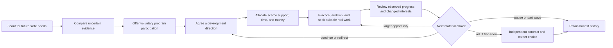
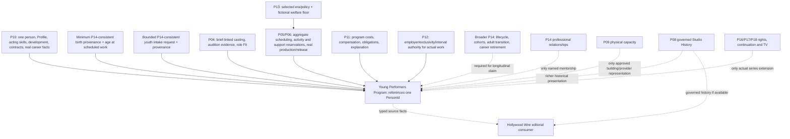

# Young Performers Program — Design and Implementation-Planning Addendum

> **OWNER-REQUESTED PRODUCT DISCOVERY**
>
> **YOUNG PERFORMERS PROGRAM — RESEARCH AND IMPLEMENTATION-PLANNING ADDENDUM**
>
> **SPECIFIC MECHANICS NOT YET APPROVED**
>
> **UNSCHEDULED**
>
> **GAMEPLAY IMPLEMENTATION NOT AUTHORIZED**
>
> **CURRENT OPS REVIEW AND ACCEPTED-BASE REFRESH REQUIRED**

Navigation: [Talent Origins Current Ops hub](TALENT-ORIGINS-CURRENT-OPS-REVIEW.md) · [Young-performer foundation](YOUNG-PERFORMERS-AND-CAREER-DEVELOPMENT-DESIGN.md) · [Talent Origins implementation register](TALENT-ORIGINS-IMPLEMENTATION-PLAN-AND-REQUIREMENT-REGISTER.md) · [Family/TV handoff](FAMILY-ENTERTAINMENT-BRAND-AND-TV-HANDOFF.md) · [Talent pathways integration plan](TALENT-DEVELOPMENT-OUTREACH-AND-CASTING-INTEGRATION-PLAN.md)

Exact inspected five-document package: [`2980bcbd1367e23575a51008a011143e3a0d9653`](https://github.com/HSpector1/The-Movies/tree/2980bcbd1367e23575a51008a011143e3a0d9653/docs/design/future-talent). That documentation revision preserves the originally reviewed research commit `207d06d4d3b6c665bd532bcbd3982d1bf0cb654f` and records Current Ops' five targeted clarifications. This addendum is based on that compatible documentation descendant on the isolated branch `docs/young-performers-program-research-01`. Its underlying accepted TypeScript product baseline is `2753e18ba8fb5f65b936c22cde9531646fecc6cd`; planning commits named below remain planning, not shipped capability.

This is one focused addendum, not a replacement research package, package number, implementation order, or approval. It qualifies the older package's deferral of persistent coaching by comparing concrete options now that the Owner has requested academy-style product discovery. It does not silently adopt any independent-review suggestion or change the controlling Current Ops clarifications.

Consequential statements are marked or framed as **SOURCE FACT**, **CURRENT CODE FACT**, **EXISTING PROJECT DIRECTION**, **INFERENCE**, **NEW RECOMMENDATION**, or **GAME-DESIGN HYPOTHESIS**. Real programs and games are references only. Every person, studio, title, and program used in design fixtures is fictional.

---

## 1. Executive recommendation and player fantasy

The right translation of a sports academy is not a school building or a list of children. It is a repeating chain of consequential studio choices:



**NEW RECOMMENDATION — choose development model B:** add costed, bounded coaching through P10's one professional-skill/development authority, and combine it with auditions and real, age-appropriate production opportunities. Private work may improve craft or knowledge under an explicit rule, but it creates no public credit, `FilmResult`, revenue, genre experience, work-history count, or Star Power. Real released work continues to use accepted production, release, career-event, and work-derived-development law exactly once.

This is the smallest option that makes the Owner's academy fantasy real. “Opportunities only” leaves the studio unable to invest directly in development. A named-coach/mentorship simulation adds relationships, personalities, hiring, and another management surface before the core loop proves its value.

The fantasy is successful when the player can say:

> I found a promising but uncertain person for a need my future films might have. I could not support everyone, so I chose where to invest. Coaching and real opportunities produced different kinds of evidence and progress. The person sometimes wanted something different. Years later I can see the work we actually did together without the studio claiming ownership of the rest of their life.

That outcome permits a major star, a valuable supporting career, a pause, a different profession, or a voluntary departure. It never promises stardom. Ordinary non-program casting remains a competitive strategy.

### 1.1 The product in one screenful

The fictional working name **Northlight Young Performers** represents a studio program, not a licensed brand and not a claim about Disney. Joining means a time-bounded support agreement: access to specified coaching, assessment, and opportunity consideration subject to capacity. It is not employment, casting, representation, rights transfer, guardianship, lifetime exclusivity, or a guaranteed role.

The smallest satisfying play loop therefore needs all of these together:

- a slate-linked scouting brief and uncertain report;
- a real choice among people the studio cannot all support;
- a voluntary, bounded participation agreement;
- one costed development focus that can produce limited permanent craft growth;
- one audition or screen exercise that changes evidence rather than craft;
- a suitable actual role governed by real production and release law;
- a review that explains progress, stalled progress, current interests, and next options;
- a permanent Profile/program-history link that survives departure.

An intake-only interface is useful foundation work, but it is not the first meaningful academy experience. A 16–17-year-old fixture can validate a bounded mechanism; it cannot be advertised as the complete childhood-to-adulthood destination.

---

## 2. What the sports comparisons actually support

Official first-party feature descriptions are strong evidence that a named system existed or was announced for a named version. They are not independent usability studies, balance evidence, or proof that a sports mechanic transfers safely to film.

### 2.1 Version and shipment discipline

| Comparator | Verified status | What it is—and is not |
|---|---|---|
| **EA SPORTS FC 25 Manager Career** | EA's 7 August 2024 deep dive describes launch-facing Development Plans 2.0 and Youth Academy additions; the title shipped 27 September 2024. The Youth Academy section is not marked with the article's separate post-launch disclaimer. | A football youth-academy comparator with scouting, roles, and playable academy matches. It is not evidence for performer contracts, welfare, or film production. |
| **EA SPORTS FC 26 Manager Career** | EA's 1 August 2025 deep dive describes the shipped 2025 edition's scouting, youth, contract, and quality-of-life changes. | A later football-career comparator. Its scout reports “consider” potential; that does not prove a hidden-truth range model suitable here. |
| **EA SPORTS NHL 25 Franchise Mode** | EA's 20 September 2024 deep dive preceded the shipped 4 October 2024 title. | Roster, conversation, contract, history, and navigation evidence. The cited article does **not** document a FIFA-style academy or junior-development pipeline. |
| **F1 Manager 2024** | Frontier's 26 June 2024 feature introduced Affiliate Drivers before the 23 July release; the 4 September Update 1.7 page says the update is available and contains an AI-team affiliate-driver fix. | A distinct development/affiliate role with continued outside competition and limited top-level opportunities. It is not a child-welfare model. |
| **Football Manager 2023/2024** | Sports Interactive's dated feature articles identify FM23 recruitment and FM24 Console training/mentoring behavior; official release notices followed. | Supplementary evidence for staged knowledge, need-led briefs, delegation, and workload reduction—not permission to turn people into transfer inventory. |

### 2.2 Retained patterns: adopt the loop, change the law

| Retained comparison | **VERIFIED SOURCE BEHAVIOR** | **WHY IT IS USEFUL** | **OUR PROPOSED TRANSLATION** | **WHAT WE REJECT OR CHANGE** |
|---|---|---|---|---|
| Need-led scouting | FC 25 can target up to four positions and three roles for needs now or in the future. FM23 Recruitment Focuses accept criteria and consume more scouts at higher priority. | Connects discovery to an organizational plan and makes attention scarce. | Issue a brief from real planned-slate needs: age-appropriate role family, relevant dates, skill evidence sought, development horizon, and support ceiling. | No position stereotypes, geographic talent stereotypes, transfer language, or guarantee that the search finds a supportable person. |
| Uncertain reports | FM23 knowledge advances through None, Minimal, Reasonable, and Extensive; reports can be ongoing, stopped, complete, or stale. FC 26 adds longer-horizon potential consideration to scout reports. | Lets evidence improve while decisions remain uncertain. | Show sources, observations, confidence, freshness, and role-relative ranges. Auditions and exercises can narrow knowledge without changing actual craft. | No exact potential value, “wonderkid” destiny label, or claim that FC 26 itself uses uncertainty bands. |
| Development direction | FC 25 Development Plans focus attributes associated with a Player Role. F1 affiliates can receive a development plan focused on weaker areas. | The player chooses a direction rather than waiting for generic growth. | Choose one broad acting focus mapped to existing P10 acting dimensions; separately track project readiness and evidence quality. | No single OVR graduation threshold, potential unlock, flat facility buff, or progress merely for selecting a focus. |
| Meaningful opportunity | FC 25 adds Youth Academy Rush; F1 affiliates can receive a gated FP1 practice opportunity while continuing in F2/F3. | Practice and progressively larger responsibility are legible parts of development. | Private scene work, audition, supporting part, ensemble part, then larger or recurring work each answer a different question. Actual released roles use real film law. | No fake youth league, transferable “loan,” replayable practice match, tournament-win windfall, fabricated credit, or fame for private work. |
| Participation distinct from main role | F1 Manager permits an affiliate role distinct from first, second, or reserve driver, while affiliates continue racing elsewhere. | Demonstrates that development affiliation need not equal the primary job. | Program participation is a separate voluntary agreement that may coexist with outside opportunities and later project employment. | Do not copy the ten-person cap, reserve-list ownership, transfer rights, or team control of outside careers. |
| Preferences and departure | NHL 25 players may reject a requested position/play-style change; FC 26 says some players will not renew because they want other opportunities. | Makes the prospect a participant in the plan rather than an owned resource. | A performer can accept, adjust, defer, pause, or decline a direction or later offer; adult contracting uses ordinary authority. | NHL says younger players are more likely to take advice. That youth-obedience/growth assumption is explicitly rejected. No persuasion minigame or coerced promised role. |
| History and attachment | NHL 25 game logs and split statistics support recent/season evaluation, while its player-card awards history spans early to later Franchise seasons; FC 26 exposes prior-season statistics in selected simulated leagues. | Longitudinal evidence makes an individual career memorable. | Link the program overview to one persistent Profile, actual projects, frozen credits, progress events, and a durable alumni view. | No second full Roster, invented awards, gossip feed, or claim that the studio caused every later success. |
| Exception-driven workload | FC 25 surfaces tasks; FM23 limits scouting meetings to actionable results and can delegate scout assignment; FM24 Console can automate training-unit formation and suggest mentoring; NHL 25 role locking removes repeated lineup repair. | Demonstrates that strategic oversight need not mean repetitive clicks. | Auto-select routine valid schedules and ordinary resource assignments. Surface review milestones, scarcity, conflicts, and no-valid-plan exceptions. | No daily class, meal, school, permit, rest, or provider clicks. NHL role locking is workflow evidence, not academy evidence. |

The strongest negative finding is equally important: none of these games proves young-performer safeguards, guardian or authorized-adult participation, schooling, protected compensation, slate-wide person scheduling, or alumni attribution. Sports also have routine competitive minutes; film opportunities are intermittent and project-dependent. That scarcity is a genuine design problem, not a term to copy.

---

## 3. What performer programs establish—and what they do not

The evidence supports one crucial boundary:

> **training enrollment ≠ development cohort ≠ showcase/casting ≠ agency representation ≠ project employment**

| Reference model | **VERIFIED SOURCE BEHAVIOR** | **WHY IT IS USEFUL / PROPOSED TRANSLATION** | **WHAT WE REJECT OR CANNOT INFER** |
|---|---|---|---|
| **Sylvia Young Theatre School — independent school/private training** | Current part-time classes serve ages 4–18 with structured acting, singing, and dance; its separate agency says class attendance does not guarantee representation. GOV.UK records the full-time institution as an independent school. | Time-bounded, focused private training can exist without a production credit. Program support, school education, selection, and representation remain distinct. | No classes-to-skill conversion rate, guaranteed job, automatic agent, studio schooling system, program-capacity law inferred from agency-roster scarcity, or copied full-time model. |
| **UCLA Camera Acting Summer Institute — bounded educational workshop** | UCLA describes a two-week, fee-based high-school intensive with scene study, storytelling, on-camera work, self-tape/audition preparation, and admission by audition/instructor consent. | Supports a finite coaching cycle with a concrete focus and observed exercises. | No employment, public production credit, fame, guaranteed improvement, or lessons-to-skill conversion rate. Current dates/costs are not game tuning. |
| **RSC Next Generation — producing theatre's longitudinal program** | The RSC describes a long-term program working over years to develop skills, create productions, and support first steps into work. Its FAQ expressly does not guarantee jobs. In a 2023 cohort account, the program developer said the RSC intended to stay in contact and offer advice/support as graduates moved into the industry or elsewhere. | Supports a bounded cohort, real but non-guaranteed opportunities, adulthood transition, graduate attachment, and dignified different outcomes. | The stated continued contact is qualitative intent, not an entitlement or guaranteed service. Theatre/access context supplies no general screen-career conversion rate, employment assumption, or universal age boundary. |
| **Disney Television Discovers — network casting/showcase initiative** | ABC Entertainment Casting created and produces a showcase to discover, mentor, and present rising actors to the industry. Disney separately says official talent searches are not affiliated with acting schools and charge no audition fee. | A showcase may be an occasional access or milestone event distinct from coaching and employment. | The public page is not child-specific and provides no academy curriculum, acceptance rate, role guarantee, fame gain, long contract, or longitudinal youth model. |
| **SAG-AFTRA Young Performers Handbook — casting/employment sequence** | The handbook separates breakdown, agent submission, audition, callback, offer, acceptance, and booking/employment; few initial auditions receive callbacks. | Model reports, representation, auditions, project offers, performer choice, and employment as separate states. An audition changes evidence, not craft. | Modern US union guidance, not universal historical law. It does not make the studio an agent or guardian. |
| **Entertainment Community Fund Looking Ahead — welfare and transition support** | Looking Ahead supports professional young performers and families through educational counseling/workshops, counseling, community, and transition-to-adult-life services. | Confirms that welfare-oriented support and healthy adult transition are real concerns distinct from acting instruction. | It is not an acting academy, casting office, employer, school, or proof of craft growth. Its services do not satisfy a production's schooling/welfare-provider reservations; the game should not simulate therapy or private life. |

**INFERENCE:** a credible fictional studio program can combine carefully bounded equivalents—support agreement, private coaching, opportunity consideration, and actual project employment—but must preserve their distinct legal and simulation meanings. No source supplies a universal lessons-to-skill rate. The game must define and test its own bounded rule rather than disguise an undefined bonus as research fact.

---

## 4. Accepted capability and missing law

### 4.1 Exact source snapshot

| Inspected authority | Exact revision | Treatment in this addendum |
|---|---|---|
| Accepted TypeScript product baseline | `2753e18ba8fb5f65b936c22cde9531646fecc6cd` | Current-code facts only; no newer branch tip was treated as acceptance. |
| Latest compatible Talent Origins documentation | `2980bcbd1367e23575a51008a011143e3a0d9653` | Documentation parent and controlling Current Ops clarification record. Its diff from the accepted baseline contains only the five Talent Origins Markdown files. |
| P10 research/package | `6a5d41ec233152ecbe8cc3bfc960c31514b6cded` | Existing project direction for person, Profile, contracts, skill/development and credited career—not shipped merely because planned. |
| P14 long-range research/package | `137ab603e37620ce647cd728b3a57154b8e3c3fb` | Existing project direction for birth provenance, lifecycle, cohorts, relationships, market and alumni; full P14 is not a first-stage prerequisite. |
| P11A launch planning | `90b349a8272f17ad7ea541cdddc777d36c1d861d` | Future authoritative money/obligation/settlement boundary. |
| P12A pre-readiness planning | `e10c0a091460168357ebcaa12897196dd9288485` | Future studio/employer identity, intervals and exclusivity boundary. |

No acceptance advancement beyond the supplied accepted TypeScript baseline was established. The documentation parent advances research disposition, not gameplay acceptance.

The following are **CURRENT CODE FACTS** at accepted TypeScript `2753e18ba8fb5f65b936c22cde9531646fecc6cd`, not claims about later WIP:

| Capability | Verified accepted source | Existing fact | Missing or unsafe shortcut |
|---|---|---|---|
| Person identity | `src/core/types.ts::Talent` | Stable string `id` joins a person to work; P10 later names the durable concept `PersonId`. | No minor intake, birth provenance, program membership, or age transition. Never create a replacement person at adulthood. |
| Age/intake | `src/core/worldgen.ts::generateTalent`; authored creation in `actions.ts` | Worldgen ages are 20–70; public authored paths constrain ages to adults; `Talent.age` is static. | A smaller adult model or relaxed validator is not youth support. Need a P14-consistent birth source and age at scheduled work. |
| Acting skill | `Talent.skills`, hidden `ceilings`, `devRate`; `tuning.ts::SKILL_ORDER.acting` | Acting Technique, Emotional Range, Dialogue Delivery, Comic Timing, Physical Performance, and Screen Presence already exist, with perceived/actual separation. | Do not create a youth OVR, academy level, or duplicate skill tree. |
| Work-derived development | `src/core/development.ts::developTalent`, invoked on release in `tick.ts` | A real released production can change exercised skills, genre experience, and work history through a bounded hidden-ceiling rule and derived RNG. | No coaching/focus/capacity/cost/learning event exists. Do not pay both coaching and work rewards for one activity or extrapolate the adult `ageRunwayMult` to minors. |
| Potential/knowledge | `talentSummary.ts` potential range and perceived read models | Potential is an estimated range; exact ceilings and actual skills remain hidden. | No exact future potential or guaranteed-prodigy label. |
| Auditions/Fit | `castingSessions.ts::auditionObservation`; `talentSummary.ts::projectFit` and `castSlotExecution` | Audition results are noisy, derived, role-specific estimates; inspection does not alter craft or the simulation RNG. | Current casting slots are adult-generic and auditions create no hold. Add age/role eligibility and program context without leaking actual Persona or skill. |
| Scheduling/capacity | `productionPhases.ts`; `StudioFacility`, `FacilityReservation`; `occupancy.ts` | Weekly phases, reservations, and union/fail-closed capacity patterns exist. Employment availability is coarse/binary across active work. | No person-day calendar, partial concurrent commitments, coaching/schooling/support capacity, or outside commitment aggregation. Per-project youth validation is false. |
| Contracts/money | `Contract`, ledger and employment paths | Adult-oriented contracts, salary, payroll, guarantees, and freelancer cost exist. | No program agreement, program operating cost, protected allocation, employer interval, or adult-transition law. Enrollment must not reuse an employment contract merely for convenience. |
| Credits/history | `FilmResult`, `FilmParticipant`, `TalentCareerEvent`; current Profile selectors | Durable results and released-film career facts exist. | Private practice cannot mint them. These facts do not prove broader P08 Studio History/world entrance shipped. |
| TV and editorial | accepted source plus P18/Wire plans | No accepted pilot/episode/season/cast-renewal workflow. Hollywood Wire is a separate downstream editorial concept. | Program existence cannot depend on TV or Wire. Wire never creates facts or replaces P08. |

Later observations remain **UNSEALED FORWARD EVIDENCE** and require an accepted-base refresh. The current Talent Origins hub records those exact later snapshots; this addendum does not reclassify them as shipped.

### 4.2 Existing direction and this addendum's delta

| Feature | Coverage classification | Disposition here |
|---|---|---|
| One identity, perceived/actual skill boundary, role Fit, real-work development, real credits | **ALREADY COVERED** | Reuse P10/P04/P07; extend, never duplicate. |
| Birth-derived age, career phases, cohorts, adult transition, alumni, rival offers | **PLANNED BUT UNDERSPECIFIED** | Take only the minimum birth/age-at-work seam for the first slice; wait for broader P14 where named. |
| Young-performer production protection and aggregate support capacity | **PLANNED BUT UNDERSPECIFIED / GENUINELY NEW DETAIL** | Reuse the five-document package and its Current Ops clarification; do not reopen the legal survey. |
| Program participation, slate-linked scouting brief, cohort support budget, private coaching event, program overview | **GENUINELY NEW** | Proposed in bounded form with YPP requirements below. |
| Exact potential, automatic star outcome, attendance fame, person ownership, profitable neglect | **CONFLICTS WITH EXISTING AUTHORITY** | Rejected. |
| Initial age range, persistent coaching, investment scale, welfare abstraction, material career freedoms | **REQUIRES SEPARATE PRODUCT DECISION** | Owner docket; recommendations are not approval. |
| Exact record placement, interval form, templates versus solver, adapter placement | **IMPLEMENTATION-LEAD RECOMMENDATION** | Resolve after product rules and accepted interfaces are refreshed; do not escalate storage taste to the Owner. |

### 4.3 Controlling clarifications retained

- Product decisions remain separate from implementation placement.
- A film-only program or family label does not inherently require television; an adult-only series does not inherently require youth systems.
- Youth work and support reservations aggregate across concurrent productions and relevant outside commitments.
- Disabling intake cannot remove protection from committed youth work.
- Nothing in this addendum changes P07 behavior or RNG when no unrelated origin contribution exists.
- P08 governed history and Hollywood Wire editorial presentation remain separate.

The Owner's campaign begins in 1920, has no hard calendar game-over, and should support authored progression through at least 2040. This is not a 2040 ending and is not authority for 2065. Exact horizon, content, policy, and jurisdiction support must be refreshed before activation.

---

## 5. The complete player loop

### 5.1 Scout: ask for a future need, not “best child”

The player starts from a real studio question. A scouting brief contains:

- one or more planned film/role links, or an explicitly speculative role family;
- character-age band and age-appropriate content boundary;
- target production window and likely preparation window;
- relevant existing acting dimensions or evidence—not a stereotype;
- whether the need is immediate supporting depth, ensemble continuity, or a longer horizon;
- maximum program places, support blocks, and search attention available;
- acceptable uncertainty and a stop/review date.

A report can contain provenance-tagged prior theatre/community work, self-tape or scene observations, current perceived craft bands, role-relative Fit evidence, expressed interests, known date constraints, and staff confidence/freshness. It may not reveal exact actual skills, ceilings, a career destiny, family wealth, body attractiveness, or scandal propensity.

The search can find a person the studio cannot responsibly support. The choices are **watch**, **refer to an ordinary future casting route**, **invite when capacity opens**, or **close the search honestly**. The program cannot stockpile unsigned people or penalize them for being discovered at the wrong time.

The accepted world contains no young candidates, so age provenance alone cannot conjure them. A bounded first stage needs an approved P14-consistent intake request/provenance seam that supplies a small authored or deterministically generated candidate fixture and registers each resulting person through P10 exactly once. Renewable live supply across the campaign waits for broader P14 cohort scheduling; the first proof does not pretend its bounded intake fixture is that system.

### 5.2 Compare: make uncertainty useful

Comparison answers four different questions side by side:

1. What have we actually observed?
2. How confident and current is that evidence?
3. Which planned opportunities could fit?
4. What support would this person consume, and what would we forgo?

An audition or private screen exercise can narrow an estimate, provide a different role-specific observation to interpret beside Fit, or leave uncertainty unresolved. It does not mutate actual craft or the underlying `projectFit` simply because the player opened or replayed a test. Same-name people remain joined by distinct stable IDs.

### 5.3 Offer program participation: support without ownership

The bounded participation agreement states:

- term and review date;
- offered coaching/assessment access and its capacity ceiling;
- whether opportunity consideration is included, without promising casting;
- routine attendance/cancellation and safe pause terms;
- the performer's and applicable authorized adult's participation;
- expense/support terms and any recurring program cost;
- voluntary exit and what historical record remains;
- explicit separation from representation, project employment, character/image rights, and future contracts.

It grants no lifetime exclusivity, automatic option, first refusal over the person, future image rights, or power to prevent ordinary outside opportunities. A later actual project requires its own audition/selection, accepted offer, employment/engagement, compensation, and production protections.

### 5.4 Agree a development direction

The player chooses a broad direction with the performer at a material review, not a daily drill. The recommendation engine may explain fit, recent evidence, opportunity demand, interests, and headroom without exposing hidden truth.

| Direction | Existing P10 mapping | What may improve permanently | What is not a permanent skill gain |
|---|---|---|---|
| Camera performance fundamentals | Acting Technique + Screen Presence | Bounded P10 acting craft through completed coaching | Comfort/readiness for one current set unless separately evidenced |
| Scene partnership and emotional work | Acting Technique + Emotional Range + Dialogue Delivery | Bounded aligned craft | Chemistry with a particular cast and role Fit |
| Comic delivery | Comic Timing + Dialogue Delivery, with supporting Screen Presence work | Bounded aligned craft | Universal comedy Fit or fame |
| Physical storytelling | Physical Performance + Acting Technique | Bounded aligned craft | Eligibility for unsafe work, stunt specialization, body score, or adult presentation |
| Audition technique | Primarily evidence quality/confidence; limited Acting Technique only if the approved curriculum justifies it | At most the explicitly coached craft component | A role, callback, employment, or actual-ability mutation from the audition itself |
| Named-role preparation | P04/P05 assignment-specific readiness | None by default; any overlapping coaching must be separately reserved and recorded | General craft, work history, genre experience, credit, or Star Power |

No new “scene skill,” “academy rating,” or child-only development stat is needed to make these directions legible.

### 5.5 Allocate limited support and money

Program capacity is a portfolio decision, not a building counter.

| Constraint | Recurring program use | Project-specific use | Player consequence |
|---|---|---|---|
| Coaching attention | Reserved support blocks for current cycles | Additional role coaching only if separately quoted/reserved | A larger cohort dilutes access or costs more; it does not create free passive growth. |
| Suitable opportunities | Slate-linked audition and role pipeline | Actual cast slot, dates, production resources | Taking too many participants can leave everyone without meaningful work. |
| Youth support | Baseline coordination and authorized-adult context | Education, welfare/supervision, rest and policy capacity for actual scheduled work | The same provider/time cannot satisfy two conflicting projects or coaching simultaneously. |
| Cash | Recurring administration/support agreement and purchased coaching | Audition, preparation, compensation, protected allocation, travel or production costs as applicable | Established performers cost more but reduce development uncertainty; prospects use time/capacity and may leave. Both strategies remain viable. |
| Space | Purchased/shared rooms or existing suitable capacity | Set/location reservation | A small studio can begin modestly. A P09 facility is optional until approved value and physical law justify it. |

Expanding from four supportable people to eight is worse when the same coaching blocks, suitable roles, and youth support are divided so thinly that cycles stall and opportunities disappear. Capacity growth must increase one of those actual bottlenecks; a decorative room does nothing by itself.

### 5.6 Prepare and seek suitable work

The film equivalent of playing time is a ladder of different evidence and responsibility:

| Opportunity | Primary outcome | Persistent public career fact? | New capability needed? |
|---|---|---|---|
| Private scene exercise | Coaching progress and/or a fresh observation | No credit, `FilmResult`, fame, revenue, genre experience, or work-history count | New bounded coaching/assessment event through P10/P04 |
| Audition or screen test | Narrows role-specific uncertainty | Audition evidence only; no public credit or fame | Extend existing P04 context/eligibility |
| Appropriate supporting role | Real production responsibility and actual work-derived development after release | Yes, through existing film participant/result/career facts | Young-role eligibility plus protection, scheduling, contract, finance, and presentation |
| Ensemble role | Real collaboration and repeated scene opportunity | Yes if genuinely produced/released | Same film spine; no special academy result path |
| Larger lead or recurring part | Higher responsibility and visibility, not guaranteed success | Yes only through actual production/release or future P18 series law | Role-specific readiness; P18 only if television is selected |

Private work should sometimes reveal that the current direction is wrong, that an expected strength is uncertain, or that the performer is not ready for the planned role. That is information, not a punishment.

### 5.7 Review progress, offer a next step, or part ways

A material review occurs at a completed coaching cycle, meaningful audition, released project, approaching agreement boundary, sustained capacity stall, expressed priority change, or age/contract transition. It does not fire every week.

The review separates:

- **craft change:** frozen P10 development events and visible perceived change;
- **role readiness:** current, project-specific preparation/Fit evidence;
- **knowledge change:** estimate range/confidence/freshness;
- **experience:** only real work and real credits;
- **fame:** only authoritative public-career causes;
- **interest and availability:** expressed or known facts, with unknowns explicit;
- **studio contribution:** program support and joint projects during the recorded interval—not ownership of later outcomes.

The player may offer a larger opportunity, continue, propose a redirect, agree a pause, or let the term end. A mid-term support reduction or changed direction requires the agreement's existing terms or a mutual amendment with the required participation/assent; it cannot be imposed as punishment. A person can decline. Leaving the program does not cancel a separate cast/employment engagement, whose contract, protection, and safe-resolution law continues independently. Routine nonrenewal is not a moral failure, and departure does not delete the program record or Profile.

Audience association with familiar youth roles is also distinct from craft and readiness. If future P07 evidence supports it, that association may help explain why one adult reinvention is easier or harder than another; it is not a permanent “typecast” debuff, an automatic negative modifier, or permission to rewrite accepted demand law.

---

## 6. Make development real without a stat farm

### 6.1 Alternatives

| Option | Player agency | Integrity with current law | Cost/risk | Disposition |
|---|---|---|---|---|
| **A. Opportunities and existing work-derived growth only** | Choose auditions and roles; no direct craft investment | Maximum reuse of accepted `developTalent` | Low implementation risk; high fantasy gap and slate-luck dependence | Preserve as a valid no-program strategy, but **reject as the whole academy design**. |
| **B. Costed, bounded coaching plus real opportunities** | Choose intake, focus, scarce capacity, and next opportunity at periodic reviews | Extends one P10 development authority; keeps practice, knowledge, readiness, and real work distinct | Medium–high product/technical risk; bounded and testable | **RECOMMENDED smallest genuine academy model; OWNER DECISION REQUIRED.** |
| **C. Named coach/mentorship layer** | Adds coach hiring, relationships, fit, continuity, and richer stories | Requires P10 identity/profession and skill authority, P11 cost/obligation, P12 employer/availability/interval law for staff (or an explicit purchased-service boundary), P14 relationship/mentorship, and possibly P09 facility law | High; risks duplicate people systems and chores | **DEFERRED WITH NAMED RETURN CONDITION:** B proves fun/value, the named-person owners are accepted, and coaches create choices beyond a quality multiplier. |

### 6.2 Proposed coaching law

**NEW RECOMMENDATION:** one coaching cycle has one agreed focus, a fixed interval, an up-front P11 quote, and reserved P05/P06-compatible support blocks. Its completion creates one idempotent P10 development event. Only P10 may mutate professional skills.

**GAME-DESIGN HYPOTHESIS — conceptual formula, not approved tuning:**

```text
cycle_progress = prior_focus_carry
               + base_learning_rate
               × completed_reserved_blocks
               × focus_to_skill_alignment
               × p10_learning_propensity
               × instruction_effectiveness
               × hidden_headroom_factor
               × continuity_factor
               × diminishing_return_factor

permanent_skill_delta = bounded_whole_points(cycle_progress, cycle_cap, annual_cap)
next_focus_carry       = unapplied_fraction_after_bounded_resolution
```

The formula is testable even though real programs supply no universal rate. Every factor must be bounded and explained:

- `completed_reserved_blocks` counts only time actually available after schooling, filming, rest, and other commitments;
- `focus_to_skill_alignment` distributes one finite gain budget over existing acting dimensions, never a new academy stat;
- current participation/assent and an agreed focus are eligibility gates, not scalar inputs; a declined or paused cycle simply does not proceed;
- `p10_learning_propensity` reuses the existing hidden P10 `devRate.acting` as the sole person-level learning-rate candidate, subject to an accepted youth calibration; it creates no second hidden growth trait;
- `instruction_effectiveness` comes from the approved service/capacity tier in option B; a named person is not required;
- `hidden_headroom_factor` respects existing P10 ceilings without exposing them;
- `continuity_factor` rewards completing a coherent cycle, not uninterrupted lifelong enrollment;
- `diminishing_return_factor` makes repeated identical coaching less efficient and preserves value in real work and different challenges;
- the cycle and annual caps prevent a cash-rich studio from converting idle weeks into unlimited skill.

The first coaching hypothesis deliberately excludes the accepted `workEthic` multiplier and adult `ageRunwayMult`. `workEthic` already influences released-work development and would otherwise be counted again without an approved coaching rationale; the accepted age curve was generated and tuned for adults aged 20–70 and cannot become a youth-growth bonus. P10 may revise that recommendation only through an explicit development-law and calibration decision.

**Calibration probe only:** start paper/balance fixtures with an eight-week cycle, at most two total actual acting-skill points per completed cycle, at most one point in any single skill, and a rolling four-point annual coaching cap. Zero visible whole-point gain remains possible when fractional progress carries forward. These numbers exist only to expose pacing, exploit, and legibility questions; they are neither research facts nor approved balance.

This proposal deliberately avoids random rerolls. Inputs freeze when a cycle is committed; a unique event key resolves once; save/load retains applied delta and carry; cancel/restart cannot replay completed blocks. If accepted P10 replay law later favors a derived stream rather than fixed-point carry, the implementation lead may recommend it, but inspection and reload can never create new draws or outcomes.

### 6.3 Four different outcomes from “development”

| Outcome | Can coaching cause it? | Can audition/test cause it? | Can actual released work cause it? |
|---|---|---|---|
| Permanent acting craft | Yes, bounded under approved P10 coaching law | No merely for auditioning | Yes, once through accepted work-derived development |
| Project readiness | Only through separately reserved role preparation; temporary/project-bound | May reveal it | Production experience may change future craft/experience, but does not retroactively change locked readiness |
| Better estimate of ability/Fit | Yes through observed exercises | Yes; this is its primary effect | Yes through real recorded evidence, using accepted public/hidden law |
| Fame, credit, revenue, genre experience, work history | No | No | Only through the authoritative project/release path as applicable |

One time block has one primary use. It cannot simultaneously satisfy required education, film a scene, complete a coaching block, and provide role preparation. Distinct, nonoverlapping activities may have distinct causal effects; “avoid double counting” does not mean collapsing all genuine coaching and work development into one cause.

### 6.4 Explaining movement and stalls

The UI never says “failed potential roll.” It can say:

- “Camera fundamentals improved after a completed coaching cycle.”
- “Most progress is still below the next visible estimate boundary.”
- “This focus now has limited room; a different challenge or real role may be more useful.”
- “Three support blocks were displaced by schooling and production commitments; the cycle is on hold.”
- “The current role-preparation work improved readiness for *Harbor Lights*, not general craft.”
- “The audition narrowed our estimate; it did not change the performer's ability.”
- “The performer wants to pause this direction.”

There is no free improvement for elapsed time, enrollment, youth, or repeated inspection.

---

## 7. Youth protection at studio-management scale

The existing [young-performer foundation](YOUNG-PERFORMERS-AND-CAREER-DEVELOPMENT-DESIGN.md) and [Current Ops register](TALENT-ORIGINS-IMPLEMENTATION-PLAN-AND-REQUIREMENT-REGISTER.md) own the legal research and controlling clarification. This addendum adds no larger compliance simulator.

**NEW RECOMMENDATION:** call the abstraction a versioned **studio welfare policy**. It is a game policy informed by researched dimensions, not a claim to reproduce every historical jurisdiction from 1920 onward. A mandatory welfare floor applies throughout the campaign; researched era/jurisdiction profiles may add constraints after an activation-time source refresh. Historical abuse never becomes a profitable option.

The production scheduler must:

1. derive age for every scheduled date from approved birth provenance;
2. aggregate the performer's applicable work across all concurrent studio productions and relevant outside commitments;
3. evaluate daily, weekly, consecutive-day, education, rest, turnaround, and other selected-profile constraints together;
4. reserve schooling/welfare/supervision capacity atomically across the slate;
5. keep coaching, schooling, role preparation, filming, travel, and rest time mutually honest;
6. automatically select a routine valid day template when one exists;
7. ask the player only when there is a real cost/time/opportunity tradeoff or no valid plan;
8. name the exact blocker and offer only lawful alternatives.

An acting coach is not automatically a school teacher, welfare worker, chaperone, guardian, representative, or production supervisor. The same available hour and provider cannot be double-booked. Protected compensation, where the selected game policy requires it, is one performer-owned settlement leg within one P11 gross compensation obligation; it never finances the studio.

### 7.1 Teen-only staging versus a genuinely younger cohort

| Scope | What it can honestly prove | Additional requirements | Honest label |
|---|---|---|---|
| **Older teens, proposed 14–17** | Intake, coaching, auditions, one supported film, two older-minor scheduling contexts, birthday-band revalidation, and near-term adult transition | Age-appropriate teen art/voice/animation, supported policy templates, assent/authorized-adult flow, school/support capacity | A bounded youth-program mechanism, **not** the complete childhood academy fantasy |
| **Genuinely younger first cohort, proposed 9–17** | Earlier discovery, several years of development, changing appearance/voice/interests, wider role progression, and a meaningful childhood-to-adulthood arc | More age bands and day templates; younger communication/assent; guardian/support patterns; suitable child proportions, wardrobe, animation, voice, blocking and roles; wider learning-content review | The first scope that can substantively claim a childhood-spanning program, still excluding under-nine requirements |
| **Under 9 / infants** | Broader family-film casting and the earliest possible career origin | Specialist production, supervision, scheduling, communication, medical/welfare and presentation research | Deferred separate expansion; never implied by the 9–17 slice |

**NEW RECOMMENDATION:** use 14–17 only for the first bounded production/development proof if risk must be contained, but reserve the public “childhood-to-adulthood program” claim until at least the approved 9–17 art, welfare, and lifecycle return conditions are met. Initial age coverage remains an Owner product decision.

### 7.2 Safe disable and rollback

Stopping new intake is different from resolving existing work:

- disabling new program offers stops new enrollments and cycles;
- already committed coaching/support agreements complete, enter an explicit safe hold with preserved reservations/obligations, or settle/cancel through an approved path;
- committed youth productions retain eligibility, supervision, education, rest, capacity, and settlement protections through completion or safe hold/cancellation;
- an in-flight youth production cannot resume under an older binary or disabled capability that cannot enforce remaining obligations;
- restoring a compatible pre-change checkpoint is a separate rollback route;
- preserving only credits and compensation is insufficient.

---

## 8. Identity, presentation, and emotional payoff

### 8.1 A compact program overview, not a second Roster

The program overview is an exception-and-direction surface:

| Participant | Current direction | Next meaningful event | Support state | Actual opportunity | Attention |
|---|---|---|---|---|---|
| Portrait + name + age-at-date | Focus and last explained movement | Cycle review, audition, project date, agreement boundary | Reserved / constrained / safely on hold | Deep-link to real project or “none scheduled” | One typed reason and action, or none |

Selecting a row opens the existing person Profile at the same stable ID. The Profile contains a **Program** section with participation interval, agreed directions, frozen coaching/assessment events, actual joint projects, and typed milestones. It does not copy all skill, contract, or film data into a second record.

The overview must also show:

- total cohort versus coaching/support/opportunity capacity;
- which future slate needs briefs serve;
- whether any participant has no credible next opportunity;
- one grouped attention item per material decision context;
- routine valid scheduling summarized as “arranged,” not a stack of permit/school chores;
- accessible keyboard/controller navigation and a stable route back to the lot/project context.

When world presentation is ready, a rehearsal room or preparation context may show a person engaged in an authoritative scheduled activity. No building is required for the first program, and an ambient child body never implies enrollment, employment, or history.

### 8.2 Milestones and alumni

Milestones are typed facts, not praise generated from vibes:

- joined or completed a program term;
- completed a named focus cycle;
- first real audition for the studio;
- first released credit;
- first larger or adult role;
- agreed pause, departure, graduation, or return;
- started separately evidenced writing, directing, or craft work;
- actual award or breakthrough when its future source owner records it.

The alumni view groups people who genuinely participated and retains the interval and joint facts. Here, **program alumnus** means a former/completed YPP participant who may still be an active professional. It is not P14's planned `retired_alumni` career-retirement state. “Northlight alumnus” means participation, not current control, loyalty, representation, retirement, or causal ownership of all success. P10 Profile/current facts plus a YPP participation projection must make this readable without waiting for P08 or Hollywood Wire. P08 may later present its governed history. Wire may later narrate a typed debut, breakthrough, contract, departure, or return; it never invents gossip or mutates facts.

### 8.3 Near-term management cycle — paper fixture

In 1994 the fictional Northlight studio has one planned family comedy, *The Clockmaker's Picnic*, with an age-appropriate supporting role shooting in weeks 18–20.

1. The player issues a brief for comic timing and dialogue evidence, with two program places and sixteen coaching blocks across the next eight weeks.
2. Four reports arrive. One performer has stronger current comic evidence, another broader uncertain screen presence, a third is unavailable during shooting, and a fourth is promising but would require support capacity Northlight does not have.
3. The player compares evidence and invites 16-year-old **Tala Okafor**. Tala and the applicable authorized adult accept an eight-week participation agreement; no role or employment is promised.
4. Tala prefers comic delivery over a staff suggestion for physical storytelling. Routine planning identifies two weeks in which schooling takes priority, so the player reserves six nonconflicting coaching blocks and forgoes a second simultaneous cycle.
5. A private scene at week four narrows the Screen Presence estimate but creates no credit, fame, or `FilmResult`. Six completed blocks produce bounded coaching progress with a clear carry-forward explanation; the known school time was never double-booked.
6. Tala auditions for the actual role. The observation improves role-specific evidence. It still does not guarantee selection.
7. After selection through normal casting, the first shooting plan conflicts with another committed youth day and a shared support provider. The system offers two shifted scene plans; the player chooses the costlier two-day move.
8. Only after the film is genuinely produced and released do the real participant, result, credit, Star Power, and work-derived development paths apply. The review distinguishes that release event from earlier coaching.
9. The next choice is a second focus, ordinary outside availability, a larger audition, a pause, or term completion—not an automatic promotion.

This fixture proves one management cycle. It does not prove a lifelong program, younger-child presentation, recurring television, or channel ownership.

### 8.4 Three long-form fictional outcomes

#### Journey A — Amari Vale, exceptional adult breakthrough

Amari joins a later, genuinely younger Northlight cohort at 11 after a school-stage referral in 1978. Early evidence suggests careful scene listening but uncertain camera presence. Northlight funds camera fundamentals, then casts Amari only after a normal audition in a modest ensemble film. The film is not a hit, but the actual work provides a first credit and experience.

At 14 Amari is ready for a substantial comedy support role but not the planned dramatic lead; role-specific readiness makes that distinction visible. At 17 a successful family adventure brings a real public breakthrough. At 18 Amari declines Northlight's proposed multi-film adult agreement, leaves the studio, and later returns for a Northlight drama at 24. At 31 Amari begins directing only after separately evidenced training/work; acting fame grants no directing craft. If future authoritative rival/external-production systems record work during the gap, the Profile may link those actual facts; otherwise it invents none. The Profile remembers Northlight's real support and joint films without claiming the whole career. This is an exceptional possible outcome, not the expected result of enrollment.

#### Journey B — Dev Sen, slower progress and a valuable supporting niche

Dev enters at 15 with strong Physical Performance evidence and uncertain Dialogue Delivery. Two cycles show modest craft movement; an audition narrows evidence but confirms that a demanding lead is premature. Northlight chooses an ensemble adventure role rather than forcing a star vehicle. Over six years Dev becomes a dependable supporting performer in physical comedy and adventure. Known outside commitments can constrain availability; an outside credit appears only if a future authoritative rival/external-production source actually creates it. Star Power remains moderate. The program history shows patient redirection, real credits, and a distinctive niche—not a failed prospect because no blockbuster career occurred.

#### Journey C — Liora Bennett, pause and changed direction

Liora joins at 13, completes one camera cycle, and earns one small released credit. At 15 she asks to pause to prioritize education. Northlight ends future capacity reservations without deleting her record or applying a loyalty penalty. At 22 she returns to Northlight as a production designer trainee through a separately evidenced craft path. Years later her Profile connects the same identity and honest early participation. The alumni page labels her “former participant; craft career” rather than “failed actor,” and acting history grants no free craft skill.

---

## 9. Ownership and conditional dependency map



Solid arrows are hard capability interfaces for a complete film-based program cycle. Dashed arrows are conditional. The academy does not require television, a family label, a channel, a record label, rival bidding, mortality, retirement, full relationship simulation, or a building merely to exist.

### 9.1 Owner/source map without freezing schemas

| Proposed addition | Existing owner and accepted symbol/direction | Reuse or extension | New fact or derived interpretation | Public/hidden and persistence | Migration, consumers, final refresh |
|---|---|---|---|---|---|
| Program brief | P04 casting/project context | Extend | Immutable search intent linked to planned roles; results derived from reports | Brief, criteria, status public; no hidden truth in client. Persist only decision-relevant brief/result provenance. | Old saves have none. Program overview/casting consume. Refresh P04. |
| Bounded young-candidate supply | P14 cohort/supply direction; P10 person registration | Minimum P14-consistent intake request/provenance seam for the first fixture; full renewable cohorts later | Authored or deterministic candidate provenance and one P10 registration receipt per person | Supported age/provenance public at approved precision; generator inputs remain authoritative internals. Persist request/result identity mappings. | Old saves gain no candidates. Program/casting consume. Refresh P14/P10 registration; full live replenishment requires broader P14 cohort law. |
| Program participation | P10 person/Profile; P10/P12 contracts must not be misused | New bounded agreement; exact record placement is an implementation-lead proposal | Term, support promise, review/exit and participation references | Public professional summary; private details withheld. Durable enough for honest alumni history. | No legacy membership backfill. Profile/program history consume. Refresh P10/P12 authority. |
| Birth/age | Minimum P14-consistent `BirthProvenance` direction; current static `Talent.age` | Replace static derivation only when approved | Birth provenance; age-at-date derived | Display precision follows provenance; exact hidden facts never invented. | Legacy age becomes explicit estimate/anchor, not exact birthday. All scheduling/profile consumers. Refresh minimum P14 seam. |
| Development focus/cycle | P10 `Talent.skills`, ceilings/dev rate, `developTalent` | Extend one P10 authority with a separate idempotent coaching provenance | Agreed focus, reserved inputs, resolution, bounded delta/carry | Perceived results and explanation public; actual/ceiling/carry internals protected under P10 law. | Old saves receive no coaching. Profile/program/progression consume. Audit existing release development. |
| Knowledge/assessment | P04 `auditionObservation`; P10 perceived fields | Extend evidence sources/confidence | Observation and freshness; estimate derived | Range/confidence/provenance public; actual craft hidden. | No retroactive tests. Compare/Profile consume. Refresh read models/RNG boundary. |
| Role preparation | P04/P05 project context | New assignment-specific readiness interpretation | Preparation reservation and current-role evidence | Public readiness explanation; not a permanent global skill. Persist only while needed plus meaningful outcome. | No legacy readiness fabrication. Casting/production consume. |
| Program/support capacity | P05/P06 reservation patterns; P11 cost; P09 only if physical | Extend slate-wide capacity | Coaching/support reservation and conflict result | Capacity/why blocked public; no sensitive welfare detail. Persist commitments and receipts. | Old saves start with no reservations/cost. Program/production consume. Refresh scheduler/finance. |
| Actual employment/compensation | P10 contract, P11 money, P12 employer/interval; P13 policy | Reuse/extend only where youth law requires | One actual project engagement and any policy-required protected settlement leg | Exact quote/obligation/explanation public as appropriate; protected funds never studio cash. | No retroactive backcharge. Payroll/cash/history consume. Refresh P11/P12/P13. |
| Milestone/program-alumni projection | P10 Profile and source career facts; YPP participation projection; future P08 presentation | New typed program facts; derived view distinct from P14 career retirement | Program entry/focus/exit plus links to actual credits | Provenance visible; no gossip, retirement inference, or causal overclaim. Durable and paged. | No legacy alumni invention. Profile/program/P08/Wire consume. Refresh P10/YPP placement and P08 only if selected. |

The product boundary—not a storage preference—is firm: P10 is the only authority that may mutate professional skill, and one identity survives every transition. Whether the program agreement resides as a P10 profile extension or in a small program aggregate that references P10 is an implementation-lead recommendation after refresh.

---

## 10. Staged implementation proposal

These are working stages, not package numbers, schedules, or implementation authority. Relative effort is comparative only.

### 10.1 Shared-pathway handoff

The linked Talent Pathways integration plan proposes proving this addendum's Option B through adults first. That is a reusable P10 development refinement, not a replacement ladder or youth proof.

| This addendum | Shared-pathway mapping | Authority boundary |
|---|---|---|
| **YPP 1** | Reuse role-backed briefs, contact evidence, watch/defer, and Profile links. | Still adds the approved youth intake source, voluntary participation/authorized-adult context, and program capacity. |
| **Original B** | Use an existing real support role where suitable. | Requires age-at-date, protection, aggregate support/scheduling, youth compensation, and age-appropriate presentation; it has no coaching or program-intake dependency. |
| **YPP 2** | Add program development to Original B's protected real-work capability only after separate approval; reuse adult coaching only if Option B is selected. | Still requires YPP 1 participation and every Original B protection; expanded roles are optional. |
| **Original C** | Carry one identity and real youth-work history into adulthood. | Requires the broader P14 lifecycle and adult-choice law; it has no program dependency. |
| **YPP 3** | Carry one identity and shared program-development evidence into broader role-specific progression. | Still requires YPP 2 plus broader P14 lifecycle/cohort law; genuine childhood scope requires approved younger coverage. |
| **YPP 4** | Consume the same Profile/history facts for a mature program and alumni view. | Rival, named-mentor, TV, label, cross-media, and outlet behavior remain conditional under their existing owners. |

This mapping changes no YPP requirement/proof ID or approval status. Adult coaching does not prove youth welfare; additional named roles, family television, a label, and an owned outlet remain separate capabilities.

### Stage 1 — limited intake and capacity foundation

| Field | Proposal |
|---|---|
| **Player outcome** | Issue one slate-linked brief, compare uncertain reports, offer a bounded participation agreement, and allocate a small cohort against visible support/cost limits. |
| **Required capabilities** | P10 registration/identity/Profile; minimum P14-consistent birth provenance and age-at-date; one approved bounded P14-consistent youth intake request/provenance seam; P04 role/brief context; P11 recurring quote/obligation; bounded capacity representation; participation/authorized-adult product rule; age-appropriate read model and presentation. |
| **Bounded implementation work** | One active brief, one authored or deterministic small candidate fixture with exact provenance and P10 registration receipts, one program overview, participation offer/accept/decline/expiry, support-capacity quote/reservation, Profile link, save/load and no-fabricated-history migration. No renewable cohort scheduler is implied. |
| **Scope exclusions** | No persistent craft change, no promised role, no actual youth production, no rival bidding, no TV, no building, no academy-complete claim. |
| **Proof / acceptance journey** | A future family-film need produces distinct uncertain reports; the player can choose only part of the candidate set; one person declines; one unsupported person remains available through ordinary routes; same-name IDs stay distinct. |
| **Persistence / migration** | Persist real briefs, agreements, and reservations only. Legacy people are not auto-enrolled and old careers gain no program history. |
| **Safe rollback** | Stop new briefs/offers; honor, complete, expire, or explicitly settle existing support agreements. No youth-production rollback is claimed because none is in scope. |
| **Fuller vision outstanding** | Coaching, actual work, longitudinal progression, younger coverage, adult transition, and alumni payoff. |
| **Relative effort / risk** | Medium–large / medium–high. Useful foundation, but not the first meaningful academy fantasy. |

### Stage 2 — meaningful development plus suitable first work

| Field | Proposal |
|---|---|
| **Player outcome** | Choose one development direction, fund/reserve a bounded coaching cycle, learn through an exercise/audition, and place a participant in one appropriate real film role whose later release records distinct work-derived progress. |
| **Required capabilities** | Stage 1; approved persistent-coaching rule through P10; P04 assessment/Fit/young-role eligibility; P05/P06 person-day and support aggregation across the slate/outside commitments; P11 program/project cost and one compensation obligation; P12 project employment/exclusivity; P13 welfare policy; accepted client art/accessibility. |
| **Bounded implementation work** | Option-B cycle; one to three mapped focuses; one private exercise; one existing audition path extension; one supported older-teen film production; automatic valid templates; one conflict/alternative; one release-based event path; review and explanation. |
| **Scope exclusions** | Proposed older-teen range only unless separately approved; no full lifelong cohort, named mentors, series, rivals, label, or outlet. One successful role does not prove the full program. |
| **Proof / acceptance journey** | The near-term Tala fixture: coaching changes only bounded P10 craft; audition narrows evidence only; shared scheduling blocks one invalid plan; real release produces its normal distinct credit/result/development exactly once. |
| **Persistence / migration** | Coaching events/resolution keys and reservations survive save/load without duplication. No historical coaching or childhood credit is backfilled. |
| **Safe rollback** | Stop new intake/cycles; complete or safely hold/settle coaching agreements. Existing youth work retains all governing eligibility, education, supervision, rest, capacity, contract, and settlement until completion or safe resolution; never resume under an incompatible binary. |
| **Fuller vision outstanding** | Years of progression, genuine younger childhood, adult independence, diverse long outcomes, mature alumni. |
| **Relative effort / risk** | Very large / high. **This is the first meaningful playable academy stage.** Stage 1 and Stage 2 should share one product acceptance claim even if engineering lands foundation seams incrementally. |

### Stage 3 — role-specific progression and adult continuity

| Field | Proposal |
|---|---|
| **Player outcome** | Manage several review cycles and opportunities as readiness changes; see the same person cross adulthood, accept/decline new contracts, pause, return, or change profession without losing history. |
| **Required capabilities** | Stage 2; broader accepted P14 lifecycle/cohort/adult-choice law; P10 multi-profession development/Profile; P11/P12 term and settlement continuity; bounded multi-year orchestration; younger art/policy set if a childhood-to-adult claim is selected. Program-alumni status remains a YPP participation fact, not P14 career retirement. |
| **Bounded implementation work** | Multi-year cohort, role-specific readiness comparisons, age/playing-range refresh, adult decision boundary, pause/exit/return, selected behind-camera path using real evidence, Profile chronology and program attribution. |
| **Scope exclusions** | No compulsory rival bids, named mentorship, TV, label, music, channel, mortality, or universal decline. |
| **Proof / acceptance journey** | Amari, Dev, and Liora fixtures resolve with one ID each; an adult agreement is not automatic; histories survive pause/departure/return; known outside commitments can affect availability without fabricated external credits; different outcomes remain valuable; non-program hiring wins a valid comparison case. Actual other-studio work is tested only after a real rival/external production source exists. |
| **Persistence / migration** | Birth provenance and lifecycle events use explicit provenance. No invented birthday, childhood, relationship, former employer, or alumni fact. |
| **Safe rollback** | Freeze new transitions/intake while resolving active agreements and protected productions; maintain identities/events; restore only a compatible checkpoint or approved forward resolver. |
| **Fuller vision outstanding** | Mature institutional presentation, optional rivals/mentors, real series/cross-media opportunities, younger-under-nine scope. |
| **Relative effort / risk** | Very large / very high. Required for longitudinal development and adult continuity. A childhood-to-adult claim also needs approved younger coverage; the decades-long institutional/alumni payoff additionally needs Stage 4 horizon evidence. |

### Stage 4 — mature program, alumni, and conditional extensions

| Field | Proposal |
|---|---|
| **Player outcome** | Run a sustainable multi-cohort program, compare investment strategies, browse honest alumni, and optionally connect graduates to real rival, television, or mentorship systems when those owners exist. |
| **Required capabilities** | Stage 3; measured cohort/storage performance; P08 only for richer governed history; P14A for actual competitive offers; P14B for named mentorship; P16/P17/P18 for actual series; P09 for a justified facility; relevant medium owner for any music partnership. |
| **Bounded implementation work** | Multi-cohort capacity policy, alumni filtering/history, program-health trends, return/departure milestones, and only the selected accepted extension adapters. |
| **Scope exclusions** | No fake rival deadline, presentation-only “series,” record-label/touring simulator, family-label bonus, subscriber economy, or owned channel. |
| **Proof / acceptance journey** | Bounded 1920-through-at-least-2040 cohort fixture; alumni links and contribution provenance; rival parity only with real offers; a TV extension only with real season/contracts; attention saved remains greater than chores added. |
| **Persistence / migration** | Paged indexes reference source facts rather than copy them. Compaction preserves identity/provenance. Old saves gain no fabricated graduates. |
| **Safe rollback** | Each optional adapter can stop new entries without orphaning source obligations; core program history remains readable. In-flight youth work follows the common safe-resolution rule. |
| **Fuller vision outstanding** | Broader family label, cross-media partnerships, and owned outlet remain separate product decisions, not automatic academy upgrades. |
| **Relative effort / risk** | Extreme if extensions are combined; medium–very high per independently authorized adapter. |

Parallel work is possible after product approval: P10 coaching-event design, P04 report/role evidence, P11 program-cost explanation, and age-appropriate presentation research can be specified against frozen interfaces while P05/P06 aggregate scheduling is designed. Integration cannot seal until the hard dependencies reconcile. TV, rivals, and named mentors remain independent conditional lanes.

---

## 11. Future proof and acceptance plan

These are paper/design fixtures only. No runtime test, game, Unity client, bridge, HID, proof harness, or executable prototype is authorized by this document.

| Proof ID | Category | Future setup | Required observation |
|---|---|---|---|
| **YPP-PRF-001** | Player/economy | Run a small and an oversized cohort with identical coaching, opportunity, support, and cash resources. | Larger intake visibly increases scarcity/stalls/opportunity cost; it does not create more free growth. A rational small-cohort strategy exists. |
| **YPP-PRF-002** | Simulation | Give one person a coaching cycle, another only a real released role, and a third both in nonoverlapping time. | Coaching and work use distinct provenance; each applies once; the combined case receives two genuine causes, not duplicate reward for one activity. |
| **YPP-PRF-003** | Simulation/RNG | Inspect and repeat an audition from identical starting state. | Estimate/confidence may resolve through its authoritative event; actual craft is unchanged; reload/inspection cannot reroll or consume simulation RNG. |
| **YPP-PRF-004** | Simulation | Enroll, coach, and review a participant with no released credit. | No unconditional fame, credit, revenue, genre experience, work history, exact potential, or guaranteed future tier appears. |
| **YPP-PRF-005** | Protection | Two productions have individually valid plans but combine into an invalid per-person daily/weekly/rest/turnaround schedule. | Aggregate refusal names the violated constraint and offers a lawful alternative. |
| **YPP-PRF-006** | Protection/capacity | Two productions and a coaching cycle contend for the same provider/time; repeat with compatible times. | Conflicting reservations fail atomically; the compatible combined schedule passes; coach/school/welfare roles are not silently interchangeable. |
| **YPP-PRF-007** | Finance | Quote one program term, coaching cycle, actual project compensation, and policy-required protected allocation. | Program and project costs explain separately; gross compensation charges once; settlement legs reconcile; restricted performer money never becomes studio liquidity. |
| **YPP-PRF-008** | Identity/contract | Cross a birthday/policy band and then adulthood during/after commitments. | Future work revalidates; completed work stays fixed; one ID survives; no automatic new contract, rights loss, or false cancellation of surviving terms. |
| **YPP-PRF-009** | Persistence | Save/load before commitment, during cycle, after resolution, and after film release. | No duplicated delta, carry, reservation, cost, credit, or career event; inspection remains passive. |
| **YPP-PRF-010** | Disable/rollback | Disable new intake with one active coaching term and one in-flight youth production; test safe hold/cancel and compatible checkpoint restore. | New offers stop, existing obligations/protections remain, incompatible old binary cannot resume work, and each distinct recovery path is explained. |
| **YPP-PRF-011** | Career outcomes | Run deterministic paper/long-horizon fixtures for breakthrough, slow supporting niche, and voluntary pause/exit. | All are legible and historically retained; none is forced, scandalized, or called a failed person. |
| **YPP-PRF-012** | Strategy | Compare a program prospect, established hire, and ordinary non-program unknown for suitable roles over several projects. | Each strategy can succeed; program membership is not a hidden Fit/fame bonus and nonparticipants retain normal recruitment. |
| **YPP-PRF-013** | Presentation | Navigate overview → one Profile → actual project → back; inspect teen and later genuinely younger art fixtures. | No second roster, no lost context, correct age-appropriate models/voice/roles, text-plus-shape status, and keyboard/controller parity. |
| **YPP-PRF-014** | History | Complete/leave the program, pause, return, and change discipline under one identity; add work elsewhere only after a real rival/external production source exists. | Program-alumni view shows exact participation/joint work and does not fabricate or claim outside achievements; P08/Wire absence does not erase Profile readability. |
| **YPP-PRF-015** | Enjoyment/workload | Count player decisions and routine operations across a season with and without automation. | Player acts on briefs, focus, scarcity, opportunity, and exceptions; automatic templates/providers remove more chores than the program adds. |
| **YPP-PRF-016** | Long horizon | Generate bounded cohorts from 1920 through at least 2040 under approved horizon/policy; page active/alumni histories. | Stable IDs, deterministic digest, bounded hot-state growth, truthful provenance, acceptable projection slope, and no fabricated legacy histories. |
| **YPP-PRF-017** | Conditional rivals | Only after accepted competitive-offer law, let a rival make a real eligible offer. | Rival follows the same availability/protection/contract law; no pre-authority fake deadline or bid exists. |
| **YPP-PRF-018** | Compatibility differential | Migrate an accepted legacy fixture, preserve its displayed age with explicit anchor/provenance, and run an identical relevant starting state and actual RNG state with no YPP enrollment, coaching, or young-candidate contribution against the then-accepted baseline. | Before an intentional derived-age transition, displayed age, release/result outputs, ordinary work-development outcomes, contract quote, and actual RNG state/draw behavior match. Stored `FilmResult` and career events are byte-stable in meaning and never rewritten. Later intended aging is tested separately under YPP-PRF-008. |
| **YPP-PRF-019** | Intake/identity | Resolve the same bounded youth-intake request twice, then attempt intake beyond its cap and a new replenishment without broader cohort authority. | Each admitted person has one P10 registration receipt and stable ID; replay is idempotent; cap refusal is explicit; no live replenishment or person appears without the approved source/provenance seam. |

Legal/policy evidence, simulation correctness, visual clarity, economics, and enjoyment are separate gates. Passing a schedule fixture does not prove the loop is fun; a clear UI does not prove compensation or development is correct.

---

## 12. Stable YPP requirement register

Statuses preserve the Talent Origins vocabulary. **RECOMMENDED** is not **APPROVED**.

| ID | Stable requirement | Status / owner or dependency |
|---|---|---|
| **YPP-001** | Deliver the Scout → Compare → Participate → Direct → Allocate → Opportunity → Review → Continue/Pause/Part Ways → Remember loop. | **OWNER DECISION REQUIRED** for the material academy experience; Stage 2 is the recommended first complete proof. |
| **YPP-002** | Connect every scouting brief to real planned roles/slate needs or label it explicitly speculative. | **RECOMMENDED STAGE 1 FOUNDATION / REQUIRED FOR STAGE 2 FIRST MEANINGFUL EXPERIENCE**; P04/project context. |
| **YPP-003** | Reports expose evidence, provenance, confidence and freshness while hiding actual craft and exact potential. | **RECOMMENDED STAGE 1 FOUNDATION / REQUIRED FOR STAGE 2 FIRST MEANINGFUL EXPERIENCE**; P04/P10 public-hidden law. |
| **YPP-004** | Discovery may find someone the studio cannot support; watch/refer/defer must not reserve or punish the person. | **RECOMMENDED STAGE 1 FOUNDATION / REQUIRED FOR STAGE 2 FIRST MEANINGFUL EXPERIENCE**; program capacity/P10 identity. |
| **YPP-005** | Preserve ordinary non-program auditions, recruitment and established hiring as viable strategies. | **EXISTING AUTHORITY plus first-stage regression requirement**; P04/P10/P12. |
| **YPP-006** | Program participation is voluntary and distinct from representation, casting, employment, guardianship, rights, and future contracts. | **RECOMMENDED STAGE 1 FOUNDATION / REQUIRED FOR STAGE 2 FIRST MEANINGFUL EXPERIENCE**; P10/P12 boundary and approved product terms. |
| **YPP-007** | Participation promises bounded support/consideration, never a role, stardom, lifetime exclusivity, or person ownership. | **RECOMMENDED STAGE 1 FOUNDATION / REQUIRED FOR STAGE 2 FIRST MEANINGFUL EXPERIENCE**; product law. |
| **YPP-008** | Cohort size is limited by actual coaching, opportunity, youth-support, time, and money bottlenecks. | **OWNER DECISION REQUIRED** for investment scale; P05/P06/P11 implementation. |
| **YPP-009** | A small studio may buy/share modest support without a mandatory new building. | **RECOMMENDED STAGE 1 FOUNDATION / REQUIRED FOR STAGE 2 FIRST MEANINGFUL EXPERIENCE**; P09 facility **DEFERRED** until justified. |
| **YPP-010** | Material reviews occur at completed cycles, evidence/project/term/age changes, or real stalls—not through weekly clicks. | **RECOMMENDED FIRST MEANINGFUL STAGE**; attention policy. |
| **YPP-011** | Persistent coaching, if approved, mutates craft only through P10's one skill/development authority. | **OWNER DECISION REQUIRED** for coaching; P10 ownership is **EXISTING AUTHORITY**. |
| **YPP-012** | Coaching directions map to existing acting dimensions; no academy rating or duplicate skill tree. | **RECOMMENDED FIRST MEANINGFUL STAGE**; P10 refresh. |
| **YPP-013** | A completed coaching cycle has real elapsed time, capacity, cost, headroom, diminishing returns, idempotent resolution, and bounded progress. | **RECOMMENDED FIRST MEANINGFUL STAGE** if coaching is approved; tuning remains a **GAME-DESIGN HYPOTHESIS**. |
| **YPP-014** | Auditions/tests create a role-specific observation without mutating actual craft or underlying `projectFit`; a persisted knowledge/confidence interpretation is a proposed extension. | **PLANNED EXTENSION OF EXISTING P04** `auditionObservation`; public/hidden read-model decision required at refresh. |
| **YPP-015** | Named-role preparation is project-specific and distinct from permanent craft development. | **RECOMMENDED FIRST MEANINGFUL STAGE**; P04/P05. |
| **YPP-016** | Required education is welfare, consumes honest time/capacity, and grants no acting bonus. | **EXISTING TALENT-ORIGINS AUTHORITY**; P05/P13. |
| **YPP-017** | Private practice creates no `FilmResult`, public credit, fame, revenue, genre experience, or work-history count. | **RECOMMENDED FIRST MEANINGFUL STAGE**; P07/P10 regression gate. |
| **YPP-018** | Actual released work continues through P04–P07/P10 and receives its authoritative consequences exactly once. | **EXISTING AUTHORITY**; no academy result path. |
| **YPP-019** | No free growth for age, enrollment, waiting, repeated inspection, restart, or replay; no universal youth multiplier. | **REJECTED DESIGN ALTERNATIVES**; save/replay proof required. |
| **YPP-020** | Use birth provenance and age at every scheduled date; never relax the adult static-age field into a youth feature. | **READY AFTER NAMED DEPENDENCY**; minimum P14-consistent age source. |
| **YPP-021** | Aggregate each performer's work across concurrent productions and relevant outside commitments before validating every applicable constraint. | **EXISTING TALENT-ORIGINS AUTHORITY / REQUIRED FOR STAGE 2**; P05/P06. |
| **YPP-022** | Reconcile schooling/welfare/supervision and coaching capacity across the slate; one provider/hour cannot be double-booked or silently cross-qualified. | **EXISTING TALENT-ORIGINS AUTHORITY plus YPP extension**; P05/P06/P13. |
| **YPP-023** | Automatically choose routine valid templates/provider assignments; ask only for real tradeoffs or no-valid-plan resolution. | **RECOMMENDED FIRST MEANINGFUL STAGE**; implementation lead chooses templates/solver placement. |
| **YPP-024** | Enforce a named fictional welfare floor and selected researched profiles; offer no profitable neglect, evasion, unsafe work, or protected-fund use. | **OWNER DECISION REQUIRED** for abstraction; P13/P05/P11. |
| **YPP-025** | One P11 gross compensation obligation contains any policy-required performer-owned protected allocation; program costs remain separate and explainable. | **READY AFTER NAMED DEPENDENCY**; P11. |
| **YPP-026** | Stopping intake never removes safeguards or unresolved support/settlement obligations from committed work; rollback follows §7.2. | **RECOMMENDED FIRST MEANINGFUL STAGE**; common safe-disable law. |
| **YPP-027** | Keep chronological age, character age, playing range, craft, role Fit, readiness, estimate, fame, career phase and program status distinct. | **EXISTING TALENT-ORIGINS AUTHORITY / REQUIRED extension**; P04/P10/P14. |
| **YPP-028** | One stable P10 identity survives participation, employment, adulthood, pause, any authoritatively recorded outside work, and profession change. | **EXISTING IDENTITY AUTHORITY**; P10 registration, P14 lifecycle consumer; external facts require their real source. |
| **YPP-029** | Program overview is a compact exception/direction surface linked to the one Profile and actual projects, not a second Roster. | **RECOMMENDED STAGE 1 FOUNDATION / REQUIRED FOR STAGE 2 FIRST MEANINGFUL EXPERIENCE**; client read model. |
| **YPP-030** | Preserve typed program milestones and a permanent program-alumni view, distinct from P14 career retirement, with precise studio-contribution provenance. | **RECOMMENDED STAGE 1 FOUNDATION** for exit fact/Profile link; mature paged index in Stage 4; P08 richer presentation is conditional. |
| **YPP-031** | Make breakthroughs possible but not guaranteed; slower niches, pause, exit and changed direction remain legitimate outcomes. | **OWNER DECISION REQUIRED** for intended career experience; P10/P14. |
| **YPP-032** | Recommend 14–17 only as bounded staging; do not claim full childhood-to-adulthood delivery until approved younger-art/welfare/lifecycle scope exists. | **OWNER DECISION REQUIRED** for initial age coverage; 9–17 **DEFERRED WITH NAMED RETURN CONDITION**. |
| **YPP-033** | Adult transition requires the performer's applicable independent choice for new/renewed terms while honoring valid surviving obligations/options. | **READY AFTER NAMED DEPENDENCY**; P10/P12/P14. |
| **YPP-034** | Named coaches/mentorship add only after option B proves value and accepted P10 identity/profession, P11 cost/obligation, P12 employment/availability (or purchased-service), and P14 relationship law supply meaningful non-buff choices. | **DEFERRED WITH NAMED RETURN CONDITION**. |
| **YPP-035** | A program can exist for films without P18, a family label, or a channel; actual series/music/rival extensions require their real owners. | **EXISTING CURRENT OPS CLARIFICATION**; conditional adapters only. |
| **YPP-036** | Hollywood Wire may narrate typed facts later but never creates/mutates them or blocks Profile/alumni readability. | **EXISTING CURRENT OPS CLARIFICATION**; P08 and Wire remain separate. |
| **YPP-037** | Do not expose exact potential, sexual/body scoring, scandal generation, coercive loyalty, youth obedience, domestic-needs chores, or person ownership. | **REJECTED DESIGN ALTERNATIVES**. |
| **YPP-038** | Preserve deterministic, passive inspection and additive migration with no fabricated childhood, coaching, program, outside-work, credit, or alumni history. | **EXISTING AUTHORITY / REQUIRED FOR EVERY STAGE**; YPP-PRF-018 is the no-program/legacy-age differential gate. |
| **YPP-039** | Supply every first-stage young candidate through an approved bounded P14-consistent intake request/provenance seam and one idempotent P10 registration; do not imply renewable cohorts. | **RECOMMENDED STAGE 1 FOUNDATION / REQUIRED FOR STAGE 2**; broader live replenishment **READY AFTER P14 COHORT AUTHORITY**. |
| **YPP-040** | With no YPP enrollment, coaching, or young-candidate contribution, preserve then-accepted results, ordinary work development, contract quotes, and actual RNG behavior at equivalent age state; never rewrite stored history. | **REQUIRED COMPATIBILITY LAW BEFORE ACTIVATION**; accepted P07/P10/P12 baseline refresh. |

No detailed type, DTO, save version, currency value, conversion rate, or implementation schedule is frozen.

---

## 13. Decision triage

### 13.1 Owner product decisions

| Material choice | Options | Recommendation—not approval |
|---|---|---|
| Academy experience | Opportunity-only; coaching plus opportunity; deeper mentorship | Choose option B. It is the smallest loop with direct investment and real opportunity. |
| Initial age coverage | 14–17 bounded proof; 9–17 childhood-spanning scope; broader | Start technical/product proof at 14–17 if needed, but reserve the full fantasy claim for approved younger scope. |
| Persistent coaching | None; bounded option B; named coach option C | Approve or reject option B explicitly. Do not infer approval from this addendum. |
| Investment scale | Purchased modest support; larger operating program; later facility-backed program | Start without a required building; calibrate meaningful scarcity before scaling. |
| Welfare abstraction | Exact-law simulator; modern rules everywhere; fictional floor plus selected researched profiles | Use a stable fictional welfare floor plus versioned researched profiles, with routine compliance automated. |
| Intended career experience | One cycle; multi-year youth-to-adult; decades-long mature institution | Preserve all, but name Stage 2 as the first meaningful loop, Stage 3 as longitudinal/adult continuity, and Stage 4 plus approved younger coverage as the complete decades-long childhood-program claim. |
| Career freedoms | Studio-favored progression; voluntary focus/pause/outside work/adult contracting | Preserve meaningful performer choice and ordinary contract law; no ownership or loyalty penalty. |
| Later family/outlet ambition | Program only; film label; series/cross-media; owned outlet | Keep each independent. Program and film label do not need TV; owned outlet requires separate business-model authorization. |

These decisions materially change play, ethics, content, cost, or scope. None is approved merely because the Owner requested research.

### 13.2 Current Ops / implementation-lead recommendations

| Engineering question | Retained proposal / alternatives |
|---|---|
| Record ownership | P10 must authorize identity and skill mutation. Exact program-agreement/index/event placement is chosen after P10/P14/P12 refresh; do not ask the Owner to pick a table or root. |
| Identity links | Every program, agreement, activity, project, and milestone references one P10-created stable ID; no age/employer/program-derived identity. |
| Learning-event representation | One idempotent cycle receipt with frozen inputs, applied delta/carry and provenance; deterministic fixed-point carry versus a named derived stream is an implementation recommendation after replay audit. |
| Interval representation | Half-open program/activity/commitment intervals consistent with accepted calendar/contract law; exact owner decided at refresh. |
| Day templates versus solver | Start with a bounded set of explainable valid templates and automatic selection; consider a general solver only if measured project variety proves templates inadequate. |
| Support accounting | Reuse atomic P05/P06 reservation patterns for time/capacity and P11 for cost; P09 owns physical capacity only if a facility becomes an approved product feature. |
| Adapter placement | Authoritative simulation remains in accepted TypeScript owners; client read models receive public facts and cannot mutate skill, schedule, contracts, or history. |
| P08/Wire handoff | Source domains retain facts; P08 governs its history when accepted; Wire is a downstream editorial consumer only. |

Escalate only a material gameplay consequence or genuine owner conflict. Multiple technically sound storage choices do not create a new Owner decision round.

---

## 14. Full vision preserved: deferred, not dropped

| Preserved ambition | Current disposition | Named return condition |
|---|---|---|
| Genuinely younger childhood-to-adulthood cohorts | **DEFERRED WITH NAMED RETURN CONDITION** | Approved age range; younger art/voice/animation/role language; applicable day/support profiles; minimum age source plus broader P14 lifecycle; specialist review. |
| Multiple years of role-specific development | **READY AFTER NAMED DEPENDENCIES** | Stage 2 coaching proves integrity/fun; P14 lifecycle and long-horizon cohort/storage law accepted. |
| Adult independence, pause, return, behind-camera work | **READY AFTER NAMED DEPENDENCIES** | P10 profession/development and P12/P14 adult contract/lifecycle interfaces. |
| Named coaches and professional mentorship | **DEFERRED WITH NAMED RETURN CONDITION** | P14 relationship authority accepted and option B evidence shows named people create choices beyond a scalar bonus. |
| Recurring family/youth series | **DEFERRED WITH NAMED RETURN CONDITION** | Actual P16/P17/P18 property, continuation, season, cast, rights, contract and outlet workflows; Stage B protections only when minors work; Stage C for a lifelong claim. |
| Family-film label | **OWNER DECISION REQUIRED** | Multiple actual family films plus approved label identity, project association, and a concrete presentation/consumer interface. TV is not inherently required. |
| Music/cross-media partnerships | **DEFERRED WITH NAMED RETURN CONDITION** | Selected medium's real partner, rights, availability, payment and career-evidence owners; no silent record-label/tour simulator. |
| Rival offers | **DEFERRED WITH NAMED RETURN CONDITION** | Accepted P14 competitive-offer law; same identity, availability, protection, and cost rules for rivals. |
| Physical academy facility | **DEFERRED WITH NAMED RETURN CONDITION** | P09-backed physical/capacity value beyond presentation and purchased services; no decorative proof. |
| Owned channel/network/platform | **OWNER DECISION REQUIRED LATER** | Separate business-model authorization covering programming, catalogue, distribution, rights, revenue, cost, era law, and enough actual content. |

The program, family label, recurring series, music partnership, and outlet remain distinct businesses and integrations. Nothing here collapses them into one upgrade tree.

---

## 15. Risks and source limitations

1. **Sports analogy risk:** sports assume scheduled competition, expose ratings/potential, and often treat people as transferable assets. Only the decision loop transfers.
2. **Promotional-source risk:** official pitch notes document named features but do not independently validate enjoyment, balance, or edge cases. Shipment corroboration does not prove quality.
3. **No empirical conversion rate:** performer programs establish real forms of practice, support, and opportunity, not a universal coaching-to-skill formula. All YPP pacing and caps are game-design hypotheses.
4. **Theatre-to-film limit:** RSC provides unusually relevant longitudinal evidence but is a theatre/education charity context, not a film-studio employment blueprint.
5. **Program-category limit:** Disney Television Discovers is a casting showcase for rising actors, not verified as a youth academy. Looking Ahead is welfare/support, not craft coaching. Sylvia Young combines institutional activities that the game must keep legally distinct.
6. **Accepted-code limit:** current `Talent.age`, worldgen, development age multiplier, offer pricing, and availability are adult-oriented. A youth feature cannot be created by widening one validator.
7. **Opportunity scarcity:** unlike match minutes, actual film roles are sporadic. The slate-linked brief and cohort-capacity model must prevent enrolling more people than the studio can meaningfully support.
8. **Double-development risk:** coaching and released work can be distinct causes, but event provenance, activity reservations and idempotence must prove the same exercise or release is never rewarded twice.
9. **Safety/rollback risk:** a disabled feature or older binary can strand an in-flight youth obligation. Forward-safe resolution and compatible checkpoint restore must be designed before activation.
10. **Presentation risk:** older-teen data does not solve younger models, movement, voice, content, or accessible context. A numeric age is not visual proof.
11. **Long-horizon risk:** 1920 through at least 2040 requires bounded cohorts, events, pages, policy provenance, and measured persistence/performance. Exact horizon and jurisdiction policy are activation-time checks.
12. **Survivorship risk:** exceptional graduates are possible fixtures, not base rates. The economy must make supporting niches, pause, departure, and established hiring worthwhile.

The research stop condition is met for product planning. Implementation still requires Owner product decisions, accepted-base refresh, formula audit/calibration, operative policy/jurisdiction refresh, accepted client-art scope, and future executable evidence under separate authority.

---

## 16. Source register

All web sources were accessed 6 September 2026. “Current” or undated pages require refresh before activation.

| Source | Publisher / date | Locator | Supported claim | Limitation | Confidence |
|---|---|---|---|---|---|
| [FC 25 Career Mode Deep Dive](https://www.ea.com/games/ea-sports-fc/fc-25/news/pitch-notes-fc-25-career-mode-deep-dive), [official launch](https://news.ea.com/press-releases/press-releases-details/2024/EA-SPORTS-Ushers-in-the-Future-of-Football-Fandom-With-EA-SPORTS-FC-25-Available-Worldwide-Today/default.aspx) | Electronic Arts; 7 Aug / 27 Sep 2024 | “Development Plans 2.0,” “Youth Academy”; launch announcement | Role-focused plans; scouting positions/roles for present/future need; Youth Rush; visible physical growth; title shipment | First-party feature description; exact potential and winning acceleration are rejected here; no performer law | High for documented feature/status |
| [FC 26 Career Mode Deep Dive](https://www.ea.com/games/ea-sports-fc/fc-26/news/pitch-notes-fc26-career-mode-deep-dive), [official launch](https://www.ea.com/news/easports-fc26-now-available) | Electronic Arts; 1 Aug / 26 Sep 2025 | “Player Potential in Scout Reports,” “Loan Freshly Bought Players,” “Youth Tournaments Substitutions,” “Contract Renewal Updates,” “New Squad Hub Option: Dismiss Contract Renewal Tasks”; launch announcement | Longer-view scout reports; selected youth opportunities; some players seek other opportunities; renewal-task dismissal; title shipment | First-party; does not establish uncertainty ranges or film translation | High for stated behavior/status |
| [NHL 25 Franchise Mode Deep Dive](https://www.ea.com/games/nhl/nhl-25/news/franchise-blog), [official launch](https://news.ea.com/press-releases/press-releases-details/2024/Built-Different-EA-SPORTS-NHL-25-With-ICE-Q-Now-Available-Worldwide/default.aspx) | Electronic Arts; 20 Sep / 4 Oct 2024 | “Box Scores, Game Logs, Stats and Award Tracking,” “Negotiations and Contracts,” “Conversation System,” roster management; launch announcement | Recent/season evaluation, career-spanning awards history, preferences, objectives, coach focus, rejection, workflow reduction; title shipment | Does not document a FIFA-style academy; youth-compliance claim rejected; first-party | High for bounded uses/status |
| [F1 Manager 2024 — Discover Rising Stars](https://www.f1manager.com/features/new/affronta-le-sfide-della-f1), [Update 1.7](https://www.f1manager.com/2024/update-notes/1-7) | Frontier Developments; 26 Jun / 4 Sep 2024 | “Discover Rising Stars”; update availability and AI-team affiliate-driver fix | Affiliate role distinct from race seat; continued outside competition; plans/facilities; gated FP1; rival parity and departure; post-launch corroboration | Affiliate roster is not child welfare or performer ownership; update note corroborates presence but not every design detail; cap/tuning not transferable | High |
| [FM23 Recruitment Revamp](https://www.footballmanager.com/features/recruitment-revamp), [FM23 release](https://www.footballmanager.com/news/football-manager-2023-out-now) | Sports Interactive; 30 Sep / 7 Nov 2022 | “Scouting Enhancement,” Recruitment Focuses; release notice | Need-led criteria, scarce scouts, staged knowledge, freshness, exception-driven meetings | Site wrapper may show current branding; dated body explicitly identifies FM23; transfer model rejected | High |
| [FM24 Console features](https://www.footballmanager.com/features/football-manager-2024-console-new-features-unveiled), [FM24 release](https://www.footballmanager.com/news/football-manager-2024-out-now) | Sports Interactive; 24 Oct / 6 Nov 2023 | training units and mentoring recommendations; release notice | Automation/delegation can reduce repetitive setup | Supplementary workflow evidence, not performer development law | High |
| [RSC Next Generation](https://www.rsc.org.uk/learn/young-people/next-generation), [2023 graduation account](https://www.rsc.org.uk/press/releases/rsc-s-young-company-perform-hamlet-as-original-members-graduate) | Royal Shakespeare Company; current page / Jul 2023 | Programme Structure and FAQ; paragraphs on 25-person ages 13–18 cohort and graduation | Multi-year skills/productions/work transition; no guaranteed job; program developer's stated intent to maintain contact/advice for graduates taking industry or other paths | Qualitative intent is not an entitlement; theatre/charity/access context supplies no conversion rate or universal model | High for stated structure; medium for future-support intent |
| [Sylvia Young part-time classes](https://www.sylviayoungtheatreschool.com/parttimeclasses), [separate agency](https://www.sylviayoungtheatreschool.co.uk/parttimeclasses/sylvia-young-agency), [GOV.UK record](https://www.get-information-schools.service.gov.uk/Establishments/Establishment/Details/101172) | Sylvia Young Theatre School / UK DfE; current pages; school record confirmed 23 Jul 2026 | “Our Approach,” age groups; agency first paragraphs; establishment details | Time-bounded focused private training; attendance does not guarantee representation; education/classes and agency are distinct | Promotional institution pages do not prove growth; agency-roster scarcity does not establish program capacity; do not copy combined business model | High for existence/boundary |
| [Disney Television Discovers Showcase](https://sites.disney.com/disney-television-discovers/talent-showcase/), [Disney Channel Talent Search](https://partners.disney.com/disney-channel-casting-call) | Disney / ABC Entertainment Casting; current undated pages | “About the Showcase”; talent-search disclaimer | Casting-created discovery/showcase and mentoring; official search separated from acting schools/fees | Not child-specific; no curriculum, employment guarantee, longitudinal academy, or outcome rate | High for stated purpose; low for unspecified mechanics |
| [Young Performers Handbook](https://www.sagaftra.org/sites/default/files/sa_documents/young_performers_handbook.pdf), [Agents & Managers](https://www.sagaftra.org/membership-benefits/young-performers/parents/agents-managers) | SAG-AFTRA; handbook ©2022 / current page | Handbook pp. 18–22, “Casting, Callbacks and Booking”; agent/manager role sections | Breakdown → submission → audition/callback → offer/booking; performer choice; representation roles distinct | Modern US union guidance, not universal/historical law or game tuning | High for role distinction |
| [Looking Ahead](https://entertainmentcommunity.org/services-and-programs/looking-ahead), [SAG-AFTRA 2021 overview](https://www.sagaftra.org/looking-ahead-program-offers-help-young-performers) | Entertainment Community Fund / SAG-AFTRA; current page / 10 May 2021 | Overview; service areas and ages 9–18 in 2021 account | Educational counseling/workshops, counseling, family/community and adult-transition support are distinct from acting instruction | Not a studio academy, school, production support reservation, employer, agent, or craft-growth study | High for program purpose |
| [Camera Acting Summer Institute](https://www.tft.ucla.edu/course/camera-acting-summer-institute/) | UCLA School of Theater, Film and Television; current 2026 page | Program Overview, Details, Eligibility and current cost | Two-week, fee-based, audition/instructor-consent high-school intensive with scene study, storytelling, on-camera and self-tape/audition practice | University promotional description; current dates/costs are not tuning; no employment, public credit, fame, guaranteed growth, or conversion-rate evidence | High for present offering |
| [Talent Origins package at exact revision](https://github.com/HSpector1/The-Movies/tree/2980bcbd1367e23575a51008a011143e3a0d9653/docs/design/future-talent) | Project: Studio; 6 Sep 2026 | Current Ops hub and five-document set | Controlling product boundaries, youth research, conditional dependencies, rollback, finance, identity and future owners | Planning, not gameplay implementation or independent source re-verification | High as project direction |
| [`Talent`, development, casting, career source snapshot](https://github.com/HSpector1/The-Movies/tree/2753e18ba8fb5f65b936c22cde9531646fecc6cd/src/core) | Project: Studio accepted TypeScript; exact commit | `types.ts`, `development.ts`, `castingSessions.ts`, `talentSummary.ts`, `worldgen.ts`, `tick.ts` | Current accepted identity/skills/development/audition/age/history behavior and gaps | Source snapshot only; later WIP is not accepted law | High |
| [Hollywood horizon Owner ruling](../../OWNER-RULINGS-HOLLYWOOD-HORIZON.md) | Project: Studio; Owner authority | “Decision — Campaign Timespan” | Starts 1920, no hard calendar game-over, authored support through at least 2040 | Activation must verify current authority/content/policy; not a 2065 claim | High as Owner direction |

No source justifies an exact hidden-potential preview, guaranteed star rate, universal peak age, youth-growth/obedience multiplier, class-attendance fame, studio ownership of a person, or a historical all-jurisdiction compliance claim.

---

## 17. Stop condition

This addendum recommends a concrete academy loop and a bounded persistent-coaching option while preserving every larger career ambition. It changes no product authority by itself. Future Ops and Current Ops must review the product decisions, accepted owners, dependencies, calibration hypotheses, presentation burden, and rollback proof before any activation.

**PRODUCTION CODE CHANGED: NONE**

**GAMEPLAY IMPLEMENTATION AUTHORIZED: NO**
