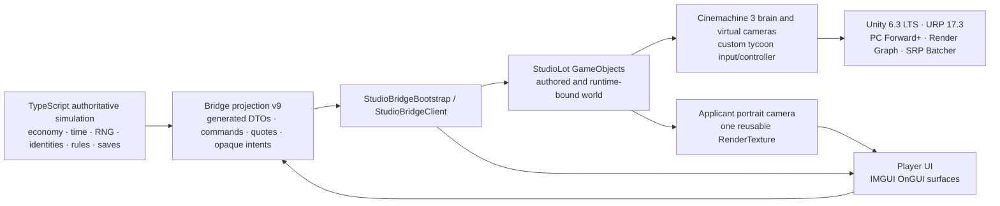
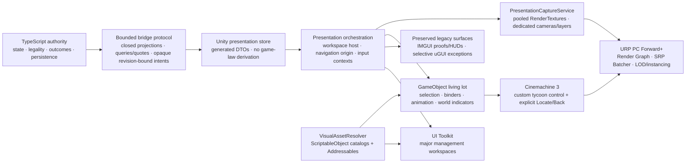

# Project: Studio — Unity Production Architecture Audit 01

**Status:** production architecture ruling

**Date:** 2026-08-25

**Scope:** Unity presentation client and its TypeScript boundary
**Immediate decision:** the foundation P04A Casting must use

## Executive recommendation

Project: Studio should standardize on its existing **Unity 6.3 LTS + URP 17.3 + PC Forward+ + Render Graph + SRP Batcher + Cinemachine 3 + Input System** foundation. This is not a pipeline-migration project. The current renderer is already the correct broad production choice for a PC-first, zoomable tycoon lot, and changing it before Casting would create risk without solving the present architectural gap.

The gap is the application layer above rendering. The current player UI is entirely immediate-mode, input is read directly from devices, production art has no scalable loading/catalog boundary, and portrait capture is a good single-purpose implementation rather than a shared service. Those choices were effective for proofs and the first vertical slices, but P04A is the point at which extending them becomes more expensive than establishing a small production foundation.

The ruling is therefore:

1. **Freeze and verify the current renderer; do not migrate it.** Keep Unity 6.3 LTS, URP, PC Forward+, Render Graph, SRP Batcher, Cinemachine 3, GameObjects, and the current lot.
2. **Establish a bounded UI Toolkit production shell before P04A's full workspace.** It needs a panel host, theme/tokens, responsive layout rules, focus/navigation, modal and Back handling, input-context arbitration, and tests. It must not become a general engine rewrite.
3. **Build P04A as the first production UI Toolkit management workspace.** Preserve Founding, Living Time, P03A Development, the workflow HUD, and inspection receipts in IMGUI until a later feature has a reason to migrate them.
4. **Productionize the already-installed Input System.** Use project-owned action maps and one context/arbitration layer. No Casting component may read `Keyboard.current`, `Mouse.current`, or `Gamepad.current` itself.
5. **Promote portrait rendering into a small shared capture service.** Reuse and pool GPU render targets. Keep portrait and still imagery on the GPU unless CPU bytes are genuinely required. Do not confuse a RenderTexture with a movie recorder.
6. **Introduce a semantic Unity presentation-key resolver and adopt Addressables for scalable production art.** TypeScript may name meaning—archetype, era, variant constraints—but must never name an FBX, prefab, material, address, or file path.
7. **Do not adopt DOTS now.** Use LOD Groups, shared meshes/materials, instancing, pooling, sensible lighting/shadow budgets, and profiling first. Consider Entities Graphics only for a separately bounded, proven high-volume visual population; never move named people, buildings, or gameplay authority into ECS merely to render them.

This keeps the working lot and campaign intact, avoids rebuilding Casting/Finance/Rivals/Staff twice, and does not move any simulation authority out of TypeScript.

## Evidence and confidence

This audit inspected the current repositories and serialized Unity assets read-only. The Unity production worktree was clean on `campaign/living-lot-client` at `2c8c747`; it contains committed P03A work ahead of its remote. The TypeScript production worktree was clean on `campaign/living-lot-ts` at `2ddf080`; it likewise contains committed P03A work ahead of its remote. Neither worktree was checked out, imported, upgraded, saved, or modified.

The documentation branch was created in a separate worktree from the remote TypeScript campaign baseline. Runtime claims come from source, serialized settings/assets, validators, and recorded proof artifacts. No new Unity editor or profiler run was performed because this pass is explicitly read-only.

The full exact-path evidence ledger is in the Builder Annex.

## Current architecture



What exists is coherent: TypeScript is authoritative; Unity presents and gathers intent; a persistent GameObject lot is already rendered through URP; Cinemachine blends a custom management camera and inspection camera; current feature slices use direct IMGUI; the founding applicant portrait uses a live camera and a reusable GPU target.

What does not yet exist is equally important: no runtime UI Toolkit, no uGUI Canvas roots, no controller navigation, no consumed input action maps, no Addressables, no production presentation catalog, no shared capture service, no movie recorder, and no DOTS/Entities packages.

## Recommended architecture



This is a presentation architecture, not a second simulation. Unity may cache presentation state and local uncommitted form state. It may not decide affordability, Fit, availability, legality, RNG, queue results, time, identity, or save truth.

## Actual Unity foundation

### Verified baseline

| Area | Current fact | Ruling |
|---|---|---|
| Editor | Unity `6000.3.22f1`, revision `1c726e1fb402` | Keep and freeze for the feature window. Unity identifies 6.3 as LTS, supported through December 2027. |
| Render pipeline | URP `17.3.0`, active through `PC_RPAsset.asset` | Keep. Do not evaluate HDRP/Built-in migration for P04A. |
| PC renderer | `PC_Renderer.asset`, rendering mode `2` (Forward+) | Keep. It matches the long-view, variable-light PC lot and is prerequisite infrastructure for optional GPU-driven features. |
| Render Graph | compatibility mode disabled | Keep enabled. New renderer work must be Render Graph compatible. |
| SRP Batcher | enabled | Keep. Do not casually defeat it with material churn or broad MaterialPropertyBlock use. |
| HDR / scale / MSAA | HDR on; render scale 1.0; URP MSAA 1x | Keep as measured baseline. Resolve the Quality Settings 4x-versus-URP 1x discrepancy in a later verification pass. |
| Shadows | 225 m; 2048 atlas; four cascades; main/additional shadows; high soft shadows | Profile against target desktop tiers. This is a likely scaling cost, not a P04 blocker. |
| Quality | PC and Mobile assets; Standalone defaults to PC | Preserve tier split. Mobile is not the design authority for this PC-first audit. |
| Color | Linear | Keep. |
| Batching | Standalone static batching on; dynamic batching off | Keep current baseline. If GPU Resident Drawer is tested, benchmark static batching off as a separate configuration. |
| GPU Resident Drawer | available in URP but disabled | Do not enable by policy. Benchmark after P04A on the canonical lot and construction churn. |
| GPU occlusion | available but disabled; Render Graph/Forward+ prerequisites present | Test only after a successful GPU Resident Drawer trial. Do not confuse camera occlusion flags with baked occlusion data. |
| LOD | 27 LOD Groups in `StudioLot`; no final billboards | Make LOD authoring mandatory for applicable production assets and validate transitions. |
| Instancing | 73 of 75 materials have instancing enabled | Preserve shared material/mesh design and prove effective batches with profiling. A material flag alone is not proof. |
| Occlusion data | camera occlusion enabled; no `OcclusionCullingData` asset found | Current scene has no verified baked occlusion solution. Lot openness and dynamic construction require measurement before baking one. |
| Lighting | 11 serialized realtime lights (`m_Lightmapping: 4`); no assigned lighting-data asset; two Volume profiles; URP post-processing on the five cameras | Current architecture is realtime lighting/post-processing. Establish per-tier light/shadow budgets and a baking policy before content scale. |
| Build targets | only explicit automation found is macOS Standalone; Standalone defaults to PC quality | Add Windows—and Linux if supported—build/proof lanes before release planning. This does not block Casting. |
| Build scene | automation explicitly builds `StudioLot.unity`; Editor Build Settings list only `SampleScene` | Align Build Settings or document automation as the sole supported build entry. This is drift, not a proven shipping failure. |

Unity's current documentation describes Forward+ as tiled light culling with a higher effective light capacity, while GPU Resident Drawer and GPU occlusion have narrower compatibility and profiling requirements. Render Graph is already active. These facts support keeping the present renderer and treating GPU-driven rendering as an optimization experiment, not a foundation migration. See [Unity's Forward/Forward+ comparison](https://docs.unity3d.com/6000.0/Documentation/Manual/urp/rendering/forward-rendering-paths.html), [GPU Resident Drawer requirements](https://docs.unity3d.com/6000.0/Documentation/Manual/urp/gpu-resident-drawer.html), [GPU occlusion requirements](https://docs.unity3d.com/6000.0/Documentation/Manual/urp/gpu-culling.html), and [Render Graph overview](https://docs.unity3d.com/6000.0/Documentation/Manual/urp/render-graph-introduction.html).

## UI architecture audit

### Current inventory

There are seven runtime `OnGUI` entry points and no runtime UI Toolkit or uGUI Canvas hierarchy. The meaningful player-facing surfaces are:

- workflow/memo and bridge status;
- selection receipt;
- Living Time HUD;
- Founding beacon and founding applicant dossier/contract administration;
- P03A Development Department, Commission, and Review workspace;
- inspection Back affordance.

Legacy `TextMesh` is used for world labels/nameplates. TextMesh Pro is not used. The uGUI package is installed but there are no Canvas roots. There are no `UIDocument`, UXML, USS, `PanelSettings`, `VisualElement`, UI Builder assets, focus graph, or gamepad navigation implementation.

### What is working and should be preserved

The current IMGUI surfaces are valuable working product slices. They demonstrate the bridge contract, workflow gating, selection, explicit commitment, Back behavior, and P03A's quote/revision flow. They should remain intact while P04A establishes the new retained pattern. A rewrite would create regression risk without improving Casting's delivery.

The lot must remain mounted beneath management workspaces. Selection must remain separate from commitment. Locate must be explicit, and Back must restore the prior workspace and world/camera origin. These are interaction laws from Packages 02–04, not implementation accidents.

### Production standard

**UI Toolkit becomes the standard for new, large, retained, screen-space management workspaces.** Casting, Finance, Rivals, and Staff all need reusable rows, scroll virtualization, data binding/update discipline, responsive composition, styling tokens, focus, and controller navigation. P04A is the correct first vertical slice after a deliberately small host foundation.

This is a chosen Project: Studio standard, not a claim that UI Toolkit is superior for every Unity UI. Unity's comparison specifically identifies dense, multi-resolution menu and HUD work as a UI Toolkit strength, while uGUI remains appropriate for world-space UI and custom material/shader cases. See [Unity UI system comparison](https://docs.unity3d.com/6000.0/Documentation/Manual/UI-system-compare.html).

**IMGUI becomes sealed legacy/debug infrastructure.** Existing production-facing IMGUI remains until opportunistic vertical-slice migration has feature value and parity proof. New debug, proof, automation, and temporary diagnostics may still use it. P04A must not add another major IMGUI workspace.

**uGUI remains an exception tool.** Use it for genuine world-space canvases, lit/custom-shader composition, or a narrow rendering interaction that UI Toolkit cannot satisfy. Do not create a parallel uGUI management-workspace framework. Existing lightweight world labels may remain until a dedicated world-indicator pass justifies replacement.

## Camera architecture audit

The project already uses Cinemachine `3.1.7` correctly as an orchestration layer rather than a replacement for tycoon-camera semantics:

- one main Camera and Cinemachine Brain;
- a priority-100 Tycoon Overview Cinemachine camera;
- a Human-Scale Inspection Cinemachine camera promoted by the director;
- a custom `TycoonCameraController` for pan, edge pan, orbit, zoom, and Home;
- `StudioCameraDirector` for focus/inspection, blends, Back, and state restoration;
- `StudioSelectionManager` for semantic ray selection and explicit activation;
- `CinemachineDeoccluder` on inspection, not on normal management navigation.

Keep the custom tycoon controller. Cinemachine should own lenses, virtual cameras, blending, shot composition, tracking, and cinematic sequencing. It should not own game-law decisions or erase explicit origin restoration.

Standardize Cinemachine 3 for normal overview/inspection, Locate and focus transitions, future Star follow, production/set cinematography, and premiere/award sequences. Future movie cameras should be a dedicated shot/capture subsystem using Cinemachine and possibly Timeline; they must not reuse the player management camera as their recording architecture.

## Input architecture audit

The Input System package `1.19.0` is installed and Player Settings select the new system only. An `InputSystem_Actions.inputactions` asset exists, but runtime code does not consume it. Current input reads `Keyboard.current`, `Mouse.current`, and `Touchscreen.current` directly through `StudioCameraInput`; no gamepad path, `PlayerInput`, or serialized UI input module was found.

The canonical architecture is one project-owned action asset with stable maps such as `Global`, `World`, `Camera`, `UI`, and `Debug`, plus one input-context service. The service, not each workspace, decides whether world selection, camera motion, or UI navigation is active. Rebinding, device schemes, accessibility settings, prompts, and controller focus all attach there.

`StudioCameraInput.Current` can remain as the one-frame camera/gesture sample facade while its source moves from direct device polling to actions. UI Toolkit can consume Input System UI actions; if uGUI and UI Toolkit coexist, their event-system integration and duplicate-event behavior must be tested explicitly. See [runtime UI event-system integration](https://docs.unity3d.com/6000.0/Documentation/Manual/UIE-Runtime-Event-System.html) and [UI Toolkit navigation events](https://docs.unity3d.com/6000.0/Documentation/Manual/UIE-Navigation-Events.html).

This action/context layer is a P04A acceptance dependency because controller navigation cannot be bolted independently onto every future workspace.

## Portrait, still, and movie capture

### Currently implemented

`StudioApplicantPortraitCamera` owns one lazily created 256×320 `RenderTexture` (`ARGB32`, depth 16), one portrait camera, and an isolated portrait layer. The texture is reused among applicants, the camera is enabled only while shown, and the texture is released and destroyed with the component. The image is a live view of the actual applicant body.

This is a sound vertical slice for one visible dossier. Its known seams are component-local ownership, layer mutation/restoration assumptions, no pool for concurrent sizes/channels, and no shared render-request contract.

### Recommended architecture

Create a small `PresentationCaptureService` or equivalent with:

- typed requests for portrait, film still, history thumbnail, newspaper, awards/promotional image, and future shot frames;
- bounded RenderTexture pools by resolution/format/depth;
- dedicated capture cameras and culling/layer profiles;
- explicit subject staging/isolation and cleanup;
- GPU texture handles with reference-counted or scoped lifetime;
- one render-request path compatible with URP/Render Graph;
- deterministic fallbacks when a live subject or asset is unavailable.

Keep normal UI imagery on the GPU. Do not encode or write portrait files. Use `AsyncGPUReadback` only when a CPU consumer truly needs bytes—for example export, long-term archival, or a future encoder—not for displaying a portrait.

A RenderTexture is also the correct frame destination for future film stills, but it is not a movie system. Actual movie capture additionally needs shot/Timeline orchestration, deterministic frame timing, dedicated camera and lighting policy, audio capture, buffering/readback, an encoder/container, storage/indexing, and playback. None of that currently exists. See [URP rendering to RenderTexture](https://docs.unity3d.com/6000.0/Documentation/Manual/urp/rendering-to-a-render-texture.html).

## Asset and content architecture

### Current state

The project has no Addressables package or settings, no production `Resources` tree, no runtime AssetBundles, no production content ScriptableObjects, and no prefab assets. The canonical lot is largely scene-authored/editor-generated and directly referenced. A JSON fallback/fixture lives under `StreamingAssets`. `AssetDatabase` use is editor-only. Current third-party content is governed by a strong provenance ledger and consists of CC0 Kenney/Quaternius sources plus documented adaptations.

This was sufficient to converge one lot. It is not a scalable content boundary for buildings, sets, vehicles, vegetation, people, outfits, props, eras, VFX, UI icons, or expansions.

### Production standard

Adopt Addressables as the normal delivery/lifetime layer for production content, with a Unity-owned semantic resolver in front of it. Addressables should be mandatory for scalable production prefabs, models, materials/variants, textures, VFX, audio, outfits, icons, era variants, and expansion content. Direct references remain acceptable for the boot scene, the immutable UI shell, and a few small always-loaded fallbacks.

TypeScript may publish:

```text
visualArchetype = "development-casting-office"
era = 1920
```

Unity may resolve that through a presentation catalog to an address such as:

```text
visual/facility/development-casting/1920/a
```

TypeScript must never know the address, asset GUID, prefab name, FBX path, material, or vendor package. Asset choice must never change gameplay authority. Addressables supplies asynchronous location, dependency, loading, and lifetime mechanics; it does not decide semantic identity or game rules. See [Unity Addressables](https://docs.unity3d.com/6000.0/Documentation/Manual/com.unity.addressables.html).

Use ScriptableObjects for immutable presentation catalogs, palettes, style/era constraints, capture profiles, and Addressable references. Do not store campaign truth, mutable people, films, finances, RNG, queues, or saves in ScriptableObjects.

P04A should depend on an `IVisualAssetResolver`-style seam, but package rollout and migration of the whole existing lot do not block its core UI. The shell may use small direct fallback assets while Foundation 4 establishes Addressables.

## Unity Asset Store and visual catalog strategy

Unity's Asset Store is a source marketplace, not a coherent art direction. Use selected assets as raw material only when their license, source, performance, era, and adaptation plan are accepted. Do not purchase or download as part of this audit.

Create both:

1. **Project Studio Art Intake Standard** — acceptance gates for legal provenance, URP compatibility, visual adaptation, scale/pivot/axes, colliders, rigs/skeletons/animations, polygon and material budgets, texture memory, LODs, shader dependencies, era, category, and test captures.
2. **Project Studio Visual Asset Catalog** — the inventory of accepted source/version/license, hashes, modifications, notices, performance metadata, semantic presentation key, Addressables group/labels, variant/era eligibility, owner, and upgrade risk.

The anti-asset-flip policy is integration work: a coherent art bible; controlled proportions, palette and materials; consistent texel density, lighting response and silhouettes; era gates; standardized rigs and animation; authored hero landmarks; source-neutral naming; performance budgets; and review captures at both management and inspection scale.

Asset Store license records must distinguish standard, restricted, and provider-specific terms and record seat requirements for extension assets. Assets may be embedded in a substantial original product, but raw redistribution and restricted/provider terms require individual review. See the [Unity Asset Store Terms](https://unity.com/legal/as-terms).

## Performance architecture

The canonical scene is already large enough to reveal the direction of travel: approximately 2,612 GameObjects, 2,275 MeshRenderers, 128 SkinnedMeshRenderers, 27 LOD Groups, 11 lights, five cameras, and 75 materials. A recorded CP22 proof scaled visible people from 25 to 100 while remaining around 9.1–9.4 ms p95 on an M3 Max, but draw calls rose from 1,686 to 5,923 and the 100-person case reached about 2.87 million triangles and 457 MB. This proves headroom on that machine, not a generic PC budget, and the draw-call slope is the warning.

The largest likely rendering bottleneck over the next year is not raw GameObject count alone. It is the combination of material/draw-call fragmentation, skinned meshes and Animators, shadowed lights and long shadow distance, repeated per-object update work, and additional portrait/production cameras as content and visible people grow. On the bridge side, large unbounded projections/digests and long-history UI transfers are a separate risk; Packages 11–12 already require bounded queries and paging.

Use ordinary Unity architecture first:

- maintain SRP Batcher compatibility and shared shader/material families;
- author LOD Groups and validate screen-relative transitions for buildings, props, vegetation, vehicles, and people;
- use shared meshes/materials and GPU instancing where the profiler proves effective batches;
- avoid broad MaterialPropertyBlock customization because it can remove SRP Batcher compatibility; use it only for an intentional measured instancing path ([Unity batching property guidance](https://docs.unity3d.com/6000.0/Documentation/Manual/DrawCallBatching-Properties.html));
- pool transient people, vehicles, indicators, effects, and capture resources;
- stream additive districts/content when lot scale warrants it, with Addressables managing dependencies and lifetimes;
- establish light, shadow, Animator, skinned-mesh, collider, physics, and `Update`/`LateUpdate` budgets;
- use impostors only for distant vegetation/large repeated background assets after LOD profiling;
- benchmark GPU Resident Drawer with and without static batching, then GPU occlusion, against construction/dynamic-object behavior;
- define representative low/mid/high PC proof machines, GPU timings, and view scenarios.

**DOTS ruling: NOT YET.** No Entities or Entities Graphics package is installed, and current named people/buildings are coupled to selection, dossiers, animation, navigation, live portraits, and authoritative TypeScript identities. Moving them to ECS would add identity/synchronization complexity without evidence that ordinary rendering is exhausted. An isolated crowd, background traffic, vegetation, or distant-extra renderer may earn Entities Graphics later through a bounded prototype and measured threshold. Gameplay authority remains TypeScript either way.

## P04A architecture ruling

### What Claude should build P04A with

| Layer | Required P04A foundation |
|---|---|
| 3D | Existing GameObject StudioLot on Unity 6.3/URP PC Forward+. Reuse selection, authoritative presence/binders, and the persistent lot. No renderer migration or ECS. |
| UI | A minimal production UI Toolkit shell, then the retained Casting workspace in UXML/USS/C#. Wide role/candidate/dossier composition, responsive breakpoints, persistent header/actions, virtualization where lists warrant it, and explicit focus. |
| Portrait | Shared `PresentationCaptureService` seam generalized from `StudioApplicantPortraitCamera`; pooled live RenderTexture and honest fallback. No file-writing or movie subsystem. |
| Input | New Input System actions through one context/arbitration layer; mouse, keyboard, and controller from the first acceptance proof. No direct device reads in Casting components. |
| Camera | Existing Cinemachine 3 overview/inspection stack and custom tycoon controller. Add explicit workspace-origin Locate/Back restoration; no automatic authority-driven camera moves. |
| Assets | Semantic Unity presentation keys resolved by a Unity-owned resolver. Addressables becomes the production asset boundary; P04 may use bounded fallback assets behind the same interface during rollout. |
| Bridge/DTO | Extend the P03A pattern: closed projection v9, bounded query/quote, revision-bound opaque intent, generated DTOs. C# displays authority; it does not calculate Fit, money, availability, legality, RNG, or outcomes. |
| World indicators | Preserve existing selection/marker laws and lightweight world labels. Use uGUI only if a real world-space rendering requirement appears. Do not build a second workspace system in world space. |

Choose **B: establish a minimal UI Toolkit production shell first, then build P04A on it.** Building Casting in the current IMGUI style would create a known rewrite before Finance, Rivals, and Staff. Building a comprehensive framework first would turn P04 into an engine migration. The correct boundary is a small vertical foundation proven directly by the Casting header, role rail, candidate list, dossier, comparison, confirmation, responsive modes, and controller focus.

The shell must be independently reviewable and rollbackable. Existing IMGUI remains the safe fallback and stays untouched. If a specific UI Toolkit limitation is found, solve or isolate that case; do not silently switch the entire workspace back to IMGUI or start a parallel uGUI framework.

### What Claude must not build

- a new major IMGUI Casting workspace;
- a second bridge client, selection system, camera director, or independent Back/origin stack;
- Unity-side Fit, cost, availability, legality, RNG, time, queue, outcome, or save logic;
- a uGUI management-workspace framework;
- per-workspace direct keyboard/mouse/gamepad polling;
- persistent Casting draft/hold state not authorized by TypeScript;
- fake present people when the projection says they are absent;
- a movie recorder, DOTS conversion, renderer migration, or whole-lot Addressables conversion inside P04A;
- a rewrite of Founding, Living Time, workflow, inspection, or P03A Development IMGUI.

## Phased migration plan

| Phase | Classification | Purpose | Likely systems | Risk | Blocks P04A? | Proof and rollback |
|---|---|---|---|---|---|---|
| Foundation 0 — verify/freeze | **NOW BEFORE P04A** | Record the exact editor/package/settings baseline; close build-entry and quality/MSAA ambiguity; protect P03A seams. | `ProjectVersion.txt`, manifests, URP/quality/build settings, validators/docs | Low | Yes, briefly | Serialized-setting validation plus existing canonical scene/build automation. Documentation/settings commit can revert independently; no upgrade. |
| Foundation 1 — renderer | **AFTER P04A** for tuning; **REJECT** migration | Keep URP/Forward+/Render Graph/SRP Batcher. Define desktop tiers and budgets. | PC/Mobile RP and renderer assets, quality profiles, proof scenes | Medium if changed | No | A/B GPU timing, render parity, screenshots, low/mid/high PC proofs. Every option changed separately. |
| Foundation 2 — UI host | **NOW BEFORE P04A** | Minimal UI Toolkit host, tokens, responsive root, focus/navigation, modal/Back, test harness. | new presentation UI root, UXML/USS/PanelSettings, bootstrap seam | Medium | Yes | One Casting-shaped vertical slice at target widths and controller/mouse/keyboard parity. Existing IMGUI remains untouched fallback. |
| Foundation 3 — input/camera | **NOW BEFORE / DURING P04A** | Action maps, input contexts, UI navigation, explicit Locate/Back origin. Preserve camera rig. | input actions/adapters, `StudioCameraInput`, director/orchestrator | Medium | Controller acceptance: yes | Device matrix, focus traversal, no input leakage, exact camera/workspace restoration. Adapter can revert to current facade. |
| Foundation 4 — assets | **DURING P04A** seam; **AFTER P04A** broad rollout | Semantic presentation resolver, catalogs, Addressables groups/lifetimes, intake standard. | package/settings, presentation catalogs, resolver, asset CI | Medium | Resolver seam only | Missing-key fallback, dependency/lifetime tests, clean build/catalog, memory unload proof. Existing direct core references remain fallback. |
| Foundation 5 — capture | **DURING P04A** | Generalize portrait camera into pooled capture service without movie scope. | portrait camera, capture profiles/service, UI texture binding | Medium | Portrait acceptance: yes | Repeated open/close, subject switch, device loss/recreate, no leak, layer restoration, exact resolution. Old portrait component is rollback boundary. |
| P04A integration | **DURING P04A** | Deliver Casting on the new seams and authoritative bridge contract. | Casting UXML/USS/controllers, bridge DTOs/endpoints, world interaction | Medium-high | This is P04A | Full role/candidate/dossier/compare/test/greenlight flow, responsive/device matrix, authority and replay tests. Feature flag/workspace route permits isolation. |
| Later modernization | **AFTER P04A** | Migrate an existing IMGUI surface only when a feature changes it; add production prefab/content workflow. | one vertical slice at a time | Medium | No | Behavioral and visual parity before deleting old surface; one-surface rollback. |
| Performance escalation | **LATER IF PROFILED** | GRD → GPU occlusion trial; streaming/impostors; isolated Entities Graphics only if earned. | renderer settings, representative content, profiling harness | High | No | Representative multi-GPU A/B with construction, inspection, portraits, and long views; configuration/prototype removable without gameplay migration. |

## Architecture decision matrix

| Technology | Current state | Recommended state | Why / when | Migration risk | P04A impact |
|---|---|---|---|---|---|
| Unity 6 LTS | 6.3.22f1 LTS | **Keep/freeze** | Current supported LTS; patch only through planned validation | Medium | No upgrade during P04A |
| URP | Active 17.3.0 | **Keep / standard** | Appropriate scalable PC presentation pipeline already integrated | High to replace | Build on it |
| HDRP | Absent | **Reject** | Excess migration/content cost; no requirement outweighs it | High | None |
| Built-in RP | Inactive | **Reject** | Regression from current SRP foundation | High | None |
| Forward | Mobile renderer | **Keep for Mobile only** | Lower mobile baseline | Low | None |
| Forward+ | Active PC | **Keep / PC standard** | Existing fit for variable visible lights and GPU-driven option path | Low to keep | No change |
| Deferred | Inactive | **Reject now** | No measured G-buffer/light case requiring a switch | Medium-high | None |
| Render Graph | Active | **Keep** | Current URP architecture and GPU-occlusion prerequisite | Medium if custom passes incompatible | New passes must comply |
| SRP Batcher | Enabled | **Keep** | Broad material/shader CPU efficiency | Low | Preserve compatibility |
| UI Toolkit | Absent | **Adopt for major retained screen UI** | Dense responsive workspaces and shared styling/navigation | Medium | Minimal shell first; Casting first workspace |
| uGUI | Package only, no Canvas | **Exception use only** | World-space/custom shader/material strengths | Medium if parallel framework grows | Not default |
| IMGUI | All current screen UI | **Seal as legacy/debug; preserve existing** | Working proof surfaces, poor long-term retained workspace base | High if rewritten at once | No new Casting workspace |
| Cinemachine | 3.1.7 active | **Keep / standard** | Existing cameras/blends/deocclusion; future shot orchestration | Low | Reuse director and rigs |
| Input System | 1.19 installed; direct device reads | **Productionize actions/context** | One path for mouse/keyboard/controller/rebinding/accessibility | Medium | Required for controller acceptance |
| Addressables | Absent | **Adopt for production art** | Scalable async content/dependency/lifetime and expansions | Medium | Resolver seam now; broad migration later |
| ScriptableObjects | Settings/Volume only | **Presentation catalogs only** | Good Unity-authored immutable metadata; not campaign truth | Low | May back visual/capture catalogs |
| RenderTexture | Portrait/evidence capture | **Standard behind capture service** | Correct GPU destination for portraits/stills | Medium | Generalize portrait use |
| AsyncGPUReadback | Absent | **Only for CPU/export/encoding needs** | Avoid needless stalls/copies in normal UI | Medium | Not required |
| GPU Resident Drawer | Off | **Later profiled trial** | Scene/repetition may benefit, but shader/static/dynamic constraints matter | Medium-high | None |
| GPU occlusion | Off | **Trial only after GRD success** | Prerequisites exist; benefit depends on real occlusion | Medium-high | None |
| LOD Groups | 27 present | **Mandatory where applicable** | Long views plus close inspection require authored geometric scaling | Low-medium | Portrait candidates need correct LOD policy |
| GPU instancing | Material flags broadly on | **Keep and verify** | Repeated props/vegetation/people can benefit | Medium through authoring | No architecture migration |
| DOTS / Entities | Absent | **Not yet** | No measured need justifies conversion complexity | High | Do not introduce |
| Entities Graphics | Absent | **Only isolated proven visual populations later** | Possible crowd/traffic/vegetation renderer, not named gameplay | High | Do not introduce |

## Risk register

| Risk | Consequence | Control |
|---|---|---|
| P04A extends IMGUI | Casting is rebuilt; Finance/Rivals/Staff fork patterns | Gate P04A on bounded UI Toolkit shell proof |
| UI foundation expands into a framework project | P04 slips into a six-week migration | Limit the foundation to requirements exercised by Casting; preserve legacy UI |
| Per-workspace input handling | controller, rebinding, modal leakage, and accessibility diverge | One action asset and context/arbitration service |
| Unity derives simulation truth | desync, replay/save drift, competing laws | closed projections, authoritative quotes, opaque revision-bound intents, DTO tests |
| Asset paths leak into TypeScript | expensive content-pipeline reversal | semantic presentation keys and Unity resolver from first new content seam |
| Addressables is treated as gameplay catalog | asset configuration changes game rules | presentation-only catalogs; TS owns semantics and outcomes |
| Capture components proliferate | GPU leaks, inconsistent layers/resolutions, duplicated cameras | bounded shared capture service and lifecycle tests |
| Premature GRD/DOTS migration | rendering regressions and authoring complexity | representative A/B profiling and removable prototype boundaries |
| Visual asset inconsistency | asset-flip appearance and unstable budgets | Art Intake Standard, Visual Asset Catalog, art bible, technical/art gates |
| Existing P03A work is disturbed | active feature regression | build P04 beside preserved components; no checkout/save/migration in active worktrees |

## Exact preservation and do-not-rebuild list

Preserve:

- TypeScript simulation authority and generated bridge DTO boundary;
- P03A's authoritative query/quote/revision-bound opaque-intent pattern;
- persistent StudioLot and current GameObject world binders;
- selection-versus-commitment law and authoritative presence rules;
- `TycoonCameraController`, `StudioCameraDirector`, Cinemachine overview/inspection rigs, and explicit Back restoration;
- current Founding, Living Time, workflow, selection, inspection, and Development IMGUI until separately migrated;
- current applicant portrait framing/body identity while moving ownership behind a service;
- current URP assets, material family, scene authoring, provenance ledger, validators, and proof automation.

Do not rebuild:

- bridge polling/transport or a second presentation store;
- selection/raycast/inspection infrastructure;
- a second management camera or independent focus system;
- TS-authoritative calculations in C#;
- existing IMGUI solely for technology consistency;
- the lot, shaders, or renderer as part of P04;
- movie recording, ECS, or full asset streaming as hidden Casting scope.

## Direct answers to the hard questions

1. **Are we on URP?** Yes: URP 17.3.0 through `PC_RPAsset.asset`.
2. **Is it correctly configured?** Broadly yes for this game: PC Forward+, Render Graph and SRP Batcher on, sensible PC/Mobile split. It needs tier profiling, MSAA/build-settings drift resolution, mip-streaming policy, and later shadow/GPU-driven experiments—not migration.
3. **Should we migrate pipeline now?** No.
4. **Is Forward+ correct?** Yes for the PC tier. Keep Mobile Forward.
5. **Is UI Toolkit mature enough?** Yes for Project: Studio's major retained screen-space management UI, provided the first bounded shell proves focus, controller input, responsive layout, texture display, and testability.
6. **What remains IMGUI?** Existing working surfaces, debug/proof/automation, and temporary diagnostics until opportunistic vertical-slice migration.
7. **What remains uGUI/Canvas?** Genuine world-space UI, custom shader/material/VFX composition, and narrow exceptions. There is no current Canvas UI to preserve.
8. **Should P04A be the first UI Toolkit workspace?** Yes, after a minimal production shell.
9. **Is RenderTexture correct for portraits?** Yes, pooled and lifecycle-owned behind a capture service.
10. **Is it correct for film stills?** Yes as the GPU frame destination.
11. **What does actual movie capture need?** Shot/Timeline orchestration, deterministic clock, camera/lighting policy, audio, buffering/readback, encoding/container, storage/indexing, and playback. It does not exist today.
12. **Should Addressables be mandatory?** Yes for scalable production art and expansions, with narrow direct-reference exceptions for boot/core fallback assets.
13. **Should Asset Store assets be used?** Yes, selectively as licensed source material subject to intake, adaptation, art direction, and performance gates.
14. **How do we avoid an asset flip?** Enforce one art bible, material/palette/scale/rig/budget standards, era/category metadata, adaptation, authored hero content, and visual review at both camera scales.
15. **Do we need DOTS?** Not now. Only a later isolated high-volume visual subsystem may earn it through profiling.
16. **Largest likely bottleneck next year?** Draw/material fragmentation plus skinned animation/shadows as visible population and content scale; unbounded bridge/history payloads are the parallel data risk.
17. **Most expensive choice to reverse?** Building several major workspaces on divergent UI/input/navigation foundations—or leaking asset/game authority across the TS/Unity boundary.
18. **What must Claude not build?** A major IMGUI Casting UI, local game law, parallel input/camera/bridge systems, whole-project migrations, movie capture, or DOTS.
19. **Three highest-value changes now?** A bounded UI Toolkit host; action-based input/context/navigation; shared presentation-service seams for semantic assets and capture.
20. **Can this preserve TS authority?** Yes. Every recommendation is confined to presentation, input, rendering, content resolution, and transport of authoritative intent/state.

## Owner decisions

No Owner decision is required to proceed with P04A architecture. The evidence supports the stack and sequence above. Later choices of visual art bible, minimum PC hardware tiers, expansion delivery policy, and whether captured movies are exported or only presented in-game are product decisions, but none should block the Casting foundation.

## Final ruling

Project: Studio already has the correct rendering and world foundation. Preserve it. The production standard to add now is a retained UI/input/navigation layer and presentation-service boundary—not a new renderer or simulation model. Build P04A on UI Toolkit, Cinemachine 3, action-based Input System, pooled RenderTexture capture, semantic Unity asset resolution, and the existing authoritative bridge. Keep current IMGUI working, keep ordinary GameObjects, adopt Addressables deliberately, and escalate to GPU-driven rendering or Entities only when representative profiling earns the complexity.

## Post-P03A sealed baseline verification

**Verification date:** 2026-08-25

**Final authority:** TypeScript seal `4423fe03664701df68e1f44de42b8c15dbe8632c`; TypeScript production-code tip `2ddf080`; Unity client seal `432c39d4caeacc33bdcd1c60ec5f4ec0a30e6321`.

This verification examined only the final Unity delta from the audited `2c8c747` to sealed `432c39d` and the final P03A seal entry added to `docs/campaigns/LIVING-LOT.md`. It did not reopen the package, renderer, or broader architecture audit.

**Result: no architecture ruling changes.** The following audited assumptions were reverified:

- P03A remains a feature-specific IMGUI implementation. No UI Toolkit host, UXML/USS, uGUI management framework, or generic retained-workspace service was introduced. Its final band-growing sheet and clip/Back containment remedies reinforce the ruling that P04A should establish the first production UI Toolkit workspace rather than copy P03A's layout code.
- P03A now resolves workspace height against the available top-floor-to-receipt band, using compact/standard bases and 660/780 caps, while live proof rects require the review tail and Back control to remain wholly contained. P04A must preserve the law—whole decision content, explicit Back, fail-closed containment, and pointer shielding—but implement it through the retained host's responsive layout, focus, and scroll policy rather than inherit those IMGUI constants.
- The shared 0.7-second commit arm, explicit layer Back buttons, current-card pointer containment, and camera-stationarity law remain intact. No central Input System action/context layer was added, so that recommendation remains required before/during P04A.
- No Cinemachine, camera-director, tycoon-controller, portrait, capture, bridge/bootstrap, or selection architecture changed. The Cinemachine restoration and `PresentationCaptureService` recommendations remain unchanged.
- The Development building and pad are now excluded from navmesh baking, the building uses a local runtime carve, and the writer approach moved onto sealed-baked ground. This is a sealed P03A world-preservation remedy, not a new simulation or rendering architecture. P04A must not undo it during scene regeneration or broad migration.
- Packages, ProjectSettings, URP assets, renderer assets, Input actions, Addressables/content-loading surfaces, and presentation-capture code are unchanged. The URP/Forward+/Render Graph/SRP Batcher and semantic resolver/Addressables rulings therefore remain unchanged.
- The final seal documentation confirms TypeScript production code remains at the already audited `2ddf080`; `4423fe0` adds the P03A seal record only. TypeScript remains authoritative, and P04A must not copy P03A's recorded C# presentation defaults as new gameplay law.

**Final P04A recommendation remains unchanged:** complete a bounded UI Toolkit production shell and centralized Input System context/navigation seam, then build P04A as the first production retained workspace on the existing GameObject lot, Cinemachine stack, authoritative bridge, pooled capture-service seam, and semantic Unity asset resolver. Preserve the sealed P03A IMGUI and navmesh/runtime-carve behavior; do not migrate either inside P04A.
