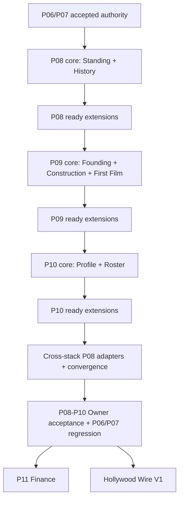

# Project: Studio — Future Package Dependency Map

**Revision:** 03
**Status:** ADVISORY / DOCUMENTATION ONLY
**Accepted base:** `2753e18ba8fb5f65b936c22cde9531646fecc6cd` / `c4c65db464ef9abcf3bdcc088f5c8a47cc9081b6`

## 1. Near-term graph



## 2. Producer/consumer matrix

| Producer | Owns | Consumer | Legal consumption | Prohibited duplication |
|---|---|---|---|---|
| P07 | release, result, three channels, theatrical state, captured expectation/participants | P08 | exact film/result facts | verdict, finance, title identity, missing history |
| P08 | Standing-change provenance, sparse history, significance, history routes | P09 | append/adapter contract for material facility facts | construction legality, cost, time, facility state |
| P09 | founding regime, property, placement, construction, facilities, Sets, world bodies | P08 | exact material milestones | property or construction authority |
| P07/P10 | captured participants and career events | P08 | exact person links when complete | missing filmography, awards, retirement |
| P09 | truthful physical owners | P10 | workplace/route only when person authority names it | assignment or employment from proximity |
| P10 | public person/contract/work/career projection | P08 | exact person history links | hidden data or person simulation |

## 3. P07 consumer boundary

P08 and later packages must preserve:

- result ID equals `productionId`;
- title is display data and can collide;
- participants/forecasts are optional;
- unknown exact result ID cannot be replaced by a fallback result;
- active-run totals remain projected;
- P07 did not provide every history route or a universal event receipt;
- windowed events are not permanent;
- permanent event IDs used for production-ID reservation cannot be compacted away casually.

## 4. Save/projection chain

```text
Accepted P07: Save V16 / Projection 15 / Protocol 4
  → expected P08: additive history root / Projection 16
    → expected P09: additive founding regime / Projection 17
      → expected P10: save-neutral if possible / Projection 18
```

Exact future numbers remain preflight decisions. Every old validator stays frozen, every migration is monotonic, and every checkpoint receives its own compatible profile copy.

## 5. Physical-world chain

```text
Administration / Studio History owner → P08
Build toolbar + parcel + property/facility bodies → P09
People strip + world person + truthful workplace owner → P10
```

No package may invent a new building solely to house a screen. No route may require rail priming.

## 6. History adapter chain

```text
P08 core records only facts available at its own time
P09 emits exact facility milestones → P08 facility adapter
P10 exposes exact public person routes → P08 person adapter
```

History is downstream. It cannot affect placement, construction, contracts, ability, availability, or career development.

## 7. Hidden-information firewall

```text
Talent actual skills / ceilings / actual genre experience / RNG
  ─X→ bridge or Unity

perceived skills + qualified potential estimate + public contract/work facts
  → P10 projection
```

Every downstream consumer inherits this firewall.

## 8. Narrative/audio chain

```text
P07/P08/P09/P10 authoritative facts
  → Hollywood Wire story/thread authority
    → accepted Audio system
      → Studio Radio
```

Radio never decides what happened. PA/Help remains operational. No runtime LLM creates facts, awards, contracts, canon, or history.

## 9. Long-range graph

```text
P08–P10 accepted
  → P11 Finance
  → P12 Rivals
  → P13 Era/Technology
  → P14 Talent Market/Career Lifecycle
  → P15 Shared Market/Legacy
  → P16 Library/Rights
  → P17 Franchises/Continuations
  → P18 Television/Cross-Media
```

Cross-links do not permit a downstream package to manufacture a missing upstream fact.

## 10. Rollback graph

```text
accepted P07
  → immutable P08 core/full-ready checkpoint
    → immutable P09 core/full-ready checkpoint
      → immutable P10 core/full-ready checkpoint
        → final stack candidate
```

Rollback is by preserved ancestry and compatible profile copies, never history rewriting or opening a newer save in an older candidate.
