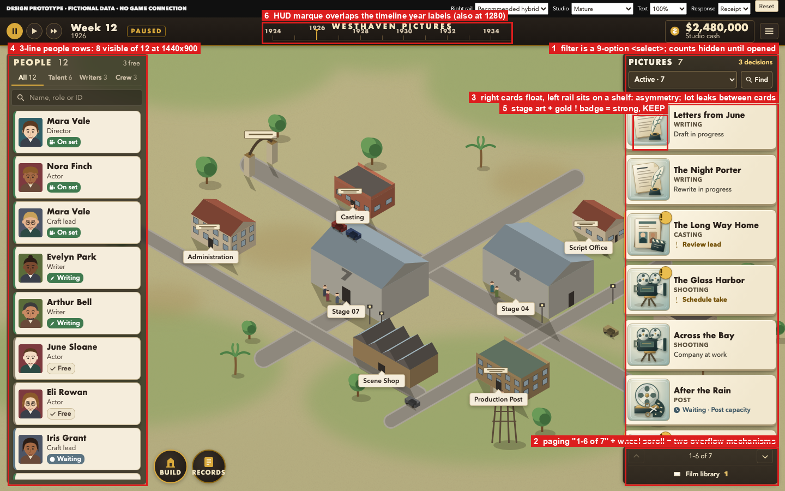
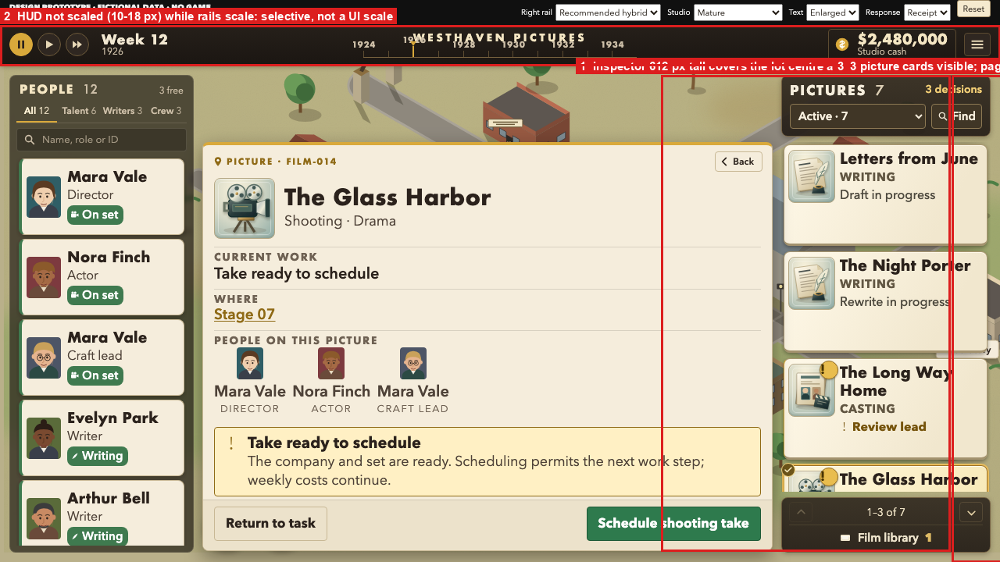

# UI/UX advisory — R3 hybrid selection and the Playability & Interaction plan

> **CORRECTED 2026-09-13 — read `RECONCILIATION-01.md` first.** After the Future Ops
> spot-check (`assets/FUTURE-OPS-SPOT-CHECK-20260913.md`) and the Owner's whole-game
> clarification with §8 choices 1A / 2B / 3A / 4B (`f2921730`), which this advisory's input
> list omitted, the following statements below are superseded and marked inline:
> R3-1 (13 / 27 Tabs include five demo-bar controls; in-game 8 / 22; "40 employees" was
> arithmetic, not a fixture), R3-2 (withdrawn as a demonstrated defect — R3 drives the
> range and page-jumps from one scroll position), R3-6 (the "612 px inspector" was the
> picture rail measured by a wrong selector; corrected geometry in `RECONCILIATION-01.md`
> §1a: 730×524 at 1280×720 Enlarged covering 100 % of the located target, and a new 1440
> Standard defect — the Records corner tool 77 % covered), R3-7 (overprint demonstrated at
> 1280; abutting at 1440), R3-10 (the "3 px radius" was the demo bar's Reset button),
> §3.1 (the 48-hour reference is withdrawn; scope is not fitted to the old budget),
> §3.10 (withdrawn under 3A — contextual help, no guided introduction), and §5 (UI
> navigation is **XAG 112**, not 106; XAG 101 measures rendered body height, not CSS
> font-size — the 16 / 14 / 12 presets are not XAG-compliant). The remaining text is
> retained as history; `RECONCILIATION-01.md` is the corrected reading and the
> disposition for the coverage register.

**Advisory only · 2026-09-13 · Opus (independent principal game UI/UX reviewer).** This
is feedback on decisions already recorded; it assigns no work, changes no plan and grants
no authority. Inputs read: the Owner selection `3aa4bad9`
(`docs/operations/UIUX-R3-HYBRID-OWNER-SELECTION.md`); the R3 package at `b56088d6`
(README, DESIGN, REVIEW, WALKTHROUGH, previews, and the prototype exercised in a fresh
headless Chromium with network blocked — `assets/r3-exercise-log.json`); the launch plan
at `673f4983` (`docs/engineering/playability-launch-review/00–02`); the handoff at
`9db31137`. Best-practice sources were fetched and adversarially verified (30 supported,
7 partly, 3 refuted, 4 unreachable — only supported/partly claims are used below;
`assets/best-practice-sources.json`).

## 1 · What is right — keep it, do not re-open

- **The composition** (people left, hybrid picture cards right, useful lot centre, compact
  inspector) is the correct answer to the original's card-stack grammar and to the R1/R2
  corrections. The Owner has closed the hybrid-vs-classic question; nothing below re-asks it.
- **R3's card content** — one changing stage illustration, a short title, one stage word,
  one state sentence, a gold "!" attached to the image for decisions and a clock for waits —
  is exactly the recognition-over-recall pattern the evidence supports (NN/g "Icon
  usability": labels visible at all times; WCAG 1.4.1 / XAG 103: never colour alone). The
  six original stage drawings are distinctive enough to pop out in a scan; keep them at
  78 px.
- **Honesty rules** (no invented percentages, dates, ratings or remedies; "location
  unavailable" instead of aliasing; selection never signs) are a product strength most
  management sims lack. Hollywood Animal's launch reviews were about withheld or
  unclear information, not density — R3's truthful strips are the right defence.
- **The plan's sequencing** (closed P13A → Playability & Interaction → targeted P13B) and
  its "first native improvement chosen from observed audit, not inferred" rule are sound.

## 2 · R3 — concrete improvements before it becomes the native target

Ranked by player impact. Each has evidence from the actual prototype.

| # | Finding (measured in the R3 prototype) | Recommendation | Evidence / source |
| --- | --- | --- | --- |
| R3-1 | *[Corrected — Reconciliation 01 §1.1: 13 / 27 include five demo-bar stops; in-game 8 / 22; "40 employees" was arithmetic, not a fixture; arrows and `1`/`2` already work.]* **Keyboard focus walks every row.** From page load it takes 13 Tabs to reach the first person and **27 Tabs to reach the first picture** because every people row is a tab stop; with 40 employees the pictures rail is 40+ presses away. `1`/`2` hotkeys exist but are undiscoverable. | Make each rail **one Tab stop** with a roving cursor (Up/Down inside; Left/Right between tab strips), so the global sequence is HUD → People → Pictures → tools → inspector. Show the `1`/`2` keys in the rail headers on keyboard use. This is also the controller model (stick moves within a rail, bumpers switch rails). | W3C APG roving tabindex; XAG 112 (focus order follows meaning; wrap at list end — mis-cited as 106 originally; the sentences appear in both 106 and 112); XAG 107 (digital single-press equivalents). |
| R3-2 | *[WITHDRAWN as a demonstrated defect — Reconciliation 01 §1.2: R3 already drives the range and page-jumps from one scroll position; only a wording assessment remains.]* **Two overflow mechanisms on one list.** The pictures rail scrolls with the wheel *and* pages with "1–6 of 7" prev/next; the two can disagree about what "1–6" means after a partial scroll. | Keep continuous scroll as the mouse path; keep the **range counter** (it is useful orientation) but drive it from scroll position; retain prev/next only as keyboard/controller page-jumps (PageUp/PageDown, bumpers) and hide them for pointer users. Never both visible as primary. | NN/g "Infinite scrolling": bounded, goal-directed lists want orientation cues (X of Y), not feed behaviour. |
| R3-3 | *[Reclassified as a proposal to test, not a defect — Reconciliation 01 §3.]* **The filter is a 9-option `<select>`** ("Active · 7 / Decisions · 3 / Waiting · 1 / Writing / Casting / Shooting / Post / Release ready / Library"). Counts and options are hidden until opened; the People rail uses visible tabs, so the two rails behave differently. | Two levels: a **visible segmented strip** `All · Decisions 3 · Waiting 1` (the three questions the player asks), plus an optional stage chip row revealed by a small "by stage" toggle. Library stays in the footer. Keep Find. | Wroblewski "Dropdowns should be the UI of last resort"; NN/g filters vs search (filters narrow; search for a known item). |
| R3-4 | *[Reclassified as an aesthetic preference for the design owner; no automatic shelf restoration — Reconciliation 01 §3.]* **Asymmetric rail materials.** The People rail sits on the dark shelf; the picture cards float on the lot with only a dark toolbar/footer, so the lot (and the "Laboratory" label) leaks between cards — the defect that argued against Exploration A′. In the early fixture the left shelf is a tall empty panel behind three cards. | Pick one container rule for both rails: a shelf that **sizes to content** (shrinks in the early studio), or floating cards on both sides with the toolbar/footer as the only chrome. Recommendation: shelf on both, content-sized, with the right toolbar/footer inside it. | Consistency (NN/g heuristic 4); the checker's A′ critique; R3's own "empty departments must not become empty panels" rule, applied to the left. |
| R3-5 | *[Corrected — Reconciliation 01 §1b: XAG 101 measures rendered body height; the 16 / 14 / 12 presets measure ≈ 17.6 / 14.1 / 12.1 px and are not XAG-compliant; the unscaled HUD at Enlarged is confirmed.]* **Text sizes are below the modern PC floor.** Rail title 14 px, state 12 px, stage word 11 px, HUD 10–18 px at 1440×900; "Enlarged" scales rails/inspector but not the HUD (10–18 px unchanged). XAG's PC/VR minimum is **18 px at 1080p** with scaling to **200 %** without loss; selective enlargement is acceptable only for repeated secondary chrome. | Define **two presets + a UI-scale slider**: "Standard" (title 16 / state 14 / stage 12 at 1440×900 — five to six cards still fit) and "Compact" (today's 14 / 12 / 11) as an opt-in; UI scale 100–200 % that also scales the HUD, tabs, badges and hit targets. Treat R3's Enlarged as the first step, not the feature. | XAG 101 (PC/VR 18 px @1080p; 200 % scaling; icon text scales with text); Apple Larger Text criteria (secondary repeated chrome may stay small); GAG "allow font size to be adjusted". |
| R3-6 | *[MEASUREMENT CORRECTED — Reconciliation 01 §1a: the "612 px" rectangle was the picture rail; `section.inspector.production` is 730×524 at y 182 (1280×720 Enlarged, FILM-014) covering 100 % of the located footprint, marker, site label and both corner tools; at 1440×900 Standard it clears the target but covers 77 % of the Records tool.]* **The inspector covers the lot at 1280 × 720 Enlarged** (612 px of 636 px height, centred), so the located target is hidden behind the card that describes it. | Make the inspector **target-aware**: dock it to the side away from the located building (or as a bottom sheet at small canvas) and pan the lot so the target stays visible beside it; collapse "More facts" by default at 1280. | Planet Zoo/Coaster and Anno keep the world visible beside every panel (comparator atlas); R3 REVIEW already flags this. |
| R3-7 | *[Precision — Reconciliation 01 §3: overprint demonstrated at 1280 (name over the "1926" label, 17×7 px); at 1440 the labels abut the name at 0–1 px and the now-marker draws through the 1926 label.]* **HUD marque collides with the timeline** — "WESTHAVEN PICTURES" overprints the 1926–1930 year labels at 1440 and 1280. | Stack the marque above the ruler with its own line, or move the marque to the left of the ruler; year labels ≥ 11 px tracked. | Visible in `previews/01-mature.png` and `assets/R3-home-annotated.png`. |
| R3-8 | *[Reclassified as an observation; two-line compression is a proposal for the audit, not automatic — Reconciliation 01 §3.]* **People rows became three lines** (name / role / status, min 78 px) to fix the clipped-status bug; 8 of 12 visible at 1440. | Return to **two lines** (name; role · ID · status chip) and let the chip wrap to a third line only when it must (long role + Enlarged). Keep the status colour on the left edge. | Density vs legibility trade; the original showed 3–7 cards, R2 8, Backlot 10–11. |
| R3-9 | *[Proposal only; not automatic; any tint must be redundant with the inspector word — Reconciliation 01 §3.]* **Genre moved off the card.** Fine for scanning, but genre is the one fact a producer uses to balance a slate. | Keep genre off the card face; show it as a small tinted corner on the stage well (tint only, word in the inspector). Colour-only is acceptable here because the word exists one click away and nothing depends on it. | WCAG 1.4.1 allows colour as an *additional* cue. |
| R3-10 | *[Partly withdrawn — Reconciliation 01 §3: in-game radii are 4 / 8 px / 50 % only; the "3 px" was the demo bar's Reset button; three in-game shadows stand as an observation.]* Minor: a third radius (3 px) and a third shadow crept in; 10 px HUD text; hover has no peek (correct per R3 rule) but site labels have no hover state on the lot. | Hold the token discipline (4/8 px, two shadows); add a light hover on site labels. | Backlot component sheet. |

## 3 · Playability & Interaction plan — design-side recommendations

The plan is governance-complete; these are the UX-craft gaps a designer would close
before activation.

1. **The first slice must be the walking skeleton of the main screen, not the strip
   alone.** *[Corrected — Reconciliation 01 §2: the 48-hour reference is withdrawn; the whole-game scope is not fitted to the older budget.]* The selection note (§3) already says this; the plan's 48-hour allocation still
   reads as F1–F8 items and has no line for "rails + inspector composition on native data".
   Add that line explicitly (with a stated cut if it does not fit) — the strip's value depends
   on the card it sits in. Industry practice: a vertical slice is the readiness gate, not a
   component demo (GDC 2015 "The Vertical Slice", Volition).
2. *[Retained with a named dependency — participants, access, cost, scheduling and gate role must be arranged, not assumed; the 6-hour figure belongs to the older plan.]* **Run the audit RITE-style with fresh players, not only Howard.** RITE
   (Microsoft Game Studios: Medlock, Wixon, Fulton, Terrano, Romero) fixes a confirmed
   blocker between participants; Nielsen's 5-user rule finds most problems for one user
   group; "Kleenex" testers are used once. Concretely: 3–5 people who have never seen the
   game, the eight tasks from the Opus walkthrough (`WALKTHROUGH.md` §C) read aloud once,
   no narration during the task, record success / time to first correct action / wrong
   turns. Howard's session is the Owner critique, not the usability sample.
3. **Define "UI scale", not "text size".** F7's 100/150/200 % client-session value should be
   a whole-interface scale (fonts, icons, hit targets, spacing) with the HUD included;
   selective enlargement is permitted only for repeated secondary chrome. Write the
   acceptance as: at 200 % no text is clipped, no two-axis scrolling in one panel, focus ring
   visible everywhere, corner tools reachable (XAG 101/113).
4. *[Revised under 1A — Reconciliation 01 §2: desktop first; existing controller paths reuse the same cursor model so they are not a legacy island; no controller-first overhaul.]* **Write the input model once and reuse it for controller.** Digital-first: one Tab stop
   per rail, arrow/stick within, bumpers/`1`/`2` between rails, Escape/Back pops one level and
   returns focus to the invoking card (WCAG 2.4.3; XAG 113 "focus never disappears"). Test
   with a mapped controller separately from mouse/keyboard, as the plan already says.
5. **Tokens before pixels.** Hand the engine a token sheet, not screenshots: Backlot's
   palette roles, two radii, two shadows, type scale and spacing as USS custom properties
   (Unity UI Toolkit `--variables`), so every native surface pulls the same values and the
   later families (Build, Finance, campaigns, results) inherit the direction by default.
6. **Acceptance by perceptual comparison, not pixel diff.** Compare native captures to the
   R3 boards at 1280×720 and 1440×900 with a tolerance (layout boxes, type sizes, colours)
   — pixel-exact diffs will fail on lot animation and font rasterisation and teach the team
   to ignore the check.
7. **Fonts and portraits are decisions, not polish.** Futura/Avenir are macOS system
   faces; Windows players get the Trebuchet fallback. Choose an OFL geometric (Jost is the
   closest Futura substitute; verify its single- vs double-storey "a" style set) and a
   humanist body, embed them in the build (OFL permits bundling), and lock metrics before
   native rails are laid out. For portraits, ship a 3-face proof (talent / writer / crew at
   44, 72 and 120 px) in one style before any roster is shown natively; placeholder art
   biases playtests (Unity "placeholder asset problem"), so temporary portraits should be
   clearly temporary but not blank.
8. **Keep the attention economy to one place.** The rail header count ("3 decisions") plus
   the "!" on the card is enough; do not add HUD-level badges, pips and a notification list
   in the same pass. The original's two tiers (ambient pip + on-demand bubble) is the
   ceiling, and preattentive search degrades past a handful of coded categories (Ware).
9. **Name the rail.** "Pictures" is period-correct but ambiguous on a screen full of
   pictures; test "Pictures" vs "Movies"/"Productions" in the audit (two-word comprehension
   question) before it is baked into native strings.
10. *[WITHDRAWN under 3A — Reconciliation 01 §2: contextual help only; no guided introduction; replaced by self-explaining states, decision cues and on-demand help.]* **Reserve a later, separate pass for onboarding cues** (the original's star trail /
    guiding stream). It is out of scope now — correctly — but the first-run experience of
    the three-zone grammar will need it; note it so it is not forgotten.

## 4 · Three things I would do first

1. **R3-1 + R3-2 + R3-3 together** (keyboard model, single overflow model, visible
   segmented filter) — they are one "list contract" and cost little in the prototype; fix
   them there so the native slice inherits the corrected behaviour.
2. **Text-size presets and UI-scale acceptance** (R3-5, plan §3) — decide the default now;
   it changes how many cards fit and therefore the rail widths that the native slice will
   hard-code.
3. **Walking-skeleton first slice with the token sheet** (plan §1, §5) — one exact person,
   one exact production, real data, placeholder-but-styled portraits, at both viewports.

## 5 · Sources used (verified)

XAG 101 Text display (PC/VR 18 px @1080p, 200 % scaling, icon text scales) ·
XAG 103 Multiple sensory methods · ~~XAG 106 UI navigation~~ **XAG 112 UI navigation** (106 is Screen narration; the quoted focus-order and looping sentences appear in both — Reconciliation 01 §1.4) · XAG 107 Input · XAG 113
UI focus handling · WCAG 2.1 SC 1.4.1 Use of Color and SC 2.4.3 Focus Order · W3C WAI-ARIA
APG keyboard interface (roving tabindex) · Apple "Larger Text evaluation criteria" ·
Game Accessibility Guidelines (readable default font size; adjustable font size; UI
reachable by the gameplay input) · NN/g: Icon usability; Recognition vs recall; Infinite
scrolling; Applying filters; Why you only need to test with 5 users; Thinking aloud ·
Wroblewski: Dropdowns should be the UI of last resort · RITE method (Medlock et al.) ·
GDC 2015 "The Vertical Slice" (Volition) · Unity USS custom properties · SIL OFL ·
Unity "The placeholder asset problem" · Ware, *Information Visualization* (preattentive
distinctiveness) · Xbox Wire on Frostpunk 2's controller adaptation (MED). Full claims,
URLs and per-claim verdicts: `assets/best-practice-sources.json`.

Limits: I exercised the R3 prototype and read the plan; I did not run the native build. *[Added: the first exercise log `assets/r3-exercise-log.json` used loose selectors; the corrected measurements with exact selectors and state are `assets/r3-remeasure-log.json` (Reconciliation 01).]*
Size guidance is stated for 1080p by XAG and scaled here by judgement to 900p/720p canvases.
