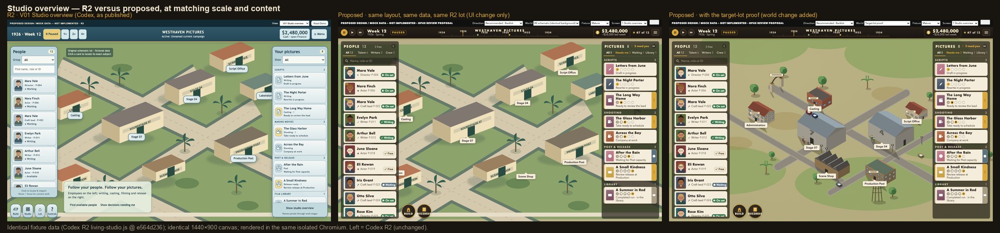
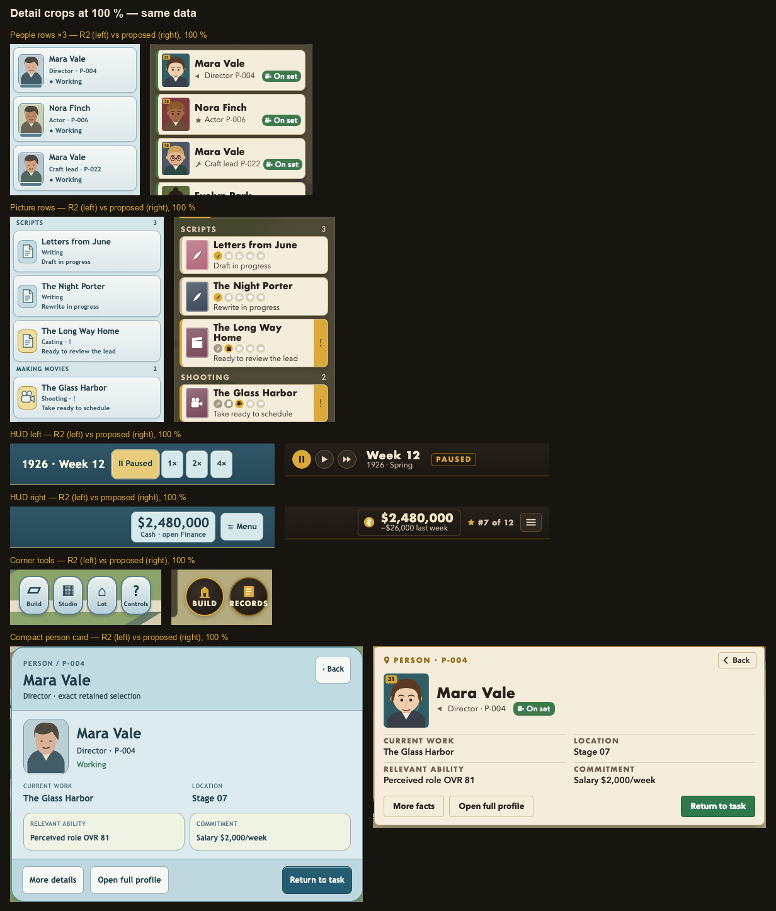
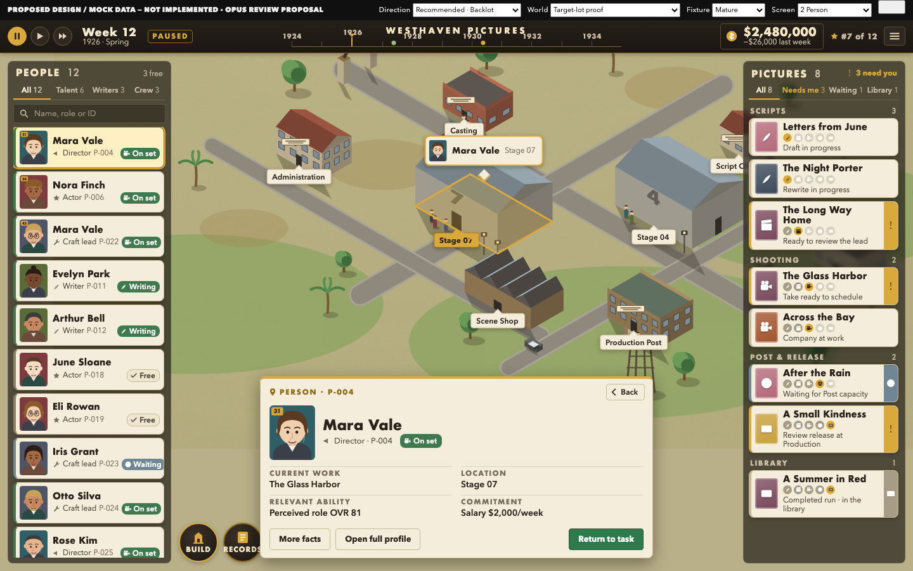
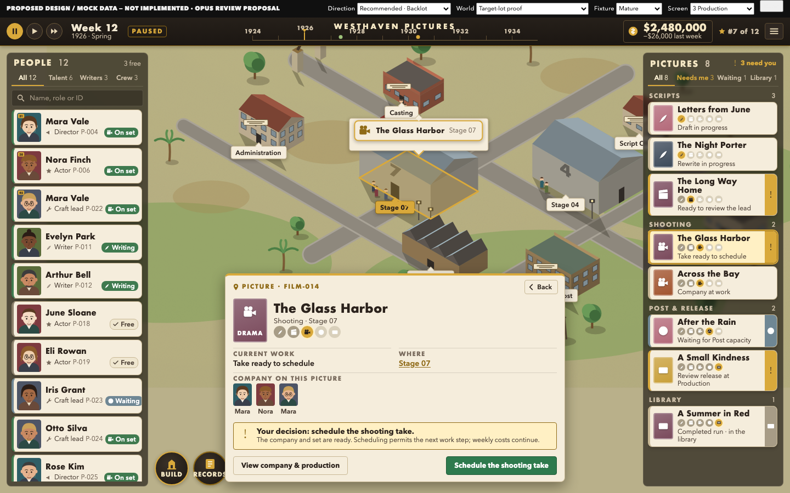
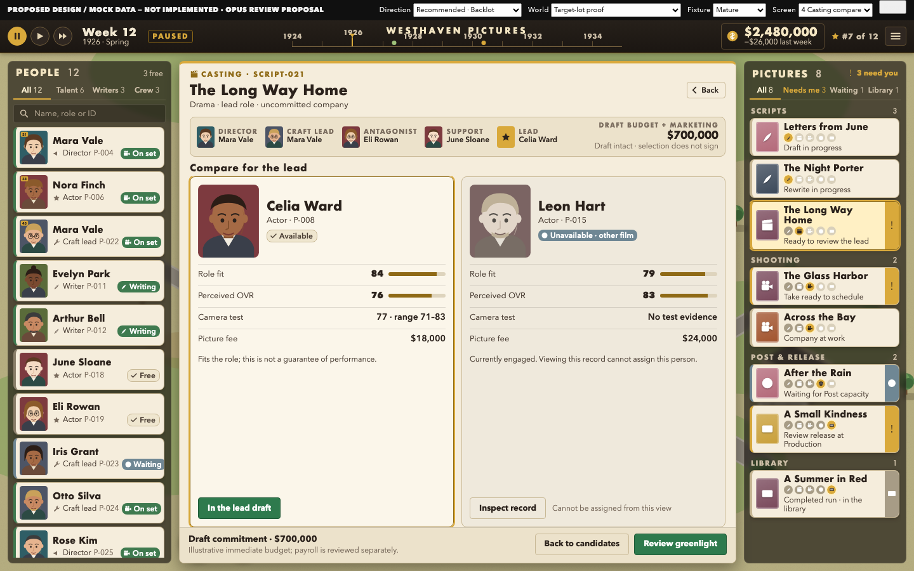
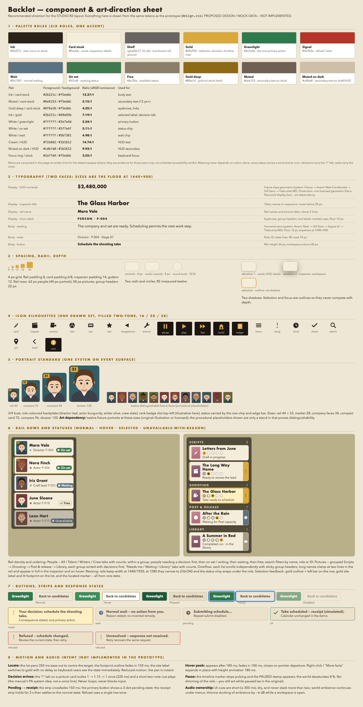

# OPUS INDEPENDENT GAME UI/UX REVIEW — R2 (`e564d236`) · visual index

**Status: PUBLISHED — OWNER DESIGN DECISION REQUIRED.** Independent principal-level
UI/UX and interface art-direction review of Codex's R2 visual blueprint. Codex remains
the author of R2; nothing here is implementation authority, a schedule or an assignment.
PROPOSED DESIGN / MOCK DATA — NOT IMPLEMENTED.

| | |
| --- | --- |
| Reviewed Codex R2 | `e564d236407cb3616ebc597713d5b9fa7d60b38a` (`docs/uiux-whole-game-review-01`; design content `1fab1a3a`); ZIP verified 21,736,950 B / SHA-256 `2096b670…8fc4` |
| This review | branch `docs/uiux-opus-r2-independent-review-01`, parent `234a36ef` (brief `05e9902e` + addendum) |
| One ZIP | `delivery/UIUX-OPUS-R2-INDEPENDENT-REVIEW.zip` — see `delivery/MANIFEST.sha256` and `delivery/package-manifest.json` |
| Handoff / resumability | `00-HANDOFF.md` |

## Executive verdict

**Layout: KEEP. Usability axis: PASS WITH REFINEMENTS. Visual-craft axis: FAIL — REDESIGN
the material, portrait, type and icon systems; the lot needs a specified art target.**
The Owner's reading is right on both counts: R2's composition (people left, pictures
right, lot centre, rails persisting through compact inspection) is the correct answer to
the R1 correction, and its rendered execution is not acceptable for a production
direction. The causes are concrete and measured, not a matter of taste (`FINDINGS.md`):
a diagram lot; one blank portrait repeated twelve times; nested pale-blue rounded panels
(12 radii, 9 shadows); mock/tutorial prose rendered as game UI; one system face with
10 px secondary text; Unicode-glyph icons; chrome that out-colours the world.

The middle column keeps R2's own schematic lot and data and changes only the UI; the
right column adds the target-lot proof. Judge the UI on the middle column.

## Recommended direction — "Backlot"

Two explorations were built on the same layout, data and viewport: **A · Card stock**
(finished evolution of Lionhead's card-stack language) and **B · Marquee glass**
(contemporary dark-glass rails). Recommended: **A refined with B's translucent shelf and
density** — it keeps the reference's vocabulary (cream index cards with badge slots,
stage pictograms, a year timeline, one round Build button, brass + greenlight accents)
and fixes A's world-leak and monotone defects. Reasons and judgments: `DESIGN.md`.

| Exploration A | Exploration B |
| --- | --- |
|  |  |

### Four key screens (clean · annotated · prototype)

| K1 Studio overview | K2 Person |
| --- | --- |
|  |  |
| [annotated](assets/design-renders/K1-overview-annotated.png) · `?screen=overview` | [annotated](assets/design-renders/K2-person-annotated.png) · `?screen=person` |

| K3 Production | K4 Casting compare |
| --- | --- |
|  |  |
| [annotated](assets/design-renders/K3-production-annotated.png) · `?screen=production` | [annotated](assets/design-renders/K4-compare-annotated.png) · `?screen=compare` |

Constraint variants: [early](assets/design-renders/V-early.png) · [long names](assets/design-renders/V-long-names.png) · [normal wait](assets/design-renders/V-waiting.png) · [compact rails (original's stacks)](assets/design-renders/V-compact-rails.png) · [1280×720](assets/design-renders/S-overview-1280-100.png) · [1280×720 @ 200 %](assets/design-renders/S-overview-1280-200.png) · [person @ 200 %](assets/design-renders/S-person-1280-200.png) · [compare @ 200 %](assets/design-renders/S-compare-1280-200.png). Journey captures J1–J14 in `assets/design-renders/`.

Comparison boards: [person 3-up](assets/design-renders/CMP-02-person-3up.png) · [compare 2-up](assets/design-renders/CMP-03-compare-2up.png) · [production 2-up](assets/design-renders/CMP-04-production-2up.png).

### Component / art-direction sheet

Editable source: `assets/design/` (`index.html` prototype, `components.html` sheet,
`design.css` tokens, `explorations.css`, `app.js`, `portraits.js`, `lot.js`, `data.js`,
`render.cjs` isolated render harness, `compare-boards.py`). Open `index.html` from the
extracted ZIP; keep the folder together. No packages, servers or network.

## Three most important changes

1. **Replace the material system** — translucent warm-dark shelf + cream card stock, two
   radii, two shadows, selection by outline; remove every mock/tutorial sentence from the
   game canvas (`V-03`, `U-06`, `U-07`, `V-10`).
2. **Make people and pictures recognisable** — one portrait standard with badge slots on
   every surface; genre poster tiles with the stage pictogram and five lit phase
   pictograms; gold "!" tab for decisions, grey clock for waits; counts in the headers
   (`V-02`, `U-09`, `V-14`, `U-16`).
3. **Give the interface a voice and a floor** — display face for numerals/names/titles,
   humanist sans body, 12 px reading floor; one drawn icon set; a 52 px HUD with the year
   timeline and the studio marque; site labels anchored to buildings and the selection
   lit on the lot (`V-04`, `V-05`, `V-06`, `U-05`).

## Read next

| File | What it holds |
| --- | --- |
| `FINDINGS.md` | Annotated R2 findings: 19 usability, 14 visual-craft; KEEP/REFINE/REDESIGN; acceptance checks; evidence crops in `assets/r2-evidence/` |
| `RESEARCH-ORIGINAL-GAME.md` | Reconstruction of the shipped Lionhead interface: manual pages, 3 traced footage workflows, 33 stills, documented behaviour; what transfers |
| `RESEARCH-COMPARATORS.md` | Seven-title evidence atlas (RCT2/3, Zoo Tycoon 1/2, Sims 2/4, Two Point Hospital, Planet Coaster/Zoo, Anno 1800, Hollywood Animal) with editions, quotes and dates |
| `DESIGN.md` | The two explorations, the recommended direction, four screens, factual vs illustrative data, retained-unchanged screens, art dependencies |
| `WALKTHROUGH.md` | Cognitive walkthrough of the eight tasks on R2 and the proposal; prototype defects found and fixed; Owner task scripts; future human tests |
| `HANDOFF-TO-CODEX.md` | Prioritized presentation and interaction changes, read-model dependencies, P13B boundaries, native gaps |
| `CHECKER.md` | The one bounded independent checker pass and its verdict |
| `SOURCES.md` · `PROGRESS.md` · `ASSIGNMENT.md` | Evidence register with inspection classes; dated log; the controlling prompt |

## Unresolved product choices for the Owner

1. **Rail names vs stacks.** The reference shows nameless portrait stacks; the proposal
   defaults to named rows and offers the stack as a "compact" mode. Which is the default?
2. **Lot art target.** The proof is code-drawn greybox-plus. Approving the UI direction
   does not approve a lot style; the lot needs its own art owner and fidelity ruling.
3. **Timeline and rank in the HUD.** Both are reference-faithful but need real data
   owners (events, studio rank) — keep as future slots, or drop.
4. **Portrait art.** Twelve fixture faces in one style is an art dependency (original
   illustration or licensed); the procedural placeholders only prove distinguishability.
5. **Retained R2 screens** (Build, Finance/Industry, campaigns, result, Laboratory entry)
   get the material system but were not re-drawn — confirm that scope for Codex.

## Review limitations (honest)

No uncoached usability study; the walkthrough is by a reviewer who designed the
proposal. The original game was not run; footage came from three identifiable YouTube
captures and the manual. The Owner's 25 reference screenshots exist in R2 only as
metadata and were not seen. Renders use macOS system faces (Futura, Avenir Next); the
CSS stacks fall back on other platforms. Two behaviour-lens crop files were mislabelled
(caught by the verifier; the facts are confirmed on the pages I viewed). One comparator
agent (Zoo Tycoon) could not fetch video and relied on manual pages. The gap-critic's
final coverage table is recorded in `PROGRESS.md` if it completed before packaging.
