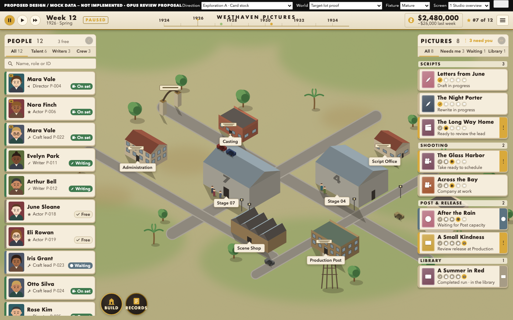
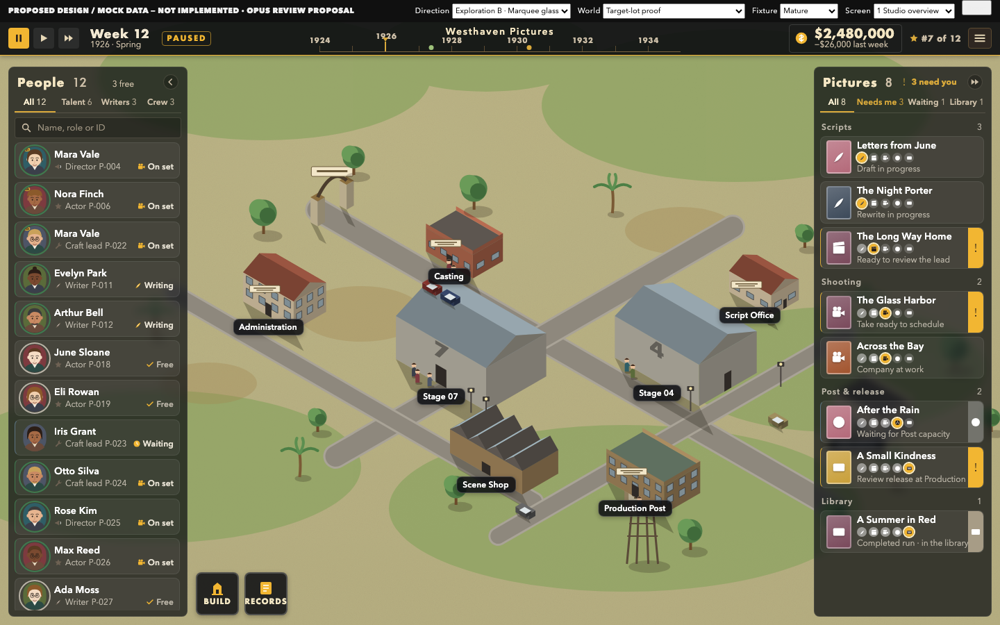
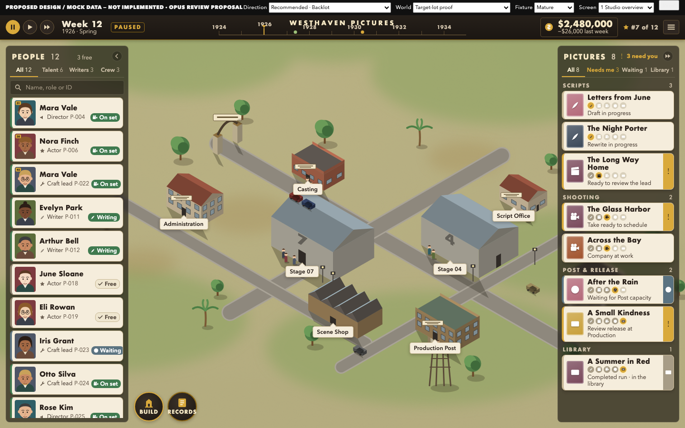

# DESIGN — two explorations, one recommended direction, four key screens

**PROPOSED DESIGN / MOCK DATA — NOT IMPLEMENTED.** Everything below is rendered from the
editable prototype in `assets/design/` (HTML/CSS/SVG + in-memory JS, no packages, no
network) with the same fixture data as Codex R2 (`data.js` = `living-studio.js` @
`e564d236`). Renders live in `assets/design-renders/`. The layout the Owner selected —
people left, pictures right, useful lot centre — is kept in every board.

## 1 · What the explorations had to solve

From `FINDINGS.md`: the R2 layout is right; its *material* is wrong. Seven causes, in
order: diagram lot; one repeated blank portrait; nested pale-blue rounded panels (12
radii / 9 shadows); mock and tutorial prose inside the canvas; one system face with 10 px
secondary text; Unicode-glyph icons; chrome that out-colours the world. The original
game's HUD (manual p.5; Steam stills; footage) is the opposite of R2's: tiny glossy
objects floating on a dominant world, portraits with badge slots, movie cards whose
*picture* changes with the stage, a timeline along the top, one round Build button.

## 2 · Exploration A — "Card stock" (finished evolution of the original's language)

- No shelf: cream index cards float directly on the world, as the original's star cards
  do; a cream header strip carries the group tabs and search; the HUD is cream too.
- Portrait cards with rank badge, name in a geometric display face, role + ID, status
  chip; picture cards with a genre-coloured poster tile, stage pictograms and the
  decision tab.
- Warm palette (card stock, brass, greenlight green), drawn two-tone icons, a year
  timeline in the HUD, round Build/Records tools.

*Judgment:* closest to the reference and immediately warmer than R2. Weaknesses seen in
the render: (1) the world shows through the gaps between cards, so site labels and props
leak between rows (see "Laboratory" poking through the right stack); (2) cream HUD + cream
cards + olive lot is close to monotone; (3) the search and tab controls look like web
form elements sitting on grass.

## 3 · Exploration B — "Marquee glass" (contemporary interpretation)

- Translucent dark-glass rails with white type and one amber accent; circular portraits
  with a role/status ring; single-line rows at higher density; the same poster tiles and
  phase pictograms; a dark HUD with the marque in a plain sans.
- The world reads as a bright picture inside a dark mount.

*Judgment:* clean, dense and legible, and it proves the layout does not need cream to
work. But it is the generic modern management look (it could be any 2018–2025 sim);
status colour is lost (every chip is amber-on-dark); the dark mount makes the lot feel
framed rather than inhabited. Its two good ideas — a translucent shelf that groups the
stack and holds tabs/counts, and denser rows with phase dots — are worth keeping.

## 4 · Recommended — "Backlot" (A refined with B's shelf and density)

Why this one: it keeps the reference's card language (cream stock, badge slots, stage
pictograms, timeline, round Build) and fixes A's two defects with B's shelf — a
66 %-opaque warm-dark ground behind each stack that stops the world leaking between
cards, carries the tabs/counts/search in a quieter register, and gives the HUD and rails
one dark family so the lot is the brightest thing on screen. Density comes from B (62 px
people rows, 58 px picture rows). Nothing is black-and-gold for its own sake: gold is one
accent used for exactly three things — selection, decision, "now" on the timeline.

### Four key screens (clean + annotated + editable source)

| Screen | Clean | Annotated | Prototype |
| --- | --- | --- | --- |
| K1 Mature studio overview — people, writing/scripts, mixed production states | `assets/design-renders/K1-overview.png` | `K1-overview-annotated.png` | `index.html?screen=overview` |
| K2 Exact-person compact inspection, studio still tracked | `K2-person.png` | `K2-person-annotated.png` | `?screen=person` |
| K3 Exact production with decision strip, company faces, worksite | `K3-production.png` | `K3-production-annotated.png` | `?screen=production` |
| K4 Casting compare at higher density | `K4-compare.png` | `K4-compare-annotated.png` | `?screen=compare` |

Constraint variants (to expose limits, not to inflate the count): `V-early.png` (3 staff,
1 script — and the lot only has the buildings that exist), `V-long-names.png`,
`V-waiting.png` (normal Post wait, no invented remedy), `V-compact-rails.png` (the
original's portrait/poster stacks as a player-selectable density), `S-overview-1280-100`,
`S-overview-1280-200`, `S-person-1280-200`, `S-compare-1280-200`.

### Comparison against R2 at identical scale and data

| Board | File |
| --- | --- |
| Overview 3-up: R2 · proposed on R2's own lot (UI change only) · proposed on the target lot | `CMP-01-overview-3up.png` |
| Person 3-up | `CMP-02-person-3up.png` |
| Casting compare 2-up | `CMP-03-compare-2up.png` |
| Production 2-up | `CMP-04-production-2up.png` |
| Detail crops at 100 % (rows, HUD, tools, compact card) | `CMP-05-detail-crops.png` |

The middle column of `CMP-01` isolates the UI craft from the world: the same schematic
lot as R2, the same data, only the chrome changed. Judge the UI there; judge the world
target in the right column.

### What is factual data and what is illustrative

Factual (from R2's fixture): every name, ID, role, status, picture title, phase, state,
place, cash, date, the Celia/Leon numbers, the $700,000 draft. Illustrative (added only to
show a device, and labelled in `data.js`): rank badges (31/38/45), the studio rank "#7 of
12", the "−$26,000 last week" delta, the timeline event pins, the "Spring" season word,
the company-face rows (derived from the fixture's `work` field), the 12 procedural faces.

### Screens retained from R2 unchanged (and why)

Build catalogue / placement / construction (V05), Finance and Industry (V06), campaign
and preference reviews (V07), film result (V08) and the P13B Laboratory entry are not
re-rendered. Their *structure* passed the usability axis; they need only the material
system from the sheet (tokens, radii, type, icons, strips) applied. Re-drawing them here
would have displaced the design work the brief asked for.

## 5 · Component / art-direction sheet

`assets/design/components.html` → `assets/design-renders/C01-component-sheet.png`:
palette roles with computed contrast pairs, the two-face type scale with size floors,
spacing/radii/depth rules, the drawn icon set, the portrait standard (one system on every
surface; twelve distinguishable placeholders), rail rows and statuses (normal / hover /
selected / unavailable-with-reason), buttons (normal / hover / pressed / focus /
disabled), response strips (decision / wait / pending / receipt / refused / unresolved),
rail density, ordering, grouping, overflow, resizing and selection feedback, and the
motion/audio intent.

## 6 · Art dependencies declared

1. **Lot art target.** The target-lot proof is code-drawn "greybox-plus". The real lot
   needs textured ground, building materials, signage, posed people and props at least at
   this fidelity — an art task with its own owner. The UI is judged on the R2-lot column of
   `CMP-01` until then.
2. **Portraits.** Twelve fixture faces at 44/72/96/120 px in one style (original
   illustration or licensed), plus the badge-slot convention.
3. **Type.** A licensed geometric Deco-flavoured display face and a humanist sans. Renders
   here use macOS system faces (Futura, Avenir Next); the CSS stacks fall back to Gill
   Sans / Trebuchet MS and the layout does not depend on metrics.
4. **Icons.** The 21 drawn silhouettes in `app.js` are a starting set to be redrawn by an
   icon artist at 16/20/28.
