# RESEARCH — comparator evidence atlas (seven titles, depth over breadth)

Each title was studied by one research subagent from primary sources (official manuals
as PDF pages, developer UI posts/interviews, official screenshots, and 1–2 identifiable
gameplay videos frame-sampled then deleted); community threads were used only for
*reported* frustrations, quoted and dated. Editions are stated per row; OpenRCT2 and other
re-implementations are never credited to the originals. Excerpt frames (limited,
downscaled) are in `assets/comparators/`; raw observations in `assets/research-raw/`.
Evidence classes as in the original-game file. "→ STUDIO" = what transfers to a
left-people / right-pictures / centre-lot HUD; "✗" = what should not.

## RollerCoaster Tycoon 2 (Infogrames, 2002; Steam Triple Thrill Pack build) and RCT3 (Frontier, 2004; Complete Edition)

Sources: RCT2 base manual PDF (Steam app 285330), Wacky Worlds manual, 5 + 6 official
Steam screenshots, two gameplay videos (frames viewed), two dated Steam threads.

- **Chrome budget under 10 % of height** (still, HIGH): two small icon clusters top-left/top-right plus a single bottom status line; the isometric park is always fully visible. → STUDIO: keep always-on chrome to the two rails + one thin HUD; the lot stays dominant. ✗ 20–24 px glyph-only buttons with no text.
- **Catalogue as a small window over the world** (still, HIGH): "New Gentle Rides" is a ~330×230 draggable window: 5×2 picture tiles + one enlarged preview + one stat line; park unblurred behind it. → the Build catalogue and the picture rail can be tile + expanded detail without leaving the lot. ✗ it is transient, not a permanent rail.
- **In-world nameplate for the selection only** (still, HIGH): "Dianna S. (Walking)" drawn beside the sprite, no window. → the located marker over the building; ✗ permanent multi-label clutter.
- **Toolbox of small non-modal windows** (doc + seq, HIGH): the manual's tutorial leaves windows open; footage shows 2–4 overlapping at once with no bookkeeping. → compact cards may coexist; ✗ unmanaged sprawl.
- **One most-urgent alert slot** (still, HIGH): bottom-centre carries exactly one line ("Twist 1 has broken down"; the German build's longer string fits the same slot). → a single flexible line is localisation-safe; ✗ it cannot show two concurrent problems — the proposal's counts in the tabs do.
- **RCT3 moves chrome to one left-edge rail** (still, HIGH) with an anchored build list (thumbnail + name + price) and a small live inspector card that follows the hovered ride. → validates an edge rail over a live world and an anchored list; ✗ undifferentiated circular icons.
- **Fixed-pixel chrome dies at 4K** (doc, MED): Steam thread 2023-01-07 "trying to play in 4k but the UI is basically non existent"; Ctrl+U scaling from earlier titles does not work; no fix by June 2024. → DPI-independent sizing from day one.

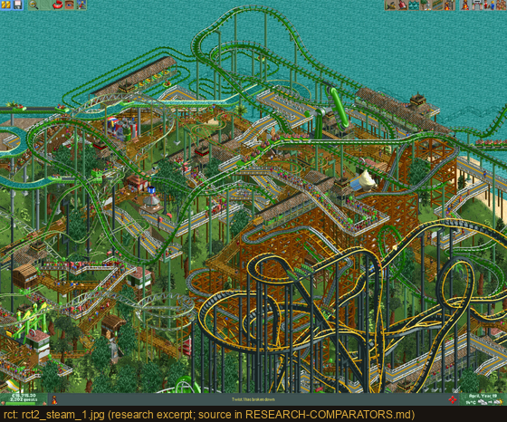 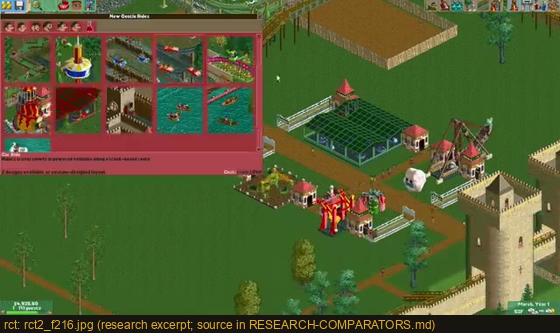 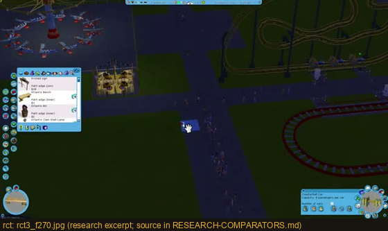

## Zoo Tycoon (Blue Fang/Microsoft, 2001) and Zoo Tycoon 2: Ultimate Collection (2008 compile of the 2004 game)

Sources: both official manuals (archive.org scans, page images viewed). Video and
MobyGames were blocked for this agent (403s); observations are manual-diagram based.

- **Fused status strip** (still, HIGH): ZT1's bottom strip is pause · date · cash · Zoo Status · Animal / Guest / Staff list buttons, each roster button carrying its own mini happiness meter. → a rail header can carry one inline meter (e.g. "3 free"); ✗ fusing unrelated data with only spacing as grouping.
- **One selected-entity card for animal / guest / staff** (still, HIGH): same structure (name, action-icon row, meter stack), tabs differ. → one inspector template for person and picture; ✗ the thin floating palette with a tiny portrait.
- **Colour ramp reserved for problems** (doc, HIGH): only guest anger and fence failure go yellow/red; other meters are length-only. → gold/red only for decision/refusal; routine stats stay neutral.
- **Persistent minimap + non-modal panels** (still, HIGH). → wayfinding stays visible under any panel.
- **ZT2's three control tiers** (still, HIGH): utility grid, four big mode buttons, a visibility-toggle strip — ~20 buttons kept legible by shape and position. → separate global, mode and filter controls; ✗ the raw count.
- **Tab-over-filter-over-grid catalogue template** reused across construction/animals/landscaping (still, HIGH); a community mod later added name search (doc, MED). → build search into any catalogue expected to exceed a screen.

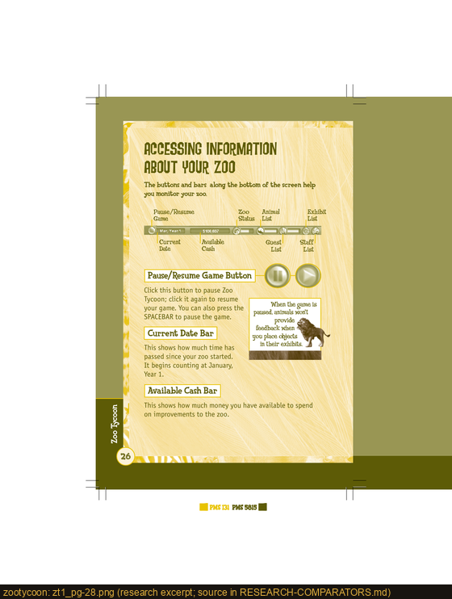 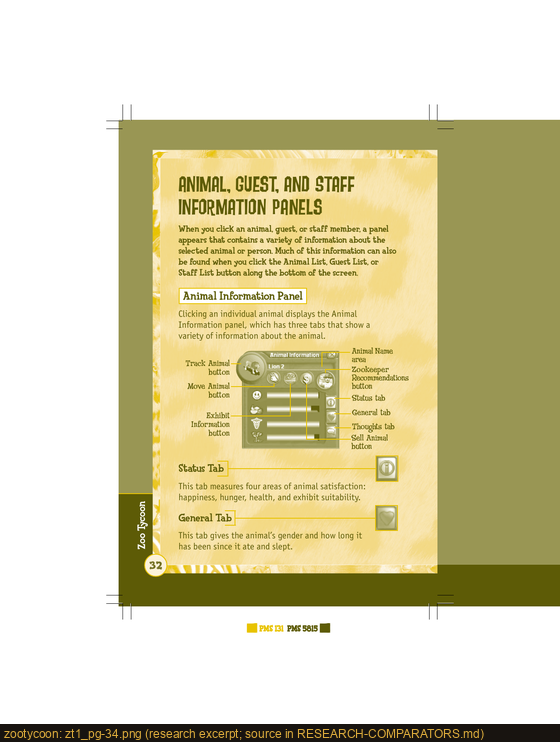 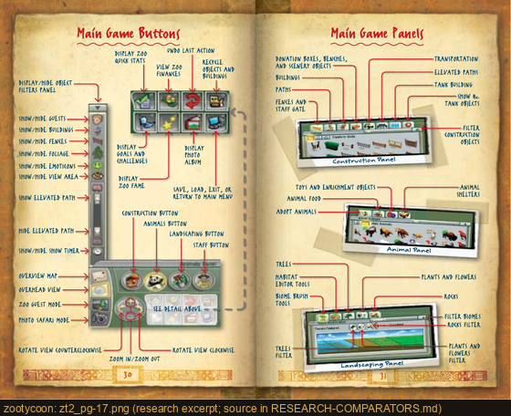

## The Sims 2 (Maxis, 2004) and The Sims 4 (2014; official Players Guide + a current-build video)

- **Sims 2 corner cluster** (still, HIGH): a radial dial of mode buttons around the active Sim's rectangular portrait, tick bars and name/age beneath, money pill; ~1/6 of screen width, semi-transparent, never blocks the lot. → fixed-corner status that survives camera moves; ✗ the radial shape.
- **Household portrait column** (still, HIGH): small square headshots stacked at the far-left edge, the active one green-bordered; length follows roster size. → maps directly to the people rail; ✗ 24 px thumbnails.
- **Wants / Fears twin strips** (still, HIGH): green and red 4-slot strips beside the portrait. → an opportunities-vs-risks pair could live in the pictures rail; ✗ thought-bubble art.
- **Buy Mode reuses the same dock** (still, HIGH): the catalogue occupies exactly the Live panel's position and height; the lot stays visible. → dock the Build catalogue where the corner tools are; never a new screen.
- **HUD footprint fixed across zoom** (seq, MED); minimap only at wide zoom. → keep the rails constant.
- **Sims 4 needs flyout** (still, HIGH): six needs as icon + label + bar in a card that appears on interaction; default dock is compact. → default-collapsed detail with one-click expand (the proposal's "More facts").
- **Portrait with emotion ring** (still, HIGH). → one colour ring can encode one high-priority state; ✗ nesting the action queue inside the portrait.
- **Controls** (doc, HIGH): click portrait = select; right-click portrait = lock camera; Space/N cycles Sims; Enter centres camera. → left-click locate, right-click facts, keyboard cycling.
- **Panel bloat over a live product** (nv, LOW — EA forum snippet only). → design a pinning/priority mechanism if the inspector will grow.

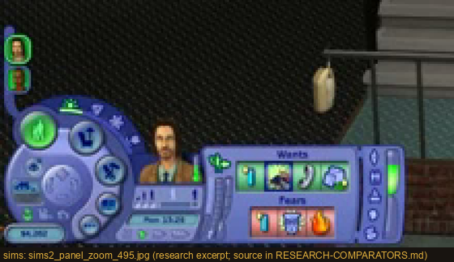 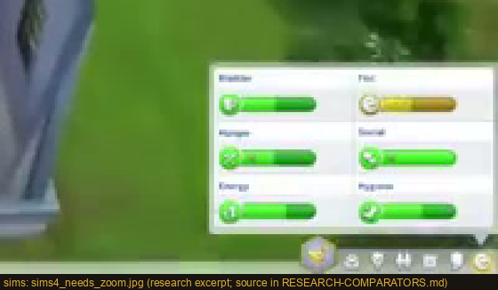

## Two Point Hospital (Two Point Studios / SEGA, 2018; pre-release developer-commentary build viewed, plus launch trailer and MCV/DEVELOP interview)

- **Two corner clusters, never one bar** (still, HIGH): build tools bottom-left; cash / reputation dial / transport / date in a dark-teal capsule bottom-right. → status cluster and action tools stay separate.
- **One saturated highlight for the armed selection** (still, HIGH): the item being placed is solid yellow on flat teal; a top strip narrates the current action. → gold as the single selection colour (adopted).
- **The world is never covered** (still, HIGH): even a complaint alert is a small ticker. → alerts as strips near the rails, not modals (adopted).
- **Developer intent** (doc, MED): Gary Carr — "A lot of PC games have very small icons which look incredibly complex… chunky and accessible UI that didn't intimidate people"; "Make people think it's easy to use and then further down it gets more complex." Mark Webley — "We probably underestimated just how much work the UI was going to be." → progressive disclosure: large first layer, depth behind a click.
- **Chrome hue sampled from the world** (still, MED): the UI teal matches the corridor floors. → sample the studio's own palette (card stock, concrete, brass) rather than generic dark/white app chrome (adopted).
- Staff Inspector panel details (nv, LOW): sources blocked; not cited.

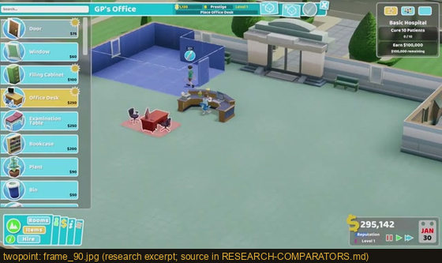 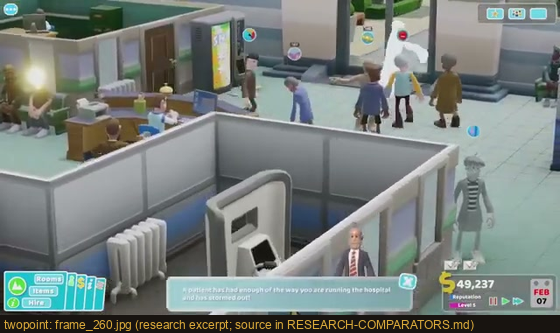

## Planet Coaster (Frontier, 2016) and Planet Zoo (Frontier, 2019) — not Planet Coaster 2 / Console Edition

- **Edge-docked panels at 20–35 % width; the world keeps rendering** (still, HIGH), even on the widest overview screen. → never black out the lot (adopted).
- **Two panel weights** (still, HIGH): a narrow single-entity card (name, one status word, rating, 1–2 bars) vs a wide 9-tab numeric table. → compact inspector vs deliberate workspace (adopted: K2/K3 vs K4).
- **Compact keeper card** (still, HIGH): name, 4 icon tabs, "Wandering", 5-star skill row, two need bars — status by bars/stars, numbers reserved for the table. → fit/OVR bars beside numbers in compare.
- **Heatmaps as an exclusive mode** with the category switcher visible (still, HIGH). → the original's "L" attractiveness overlay would be a later toggle, not a permanent layer.
- **Selection drawn on the ground plane** (still, MED): green ring + dashed footprint. → the proposal's footprint outline (adopted); ✗ the circle (isometric = tile outline).
- **Reported frustrations** (doc, HIGH): 2019-11-14 "Building barriers click by agonising click. Can't I just drag?" (discoverability of existing gestures); 2019-09-24 a visually impaired player: "the surfaces and texts in the game are too small" — moderator confirms 160 % cuts off menus, no step between 100 and 160. → fine-grained UI scale is an accessibility requirement, not a polish item.
- **Icon-only tab rails** (still, MED) mostly work for zoo/coaster pictograms; a studio's department vocabulary is less standard. → label the tabs (adopted).

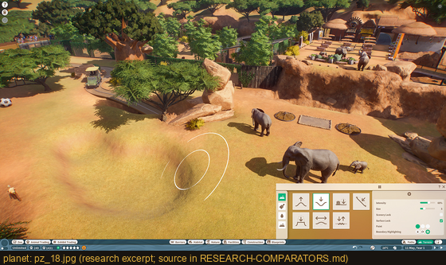

## Anno 1800 (Ubisoft Blue Byte, 2019; Anno Union UI and Visual Feedback dev blogs, official screenshots, one no-commentary walkthrough)

- **Thin dark translucent top bar** (still, HIGH) at ~5 % height with treasury/population/influence and a notification badge on the player portrait. → the proposal's 52 px HUD.
- **Parchment side panel ~22 % wide on selection** (seq, HIGH): icon/portrait header + 2–4 stat rows; the world stays pannable. → compact inspector proportions.
- **World-anchored radial on a placed foundation** (seq, HIGH) with a label ribbon (name, cost, countdown). → anchor building actions at the building (site labels); ✗ icon-only wheel.
- **Population card** (still, HIGH): painted portrait bust in warm sepia, tabs, count, satisfaction bar, incidents footer, "Jump To Object". → portrait as emotional anchor + one meter + a locate action.
- **Advisor toast bottom-centre** for the current problem (seq, HIGH); no stack observed.
- **Developer intent** (doc, HIGH): "form follows function", darker/desaturated tones for persistent HUD, brighter colours reserved for notifications; period flavour lives in the world and the portrait illustration, not in ornate borders. → this is the argument against "gradients and bevels everywhere" (adopted).
- **Reported scaling gap** (doc, MED): 2023-03-08 "I almost need a microscope to read the words"; official 2023-03-14 reply: only Large Subtitles can be enabled. → same lesson as Planet Zoo.

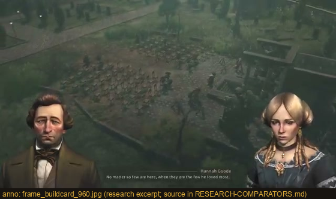

## Hollywood Animal (Weappy Studio, Steam Early Access since 2025-04-10; 14 official screenshots + two EA reviews)

- **The lot is the permanent home** (still, HIGH): top bar with date/speed and four counters; a left objectives list; right-centre floating cards for up to three in-progress scripts with writer, stars and dual bars; finished films along the bottom. → confirms the persistent-cards-on-the-lot model; ✗ the sheer amount of concurrent chrome.
- **One canonical talent card** (still, HIGH) — portrait, name, role icon, star rating, two coloured meters, a small genre/role icon row — reused in casting, scandal, hiring and dark-ops screens. → one portrait/card system everywhere (adopted).
- **Decision-screen anatomy** (still, HIGH): fixed subject card + illustrated mutually-exclusive choice tiles with a clear selected border. → for genuine choices, large tiles; for acknowledgements, one button.
- **Full-screen ceremony for awards** (still, HIGH) in a painted Art-Deco theatre; reviews report unskippable transitions become "a chore". → reserve full-screen for rare beats and make them skippable.
- **Reported frustration is about withheld information, not density** (doc, MED): GameLuster — "the optimum number of those rentals is never well defined… you're either overbooking… or underbooking"; opaque post-shoot feedback. → truthful blocked reasons and consequences stated on the card (R2 already does this; kept).
- **Art direction praised** (doc, MED): "The UI is still good and contextual. The building designs are period appropriate." → a coherent period register is achievable without ornament.

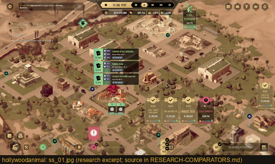 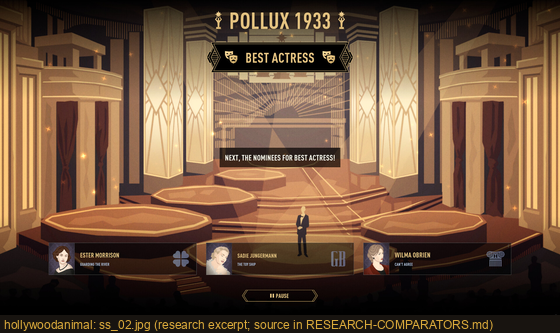

## Cross-title synthesis — what the proposal adopted

| Dimension | Consensus across titles | Adopted in the proposal |
| --- | --- | --- |
| Persistent staff/project awareness | Small portrait/tile stacks at the screen edge (The Movies, Sims 2, Hollywood Animal); counts/meters in headers (ZT1) | People/pictures stacks with counts, "N free", "N need you" |
| Portrait/card craft | Face + one badge + one bar (The Movies, Sims 4 ring, Anno bust, Hollywood Animal card) | Portrait standard with badge slots; status chip + edge bar |
| Compact status | Words/bars/stars at the card tier; numbers in the deliberate view (Planet, ZT1) | Phase pictograms + state line; numbers only in compare |
| Density/hierarchy | Progressive disclosure; large first layer (Two Point) | 62/58 px rows; "More facts"; compact rail mode |
| Contextual vs full-screen | Never cover the world (all); full-screen only for rare ceremony (Hollywood Animal, The Movies awards) | Compact inspector + rails; workspace keeps rails |
| Camera & selection | Ground-plane selection + jump (Planet, Sims, The Movies) | Footprint outline, gold site label, lot pan |
| Navigation continuity | Same dock for catalogue and live panel (Sims 2) | Corner cluster = Build + Records only |
| Critical alerts | One line or strip near the action (RCT2, Two Point, Anno); shape+colour (The Movies) | Decision strip with "!"; counts in tabs |
| Keyboard/mouse | Click select / right-click detail / key to cycle (Sims 4, The Movies) | Same, plus 1/2 hotkeys |
| Readable scaling | Multi-year unresolved complaints when absent (RCT3, Planet Zoo, Anno) | 12 px floor at reference; 1280 canvas; 200 % mode; flagged native requirement |
| Coherent identity | Sample the world's palette; flavour in content and portraits, not borders (Two Point, Anno) | Card stock / brass / greenlight; no bevels |
