# RESEARCH — the shipped Lionhead *The Movies* (2005) interface, reconstructed from primary evidence

Method (four lenses plus a completeness critic that filled three gaps from a fourth video): the official manual was viewed page by page (Opus: printed pp.4–9 at 80–260 dpi;
a research subagent: all 22 PDF spreads at 110 dpi). Four identifiable retail gameplay
videos were downloaded at ≤480p, contact-sheeted and frame-sampled, then deleted; three
continuous workflows were traced with timestamps. Thirty-three official/retail stills
were viewed (15 Steam store screenshots for app 7900; 9 MobyGames 2005 thumbnails via the
Wayback Machine; 4 GameSpot review captures with captions; 6 Stunts & Effects marketing
renders). Documented behaviour came from the manual, a GameFAQs walkthrough, PCGamingWiki
and three Fandom facility pages (Wayback). A separate adversarial verifier re-opened 29
cited frames: 18 supported, 9 partly, 2 refuted; the 2 refutations were **mislabelled
crop files** in the behaviour lens, not wrong content — the same facts are on manual
pp.5 and 7, which I viewed myself (`assets/original-game/manual-p5-hud-diagram.png`,
`manual-p6-7-cards-crops.png`). Where a subagent's claim rests on a mislabelled file it is
cited here to my own crop instead. Full source rows are in `SOURCES.md`; the research
agents' raw observations are preserved verbatim in `assets/research-raw/`.

Evidence classes: **still** = visible in a still; **doc** = documented behaviour;
**seq** = observed sequence in footage; **inf** = inference; **nv** = not verified.
Edition: base game unless stated. All frames are limited illustrative excerpts with the
source locator in the caption; no Lionhead asset is reused in the proposal.

## 1 · The HUD in one picture

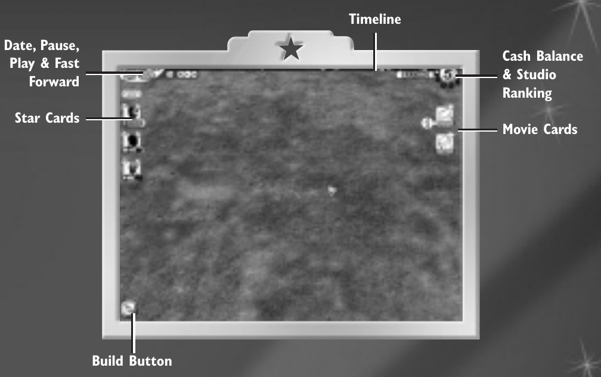

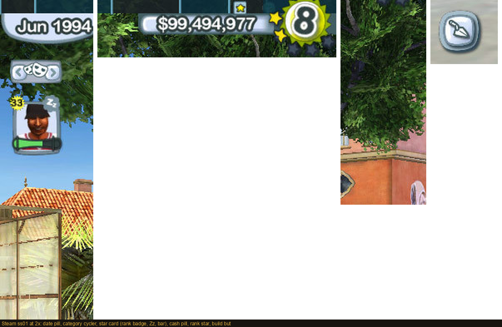

| # | Observation | Class | Source / locator | Lesson for STUDIO |
| --- | --- | --- | --- | --- |
| O-01 | The world fills the screen. Persistent chrome is a ~30–36 px top strip (date pill, timeline, VCR transport, cash pill, rank star), a left stack of 3–7 small square star cards (~60 px, ≈6 % of width), a right stack of 2–5 movie/task tiles, and one round Build button bottom-left. **No container panels.** | still / doc | Manual p.5 diagram; Steam ss01/02/07/08; GameSpot gs02 | The reference's rails are *card stacks over the world*. Any rail material must recede; R2's opaque panels invert the reference. |
| O-02 | Star card = rendered face, **rank numeral in a starburst badge top-left**, activity glyph top-right (lightning = available, Zz = off-duty), a glossy pill **status bar underneath** (green→red); **no name on the card**. Category cycler (arrows + masks icon) above the stack. | still / doc | Steam ss01 2x crop; ss02 (7 cards, ages 37–45 overlaid); manual p.6 | Portrait + two badge slots + one bar is the compact status vocabulary. A readable modern version adds the name, which forces wider cards — hence the shelf in the proposal and the "compact" mode that restores the stack. |
| O-03 | Movie card stage is shown by **swapping the pictogram**: quill → script+check → clapper → camera → film can → released can with a pulsing "$"; genre glyph top-right; progress bar bottom; chart-rank numeral when released. | still / doc | Manual p.7 (my crop); Steam ss04/ss11 tiles | Stage by image, attention by a pulsing overlay: the proposal's poster tile + five stage pictograms + "!" tab derive from this. |
| O-04 | Left-click a star card = camera jumps to the person; hold-drag = pick up; right-click = all information bubbles instantly; click cash = Finance; Build = corner button with Facilities / Sets / Landscape sub-menus. | doc | Manual pp.6, 8, 10 | R2 KEEPs click-locates, right-click-expands, cash→Finance, corner Build. The camera jump is the part R2 only gestures at. |
| O-05 | Information bubbles: hover → after a wait, priority-sorted oval bubbles on thin lines from the subject; red "!" = wrong, blue "i" = info; click to burst; bars with thresholds. Pips: diamond icons with red/green backgrounds for negative/positive change. Guiding star trail from a picked-up item to the sensible destination; Tab jumps to the highest-priority stream. PA-system audio. | doc / still | Manual p.8; Steam ss12; GameSpot gs01 | Two notification tiers (ambient pips vs on-demand bubbles); alert semantics by shape+colour; selection connected to the world by a trail. |
| O-06 | Timeline along the top edge, one segment per year, with event pins; pause = "audit yes, manipulate no" (no pick-up/drop while paused); P toggles pause. | doc / still | Manual p.5; Steam ss01 top strip | A year ruler is part of the identity and the era cue; pause is a world state. |

## 2 · Three continuous workflows from retail footage (observed sequences)

Videos: **V1** "The Movies – Ep. 1 – Movie Studio Tycoon" (PHENIXX BUILDS, 2020-03-28, 35 min;
main menu carries Stunts & Effects branding, base-game-shaped menu); **V2** "Lets Play
Classics – The Movies on PC" (Monkiedude22, 2017-01-31, 79 min); **V3** "The Movies (2005)
– Gameplay [1080p60]" (Mausser, 2024-12-31, 25 min, fast-forward throughout). All
unobstructed UI, no webcam overlay.

**W-A Construction (V1 5:00 → 14:00).** Empty lot with the full HUD (5:00) → corner Build →
Facilities catalogue: a translucent pale-blue list of 8 priced rows with owned counts
(8:56) → a **red-outlined footprint tracks the drag** (8:58–9:00, moves and rotates
between frames) → **yellow/black hazard tape** once a valid site is accepted, cash ticking
down (9:02–9:06) → scaffold and tarp (6:20–7:00 on another building) → working lot with
guard booth and traffic (14:00).

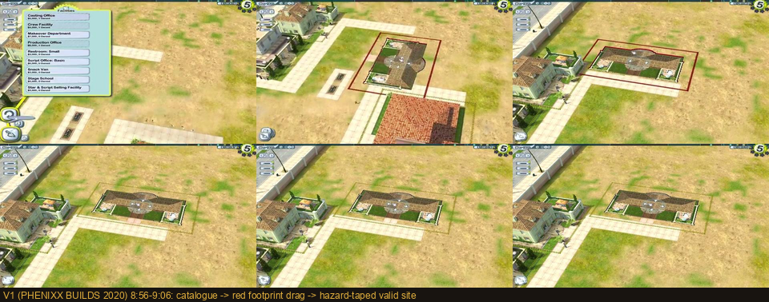

**W-B Script → shoot → release → watch (V2 24:00 → 28:20; V3 blocker).** Quill icon in a
bubble anchor over the stage (24:00) → the bubble expands to a **"Shooting Schedule"
popup** with genre, progress bar and verbatim tutorial copy (24:20) → the same widget
hovered on "Fast Forward" (24:40) → (V3) scene-level status "Assembling on set… Scene
3/3" and a **blocker**: casting panel with a red flag on the understaffed zone while the
**cash pill turns red** (−$7,388) → "Released!" framed card with quality stars and word
grades (26:40) → the finished film **plays in video-player chrome** (27:00–28:00) →
disclaimer and fake company logos (28:20).

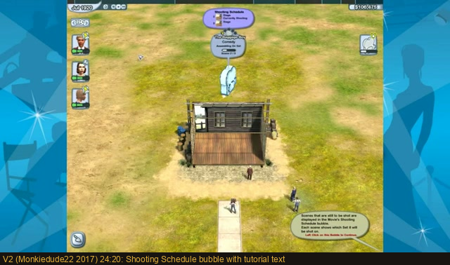
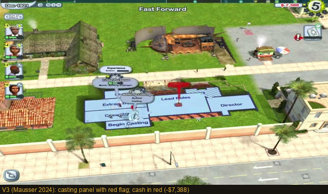
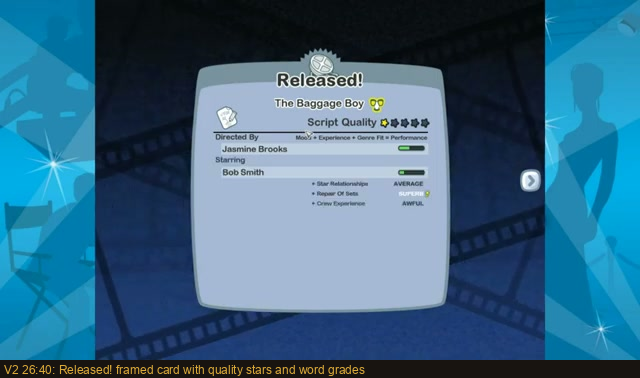

**W-C Hire / casting from the building (V1 20:00 → 30:10).** Large translucent
diagonal-striped **zone panels lie on the ground** of the facility ("Create Director",
"Fire") with numbered roster portraits stacked beside them (20:00) → a 5-cell genre strip
(Horror / Sci-Fi / Fire / Action / Comedy) (23:40) whose cells swap content ("Script Pool",
selected = solid green) (26:20, 30:10) → casting panel "Director / Lead Roles / Crew 2/2 /
Extras 1/1 / Shoot It" with a **red circular badge on the unfilled Director cell**
(25:40) → (V3) "Begin Casting" as a discrete button with four numbered portraits and thin
green bars stacked at screen-left.

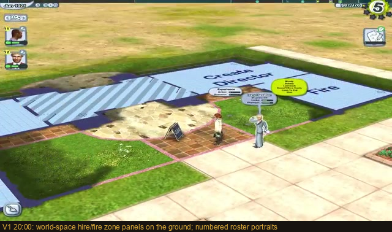
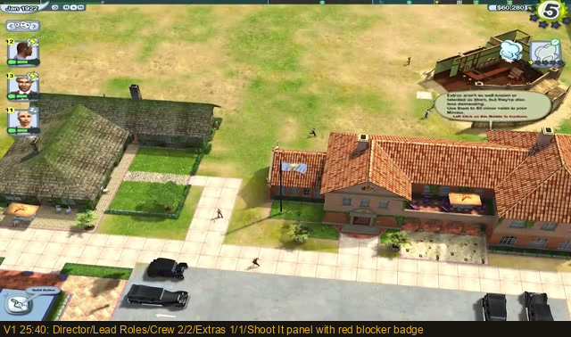

Not found in ~2 h of sampled footage (classed **nv**, not absent): a post-hire persistent
person-inspection panel (the closest analogues are the pre-hire StarMaker attribute sheet
and the small portrait+bar rows inside casting panels); a distinguishable right-click
menu (the manual documents right-click = all bubbles). Two different release-summary
layouts (V1 numeric stars + critic-quote cards; V2 plain word grades) could not be
attributed to a version/setting from footage alone.

**W-D (gap-fill) Custom script → catalogue → finance → charts (G1, "This game lets you
create hilariously bad movies", YouTube GNA4MAzei4s, 25 min).** The workflow's
completeness critic found three weak situations and filled them from a fourth video: the
Advanced Movie-Maker's **4-act structure bar** with empty scene slots (13:39) → the
**Sets catalogue** (priced rows in a pale rounded list, a hover tooltip card with picture
and description, 13:45) → the authored script **playing back as a finished film** (13:52)
→ hovering the cash figure cycles "Click to view Studio Charts" / "Finance Screen"
(15:53–15:54) → the **Star Salaries** framed screen (rank badge, tiny portrait,
satisfaction bar, influence diamonds, salary with a raise stepper, total) (16:11) → the
**Studio Charts** ranking whose rows visibly re-sort rather than hard-cut (two frames 11 s
apart). It also caught the **selected-person bubble cluster** in real footage: Work /
Stress / Boredom bars, a central named bubble with a red "!" ("Threatening to quit on
29 October 1958. Talking."), Status/Image and Fashion satellites.

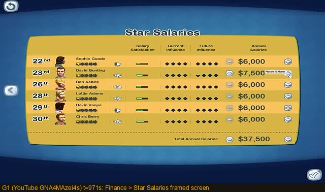
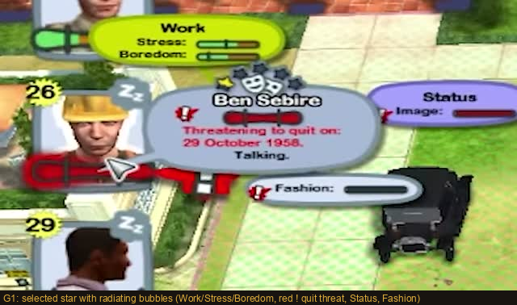
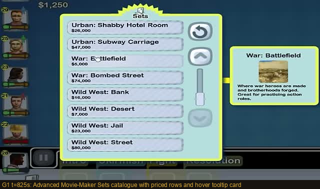
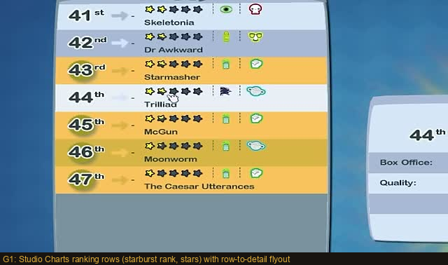

## 3 · Situations required by the brief — coverage

| Situation | Evidence | Files |
| --- | --- | --- |
| Early studio | V1 5:00 empty lot; Steam ss04 (Oct 1929, sparse) | `footage-v1-5m00-empty-lot.png` |
| Busy mature lot | V1 14:00; Steam ss13–15 (hero renders, no HUD — aspirational) | `footage-v1-14m00-working-lot.png` |
| Employee / category navigation | Steam ss01 cycler; ss02 (7 cards); manual p.6 | `steam-ss01-hud-crops-2x.png`, `steam-ss02-left-rail-excerpt.png` |
| Selected person | Steam ss12 (Dave Woods bubbles); gs01 (name/movie/state + Work/Stress bubbles); G1 full radiating cluster with red "!" | `steam-ss12-bubbles-excerpt.png`, `gamespot-gs01-bubbles-excerpt.png`, `footage-g1-selected-person-bubbles.png` |
| Script development / finished script | Manual p.7 stages; V2 24:00–24:40; G1 act-structure bar, Sets catalogue, playback | `manual-p6-7-cards-crops.png`, `footage-v2-24m20-shooting-schedule.png`, `footage-g1-13m39-act-structure.png`, `footage-g1-13m45-sets-catalogue-tooltip.png` |
| Casting / building work areas | Steam ss05 (Lead Roles floor zones); V1 20:00 / 25:40 | `steam-ss05-casting-floor-excerpt.png`, `footage-v1-*` |
| Filming / blocker | V3 red flag + red cash; V1 25:40 red badge | `footage-v3-blocker-red-cash.png` |
| Post / release | V2 26:40 Released; V1 31:40 reviews; MobyGames thumb 01 (editing filmstrip, MED) | `footage-v2-26m40-released-card.png`, `footage-v1-31m40-critic-reviews.png` |
| Construction catalogue / placement | V1 8:56–9:06 | `footage-v1-drag-sequence-8m56-9m06.png` |
| Detailed management view | G1 Star Salaries screen and Studio Charts (seq); manual p.6 Studio Ranking thumbnail; MobyGames awards screen (Spanish build, MED); GameFAQs Finance/Salary routes (doc) | `footage-g1-16m11-star-salaries.png`, `footage-g1-studio-charts.png`, `manual-p6-7-cards-crops.png` |
| Hover / primary / secondary / held gesture | Manual pp.6, 8, 10 (doc); V1 drag (seq) | — |
| HUD hierarchy, proportions, portrait framing, icons, type, materials | Steam ss01 2x crop: glossy silver pills, starburst badges, rounded-square silver frames, bold rounded sans | `steam-ss01-hud-crops-2x.png` |
| Animation / audio | Pulsing "$" (doc); menu particle wipe (V1 0:05, seq); Studio Charts rows re-sorting between frames and a HUD tooltip label cycling (G1, seq); PA announcements (doc). **Audio was not checked**: the toolset can extract but not listen to a track. | `footage-g1-studio-charts.png` |
| Dense-world / high-resolution | PCGamingWiki: HUD stretched at ultrawide, distorted text, some UI locked to 30 fps; community "Fixer" claims hitbox correction (nv) | — |

## 4 · What transfers and what should not

**Transfer:** world-dominant screen with recessive chrome; portrait cards with badge slots
and a status bar; stage-by-pictogram with one animated cue reserved for money; a year
timeline; one round Build button; hover = summary, right-click = everything; alerts by
shape + colour + a red cash figure; building-scoped work areas that "lower the walls";
the guiding trail from selection to destination; the framed "screen" language for deep
views (Ranking, Released, Reviews, Star Salaries, Studio Charts); the selected-person
bubble cluster as the model for a compact inspector that keeps the world visible.

**Do not transfer:** nameless cards (add names or a compact mode with hover names);
serial one-card cycling (needs a filterable list); drag-and-drop as the only assignment
path; full-perspective menus textured on the terrain (z-fighting, dated); three-sentence
tutorial bubbles over the world; a silent debt penalty; fixed-pixel chrome that breaks at
non-4:3 resolutions; Lionhead's actual portraits, icons, textures or frame art.

## 5 · What R2 got right against this evidence, and what it missed

Right: left people / right pictures placement; click locates; right-click expands;
cash → Finance; corner Build with price and footprint; discrete stage words, no fake
percentages; normal wait ≠ decision.

Missed: the *material* (cards over the world, not boxed lists); the portrait as the
awareness device; stage imagery; the timeline; the trail/lit target on locate; alert
shape; the framed-screen identity of deep views; and the world itself as the progression
signal (the early fixture showing the full mature lot contradicts the reference's
sparse→dense reading).
