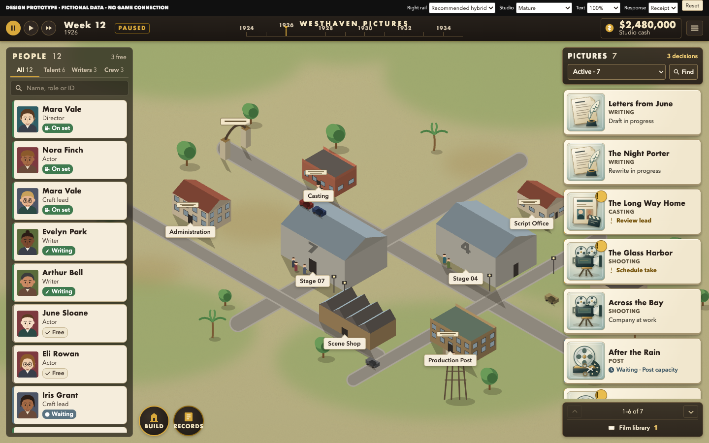

# STUDIO — current visual blueprint

**UI/UX VISUAL BLUEPRINT PUBLISHED — FUTURE OPS / OWNER DESIGN REVIEW REQUIRED**

**[Open the focused R3 visual index: right-hand picture cards](r3-picture-cards/README.md).** Recommended hybrid and closer-to-original comparison, mature/early/selected/waiting/busy/enlarged views, editable original artwork, functioning isolated prototype, regression evidence and complete downloadable package.

R3 selectively reuses the completed Opus Backlot work and existing Lionhead research. It keeps employees left, pictures right and the studio center; strengthens the current-stage image and visible decision/wait language; repairs prototype scroll/focus, clipping and exact-person facts. Backlot remains a working direction for review. Portrait finishing and application to the other screen families are explicitly unfinished. No native implementation is authorized.

The [complete R2 eight-family index and package](https://github.com/HSpector1/The-Movies/blob/e564d236407cb3616ebc597713d5b9fa7d60b38a/docs/operations/uiux-visual-blueprint/r2/README.md), [R1 index and package](https://github.com/HSpector1/The-Movies/blob/1c01a4146d513724b6ec3e601bf7be100db1a671/docs/operations/uiux-visual-blueprint/README.md) and [original independent audit](https://github.com/HSpector1/The-Movies/blob/72f04f95bb00ba601d511142b9db8b231e86526b/docs/operations/UIUX-WHOLE-GAME-REVIEW.md) remain preserved and pinned as history.
