# STUDIO — visual blueprint review index

**UI/UX VISUAL BLUEPRINT PUBLISHED — FUTURE OPS / OWNER DESIGN REVIEW REQUIRED**

**PROPOSED DESIGN / MOCK DATA — NOT IMPLEMENTED.** One recommended direction, eight screen families, editable source and three linked local journeys. This is the visual follow-up to the [original independent review](https://github.com/HSpector1/The-Movies/blob/72f04f95bb00ba601d511142b9db8b231e86526b/docs/operations/UIUX-WHOLE-GAME-REVIEW.md). It supersedes prose-only layout recommendations with a concrete target; the original findings, evidence limits and native acceptance requirements remain intact.

Start with the lot and production images below, then casting and campaign review. For clicking, extract the complete ZIP and open **index.html** locally; GitHub only displays HTML source. No server, packages, account or game installation is required. The package contains the actual images and editable files, not a generator. See [opening instructions and journey steps](PROTOTYPE.md).

[Layout, tokens, components and control standard](SPECIFICATION.md) · [source-to-design and implementation routing](ROUTING.md) · [independent checker disposition and native gaps](REVIEW.md) · [editable HTML](index.html) · [CSS](styles.css) · [minimal design-state JavaScript](prototype.js) · [original lot SVG](lot.svg).

## One recommended direction

**Studio desk** uses warm opaque paper, pine actions, Georgia titles and an original schematic lot. The lot remains the normal home; exact dossiers and deliberate larger comparison spaces carry the work. The two composition sketches below precede the selected direction; only A is developed. This carries forward the published original-*The Movies*-led reference without reproducing its artwork or conducting another survey.

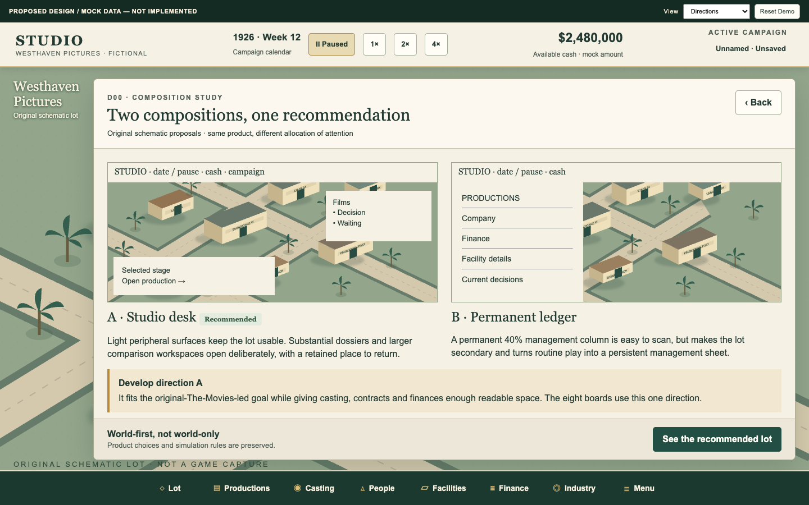

The three highest-impact changes are: an exact production with its action, reason and response always together; readable people and comparison views that preserve the casting draft and exact return identity; and campaign reviews that expose copy/loss consequences, retain an unresolved operation and require explicit continuation.

## Eight families — clean reference views

All reference images below use a chosen **1440×900 CSS-pixel canvas**. Every picture is visibly labeled proposed/mock/not implemented. They are rendered from the bundled prototype and do not depict an accepted native build. Annotated versions retain the same canvas and add a 300px note rail.

### V01 — Lot and persistent HUD

Early and mature states use the same selected-object card, time/cash/campaign HUD and named project rail. The center remains available for the lot.

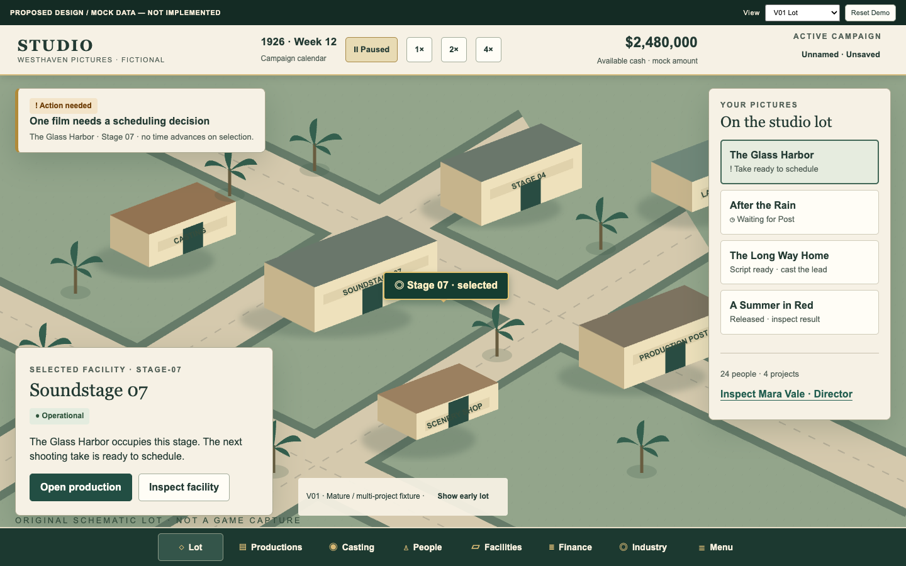

[Annotated view](previews/V01-lot-mature-annotated.png).

### V02 — Production

The selected film retains its company and worksite links, phase and pinned action/reason/response. Normal waiting offers no invented repair. J1 demonstrates exact Profile → Back with preserved scroll.

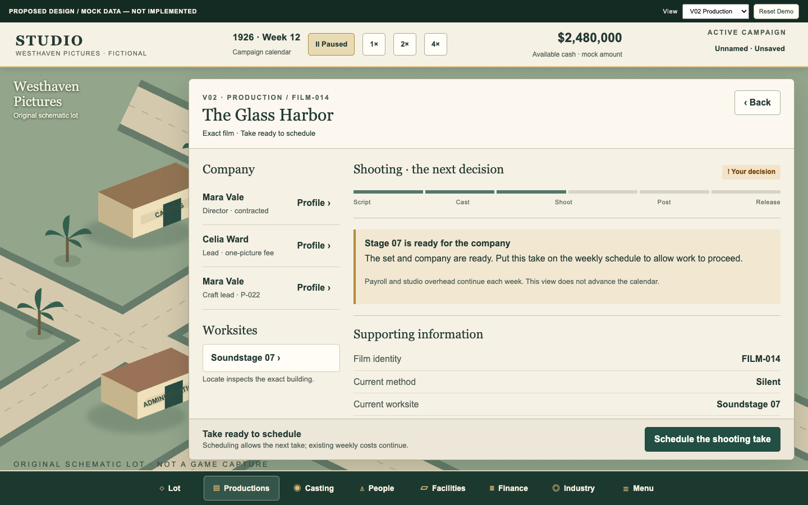

[Annotated view](previews/V02-production-action-annotated.png).

### V03 — Person / talent dossier

Identity, perceived ability, availability and financial basis sit together. A separate Celia contract review exposes the exact person and terms before commitment.

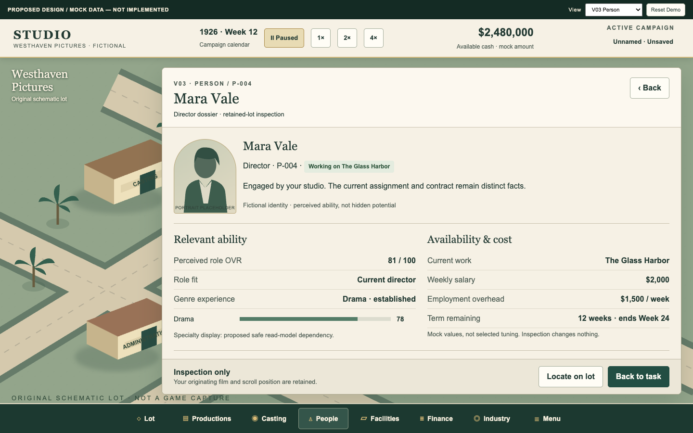

[Annotated view](previews/V03-person-annotated.png).

### V04 — Casting and comparison

The selected role and company draft stay visible beside aligned exact candidates. Unavailable Leon remains inspection-only; candidate review returns to the retained draft.

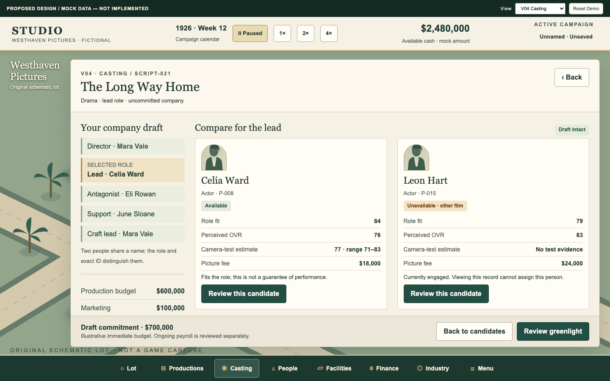

[Annotated view](previews/V04-compare-annotated.png).

### V05 — Building and facility

Catalogue selection, footprint, capital cost, timing and constraints precede review. Cancel applies to the uncommitted tool. Construction and operational cards are separate; Laboratory entry styling leaves its department owner intact.

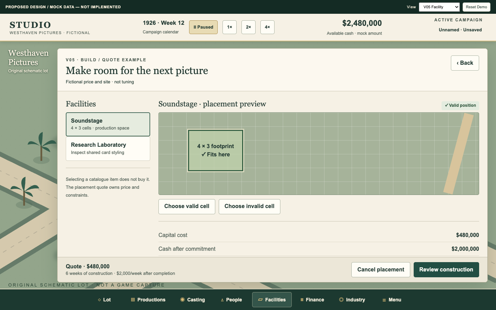

[Annotated view](previews/V05-placement-valid-annotated.png).

### V06 — Finance / Industry

Period, coverage, recorded outflow and conditional runway explain the figures. Public Industry uses the same vocabulary with an exact return route and disclosure boundary.

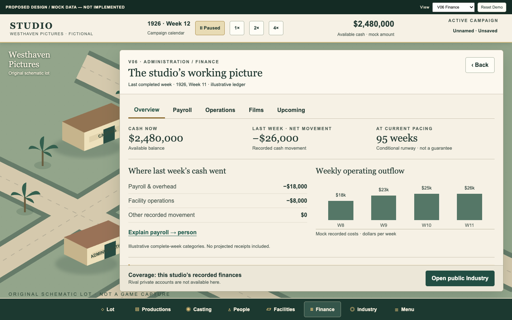

[Annotated view](previews/V06-finance-annotated.png).

### V07 — Campaigns / preferences

Active campaign and selected target are distinct. Naming explains copy activation, source preservation and form-draft loss; pending, unresolved recovery and continuation have explicit states.

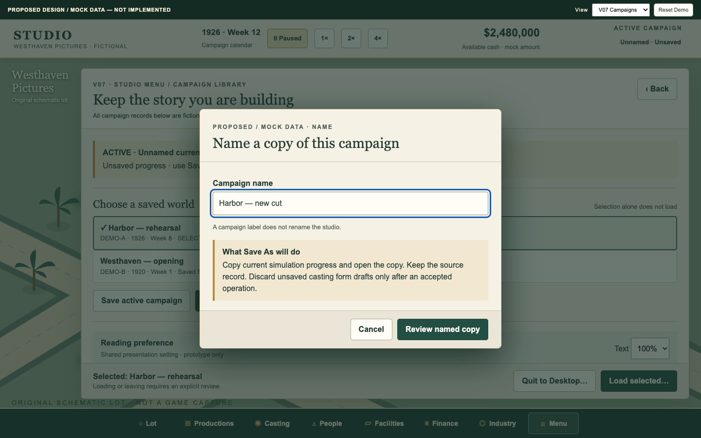

[Annotated view](previews/V07-save-as-annotated.png).

### V08 — Film result / history

Critics, audience and business have separate meanings. Recorded values and frozen forecast carry provenance; unavailable evidence never becomes zero.

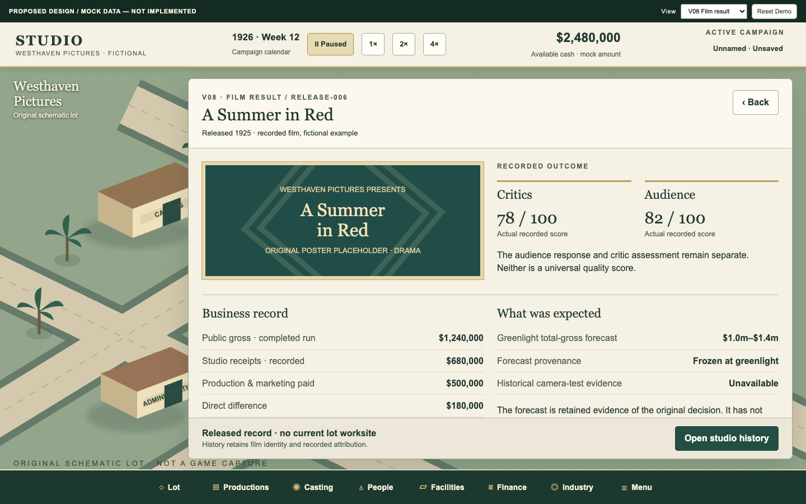

[Annotated view](previews/V08-result-annotated.png).

## Complete board and variant register

Each row links the actual PNG pair. All are editable through the common HTML/CSS/JavaScript and original SVG; there is no separate hidden design source.

| ID / variant | Clean | Annotated |
| --- | --- | --- |
| D00-directions — Composition alternatives | [PNG](previews/D00-directions.png) | [PNG + notes](previews/D00-directions-annotated.png) |
| V01-lot-early — Early lot | [PNG](previews/V01-lot-early.png) | [PNG + notes](previews/V01-lot-early-annotated.png) |
| V01-lot-mature — Mature lot | [PNG](previews/V01-lot-mature.png) | [PNG + notes](previews/V01-lot-mature-annotated.png) |
| V02-production-action — Actionable production | [PNG](previews/V02-production-action.png) | [PNG + notes](previews/V02-production-action-annotated.png) |
| V02-production-wait — Normal waiting | [PNG](previews/V02-production-wait.png) | [PNG + notes](previews/V02-production-wait-annotated.png) |
| V03-person — Person inspection | [PNG](previews/V03-person.png) | [PNG + notes](previews/V03-person-annotated.png) |
| V03-contract — Exact contract review | [PNG](previews/V03-contract.png) | [PNG + notes](previews/V03-contract-annotated.png) |
| V04-casting — Casting draft | [PNG](previews/V04-casting.png) | [PNG + notes](previews/V04-casting-annotated.png) |
| V04-compare — Two-candidate comparison | [PNG](previews/V04-compare.png) | [PNG + notes](previews/V04-compare-annotated.png) |
| V05-placement-valid — Valid footprint / quote | [PNG](previews/V05-placement-valid.png) | [PNG + notes](previews/V05-placement-valid-annotated.png) |
| V05-placement-invalid — Overlapping placement constraints | [PNG](previews/V05-placement-invalid.png) | [PNG + notes](previews/V05-placement-invalid-annotated.png) |
| V05-construction — Construction | [PNG](previews/V05-construction.png) | [PNG + notes](previews/V05-construction-annotated.png) |
| V05-operational — Operational facility | [PNG](previews/V05-operational.png) | [PNG + notes](previews/V05-operational-annotated.png) |
| V05-laboratory-entry — P13B-owned Laboratory entry | [PNG](previews/V05-laboratory-entry.png) | [PNG + notes](previews/V05-laboratory-entry-annotated.png) |
| V06-finance — Finance overview | [PNG](previews/V06-finance.png) | [PNG + notes](previews/V06-finance-annotated.png) |
| V06-industry — Public studio drill-down | [PNG](previews/V06-industry.png) | [PNG + notes](previews/V06-industry-annotated.png) |
| V07-campaigns — Campaign library / preference | [PNG](previews/V07-campaigns.png) | [PNG + notes](previews/V07-campaigns-annotated.png) |
| V07-save-as — Save As name and consequences | [PNG](previews/V07-save-as.png) | [PNG + notes](previews/V07-save-as-annotated.png) |
| V07-overwrite — Overwrite review | [PNG](previews/V07-overwrite.png) | [PNG + notes](previews/V07-overwrite-annotated.png) |
| V07-pending — Operation pending | [PNG](previews/V07-pending.png) | [PNG + notes](previews/V07-pending-annotated.png) |
| V07-unresolved — Unresolved / same-operation retry | [PNG](previews/V07-unresolved.png) | [PNG + notes](previews/V07-unresolved-annotated.png) |
| V07-receipt — Simulated receipt | [PNG](previews/V07-receipt.png) | [PNG + notes](previews/V07-receipt-annotated.png) |
| V07-continuation — Explicit leave continuation | [PNG](previews/V07-continuation.png) | [PNG + notes](previews/V07-continuation-annotated.png) |
| V08-result — Film result / history | [PNG](previews/V08-result.png) | [PNG + notes](previews/V08-result-annotated.png) |
| C01-components — Tokens / typography / components | [PNG](previews/C01-components.png) | [PNG + notes](previews/C01-components-annotated.png) |

## Component states and stress examples

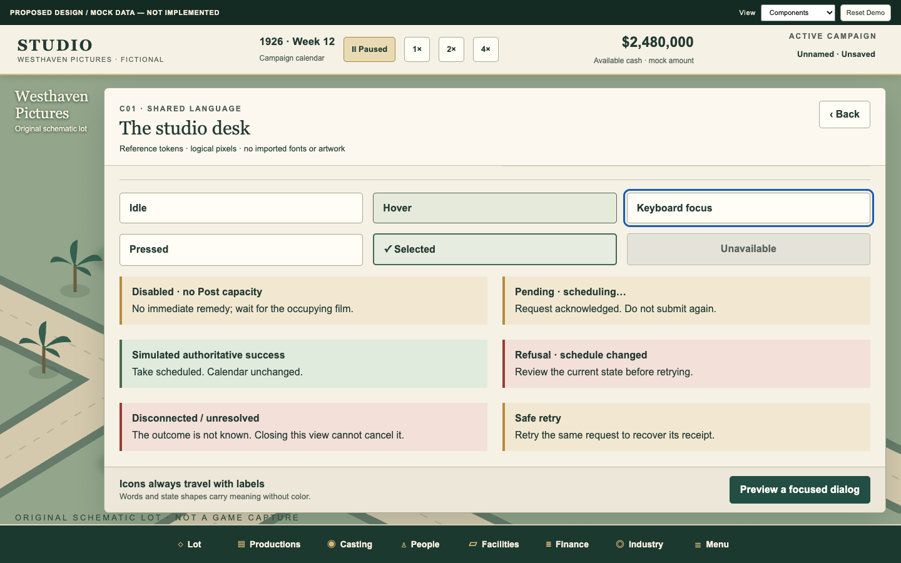

The following are **prototype configurations**, not native-platform acceptance. At 200% workspace text, bodies scroll and columns stack while commitment, reason and Cancel remain reachable. Compact HUD/navigation type remains fixed in this prototype; full global-chrome scaling is an explicit remaining presentation requirement.

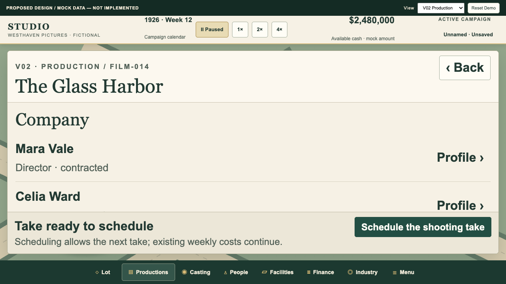

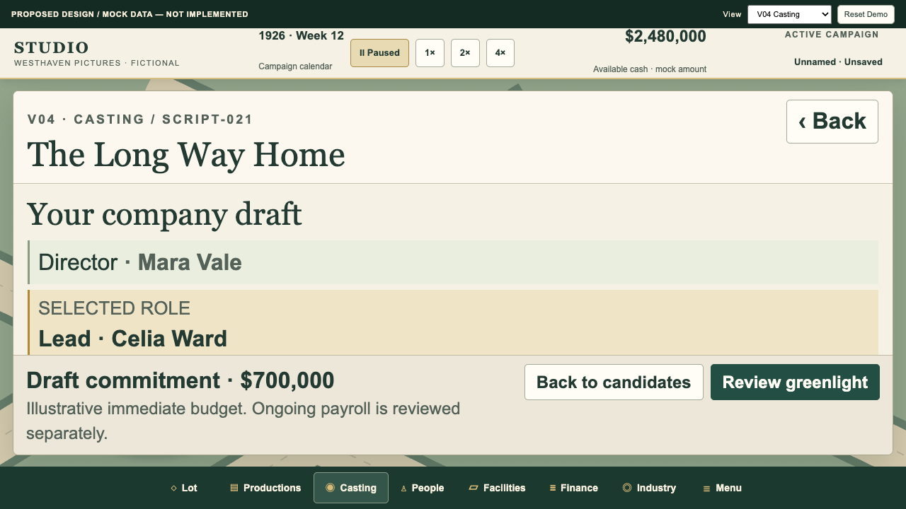

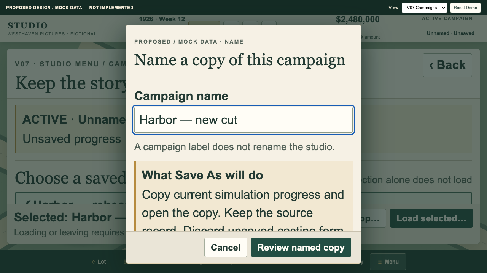

| Highest-risk layout | 1920×1080 / 100% | 1280×720 / 100% | 1280×720 / 200% |
| --- | --- | --- | --- |
| production | [PNG](previews/stress-production-1920-100.png) | [PNG](previews/stress-production-1280-100.png) | [PNG](previews/stress-production-1280-200.png) |
| casting | [PNG](previews/stress-casting-1920-100.png) | [PNG](previews/stress-casting-1280-100.png) | [PNG](previews/stress-casting-1280-200.png) |
| campaigns | [PNG](previews/stress-campaigns-1920-100.png) | [PNG](previews/stress-campaigns-1280-100.png) | [PNG](previews/stress-campaigns-1280-200.png) |

Edge fixtures: [missing production](previews/edge-production-missing.png), [no candidates](previews/edge-casting-empty.png), [long title / large candidate list](previews/edge-casting-long.png), [overlapping placement constraints](previews/edge-building-invalid.png). Duplicate names P-004/P-022 and unavailable P-015 are exercised in the prototype; no target is replaced by a neighboring record.

## Evidence, ownership and next decision

The exact [follow-up assignment](https://github.com/HSpector1/The-Movies/blob/c9ad874a7c8d6010d80ef87313e21ea9f016f99a/docs/operations/UIUX-VISUAL-DESIGN-SECOND-PASS-BRIEF.md) governs this delivery. The inspected sources remain TypeScript/bridge `45ca33650074ad5413c39fb9d4a5c04cd6571c3a`, Unity `6420a4d91de52db1bffca2988f2c995672e7d53e`, P13A closeout `45a3916862a6e98fcb7e9c6908cb2b31f1e8b588`, comparator notes `fe4d22ce60505ccce27543d7201c69d46d42a368`, and P13B supplement `9f48d79c2ec73e32930ff73c12dc9b99985457ec`. These are reference identities, not an execution baseline.

Source findings, Owner-reported Laboratory friction, the one historical P06C capture, new design inference and native verification are separated in the routing/review records. No accepted-P13A opening/mature captures were inspected. The new lot, silhouettes, poster and composition sketches are original source-authored illustration. Only system font names are referenced; no fonts, manual pages or borrowed game artwork are redistributed.

The one bounded checker inspected rendered screens and exercised all three journeys; four concrete findings were repaired and their repairs confirmed. No game launch/build/test, bridge connection, real campaign/profile access or native input occurred. No runtime worker is assigned. P13B retains Laboratory staffing, funding, research choices and department design.

Future Ops / Owner review this visual target. F1 production remains the recommended first native slice, followed by the finite sequence in ROUTING.md. There is no unresolved gameplay choice blocking this delivery; approval of the recommended visual direction is the requested decision. Runtime identity refresh, native captures, input/device checks, authoritative costs/commands and persistence acceptance remain pending. Publication does not authorize implementation.
