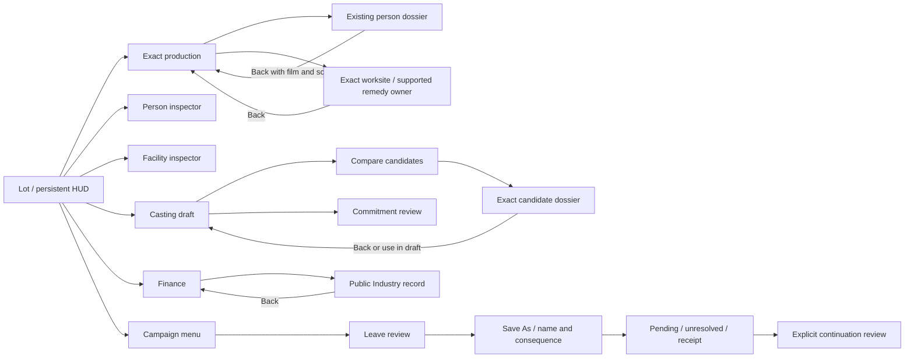

# Studio desk — visual and interaction specification

**PROPOSED DESIGN / MOCK DATA — NOT IMPLEMENTED.** These are design artifacts, not a native build or an implementation order. [Visual index](README.md) · [source and routing matrix](ROUTING.md) · [prototype instructions](PROTOTYPE.md).

The first review established useful existing owners and eight focused gaps. The one inspected historical P06C image kept a strong lot identity, but it cannot describe P13A pixels. This proposal therefore uses an original schematic lot, never a fabricated “before” screenshot. It develops the existing world-first guidance into one visual target.

## Direction and screen map

[D00 composition study](previews/D00-directions.png) compares **A: Studio desk**, selected, with **B: Permanent ledger**. A retains an open lot with a peripheral project rail and selected-object card. B allocates 40% permanently to management; it makes dense lists easier to reach but reduces the lot’s role. A is recommended without requesting another product vote. The substantial dossier and comparison workspace are deliberate depth, not a return to tiny cards.

Every workspace replaces the previous workspace, retaining its presentation context; no pile of floating windows. HUD and lot remain visible. A modal retains the workspace visually but makes both workspace and HUD inert. No layer invents auto-pause. Time state remains unchanged when a view opens; only the time control illustrates a pause-state change, and no clock actually runs in the prototype. The menu is a navigation surface, not permission to change campaign authority.

## Reference geometry and reflow

The clean reference canvas is **1440×900 CSS pixels at device scale 1**. The 40px prototype identification bar is outside the proposed game. Actual prototype stage starts below it. Annotated views add a 300px explanatory rail to the right of the same 1440px canvas; they are not alternative layouts.

| Stable region ID | 1440×900 reference | Anchoring, constraints and reflow |
| --- | --- | --- |
| G-HUD | x0 y40 w1440 h80 | Top edge; 28px horizontal inset; brand, date/time, cash, active campaign. 72px in the 720px stress canvas. Compact chrome retains fixed readable type while workspace text scales. |
| G-NAV | x0 y840 w1440 h60 | Bottom edge; 8 labeled destinations; at narrow widths an explicitly scrollable navigation row. Never underneath a modal’s input layer. |
| G-LOT | y120–840 | Original vector backdrop; no game capture. Home retains central open space; workspaces may cover more for deliberate comparison. |
| V01-RAIL | x1126 y140 w290 | Top-right, 18px inner padding, named state rows; mature density grows in the same component. A future native long rail needs its existing scrolling/collapse owner. |
| V01-CARD | x24, bottom820, w410 | Selected subject; 22px padding. Primary Open plus secondary Inspect. Height fits content. Demo variant switch is outside its action area. |
| W-INSPECTOR | x336 y140 w1080 h680 | Right anchored, width min(1080px, available width minus250px). At 1281–1300px retain160px for the lot; at ≤1280px use full stage width. |
| W-COMPARE | x166 y140 w1250 h680 | Deliberate wider workspace. Header and footer pinned; body scrolls. 245px draft column and remaining comparison/detail. |
| W-HEADER | 20px/24px padding | Georgia30/34.5 title; identity line; Back. Long titles wrap, not ellipsis over exact identity. At small height title25px. |
| W-BODY | 24px padding/gap | Flex min-height0 and overflow:auto. Scroll owner is the panel. Sticky company/draft column in regular layout. Supporting records never scroll the camera. |
| W-ACTION | 14px/24px padding | Pinned reason/response and action; content-derived height, not a hard pixel crop. Two columns at reference, wrapping on narrow view. |
| M-REVIEW | max620px wide | Centered; max-height viewport−90px. Header, independently scrolling body, pinned wrapping actions. Modal focus is confined and background is inert. |
| D-PORTRAIT | 130×155px | Original silhouette; identity outside the image. Comparison uses60×62px. Native portraits may replace only through existing asset/identity ownership. |
| B-FOOTPRINT | example160×120 in240px preview | 4×3 schematic cells; validity uses symbol, text and boundary. Real grid coordinates, validity and quote must come from P09. |

The 1920×1080 and 1280×720 previews are **prototype configurations**, not claims of supported native platforms. Workspace text scales to150/200% using the same preference. At200%, the workspace consumes the stage width, two-column content stacks and controls wrap; the scroll body yields space to pinned actions. Compact global navigation/identity chrome is held at its reference typography in this prototype; extending200% scaling to that chrome is an explicit remaining presentation requirement, not a demonstrated result. All price, reason and cancellation text in commitment/workspace content is scalable; content may require scrolling but never disappears behind the footer.

## Tokens, type and measured contrast

All assets are original source-authored vectors and CSS. Fonts are system **Georgia** (titles) and **Arial/Helvetica/sans-serif** (content), used by name only; no fonts are bundled or fetched. Brass decoration is not used as low-contrast body text. Decision surfaces are opaque paper; only modal shading and the schematic map use translucency. No copyrighted manual page, portrait, logo or game UI art is included.

| Token / pair | Values | Measured contrast ratio |
| --- | --- | ---: |
| Ink on paper | `#233a33` / `#f6f1e5` | 10.80:1 |
| Supporting text on paper | `#536158` / `#f6f1e5` | 5.79:1 |
| Primary text on pine | `#fffdf6` / `#224e43` | 9.22:1 |
| Warning text / fill | `#71410b` / `#f3e4c9` | 6.80:1 |
| Refusal on paper | `#942f29` / `#f6f1e5` | 6.91:1 |
| Focus ring against paper | `#175db5` / `#f6f1e5` | 5.70:1 |
| Disabled text / fill | `#5a625c` / `#e4e3da` | 4.89:1 |

Ratios use sRGB relative luminance, `(lighter+.05)/(darker+.05)`, computed for these exact proposed pairs. They do not establish all-state or native accessibility compliance. Borders/icons require contextual native checks.

Body16px/1.45; supporting13px/1.45; section22px; title30px/1.15; eyebrow12px/1.45 with.16em tracking; money tabular numerals. Spacing uses4/8/12/16/24/32px. Panels have1px borders and8px radius; workspace controls5px radius, 44px minimum height, 9×16px padding. Compact HUD controls use40px; its operation-status link uses24px and the adjacent campaign chip compacts to28px while status is present. These smaller chrome targets require native target-size review, alongside full chrome text scaling. Focus ring3px with3px offset. Controls do not rely on icon recognition: all icons have labels. No ornamental loading animation or automatic camera flourish. Press displacement is1px; no transition blocks input. Reduced-motion environments need no animation to understand state.

Avoid truncating identity, cost, reason or commitment labels. Wrap long strings and preserve exact IDs on duplicate names. Optional native tooltips should open beside the control on hover/focus, flip within the viewport, and never contain the only disabled reason or financial consequence. The prototype uses visible copy instead of tooltip-only information.

## Component states and exact control behavior

[C01 token sheet](previews/C01-components.png) and [C01 state sheet](previews/C01-states.png) show the shared grammar. Stable DOM `data-act` values are the control IDs; `V01–V08`, `W-*`, `M-*`, `J1–J3` are design IDs. Displayed text is editable in `prototype.js`; dimensions and states are editable in `styles.css`.

| State | Elements / exact example | Input and response |
| --- | --- | --- |
| Idle / hover / pressed | Ordinary navigation / Open production | Ivory → pale green hover →1px press. Changes navigation only. |
| Keyboard focus | All actionable buttons, inputs and selects | Visible blue ring; Tab order follows reading order. Modal traps focus; Escape returns one layer. |
| Selected | Exact person/film/campaign row | Checkmark/outline plus name and ID. Selection cannot sign, load, spend or advance. |
| Disabled with reason | “No immediate remedy”; invalid build | Reason visible beside control. No click dispatch. Do not make disabled styling the only explanation. |
| Pending | “Submitting schedule…” / “Saving named copy…” | Immediate acknowledgement, disabled repeated submit. Same-screen rerenders retain scroll. |
| Simulated accepted receipt | “Take scheduled. Calendar unchanged.” | Prototype receipt only. Real implementation waits for authoritative command/storage completion. |
| Refusal | “The schedule changed. Review the current state before retrying.” | Keep draft/subject; next action reviews current state rather than silently replaying a stale quote. |
| Disconnected/unresolved | “The response did not arrive” | Outcome unknown. Close view is not operation cancellation. Retry same operation recovers its receipt. |
| Safe retry | “Retry same operation” | Reuses the same conceptual request. The prototype models no server IDs; production must preserve exact bytes/command ID as its owner already does. |

| Journey/state → input | Navigation or action; visible response | Retained / Back / stale behavior | Owner |
| --- | --- | --- | --- |
| J1 production → company Profile | Open exact P-004 or P-022, not name lookup | Film/state/scroll/focus retained; Back restores after layout. Missing target opens no substitute. | Existing P10 profile plus proposed Production return origin |
| J1 ready → Schedule take | Pending then simulated scheduled/refusal | Repeat disabled; refusal leaves same film; waiting branch has no invented repair | Existing production operation + F1 presentation |
| J1 worksite → facility | Exact selected facility inspector; Locate is a labeled static camera example | Back returns to film; actual camera/target resolution remains native | P09 / workspace host |
| J2 compare → Review this candidate | Exact dossier for P-008; unavailable P-015 is inspection-only | Role, pins and company draft retained; Use in lead draft is reversible, not signing | Casting / People; F6 |
| J2 draft → Review greenlight → staged commit | Costs/ongoing basis/capacity distinction → pending → receipt/refusal | Pending guarded; no repeated commit; stale response retains draft | Casting quote/commit authority |
| J3 unnamed leave → Save As | Name → consequence/overwrite review → operation-specific pending | Cancel before submission preserves progress. Source and destination are explicit | Campaign menu / storage owner |
| J3 unresolved → Retry → receipt | No optimistic Saved state; then explicit continuation review | Closing view cannot cancel request; persistent HUD status reopens it, competing campaign operations stay disabled while pending/unresolved, and no receipt steals focus from another view. New leave task requires fresh authority | Existing exact-request retry + proposed continuation context |
| Text input → Enter / Escape | Enter in campaign name advances only to review; Escape cancels top dialog | No background submit/time input; invoker focus is restored when still present | Shared input ownership |
| Wheel / secondary click | Panel scroll owns wheel; standard context click has no committing action | No camera zoom is implemented; native mouse/trackpad ownership still required | Existing UI/camera gate |
| Placement → Cancel vs post-submit | Pre-submit cancels preview; after accepted mock commit shows construction | No cancellation of already-submitted physical work is invented | Existing P09 and P13B cancellation scope |

Attention: information stays noninterruptive, repeated symptoms group by exact cause, real blockers lead to existing lawful destinations, and real deadlines retain dates/subjects. Waiting remains normal when no remedy exists. No new automatic pause or adviser is proposed. The prototype has no physical-controller validation; native mapping/focus must be tested separately.
