# STUDIO R2 — people left, pictures right, studio in view

**UI/UX VISUAL BLUEPRINT PUBLISHED — FUTURE OPS / OWNER DESIGN REVIEW REQUIRED**

**PROPOSED DESIGN / MOCK DATA — NOT IMPLEMENTED.** This Owner-directed revision replaces the R1 studio-desk recommendation. The supplied Lionhead screenshots make the missing relationship clear: people remain discoverable on the left, scripts and films stay trackable on the right, and inspection happens in the lot between them. R2 develops that relationship throughout the same eight screen families and clickable journeys.

**Click through:** extract this complete package and open **index.html**. No install, server, login or game is required. GitHub displays HTML source; it does not run this local prototype. [Journey instructions](PROTOTYPE.md) · [editable HTML](index.html) · [shared CSS](styles.css) / [R2 CSS](living-studio.css) · [fictional journey state](prototype.js) / [R2 interactions](living-studio.js) · [original lot SVG](lot.svg).

[Reference observations and source findings](REFERENCE-REVIEW.md) · [exact layout / control standard / screen map](SPECIFICATION.md) · [source-to-design / implementation routing](ROUTING.md) · [rendered checks and future native acceptance](REVIEW.md).

## The recommended revision

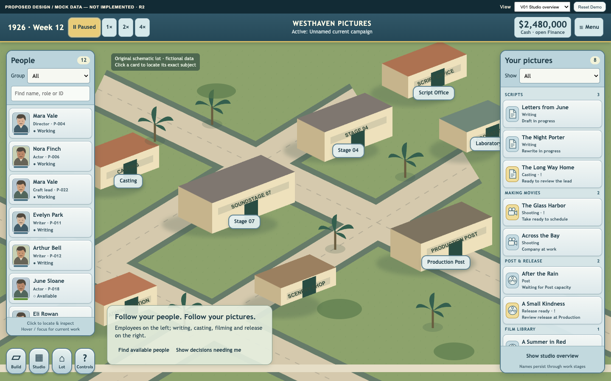

1. **Find the person without leaving the studio.** Portrait, name, role, exact ID and activity form a left-side employee list. Filter by Talent, Writing or Crew; search for a name or ID. Click locates and pins that exact person; inspection does not assign them.
2. **Follow every picture through its work.** The right slate groups writing, casting, shooting, Post/release and completed library records. Titles persist; current work and decisions are visible. “Needs me” and “Waiting” separate an action from normal waiting.
3. **Keep work attached to the lot.** Compact person, picture and facility cards retain both side lists. Casting has local Director / Lead / Company destinations. Build expands from the corner with price, explanation and a footprint preview. Detailed comparison, Finance and commitment reviews take more space deliberately.

R2 uses opaque pale-blue controls, dark readable labels, restrained gold selection, rounded corner tools and original schematic illustration. It follows the reference’s placement and interaction relationships. It does not copy Lionhead’s artwork or add its needs, relationships, hiring gestures or other gameplay systems.

The [R1 alternatives and prior direction](https://github.com/HSpector1/The-Movies/blob/1c01a4146d513724b6ec3e601bf7be100db1a671/docs/operations/uiux-visual-blueprint/README.md) remain available as history. Only this revised direction is recommended. The [original audit](https://github.com/HSpector1/The-Movies/blob/72f04f95bb00ba601d511142b9db8b231e86526b/docs/operations/UIUX-WHOLE-GAME-REVIEW.md) and newer authorized source work are preserved.

## Eight screen families

Every clean board is rendered at **1440×900 CSS pixels** from the bundled editable prototype. Annotated boards keep that game canvas and add a 300px family-specific explanation rail. These are chosen design configurations, not accepted native-game captures.

### V01 — lot and persistent HUD

The overview above shows the mature fixture. The same rails grow by rows; each list owns its own scroll. Time and cash stay at the top; local tools live in the corner. [Early fixture](previews/V01-early.png) · [annotated overview](previews/V01-overview-annotated.png).

### V02 — production in context

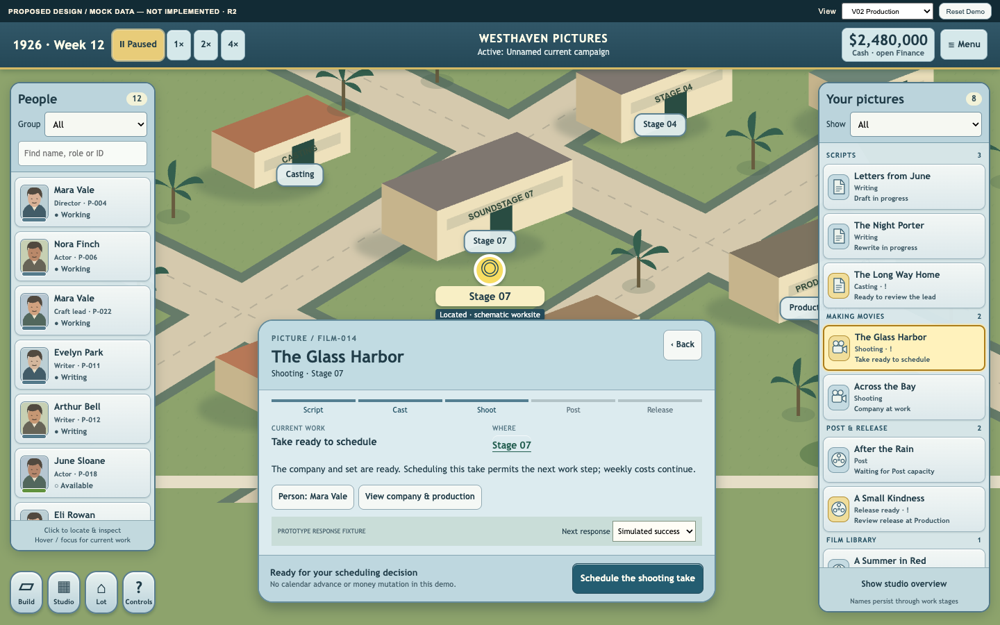

Phase, current work, site and exact person precede the pinned action/reason/response. The right rail updates its staged scheduling response. [Normal wait](previews/V02-waiting.png) offers no invented repair. [Annotated production](previews/V02-production-annotated.png).

### V03 — person before dossier

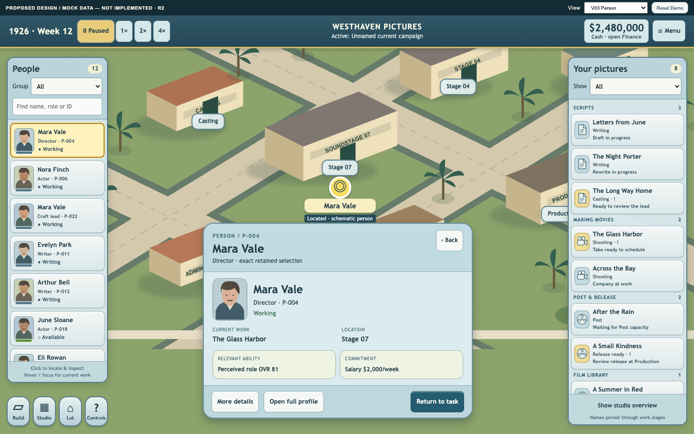

A person has a compact inspection layer and a deliberate full profile. P-004 and P-022 share a name but never an identity. Contract review has exact terms; a candidate inspection does not sign. [Contract review](previews/V03-contract.png) · [annotated person](previews/V03-person-annotated.png).

### V04 — building-led casting and comparison

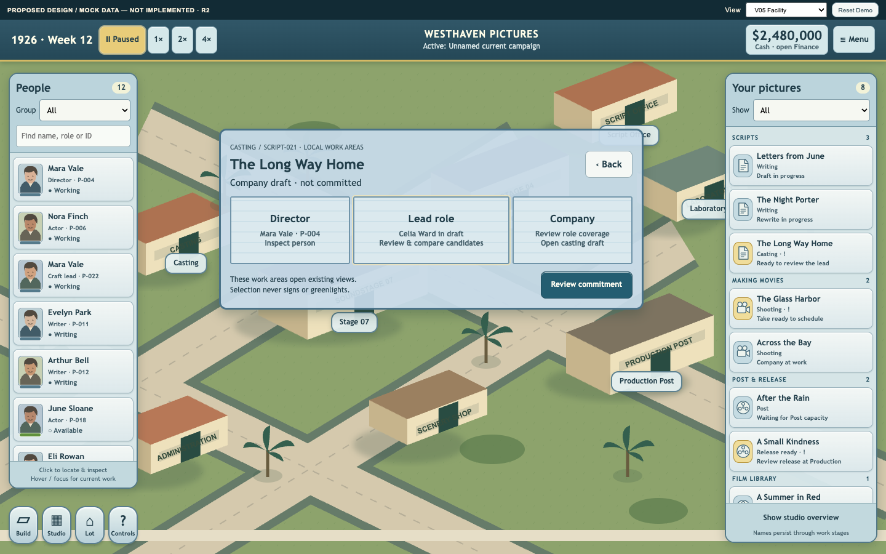

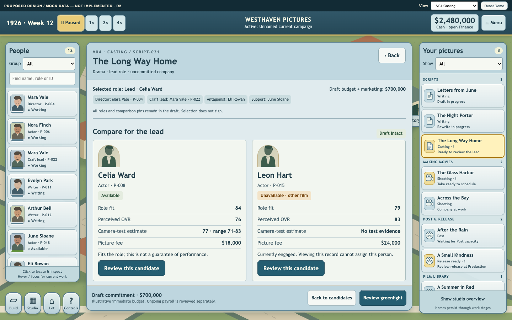

Director/Lead/Company areas open the actual prototype’s existing views. Candidate review returns to the same company, role and comparison position. Unavailable Leon and unrelated employees remain inspection-only. [Annotated work areas](previews/V04-casting-building-annotated.png) · [annotated comparison](previews/V04-compare-annotated.png).

### V05 — corner Build and facility context

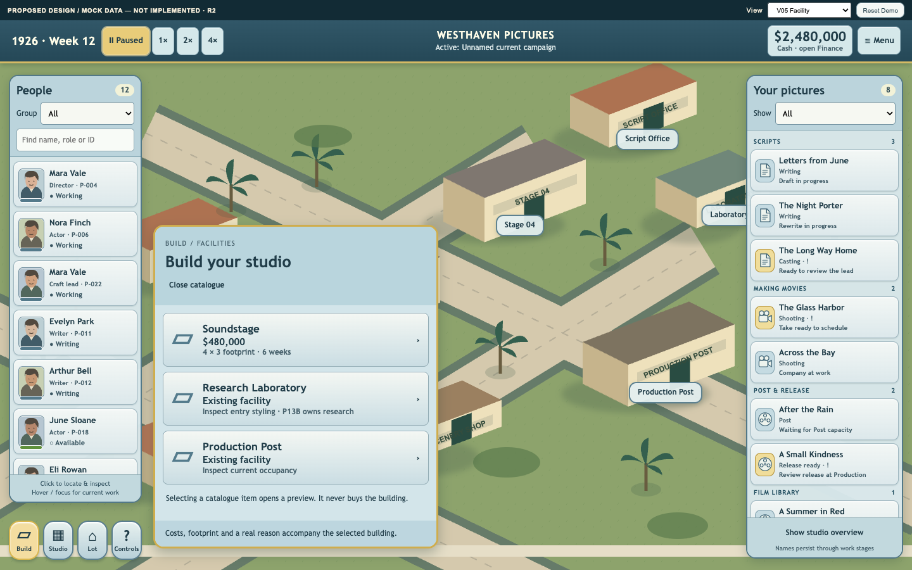

A selected item becomes an uncommitted in-world footprint, followed by consequence review. [Valid](previews/V05-placement.png) / [invalid](previews/V05-invalid.png) · [construction](previews/V05-construction.png) / [operational](previews/V05-operational.png) · [annotated catalogue](previews/V05-catalogue-annotated.png). [Laboratory](previews/V05-laboratory.png) demonstrates entry styling only; its workflow remains P13B-owned.

### V06 — Finance and Industry

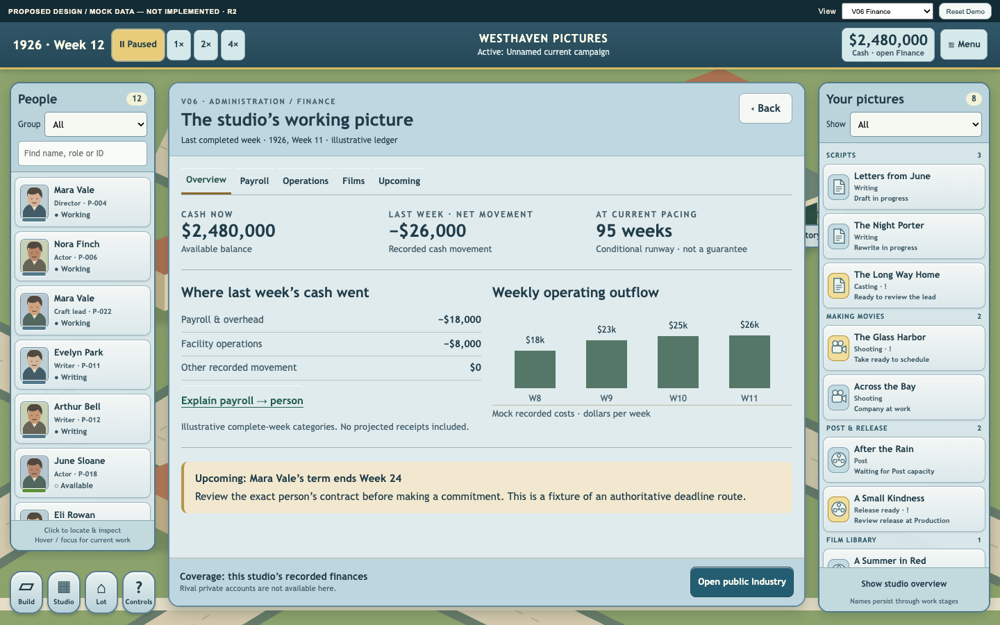

Cash opens Finance directly. Period, coverage and conditional estimate labels retain their meaning. [Industry drill-down](previews/V06-industry.png) stays within public information. [Annotated Finance](previews/V06-finance-annotated.png).

### V07 — campaigns and preferences

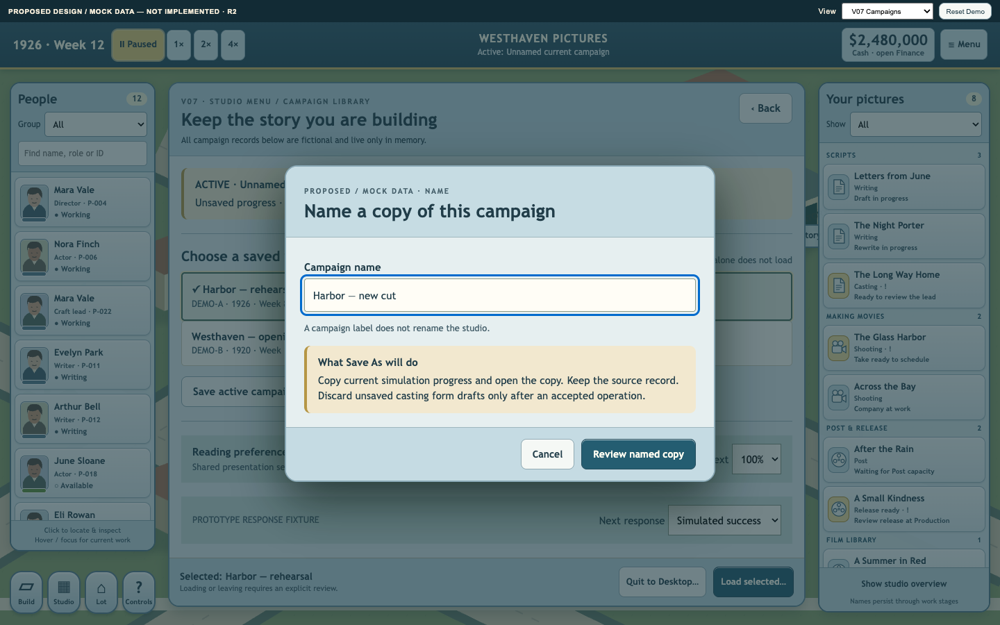

Active campaign and selected load target are separate. Closing a pending view does not cancel its operation or automatically reopen it. Menu retains a named status entry for explicit recovery. [Campaign library](previews/V07-campaigns.png) · [unresolved](previews/V07-unresolved.png) · [annotated Save As](previews/V07-save-as-annotated.png).

### V08 — film result and history

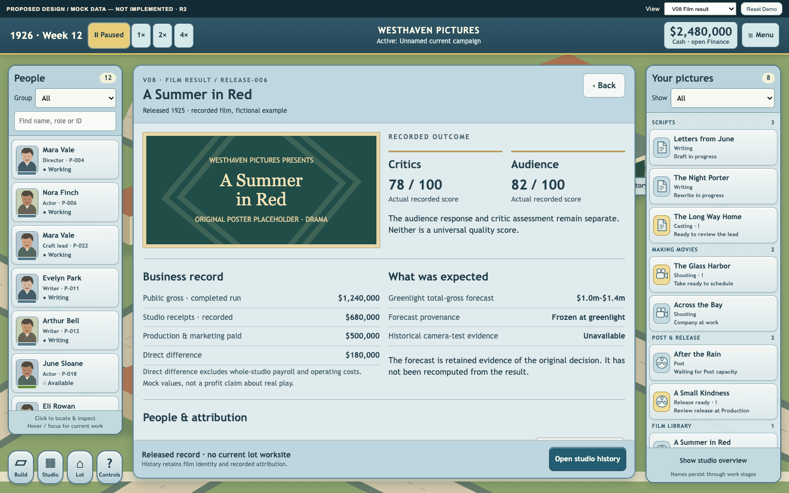

Completed films belong in the library, with exact historical attribution. Recorded results and frozen forecasts differ; absent evidence is not zero. [Annotated result](previews/V08-result-annotated.png).

## Complete editable board register

All board/state IDs below link actual files. The HTML/CSS/JavaScript and original SVG are the editable source for every board; no design file is kept privately.

| Board / state | Clean PNG | Annotated PNG |
| --- | --- | --- |
| V01-overview — Studio overview | [View](previews/V01-overview.png) | [View with notes](previews/V01-overview-annotated.png) |
| V01-early — Early studio | [View](previews/V01-early.png) | [View with notes](previews/V01-early-annotated.png) |
| V02-production — Actionable production | [View](previews/V02-production.png) | [View with notes](previews/V02-production-annotated.png) |
| V02-waiting — Normal Post wait | [View](previews/V02-waiting.png) | [View with notes](previews/V02-waiting-annotated.png) |
| V03-person — Compact person | [View](previews/V03-person.png) | [View with notes](previews/V03-person-annotated.png) |
| V03-contract — Exact contract review | [View](previews/V03-contract.png) | [View with notes](previews/V03-contract-annotated.png) |
| V04-casting-building — Casting work areas | [View](previews/V04-casting-building.png) | [View with notes](previews/V04-casting-building-annotated.png) |
| V04-compare — Retained company and comparison | [View](previews/V04-compare.png) | [View with notes](previews/V04-compare-annotated.png) |
| V05-catalogue — Corner Build catalogue | [View](previews/V05-catalogue.png) | [View with notes](previews/V05-catalogue-annotated.png) |
| V05-placement — Valid uncommitted footprint | [View](previews/V05-placement.png) | [View with notes](previews/V05-placement-annotated.png) |
| V05-invalid — Overlapping placement constraints | [View](previews/V05-invalid.png) | [View with notes](previews/V05-invalid-annotated.png) |
| V05-construction — Construction | [View](previews/V05-construction.png) | [View with notes](previews/V05-construction-annotated.png) |
| V05-operational — Operational facility | [View](previews/V05-operational.png) | [View with notes](previews/V05-operational-annotated.png) |
| V05-laboratory — P13B-owned Laboratory entry | [View](previews/V05-laboratory.png) | [View with notes](previews/V05-laboratory-annotated.png) |
| V06-finance — Finance | [View](previews/V06-finance.png) | [View with notes](previews/V06-finance-annotated.png) |
| V06-industry — Public Industry record | [View](previews/V06-industry.png) | [View with notes](previews/V06-industry-annotated.png) |
| V07-campaigns — Campaigns and preferences | [View](previews/V07-campaigns.png) | [View with notes](previews/V07-campaigns-annotated.png) |
| V07-save-as — Save As name and consequences | [View](previews/V07-save-as.png) | [View with notes](previews/V07-save-as-annotated.png) |
| V07-overwrite — Overwrite review | [View](previews/V07-overwrite.png) | [View with notes](previews/V07-overwrite-annotated.png) |
| V07-pending — Named pending operation | [View](previews/V07-pending.png) | [View with notes](previews/V07-pending-annotated.png) |
| V07-unresolved — Unresolved and safe retry | [View](previews/V07-unresolved.png) | [View with notes](previews/V07-unresolved-annotated.png) |
| V07-receipt — Simulated receipt | [View](previews/V07-receipt.png) | [View with notes](previews/V07-receipt-annotated.png) |
| V07-continuation — Explicit original-task continuation | [View](previews/V07-continuation.png) | [View with notes](previews/V07-continuation-annotated.png) |
| V08-result — Result and history | [View](previews/V08-result.png) | [View with notes](previews/V08-result-annotated.png) |
| C01-components — Shared tokens and component states | [View](previews/C01-components.png) | [View with notes](previews/C01-components-annotated.png) |

## State and large-text review

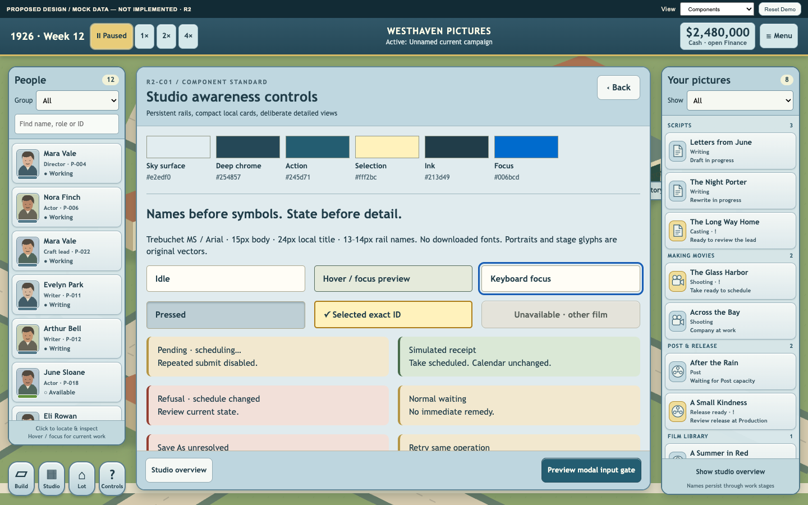

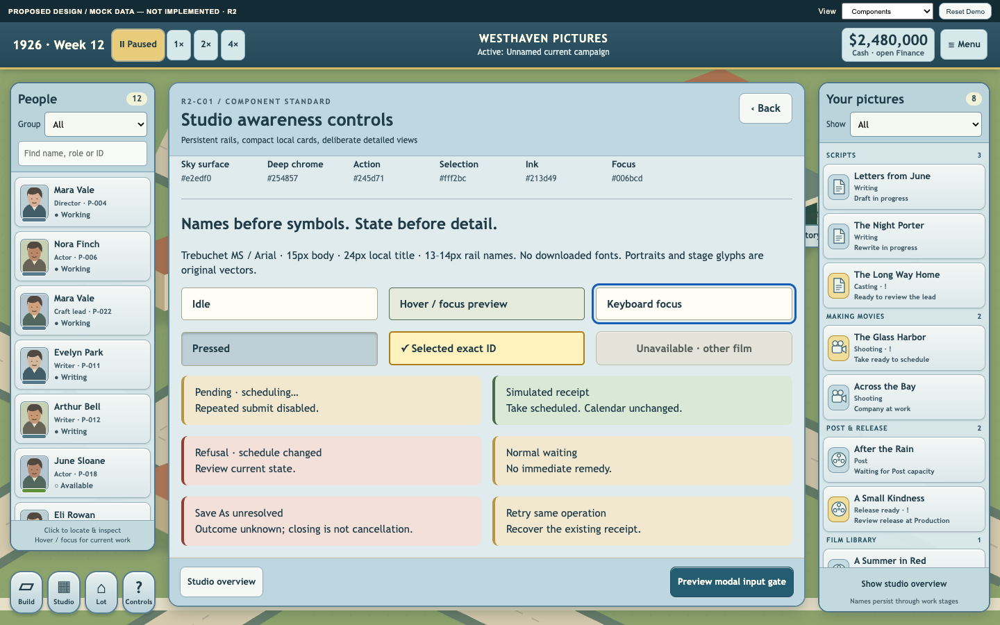

[Annotated response states](previews/C01-states-annotated.png).

The 200% preference enlarges workspace/commitment content and reflows columns. It selectively enlarges rail text; compact chrome does not uniformly double. Full native global text scaling remains a stated gap. View the critical footer and scrollable content in these actual renders:

| Family | 1920×1080 / 100% | 1280×720 / 100% | 1280×720 / 200% |
| --- | --- | --- | --- |
| home | [PNG](previews/stress-home-1920-100.png) | [PNG](previews/stress-home-1280-100.png) | [PNG](previews/stress-home-1280-200.png) |
| production | [PNG](previews/stress-production-1920-100.png) | [PNG](previews/stress-production-1280-100.png) | [PNG](previews/stress-production-1280-200.png) |
| casting | [PNG](previews/stress-casting-1920-100.png) | [PNG](previews/stress-casting-1280-100.png) | [PNG](previews/stress-casting-1280-200.png) |
| campaigns | [PNG](previews/stress-campaigns-1920-100.png) | [PNG](previews/stress-campaigns-1280-100.png) | [PNG](previews/stress-campaigns-1280-200.png) |

Edge fixtures: [missing exact production](previews/edge-production-missing.png), [no candidates](previews/edge-casting-empty.png), [long title / finite large candidate list](previews/edge-casting-long.png). These are deterministic design examples, not performance or native resilience evidence.

## What was checked and what comes next

The author exercised employee discovery, all three linked journeys, exact selection, build preview/Cancel and large-text focus/scroll. One independent read-only checker inspected the rendered families and functioning prototype, reported four concrete defects, then confirmed all four repairs. The [review record](REVIEW.md) links the actual results and corrected examples. No additional reviewer fleet, broad genre survey or native validation occurred.

The source inspection remains bound to accepted TypeScript/bridge `45ca33650074ad5413c39fb9d4a5c04cd6571c3a` and Unity `6420a4d91de52db1bffca2988f2c995672e7d53e`. R2’s complete employee discovery deliberately requires authoritative roster membership joined to presence, Profile and locatable-body data: the existing presence count is not an employee count. The source/routing documents separate that dependency from presentation changes.

**First proposed native slice after design review:** persistent employee discovery on the left, the existing picture lifecycle on the right, and one exact person/film inspection → Back journey with the local action/reason/response strip. Then extend the same behavior to Casting/Build and the deeper common workspaces. This is a recommendation, not implementation authorization, scheduling or an assignment to another worker.

Native captures, supported-device text sizing, exact identity/body joins, physical input/click-through, authoritative command/quote responses and durable campaign recovery still require separate Future Ops authorization and evidence. P13B retains Laboratory workflow, staffing, funding and research. No gameplay edits, build/launch, real bridge, campaign/profile access, hooks, PR, merge or protected-ref promotion occurred.

**Stop for Future Ops / Owner design review.**
