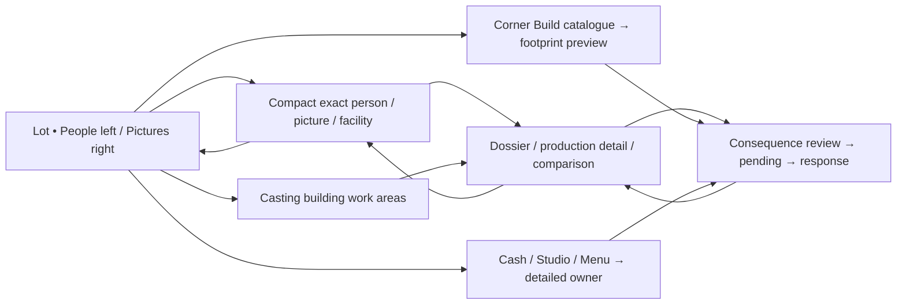

# R2 layout and button standard

**PROPOSED DESIGN / MOCK DATA — NOT IMPLEMENTED.** [Visual index](README.md) · [reference analysis](REFERENCE-REVIEW.md) · [routing](ROUTING.md).

## Placement and visual grammar

Reference: 1440×900 CSS pixels, device scale 1. A 32px always-visible mock identification bar sits outside the proposed game. The persistent in-game HUD occupies y32–100. The lot is the center of the normal interaction. All geometry is prototype geometry, not the Owner’s native viewport.

| ID | Reference geometry / anchors | Overflow and behavior |
| --- | --- | --- |
| R2-HUD | x0 y32 w1440 h68 | Date and current pause state at left; studio and active campaign identity center; clickable cash and Menu right. No new auto-pause. |
| R2-PEOPLE | x14 y118 w210, bottom 794 | Header/group/search remain fixed; one independent list scroll; footer explains locate/inspect. Exact name, role, ID and public work/availability. |
| R2-PICTURES | x1178 y118 w248, bottom 882 | One list scroll, grouped Scripts / Making movies / Post & release / Film library. Title, phase, state; no fabricated percentage. Seven active fixtures and one library record. |
| R2-LOCAL | x center of remaining lot; max660 wide; bottom 868 | Compact person/film/facility inspector. Content-derived height, max62% of center area at reference. Header/action footer fixed; body scrolls. Person card max560 wide. |
| R2-WORKSPACE | x242 y118 w918, bottom 874 | Deliberate larger casting/Finance/campaign/result work; retains both rails. Scroll body; fixed header/footer. Two comparison columns at reference; stack at large text. |
| R2-BUILD | x242; width 450; bottom 866, max90% of center height | Corner Build opens a catalogue. Price and explanation are in each row. Selecting starts an uncommitted preview. |
| R2-FOOTPRINT | 290×150 example, within center lot | Valid/invalid boundary, explicit reasons and no preview charge. Prototype state buttons stand in for native positioning. |
| R2-CASTING-ROOMS | max690 wide, center lot, top 12% | Director / Lead / Company areas open exact existing people/casting views. No drag-to-hire or auto-assignment. |
| R2-TOOLS | x14 bottom 16, 214 wide | Four labeled controls: Build, Studio, Lot, Controls. Studio opens a compact destination menu. |
| R2-PEEK | 265 wide beside hovered/focused row | Text-only transient facts; viewport-clamped vertically, pointer-transparent. No financial commitment lives only here. |
| R2-MODAL | max620 wide; max viewport height−64 | Opaque review over shaded lot; game, rails and mock selector inert. Body scrolls; footer stays reachable. |

At 1280×720, rails narrow to190/224px with 10px insets; center region is x212–1034. Content scrolls instead of silently hiding records. At 1920×1080, rails keep reference widths while the world grows. The same markup is rendered at these configurations. The schematic map and markers share one coordinate frame; locating translates only the fictional illustration, not a native camera or game entity.

Typography uses available system Trebuchet MS / Arial, no font files. Body 15px/1.4, local title24px/1.1, rail name13–14px, secondary rail facts10–11px, detailed title25px. At the 200% preference, workspace/commitment text doubles; columns stack. Rail text enlarges selectively and rows grow; compact HUD/tool labels do not fully double. Full uniform chrome scaling and comfortable rail text at the supported native displays remain explicit acceptance requirements. The prototype does not claim all-state accessibility compliance.

Palette: opaque sky `#e2edf0`, deep chrome `#254857`, action `#245d71`, selected fill `#fff2bc`, ink `#213d49`, focus `#006bcd`. Primary labels use `#fffef2`. Controls have8px radius; rails 15px; local cards22px. Borders1–2px. Selection uses a gold outline plus exact identity; availability/waiting also use words. No selection animation delays input; the marker and picture state update immediately. System motion preference requires no animation to understand the interface.

## One control standard

| Input / current surface | Proposed response | Preserve / safeguard |
| --- | --- | --- |
| Hover or focus employee/picture card | Preview exact identity, current work and location next to that rail | No selection, time change or commitment; pointer departure closes preview. |
| Primary click / Enter on employee card | Locate schematic target and pin compact person card | Employee group/search, both rail offsets and originating picture remain. Do not resolve by name or substitute a missing body. |
| Primary click on script/production card | Select exact picture and locate its current supported owner | Phase/state remain explicit. A library result opens its record; no current worksite is invented. |
| Right-click card / More details | Expand local fact groups | Keyboard-accessible More is equivalent. Secondary click never signs, deletes or buys. |
| Click building label | Open its local work or facility card | Same exact owner as the rail route. Director/Lead/Company controls open existing views. |
| Open full profile / detailed production / compare | Open deliberate deeper view | Keep both rails, exact origin, draft/pins, text choice, panel/rail offsets and focus. |
| Back / Escape | Close top modal, then expanded local facts/drawer, then return one context | No silent draft discard or command replay. Closing pending is not canceling the operation. |
| Build → item → site | Show footprint, full cost, validity and reason | Selection/invalid preview never charges. Cancel returns to catalogue; commitment review uses the existing quote owner. |
| Cash / Studio menu | Finance / named common destination | Navigation does not spend or advance time. |
| Wheel inside rail/panel | Scroll only that owner | No camera zoom from the same event; native trackpad/gesture latching remains a future check. |
| Text entry and Enter | Search locally; campaign-name Enter advances only to consequence review | Text entry owns keys; background time/commands cannot fire. |
| Submitted operation | Immediate named pending, guard repeat input, then receipt/refusal/unresolved | Keep subject and draft; no optimistic persistence. Retry recovers the same conceptual request. |
| Modal active | Background and both rails inert; focus trapped | Tab/Shift-Tab remain within modal; Escape returns to invoker when present. |

Workspace actions target at least 44px height. The default compact rails target whole rows of 66–72px. Some high-frequency chrome/filter/inline controls remain34–36px, with corner tools48×62px. Those smaller targets and native device scaling need explicit acceptance; prototype CSS targets do not prove native hitboxes. Visible focus uses a 3px blue ring plus3px offset. Labels/costs/reasons wrap rather than being silently replaced with ellipses. No safety-critical fact depends solely on a tooltip, icon, color or portrait.

The component sheet distinguishes idle, hover, focus, pressed, selected, unavailable-with-reason, pending, simulated success, refusal, unresolved and retry. Film phases are discrete stage words, not elapsed-completion percentages. A completed command clears its action-needed treatment; a normal wait does not become an urgent task merely because time has not advanced.

## Measured palette pairs

These are calculated sRGB luminance ratios for the stated opaque tokens, not native-display or all-state accessibility certification. Gradients, borders, image overlays and disabled controls require their own final review.

| Pair | Foreground / background | Ratio |
| --- | --- | --- |
| Ink / sky | `#213d49` / `#e2edf0` | 9.63:1 |
| Primary label / action | `#fffef2` / `#245d71` | 7.19:1 |
| HUD label / chrome | `#fffde9` / `#254857` | 9.56:1 |
| Ink / selected | `#213d49` / `#fff2bc` | 10.22:1 |
| Secondary rail text / light row | `#4c6570` / `#dce8eb` | 4.93:1 |
| Blue focus / sky | `#006bcd` / `#e2edf0` | 4.42:1 |

## Screen map and layer ownership

One center inspector replaces the previous center inspector; it does not replace the rails. The return stack keeps that prior view. A transient peek is pointer-transparent; the corner drawer owns its buttons. A modal makes the whole game surface inert until closed; it neither accepts background rail clicks nor silently cancels a submitted request. The lot schematic is the lowest layer. New targets start their own content at the top, while same-view updates and Back preserve the applicable offset.
