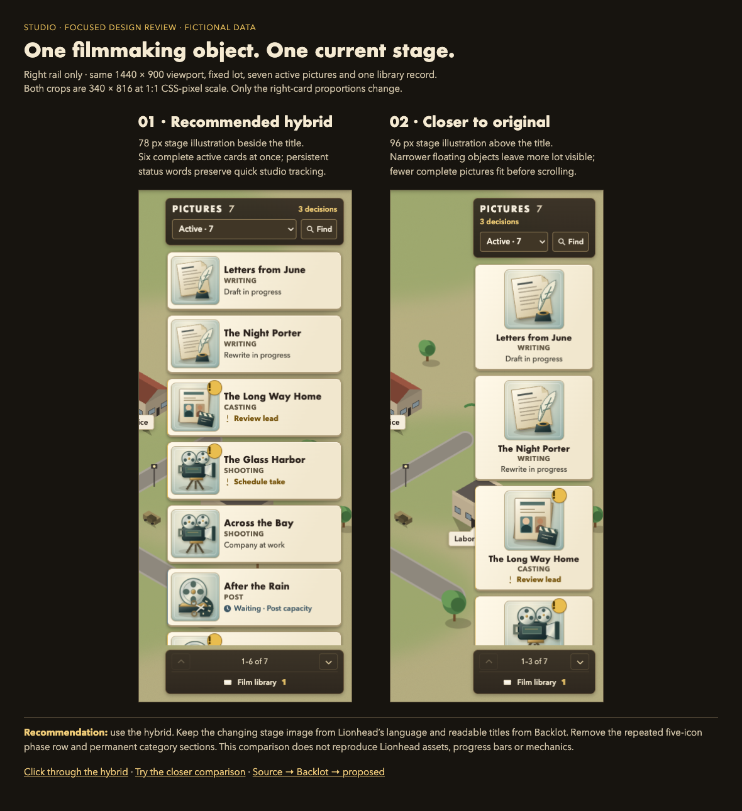
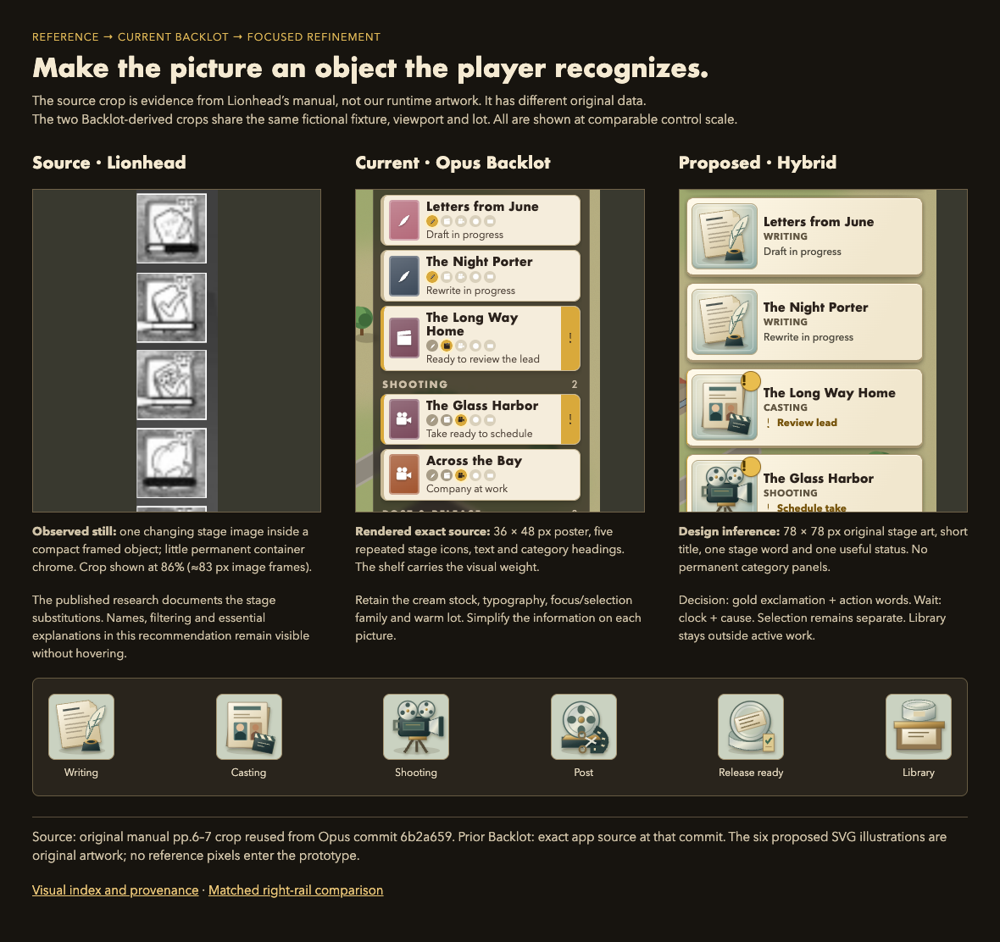
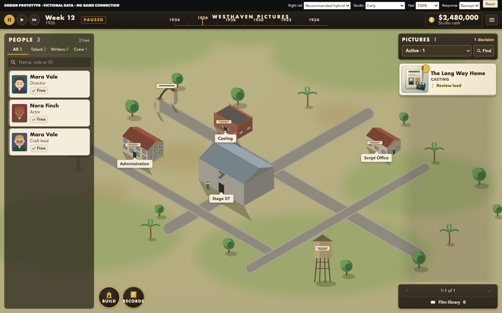
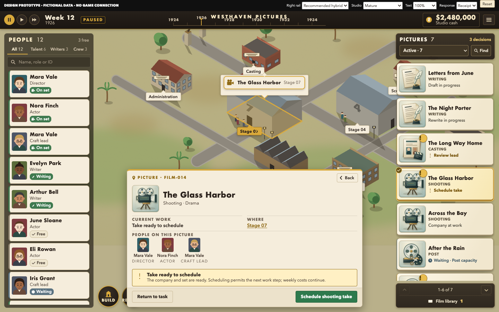
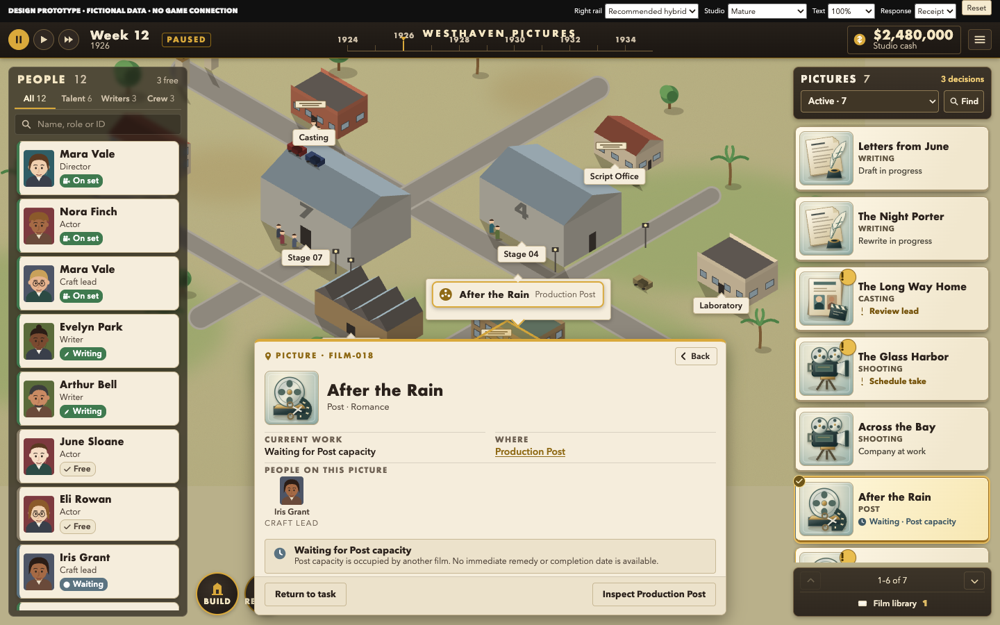
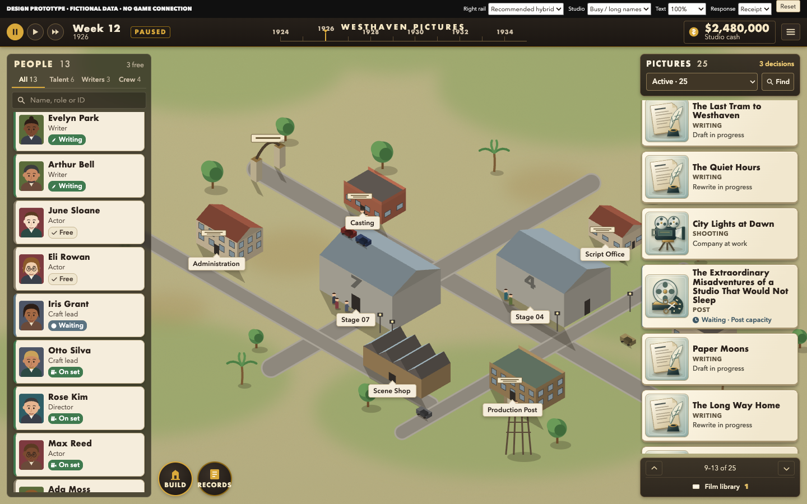
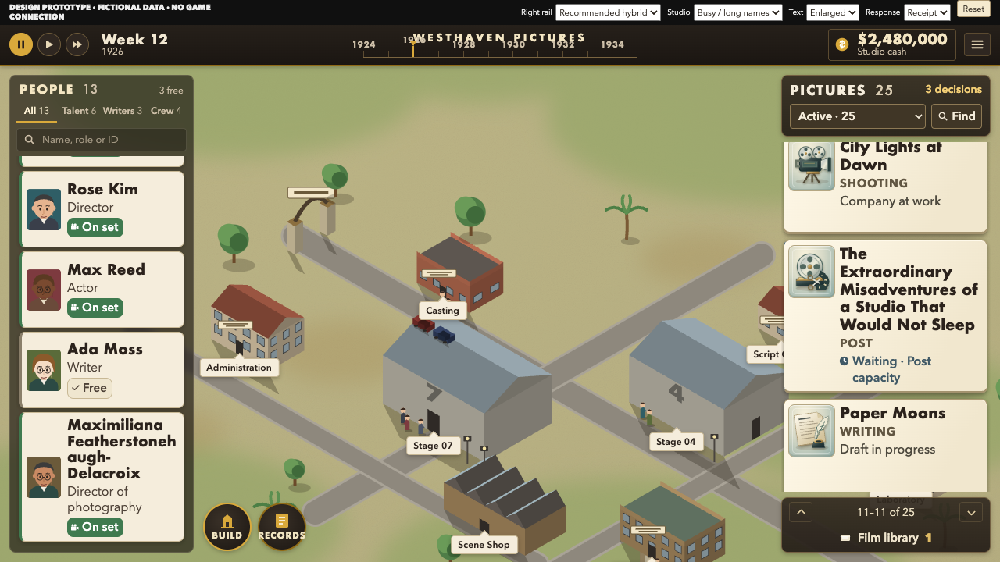

# STUDIO — right-hand picture cards · R3 focused visual index

**UI/UX VISUAL BLUEPRINT PUBLISHED — FUTURE OPS / OWNER DESIGN REVIEW REQUIRED**

Recommend the **hybrid** below: a prominent, changing filmmaking object beside each short title, with one actual stage and one useful state. Employees stay left; pictures stay right; the Backlot studio remains the center. Backlot is a working direction, not full approval. This is an isolated fictional-data prototype, not implemented game UI.

**[Download the complete R3 ZIP](delivery/STUDIO-PICTURE-CARDS-R3.zip?raw=true)** · [Exact content commit and checksums](PACKAGE.md).

**Click through:** extract the complete package and open [index.html](index.html). No server, install, account or connection is required. GitHub displays HTML source rather than running it. [Guided checks and controls](WALKTHROUGH.md) · [Exact design and routing](DESIGN.md) · [Reproduction, repairs and native requirements](REVIEW.md) · [Source provenance](PROVENANCE.md).

## The bounded decision

**Choose the hybrid or request a right-card adjustment before extending this direction.** It shows six complete active cards at 1440×900, versus three in the narrower image-first comparison. The closer comparison uses the same artwork, data, background, viewport and controls; only the right-card proportions change. Neither includes invented percentages, completion dates, ratings or production rules.

[Editable comparison board](comparisons.html) · [Hybrid crop at native CSS scale](previews/rail-hybrid.png) · [Closer comparison crop](previews/rail-classic.png). The prototype’s **Right rail** selector changes between these two treatments.

## Source → current Backlot → proposed

The original-game excerpt is reference evidence only. The Backlot crop was rendered from the exact Opus source; the proposal uses new original SVG artwork. The original crop necessarily has different data; the two design crops use the same fictional studio and viewport. Crops retain comparable control scale, not a claim of identical source-game resolution.

[Editable source comparison](comparisons.html?view=evolution) · [Exact prior Backlot rail](previews/rail-backlot.png) · [Published original-game research](https://github.com/HSpector1/The-Movies/blob/6b2a659bcaa1e577c8d90a10aae390e3855a2985/docs/operations/uiux-opus-r2-independent-review/RESEARCH-ORIGINAL-GAME.md).

## Required views

| View | Clean / additional view | What to judge |
| --- | --- | --- |
| Mature studio | [Clean](previews/01-mature.png) · [Annotated](previews/01-mature-annotated.png) | Employees left, legible picture objects right, unobstructed studio overview |
| Early studio | [Clean](previews/02-early.png) | One picture stays one object; empty departments do not become empty section panels |
| Selected picture | [Clean](previews/03-selected.png) | Exact title/ID, selected card, supported worksite, company and local action/reason/response |
| Waiting / blocked by capacity | [Clean](previews/04-waiting.png) | Honest Post wait, exact facility inspection, no fabricated immediate remedy |
| Busy list | [Clean](previews/05-busy.png) | 25 active pictures, long and duplicate titles, independent scroll and visible range controls |
| 1280×720 enlarged | [Long-name stress](previews/06-small-enlarged.png) · [Selected wait](previews/07-small-waiting.png) | Full status words and long titles reflow; scrolling preserves access |

Only these main-screen variants were developed. The historic [R2 eight-family package](https://github.com/HSpector1/The-Movies/blob/e564d236407cb3616ebc597713d5b9fa7d60b38a/docs/operations/uiux-visual-blueprint/r2/README.md) remains unchanged; this pass does not claim to finish their Backlot treatment.

## What changed, what remains

Removed the repeating five-icon phase row and permanent picture-category sections. Added six original stage illustrations, visible decision/wait language, active filters, title/ID Find, range/paging controls and a separate completed library. Corrected both-rail/focus return, clipped employee status and inconsistent candidate facts. The same bounded independent checker verified the repairs; [evidence and limits](REVIEW.md).

**Still unfinished:** portrait finishing; applying Backlot materials and this control standard to the other screen families; full global text scaling; native roster/production integration, real locating/input/focus, authoritative command outcomes and supported-device validation. Laboratory workflow remains P13B-owned. No gameplay edits, builds, launches, bridge access, campaign/profile access, hooks, installs, PR, merge or deployment were performed for this pass.

Stop here for **Owner / Future Ops DESIGN review**. No native implementation is authorized.
