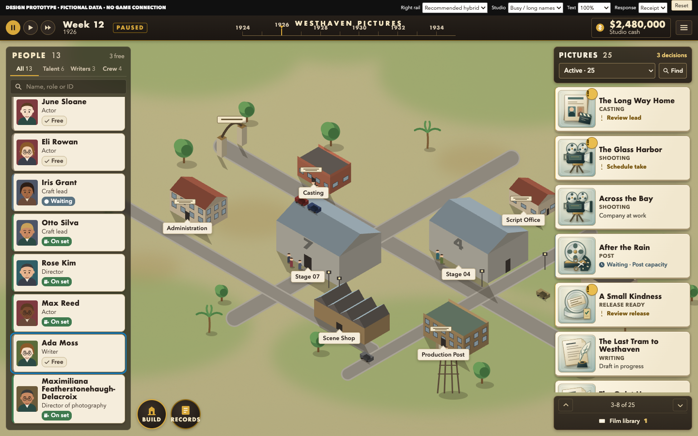
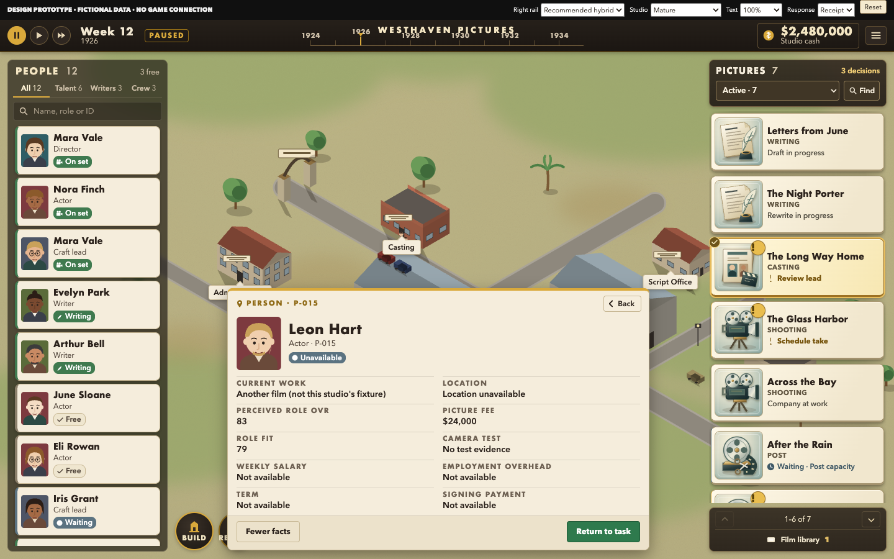

# R3 rendered review, regression repairs and native requirements

[Visual index](README.md). **Design/prototype review only.** Checked 2026-09-12. The author and the same single bounded independent read-only checker used fresh isolated headless Chrome contexts. Local files only; HTTP(S) was blocked. No installs, builds, game launches, native input or real bridge/campaign/Profile access. The checker made no source edits and did not direct other workers. Sonnet was unavailable in this session; the existing inherited-model checker was reused. No Sonnet review is claimed.

## Reported findings were reproduced before repair

The exact Opus app at `6b2a659bcaa1e577c8d90a10aae390e3855a2985` was rendered from its retrieved source. All three reported problems were reproduced; they are **prototype findings**, not evidence of Unity defects. [Baseline measurements](evidence/opus-baseline.json).

| Reported problem | Actual baseline observation | Focused correction / confirmation |
| --- | --- | --- |
| People scroll and invoking focus lost | P-027: People 161 → 0 on inspection → 0 after Escape; focus BODY | Navigation snapshots store both rails, local body scroll and stable invoking focus key. New inspector starts at top. Checker: People 426 → 426 → 426, Pictures 205 → 205 → 205, Back to `person-row-P-027`. Row heights changed, so 426 is the current bottom position; it is not misrepresented as the old 161. |
| 1280×720 enlarged status cropped | Mara P-004 “On set” text exceeded the clipped row by 17.70 px; Writer status by 10.34 px | Give name, role and status separate wrapping lines. Both treatment variants fit all measured status/title boxes; the long-name fixture grows vertically. Lists still intentionally clip partial edge rows and expose scrolling. |
| Person facts inconsistent with comparison | Leon comparison OVR 83 became generic 81 in the expanded profile; generic employment values were reused | Exact candidate facts come from the comparison object. Leon remains 83 / fit 79 / $24,000 fee, salary/term unknown. Celia remains 76 / fit 84 / $18,000 fee, with separately labeled proposed employment terms. Unknown people do not inherit Mara’s terms. |

## One checker, bounded rendered and functioning-prototype review

The checker actually inspected mature, early, selected production, waiting, busy, long-title and 1280×720 enlarged views; compared hybrid and classic at identical viewport/data/background; and exercised the controls. [Candidate results](evidence/candidate-results.json) record the measurements. Direct initial-page screenshots may have BODY focus because no control has been invoked; return assertions concern an actual prior activation.

- Both rail offsets and invoking focus survived P-027 inspection, More facts, collapse and Back; busy picture `BUSY-018` → Script Office → Back restored 426 / 1916 and the exact picture-row focus.
- Company → Nora → Back restored exact FILM-014 and company-button focus. The schedule pending/receipt/refusal paths ran; responses remained attached to the picture during excursions. Pointer automation may scroll an offscreen row into view before activating it; snapshots are taken at activation, not before that deliberate scroll.
- Early casting comparison and Reset ran without exceptions. Leon/Celia values matched their dossiers; unavailable Leon could not be assigned. Library, active/stage/decision/wait filters, exact-ID Find and paging worked.
- Hybrid initially showed six complete cards versus classic’s three at 1440×900; three versus two at 1280×720 enlarged. The final classic stacked filter reduces available vertical list space but retains two complete initial cards. Partial edge rows remain discoverable by scrolling.
- No page errors or attempted outbound requests were recorded.

The checker found two additional concrete problems in the candidate. Both were corrected and the **same checker** confirmed the fixes:

| Additional issue | Final repair and evidence |
| --- | --- |
| Previous paging button lost focus to BODY when disabling itself at the top | Boundary controls retain focus with `aria-disabled` and guarded activation. Hybrid and classic keep `pictures-up` at the top and `pictures-down` at the bottom; repeated Enter leaves offsets unchanged. People remained 161 through the boundary check. |
| Classic enlarged filter clipped its label beside Find | Stack the full-width filter above Find. At 1280×720 the “Release ready” label is 96.84 px in a 174 px control; confirmed visually. |

[Original candidate control findings](evidence/candidate-controls.json) · [Final targeted repair confirmation](evidence/candidate-repairs.json) · [Final narrow comparison render](evidence/candidate-repairs-classic.png). No remaining concrete findings were reported in this bounded check. That is not a comprehensive usability or accessibility certification.

The author independently checked actual employee round trips (People 426 / Pictures 600 retained), shared Script Office identity, no schedule action for Writing/Post, missing release location without a fake Post alias, library/filter/search/paging, row hit containment and focus-versus-selection. All 13 people and 25 active picture title/role/status boxes fit horizontally at 1280×720 enlarged, both with installed fonts and an injected Arial fallback. [Author result](evidence/author-check.json). The candidate boundary repairs were separately rechecked by the independent checker; the author’s earlier broad check is not represented as a post-repair rerun of everything.

## Remaining unfinished work and limits

**Portrait finishing remains outstanding.** The prior Opus portraits are reused as provisional art; this pass does not claim finished character identity, expressive needs/status art, animation or portraits at native rendering quality. The existing lot and general Backlot direction also remain a working direction, not full Owner approval.

**Application to remaining screen families remains outstanding.** No large eight-family gallery was regenerated. Finance, Industry, campaign management, construction/placement, deeper profiles/contracts, result presentation and the full casting workflow keep their historical R2 designs; their new material treatment is not silently complete. Build, Records, Finance/Menu, greenlight and deeper release/result destinations explicitly report static coverage in this focused prototype. P13B’s Laboratory workflow was not taken over.

The prototype demonstrates finite fictional selection and navigation; it does not model simulation, scheduling law, queue admission, authoritative command receipts, roster membership, finances, persistence, performance or real body locations. Extra busy projects are duplicated fixture states. The early comparison reuses the same fictional draft examples, including people outside the visible early roster; this is a design fixture, not a claim that the early studio already employs them.

The narrow/enlarged screenshots intentionally show independent list overflow. Full long titles/statuses are reachable, but no promise is made that every entry fits onscreen at once. The selective Enlarged setting is not global 200% scaling. Default 11 px stage labels, small HUD/tabs, portrait quality, view distance and larger/Retina/controller support require further acceptance. In very tall inspection, the panel can dominate the center and obscure part of the lot or corner tools; native camera framing and global-tool placement require device review. No uncoached-player task study, native focus/click-through check or measured performance benchmark was performed.

## Future native acceptance — unsatisfied by this prototype

After separate native authorization, Future Ops should pin the then-accepted TypeScript/bridge and Unity identities, one existing input owner, disposable early/mature fixtures and the supported viewport/text/device matrix. This is routing guidance, not an assignment or implementation authorization.

| Check | Required future evidence |
| --- | --- |
| Exact production truth | Every discrete script/film stage, decision and wait derives from its authoritative projection/legality; unknown stage/evidence stays explicit. No percentages, dates, ratings or fabricated commands. Distinguish active production from exact historical result/library. |
| Find and track people | Authoritative employment roster joined safely to presence/Profile and locatable body. Missing body keeps exact inspection available; presence count/cap is never labeled total employees. Duplicate names remain distinct by ID. |
| Selection and location | Exact card → compact inspection → lawful site/body → company member → Back with selected ID, camera context, both independent rail offsets, filter/search and invoking focus retained. Shared worksites do not substitute pictures. Missing/stale/deleted records do not select neighbors. |
| Real input and overlay ownership | Wheel/trackpad containment, keyboard focus rings/order, Escape/Back/Cancel, page-boundary focus, no click-through, supported controller/touch if in scope, no held-drag-only essential action. Correct explicit modal versus nonmodal ownership. |
| Action/reason/response | Same exact active film and normal Post wait; visible costs/consequences and real remedy only if available. Slow, duplicate, accepted, refused and changed-state operations preserve exact request/subject. Pending does not double-submit; receipt reflects authority. |
| Busy / library / concurrent updates | Long and duplicate titles, 40+ employees/20+ pictures, stable ordering and selection, filtering, empty results, active/library separation, background state changes and offset clamping. Performance measured on the native target. |
| Readability / art | 1280×720, 1440×900 and supported larger/Retina scope, normal and actual supported large text. Full cost/cause/status/Cancel reachable, stage art recognizable, selection distinguishable from alert/focus, fallback font/license and color-vision/view-distance checks. Review center/corner-tool visibility in enlarged inspection. |
| Broader application | Separately authorize portrait finishing and remaining screen-family adaptation after main-screen review. Preserve existing campaign consequence/pending law, exact casting draft and result evidence. P13B owns Laboratory workflow. |

**Stop for Owner / Future Ops DESIGN review. No native implementation is authorized.**
